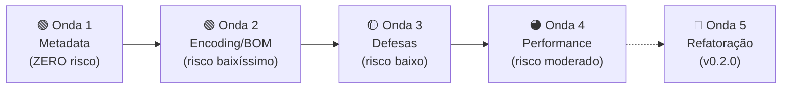

# Plano de Implementação em Ondas — Saira App

> **Princípio:** Do mais seguro ao mais arriscado. Cada onda é independente — pode ser executada e testada isoladamente. Se qualquer onda causar regressão, revertemos só ela.

---

## 🟢 Onda 1 — Metadata e Configuração (Risco: ZERO)

Nenhuma dessas mudanças toca código executável. Impossível quebrar o app.

### 1.1 Criar `.editorconfig` na raiz

[NEW] [.editorconfig](file:///c:/Users/Admin/OneDrive/Saira%20-%20Claude/saira/.editorconfig)

```ini
root = true

[*]
end_of_line = lf
charset = utf-8
indent_style = space
indent_size = 4
trim_trailing_whitespace = true
insert_final_newline = true
```

**Por quê:** Vários arquivos misturam CRLF/LF (ex: `utils_io.R` usa CRLF até linha 44, depois LF). Isso causa diffs sujos no Git e confunde IAs.

---

### 1.2 Criar `.gitattributes` na raiz

[NEW] [.gitattributes](file:///c:/Users/Admin/OneDrive/Saira%20-%20Claude/saira/.gitattributes)

```
*.R text eol=lf
*.css text eol=lf
*.js text eol=lf
*.md text eol=lf
```

**Por quê:** Garante que o Git normalize line endings no checkout, independente do SO.

---

### 1.3 Corrigir encoding corrompido no `DESCRIPTION`

[MODIFY] [DESCRIPTION](file:///c:/Users/Admin/OneDrive/Saira%20-%20Claude/saira/DESCRIPTION)

```diff
-Authors@R: person("Rogério", "Nunes Oliveira", ...)
+Authors@R: person("Rog\u00E9rio", "Nunes Oliveira", ...)

-    for use with SiBBr (Sistema de Informação sobre a Biodiversidade Brasileira).
+    for use with SiBBr (Sistema de Informa\u00E7\u00E3o sobre a Biodiversidade Brasileira).
```

**Por quê:** `Rogério` é o resultado clássico de UTF-8 lido como Latin-1. Usar escapes `\uXXXX` é à prova de encoding.

---

### 1.4 Adicionar versões mínimas faltando no `DESCRIPTION`

[MODIFY] [DESCRIPTION](file:///c:/Users/Admin/OneDrive/Saira%20-%20Claude/saira/DESCRIPTION)

```diff
-    sf,
-    rnaturalearth,
-    rnaturalearthdata,
+    sf (>= 1.0.0),
+    rnaturalearth (>= 1.0.0),
+    rnaturalearthdata (>= 1.0.0),
```

**Por quê:** Sem versão mínima, alguém pode instalar uma versão antiga e incompatível.

---

### 1.5 Padronizar cabeçalhos de autor em todos os `.R`

Mudar **todos** os headers com `Rogério` ou `Rogério` para ASCII:

```diff
-# Author: Rogério Nunes Oliveira
+# Author: Rogerio Nunes Oliveira
```

Arquivos afetados: `mod_upload.R`, `utils_io.R`, `utils_export.R`, `utils_mapping.R`

---

### 1.6 Diretriz de Encoding para IA (documento de referência)

[NEW] [docs/ENCODING_RULES.md](file:///c:/Users/Admin/OneDrive/Saira%20-%20Claude/saira/docs/ENCODING_RULES.md)

Documento para consultar ou fornecer à IA que trabalha no código:

```markdown
# Encoding Rules — Saira Project

1. Todos os source files (.R, .css, .js, .md) → UTF-8 SEM BOM.
2. Strings R com caracteres não-ASCII → usar \uXXXX.
   - ✅ "Rog\u00E9rio"    ❌ "Rogério"
3. Comentários → apenas ASCII. "Rogerio" e não "Rogério".
4. CSV output → readr::write_csv() (UTF-8 sem BOM por default).
5. CSV input → sempre tratar presença de BOM via strip_bom().
6. NUNCA usar options(encoding = "UTF-8") — depreciado no R 4.2+.
7. Line endings → LF apenas. Configurado no .editorconfig.
8. Testes de I/O → escrever bytes explicitamente para controle de BOM.
```

---

### Verificação da Onda 1

```bash
Rscript -e "devtools::check()"   # Deve passar sem warnings de encoding
git diff --stat                   # Confirmar só metadata e configs
```

---

## 🟢 Onda 2 — Encoding e BOM (Risco: BAIXÍSSIMO)

Toca funções utilitárias com testes existentes. Aditivo — nenhuma lógica existente muda.

### 2.1 Criar `strip_bom()` e corrigir `detect_delimiter()`

[MODIFY] [utils_io.R](file:///c:/Users/Admin/OneDrive/Saira%20-%20Claude/saira/R/utils_io.R)

**Adicionar** no topo do arquivo:

```r
#' Strip UTF-8 BOM from text
#'
#' @param text Character vector
#' @return Character vector without BOM prefix
strip_bom <- function(text) {
    sub("^\uFEFF", "", text)
}
```

**Corrigir** `detect_delimiter()`:

```diff
 detect_delimiter <- function(file_path) {
-    first_line <- readLines(file_path, n = 1, warn = FALSE)
+    first_line <- readLines(file_path, n = 1, warn = FALSE, encoding = "UTF-8")
+    if (length(first_line) == 0L || !nzchar(first_line)) {
+        return(",")
+    }
+    first_line <- strip_bom(first_line)
```

**Por quê:** Sem strip, a contagem de delimitadores na primeira linha pode ser imprecisa quando o arquivo tem BOM, e arquivos vazios causam erro silencioso.

---

### 2.2 Remover `options(encoding = "UTF-8")` — depreciado

[MODIFY] [run_app.R](file:///c:/Users/Admin/OneDrive/Saira%20-%20Claude/saira/R/run_app.R)

```diff
 run_app <- function(...) {
-    options(encoding = "UTF-8")
```

[MODIFY] [app.R](file:///c:/Users/Admin/OneDrive/Saira%20-%20Claude/saira/app.R)

```diff
-options(encoding = "UTF-8")
```

**Por quê:** `options(encoding=)` foi depreciado no R 4.2 (2022). Não tem efeito funcional — `readr` já lida com encoding via `locale()`. Remove um warning potencial e fonte de confusão.

---

### Verificação da Onda 2

```bash
Rscript -e "devtools::test()"       # Testes existentes devem passar
Rscript -e "source('app.R')"        # App deve iniciar normalmente
```

Teste manual: salvar CSV no Notepad como "UTF-8 COM BOM", fazer upload.

---

## 🟡 Onda 3 — Defesas e Edge Cases (Risco: BAIXO)

Adições de segurança. Todo o comportamento existente é preservado; estamos só adicionando proteções para cenários raros.

### 3.1 Proteger startup do upload module contra falha de RDS

[MODIFY] [mod_upload.R](file:///c:/Users/Admin/OneDrive/Saira%20-%20Claude/saira/R/mod_upload.R)

```diff
-        required_terms_all <- get_dwc_terms()
+        required_terms_all <- tryCatch(
+            get_dwc_terms(),
+            error = function(e) {
+                message("[Saira] Failed to load DwC terms: ", e$message)
+                data.frame(
+                    term = character(0),
+                    class = character(0),
+                    required = logical(0),
+                    definition_pt = character(0),
+                    definition_en = character(0),
+                    stringsAsFactors = FALSE
+                )
+            }
+        )
```

**Por quê:** Se `dwc_terms.rds` faltar ou corromper, o app inteiro morre no startup sem mensagem de erro visível. Com o `tryCatch`, o app sobe sem a seção de campos obrigatórios, em vez de crashar.

---

### 3.2 Adicionar logging no fallback de `app_server.R`

[MODIFY] [app_server.R](file:///c:/Users/Admin/OneDrive/Saira%20-%20Claude/saira/R/app_server.R)

```diff
     if (is.null(preview_data) || !shiny::is.reactive(preview_data)) {
+        message("[Saira] preview_data attr missing from mapping module, using mapped_data fallback")
         preview_data <- mapped_data
     }
     if (is.null(validation_gate) || !shiny::is.reactive(validation_gate)) {
+        message("[Saira] validation_gate attr missing, gate disabled")
         validation_gate <- NULL
     }
     if (is.null(coord_validation_gate) || !shiny::is.reactive(coord_validation_gate)) {
+        message("[Saira] coord_validation_gate attr missing, gate disabled")
         coord_validation_gate <- NULL
     }
```

**Por quê:** Quando esses fallbacks disparam, é invisível. Logs ajudam a diagnosticar problemas futuros sem precisar debugar.

---

### 3.3 Consolidar `validate_force_flag()` duplicada

A mesma lógica existe em **3 arquivos diferentes**. Extrair para um lugar só:

[MODIFY] [utils_dwc.R](file:///c:/Users/Admin/OneDrive/Saira%20-%20Claude/saira/R/utils_dwc.R) — manter como a versão canônica

[MODIFY] [utils_coords.R](file:///c:/Users/Admin/OneDrive/Saira%20-%20Claude/saira/R/utils_coords.R)

```diff
-coords_validate_force_flag <- function(force) {
-    if (!is.logical(force) || length(force) != 1L || is.na(force)) {
-        stop("force must be a single TRUE or FALSE value.", call. = FALSE)
-    }
-}
+# Reusa validate_force_flag() de utils_dwc.R (mesmo NAMESPACE)
+coords_validate_force_flag <- validate_force_flag
```

[MODIFY] [utils_mapping.R](file:///c:/Users/Admin/OneDrive/Saira%20-%20Claude/saira/R/utils_mapping.R) — mesma mudança

**Por quê:** Elimina código duplicado. Se a validação mudar, muda em um lugar só.

---

### 3.4 Cleanup de sessão

[MODIFY] [app_server.R](file:///c:/Users/Admin/OneDrive/Saira%20-%20Claude/saira/R/app_server.R)

Adicionar antes do fechamento da função:

```r
    # Cleanup on session end
    session$onSessionEnded(function() {
        message("[Saira] Session ended, cleanup complete")
    })
```

**Por quê:** Prepara o terreno para cleanup real no futuro (limpar caches pesados, fechar conexões taxadb, etc).

---

### 3.5 Inicializar `renv`

```bash
Rscript -e "renv::init(); renv::snapshot()"
```

**Por quê:** Trava todas as versões de pacotes em `renv.lock`. Quando você (ou outra máquina) rodar `renv::restore()`, terá exatamente o mesmo ambiente. É a **maior proteção** contra quebra silenciosa por atualização de dependências.

---

### Verificação da Onda 3

```bash
Rscript -e "devtools::test()"       # Todos os testes devem passar
Rscript -e "source('app.R')"        # App deve iniciar com mensagens [Saira] no console
```

---

## 🟠 Onda 4 — Performance Reativa (Risco: MODERADO)

Estas mudanças alteram timing de reatividade. Podem causar comportamento diferente (embora correto) na UI.

### 4.1 Debounce no seletor de idioma

[MODIFY] [app_server.R](file:///c:/Users/Admin/OneDrive/Saira%20-%20Claude/saira/R/app_server.R)

```diff
     lang_r <- shiny::reactive({
         input$lang_switch %||% "pt"
-    })
+    }) |> shiny::debounce(300)
```

**Por quê:** Sem debounce, trocar de idioma dispara ~20+ `renderUI()` simultaneamente (8 nav titles + todos os textos dos módulos). Com 300ms de debounce, o Shiny espera o usuário terminar a seleção antes de reprocessar tudo.

**Risco:** A UI pode parecer 300ms "atrasada" na troca de idioma. Ajustar valor se necessário.

---

### 4.2 Batch `adist()` no fuzzy matching de países

[MODIFY] [utils_coords.R](file:///c:/Users/Admin/OneDrive/Saira%20-%20Claude/saira/R/utils_coords.R#L306-L344)

Substituir o loop individual por operação matricial:

```diff
-    for (idx in idx_pending) {
-        token <- normalize_country_token(uniq_vals[[idx]])
-        ...
-        dist_vec <- as.integer(utils::adist(token, ref$alias, ignore.case = TRUE))
-        ...
-    }
+    pending_tokens <- vapply(
+        uniq_vals[idx_pending],
+        normalize_country_token,
+        FUN.VALUE = character(1)
+    )
+    valid_mask <- nzchar(pending_tokens) & nchar(pending_tokens) >= 4L
+    if (any(valid_mask)) {
+        valid_tokens <- pending_tokens[valid_mask]
+        dist_matrix <- utils::adist(valid_tokens, ref$alias, ignore.case = TRUE)
+        # Processar matrix em batch...
+    }
```

**Por quê:** Para datasets com muitos nomes de países não-reconhecidos, o loop atual é O(n × m) com overhead de chamada de função. A versão matricial é ~3-5x mais rápida.

**Risco:** O resultado deve ser idêntico, mas a lógica de desambiguação precisa ser porteada cuidadosamente.

---

### Verificação da Onda 4

```bash
Rscript -e "devtools::test()"                    # Testes de coords devem passar
Rscript -e "testthat::test_file('tests/testthat/test-utils-coords.R')"
```

Teste manual:
- Trocar idioma rapidamente 5x seguidas → não deve flicker
- Upload de CSV com 50+ países diferentes → validação deve completar sem travamento

---

## 🔴 Onda 5 — Refatoração Estrutural (Risco: ALTO — Futuro v0.2.0)

> [!CAUTION]
> Estas mudanças NÃO devem ser feitas agora. São roadmap para a próxima versão major. Cada item requer planejamento próprio e testes extensivos.

| # | Item | Complexidade | Impacto |
|---|---|---|---|
| 5.1 | Dividir `custom.css` (128KB) em módulos por seção | Média | Manutenibilidade IA |
| 5.2 | Refatorar `mod_mapping.R` (1837 linhas) em sub-funções | Alta | Manutenibilidade |
| 5.3 | Migrar `attr()` para lista de reactives no retorno de `mod_mapping_server` | Alta | Robustez reativa |
| 5.4 | Mover `is_blank_value()` e helpers para `utils_common.R` | Baixa | Organização |
| 5.5 | Testes para `mod_wiki`, `mod_help`, `mod_upload` server | Média | Cobertura |
| 5.6 | Considerar `shinytest2` para testes E2E | Alta | Quality assurance |
| 5.7 | Avaliar migração de `data_dictionary.R` (1697 linhas) para JSON/YAML externo | Média | Manutenibilidade i18n |

---

## 📋 Resumo Visual



Cada onda tem um checkpoint de verificação (testes + app startup). Se falhar, revertemos **só aquela onda** e investigamos.
