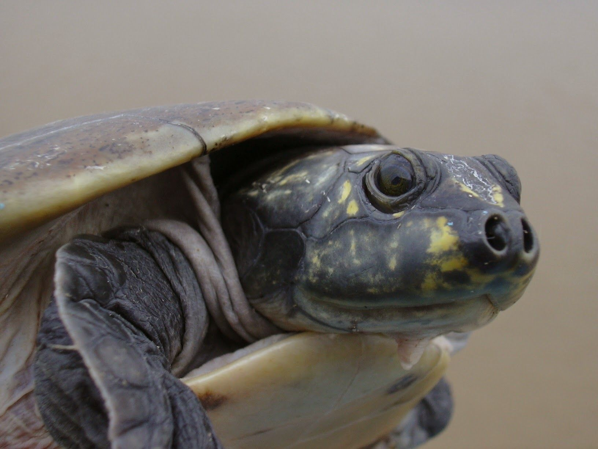
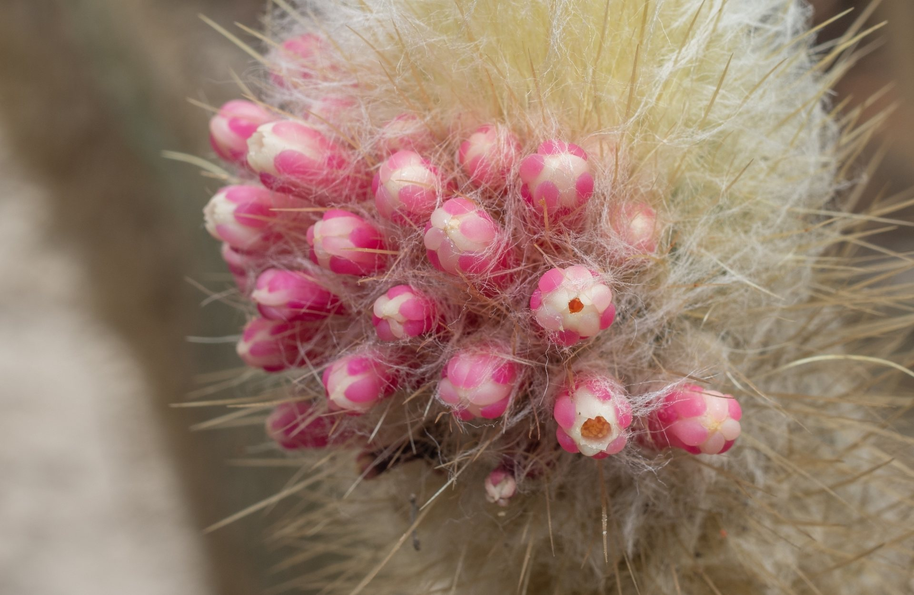
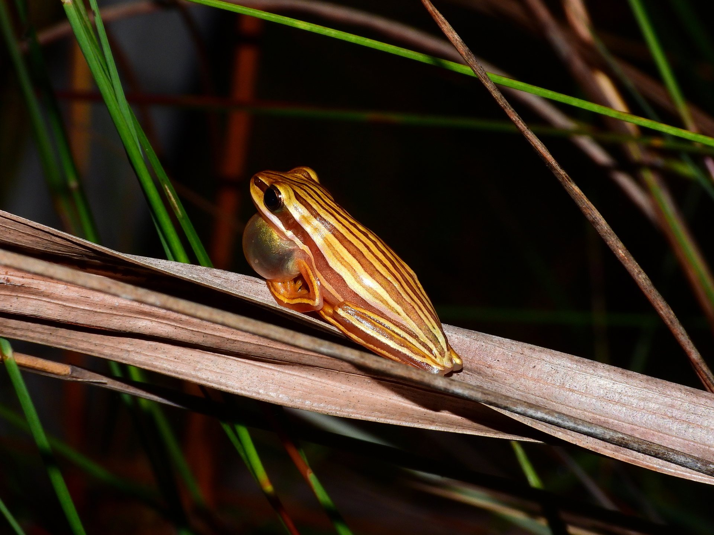
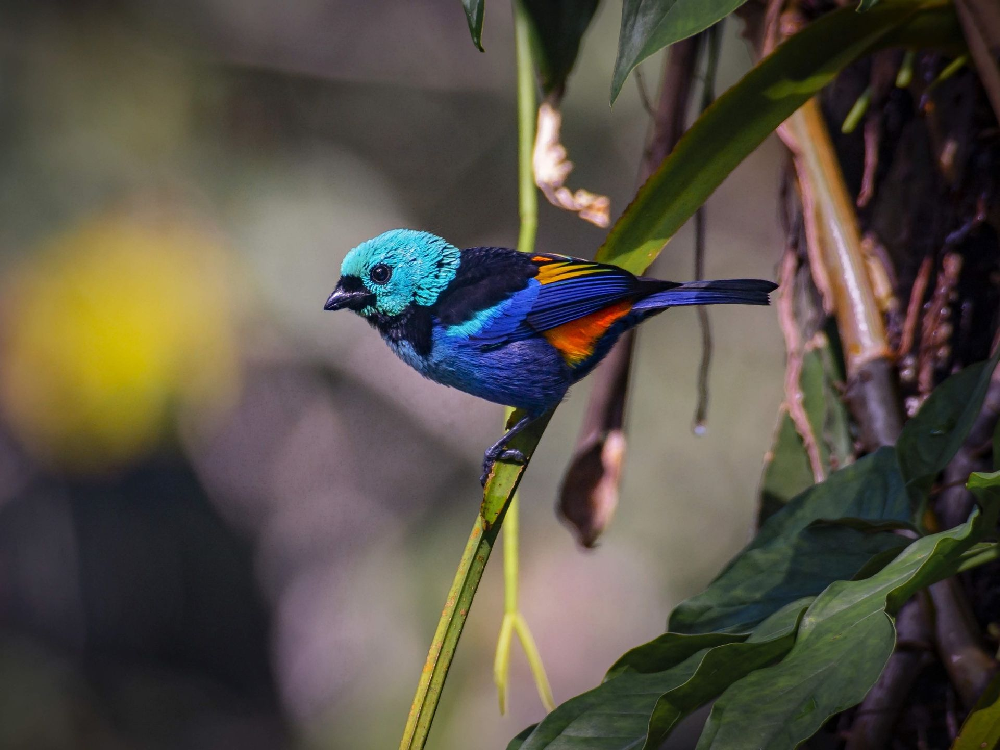
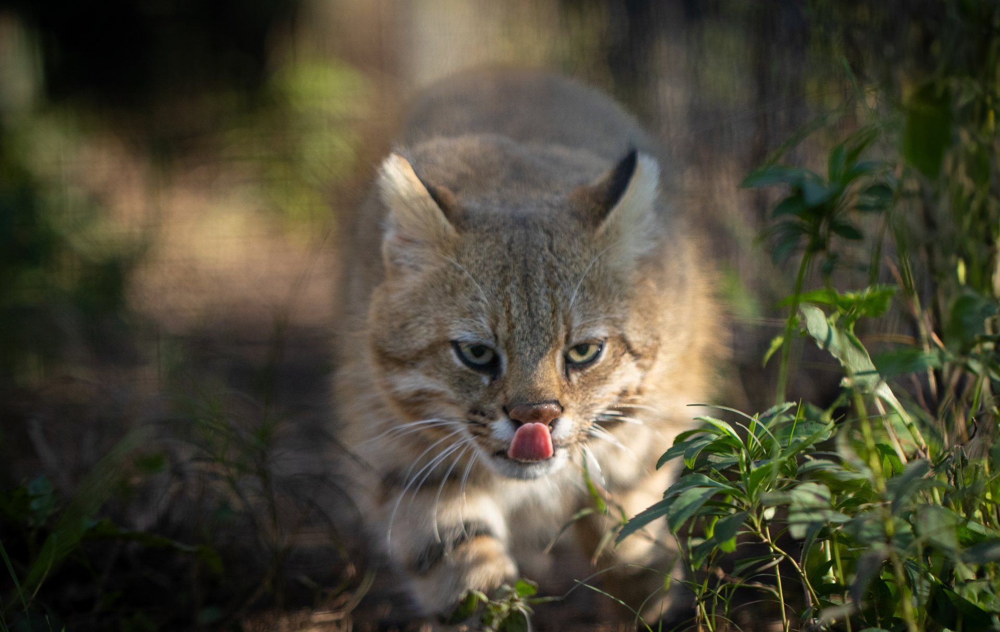
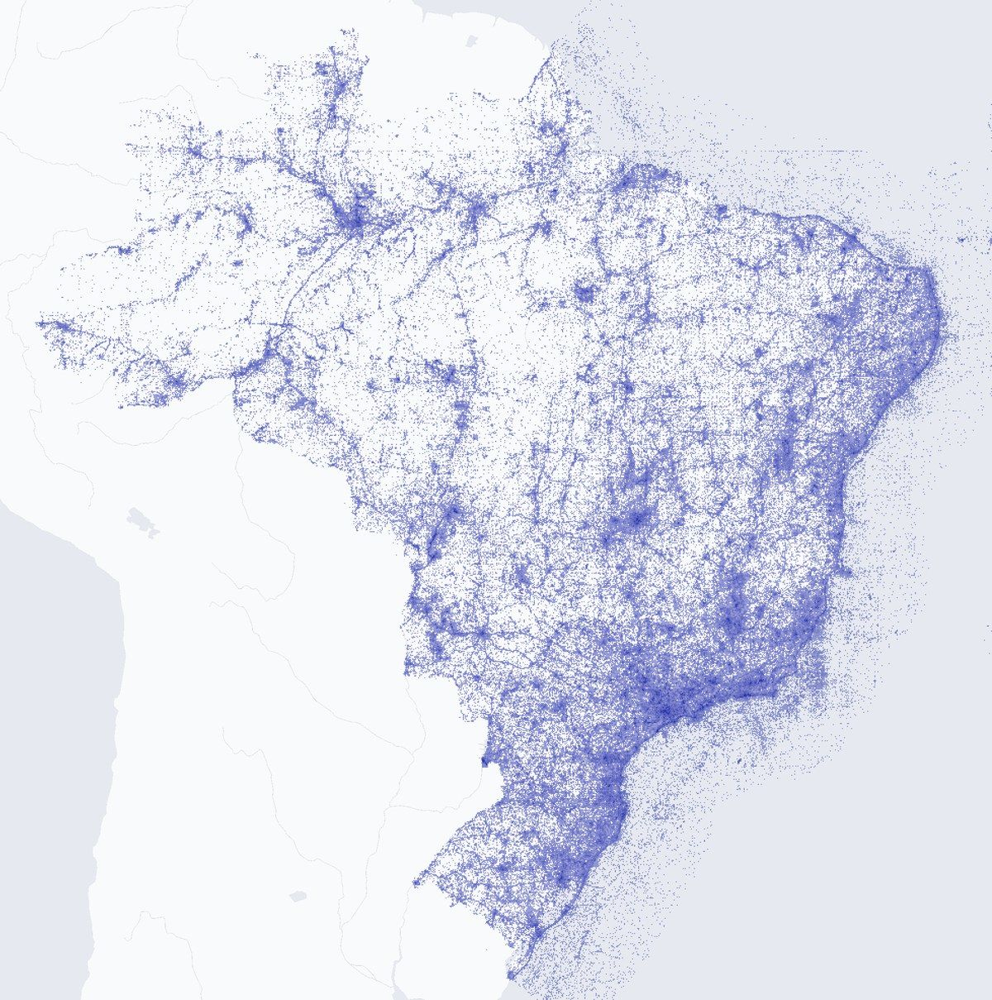
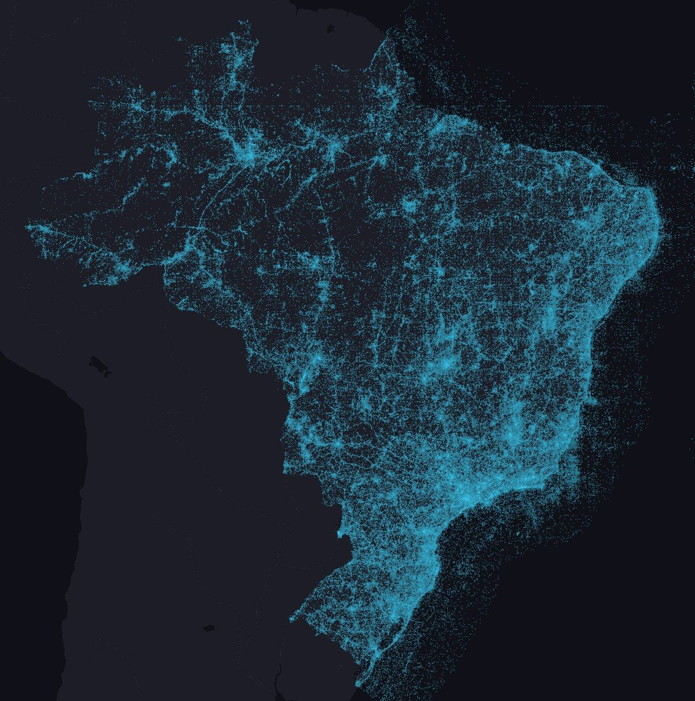

```{=html}
<div class="lp">

<!-- ===================== HERO: one MMA-threatened species per biome ===================== -->
<section class="lp-hero" aria-label="Threatened species of the six biomes" data-seconds="7">
  
  
  
  
  
  
  <div class="lp-hexes" aria-hidden="true"></div>
  <div class="lp-scrim" aria-hidden="true"></div>
  <div class="lp-hero-text">
    <h1 class="lp-rise">Saíra</h1>
    <p class="lp-sub lp-rise" style="--d: .15s">Darwin Core for Brazilian biodiversity.</p>
    <div class="lp-actions lp-rise" style="--d: .3s">
      <a class="lp-btn lp-btn-primary" href="tutorials/01-installation.html">Read the tutorials</a>
      <a class="lp-btn" href="#install">Install</a>
    </div>
  </div>
  <div class="lp-rec lp-rise" style="--d: .45s">
    <div class="lp-rec-name">Tangara fastuosa</div>
    <div class="lp-rec-line">Thraupidae · Paraíba</div>
    <span class="lp-rec-cat" data-code="VU">Vulnerable · MMA</span>
    <div class="lp-rec-credit">Photo: <span>Renato Bandeira · CC BY 4.0</span></div>
  </div>
  <nav class="lp-biomes lp-rise" style="--d: .6s" aria-label="Biomes">
    <button type="button" class="lp-biome" aria-pressed="false" data-sci="Podocnemis sextuberculata" data-fam="Podocnemididae" data-uf="Amazonas" data-code="EN" data-cat="Endangered · MMA" data-credit="Rafael Bernhard · CC BY 4.0"><span class="lp-prog"></span><span class="lp-biome-name">Amazon</span><span class="lp-biome-sp">Six-tubercled river turtle</span></button>
    <button type="button" class="lp-biome" aria-pressed="false" data-sci="Micranthocereus polyanthus" data-fam="Cactaceae" data-uf="Bahia" data-code="EN" data-cat="Endangered · MMA" data-credit="Brian Williams · CC BY 4.0"><span class="lp-prog"></span><span class="lp-biome-name">Caatinga</span><span class="lp-biome-sp">Pink-flowered cactus</span></button>
    <button type="button" class="lp-biome" aria-pressed="false" data-sci="Boana buriti" data-fam="Hylidae" data-uf="Goiás" data-code="VU" data-cat="Vulnerable · MMA" data-credit="Reuber Brandão · CC BY 4.0"><span class="lp-prog"></span><span class="lp-biome-name">Cerrado</span><span class="lp-biome-sp">Cerrado tree frog</span></button>
    <button type="button" class="lp-biome" aria-pressed="true" data-sci="Tangara fastuosa" data-fam="Thraupidae" data-uf="Paraíba" data-code="VU" data-cat="Vulnerable · MMA" data-credit="Renato Bandeira · CC BY 4.0"><span class="lp-prog"></span><span class="lp-biome-name">Atlantic Forest</span><span class="lp-biome-sp">Seven-colored tanager</span></button>
    <button type="button" class="lp-biome" aria-pressed="false" data-sci="Acanthochelys macrocephala" data-fam="Chelidae" data-uf="Mato Grosso" data-code="VU" data-cat="Vulnerable · MMA" data-credit="Thomas Galewski · CC BY 4.0"><span class="lp-prog"></span><span class="lp-biome-name">Pantanal</span><span class="lp-biome-sp">Pantanal swamp turtle</span></button>
    <button type="button" class="lp-biome" aria-pressed="false" data-sci="Leopardus munoai" data-fam="Felidae" data-uf="Rio Grande do Sul" data-code="CR" data-cat="Critically endangered · MMA" data-credit="Felipe Peters · CC BY-NC 4.0"><span class="lp-prog"></span><span class="lp-biome-name">Pampa</span><span class="lp-biome-sp">Pampas cat</span></button>
  </nav>
</section>

<!-- ===================== DATA: the demo sheet fixed tab by tab, then the network map ===================== -->
<section class="lp-section lp-data" id="data" aria-labelledby="data-title">
  <div class="lp-head">
    <div>
      <span class="lp-eyebrow">From Saíra to SiBBr and GBIF</span>
      <h2 id="data-title">From spreadsheet to integrated data.</h2>
      <p class="lp-lede">Saíra converts the spreadsheet to Darwin Core. The exported file can be published in SiBBr, which shares the records with GBIF.</p>
    </div>
  </div>
  <div class="lp-mod">
    <span class="lp-step"><b>01</b>In Saíra</span>
    <h3>Each tab works on the whole spreadsheet.</h3>
    <div class="lp-panel lp-flow" data-step="Step {n} of {total} · {tab}" data-raw="Spreadsheet as it arrived" data-done="Done. 6 rows in occurrence.txt, 6 with generalized coordinates.">
      <div class="lp-bar">
        <span class="lp-file">seis_biomas.csv<small>6 records · one threatened species per biome</small></span>
        <button type="button" class="lp-toggle" data-pause="Pause" data-play="Resume">Pause</button>
      </div>
      <ol class="lp-tabs" aria-label="Saíra tabs">
        <li data-verb="reads the file and its encoding"><b>1</b>Home</li>
        <li data-verb="matches columns to terms"><b>2</b>Mapping</li>
        <li data-verb="shows the mapped records"><b>3</b>Preview</li>
        <li data-verb="checks names against the databases"><b>4</b>Names</li>
        <li data-verb="tests range, sea, country and swaps"><b>5</b>Coordinates</li>
        <li data-verb="protects threatened species"><b>6</b>Generalization</li>
        <li data-verb="writes ISO dates and stable IDs"><b>7</b>Export</li>
      </ol>
      <div class="lp-stage">
        <span class="lp-cap">Your spreadsheet</span>
        <div class="lp-scroll"><div class="lp-grid" role="table" aria-label="Demo spreadsheet" data-cols="Species|Lat|Long|Date|State"></div></div>
        <p class="lp-verb"></p>
      </div>
      <div class="lp-foot"><span class="lp-status">Spreadsheet as it arrived</span></div>
    </div>
    <p class="lp-note">Real GBIF records, with errors inserted for the demo. All six species are on the MMA list, so their coordinates go out on a 0.1° grid.</p>
  </div>
  <div class="lp-mod lp-map">
    <div class="lp-map-text">
      <span class="lp-step"><b>02</b>In the network</span>
      <h3>Occurrences from Brazil in SiBBr and GBIF.</h3>
      <p class="lp-big"><strong>45,020,973</strong><span>species occurrences in SiBBr</span></p>
      <p>SiBBr is the Brazilian GBIF node and sends this data to the global network.</p>
      <p class="lp-src">Sources: <a href="https://sibbr.gov.br/">SiBBr</a> and <a href="https://www.gbif.org/country/BR/summary">GBIF.org</a>, 9 Oct 2026. Base map: <a href="https://openmaptiles.org/">© OpenMapTiles</a> <a href="https://www.openstreetmap.org/copyright">© OpenStreetMap contributors</a>.</p>
    </div>
    <figure class="lp-mapfig">
      
      
      <span class="lp-pin" style="--x: 24.72%; --y: 21.59%" aria-hidden="true"></span>
      <span class="lp-pin" style="--x: 76.57%; --y: 48.49%" aria-hidden="true"></span>
      <span class="lp-pin" style="--x: 64.51%; --y: 54.4%" aria-hidden="true"></span>
      <span class="lp-pin" style="--x: 92.56%; --y: 31.11%" aria-hidden="true"></span>
      <span class="lp-pin" style="--x: 43.5%; --y: 55.06%" aria-hidden="true"></span>
      <span class="lp-pin" style="--x: 49.24%; --y: 88.34%" aria-hidden="true"></span>
      <span class="lp-card" style="--x: 24.72%; --y: 21.59%" aria-hidden="true"><span><em>Podocnemis sextuberculata</em><span>Six-tubercled river turtle</span><span class="lp-card-xy"></span><span class="lp-card-cat" data-code="EN">Endangered · MMA</span></span></span>
      <span class="lp-card is-left" style="--x: 76.57%; --y: 48.49%" aria-hidden="true"><span><em>Micranthocereus polyanthus</em><span>Pink-flowered cactus</span><span class="lp-card-xy"></span><span class="lp-card-cat" data-code="EN">Endangered · MMA</span></span></span>
      <span class="lp-card is-left" style="--x: 64.51%; --y: 54.4%" aria-hidden="true"><span><em>Boana buriti</em><span>Cerrado tree frog</span><span class="lp-card-xy"></span><span class="lp-card-cat" data-code="VU">Vulnerable · MMA</span></span></span>
      <span class="lp-card is-left" style="--x: 92.56%; --y: 31.11%" aria-hidden="true"><span><em>Tangara fastuosa</em><span>Seven-colored tanager</span><span class="lp-card-xy"></span><span class="lp-card-cat" data-code="VU">Vulnerable · MMA</span></span></span>
      <span class="lp-card" style="--x: 43.5%; --y: 55.06%" aria-hidden="true"><span><em>Acanthochelys macrocephala</em><span>Pantanal swamp turtle</span><span class="lp-card-xy"></span><span class="lp-card-cat" data-code="VU">Vulnerable · MMA</span></span></span>
      <span class="lp-card" style="--x: 49.24%; --y: 88.34%" aria-hidden="true"><span><em>Leopardus munoai</em><span>Pampas cat</span><span class="lp-card-xy"></span><span class="lp-card-cat" data-code="CR">Critically endangered · MMA</span></span></span>
    </figure>
  </div>
</section>

<!-- ===================== WHY: uses of open data (icons: Lucide, ISC license) ===================== -->
<section class="lp-section lp-why" id="why" aria-labelledby="why-title">
  <div class="lp-head">
    <div>
      <span class="lp-eyebrow">Open data</span>
      <h2 id="why-title">Why does open data matter?</h2>
      <p class="lp-lede">Each published record supports decisions by environmental and health agencies, such as:</p>
    </div>
  </div>
  <div class="lp-why-row">
    <ol class="lp-uses">
      <li class="lp-use is-risk"><span class="lp-use-ic"><svg class="lp-use-svg" viewBox="0 0 24 24" fill="none" stroke="currentColor" stroke-width="1.6" stroke-linecap="round" stroke-linejoin="round" aria-hidden="true"><polyline points="22 17 13.5 8.5 8.5 13.5 2 7" pathLength="1"/><polyline points="16 17 22 17 22 11" pathLength="1"/></svg><svg class="lp-use-ring" viewBox="0 0 80 80" aria-hidden="true"><circle cx="40" cy="40" r="38" pathLength="1"/></svg></span><span class="lp-use-label">Extinction risk</span></li>
      <li class="lp-use is-area"><span class="lp-use-ic"><svg class="lp-use-svg" viewBox="0 0 24 24" fill="none" stroke="currentColor" stroke-width="1.6" stroke-linecap="round" stroke-linejoin="round" aria-hidden="true"><path d="M10 10v.2A3 3 0 0 1 8.9 16H5a3 3 0 0 1-1-5.8V10a3 3 0 0 1 6 0Z" pathLength="1"/><path d="M7 16v6" pathLength="1"/><path d="M13 19v3" pathLength="1"/><path d="M12 19h8.3a1 1 0 0 0 .7-1.7L18 14h.3a1 1 0 0 0 .7-1.7L16 9h.2a1 1 0 0 0 .8-1.7L13 3l-1.4 1.5" pathLength="1"/></svg><svg class="lp-use-ring" viewBox="0 0 80 80" aria-hidden="true"><circle cx="40" cy="40" r="38" pathLength="1"/></svg></span><span class="lp-use-label">Protected areas</span></li>
      <li class="lp-use is-lic"><span class="lp-use-ic"><svg class="lp-use-svg" viewBox="0 0 24 24" fill="none" stroke="currentColor" stroke-width="1.6" stroke-linecap="round" stroke-linejoin="round" aria-hidden="true"><path d="M15 2H6a2 2 0 0 0-2 2v16a2 2 0 0 0 2 2h12a2 2 0 0 0 2-2V7Z" pathLength="1"/><path d="M14 2v4a2 2 0 0 0 2 2h4" pathLength="1"/><path d="m9 15 2 2 4-4" pathLength="1"/></svg><svg class="lp-use-ring" viewBox="0 0 80 80" aria-hidden="true"><circle cx="40" cy="40" r="38" pathLength="1"/></svg></span><span class="lp-use-label">Licensing</span></li>
      <li class="lp-use is-inv"><span class="lp-use-ic"><svg class="lp-use-svg" viewBox="0 0 24 24" fill="none" stroke="currentColor" stroke-width="1.6" stroke-linecap="round" stroke-linejoin="round" aria-hidden="true"><path d="m21.73 18-8-14a2 2 0 0 0-3.48 0l-8 14A2 2 0 0 0 4 21h16a2 2 0 0 0 1.73-3" pathLength="1"/><path d="M12 9v4" pathLength="1"/><path d="M12 17h.01" pathLength="1"/></svg><svg class="lp-use-ring" viewBox="0 0 80 80" aria-hidden="true"><circle cx="40" cy="40" r="38" pathLength="1"/></svg></span><span class="lp-use-label">Invasive species</span></li>
      <li class="lp-use is-zoo"><span class="lp-use-ic"><svg class="lp-use-svg" viewBox="0 0 24 24" fill="none" stroke="currentColor" stroke-width="1.6" stroke-linecap="round" stroke-linejoin="round" aria-hidden="true"><path d="m8 2 1.88 1.88" pathLength="1"/><path d="M14.12 3.88 16 2" pathLength="1"/><path d="M9 7.13v-1a3.003 3.003 0 1 1 6 0v1" pathLength="1"/><path d="M12 20c-3.3 0-6-2.7-6-6v-3a4 4 0 0 1 4-4h4a4 4 0 0 1 4 4v3c0 3.3-2.7 6-6 6" pathLength="1"/><path d="M12 20v-9" pathLength="1"/><path d="M6.53 9C4.6 8.8 3 7.1 3 5" pathLength="1"/><path d="M6 13H2" pathLength="1"/><path d="M3 21c0-2.1 1.7-3.9 3.8-4" pathLength="1"/><path d="M20.97 5c0 2.1-1.6 3.8-3.5 4" pathLength="1"/><path d="M22 13h-4" pathLength="1"/><path d="M17.2 17c2.1.1 3.8 1.9 3.8 4" pathLength="1"/></svg><svg class="lp-use-ring" viewBox="0 0 80 80" aria-hidden="true"><circle cx="40" cy="40" r="38" pathLength="1"/></svg></span><span class="lp-use-label">Zoonoses</span></li>
    </ol>
    <p class="lp-why-num"><strong data-count="6">+6</strong><span>peer-reviewed papers per day use GBIF data</span></p>
  </div>
  <p class="lp-note">Sources: <a href="https://www.metropoles.com/ciencia/plataforma-dados-sobre-biodiversidade">Metrópoles</a> (uses of SiBBr, in Portuguese); <a href="https://www.gbif.org/data-use">GBIF.org</a> (papers per day).</p>
</section>

<!-- ===================== INSTALL: the script in a console window, then a short replay of the output ===================== -->
<section class="lp-section lp-install" id="install" aria-labelledby="install-title">
  <div class="lp-install-text">
    <span class="lp-eyebrow">Installation</span>
    <h2 id="install-title">Install from the R console</h2>
    <p>pak installs Saíra and its dependencies. Then <code>saira::run_app()</code> opens the app in your browser.</p>
    <p class="lp-small">Never used R? The <a href="tutorials/01-installation.html">installation tutorial</a> starts from zero. Found a bug? <a href="https://github.com/rogerio-onza/saira/issues">Open an issue</a>.</p>
  </div>
  <figure class="lp-term" aria-labelledby="lp-term-label">
    <div class="lp-term-bar">
      <div class="lp-tl" aria-hidden="true"><span></span><span></span><span></span></div>
      <figcaption id="lp-term-label" class="lp-term-label">Console · R</figcaption>
      <button type="button" class="lp-copy" data-copied="Copied" data-copy='options(repos = c(&#10;  ropensci = "https://ropensci.r-universe.dev",&#10;  CRAN     = "https://cloud.r-project.org"&#10;))&#10;install.packages("pak")&#10;pak::pak("rogerio-onza/saira")&#10;saira::run_app()'>
        <svg viewBox="0 0 24 24" fill="none" stroke="currentColor" stroke-width="2" aria-hidden="true"><rect x="9" y="9" width="12" height="12" rx="2"/><path d="M5 15V5a2 2 0 012-2h10"/></svg>
        <span>Copy</span>
      </button>
    </div>
    <pre class="visually-hidden">options(repos = c(ropensci = "https://ropensci.r-universe.dev", CRAN = "https://cloud.r-project.org"))&#10;install.packages("pak")&#10;pak::pak("rogerio-onza/saira")&#10;saira::run_app()</pre>
    <div class="lp-term-body" aria-hidden="true">
      <div class="lp-term-line"><span class="pr">&gt; </span><span class="fn">options</span>(repos = <span class="fn">c</span>(</div>
      <div class="lp-term-line"><span class="pr">+ </span>  ropensci = <span class="str">"https://ropensci.r-universe.dev"</span>,</div>
      <div class="lp-term-line"><span class="pr">+ </span>  CRAN     = <span class="str">"https://cloud.r-project.org"</span></div>
      <div class="lp-term-line"><span class="pr">+ </span>))</div>
      <div class="lp-term-line"><span class="pr">&gt; </span><span class="fn">install.packages</span>(<span class="str">"pak"</span>)</div>
      <div class="lp-term-line"><span class="pr">&gt; </span><span class="fn">pak::pak</span>(<span class="str">"rogerio-onza/saira"</span>)</div>
      <div class="lp-term-line"><span class="pr">&gt; </span><span class="fn">saira::run_app</span>()</div>
      <div class="lp-term-line" data-out data-wait="350"><span class="out">package ‘pak’ successfully unpacked and MD5 sums checked</span></div>
      <div class="lp-term-line" data-out data-wait="250"><span class="out">→ Will install 128 packages.</span></div>
      <div class="lp-term-line" data-out data-wait="1100"><span class="pr">ℹ </span><span class="out">Getting 128 pkgs</span><span class="lp-term-prog"><i></i></span></div>
      <div class="lp-term-line" data-out data-wait="350"><span class="str">✔ </span><span class="out">Installed saira <span data-saira-version>0.11.2</span> (github::rogerio-onza/saira)</span></div>
      <div class="lp-term-line" data-out><span class="out">Listening on </span><span>http://127.0.0.1:7346</span></div>
    </div>
  </figure>
</section>

</div>
<script src="../assets/js/landing.js" defer></script>
```
