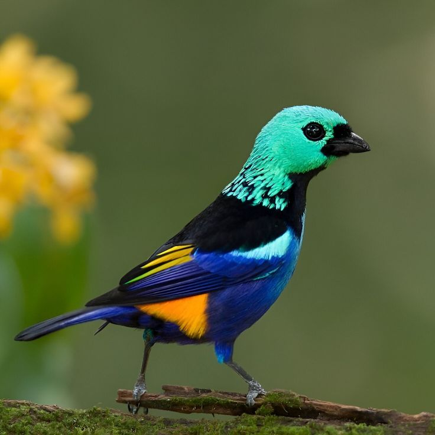

```{=html}
<div class="lp">

<!-- ===================== HERO ===================== -->
<section class="lp-hero">
  <div class="lp-hero-text">
    <h1 class="lp-rise">Saíra</h1>
    <p class="lp-sub lp-rise" style="--d: .15s">Darwin Core for Brazilian biodiversity.</p>
    <p class="lp-lede lp-rise" style="--d: .3s">An R/Shiny app that converts occurrence spreadsheets to the GBIF and SiBBr format. You work through menus and buttons, and the spreadsheet never leaves your computer.</p>
    <div class="lp-actions lp-rise" style="--d: .45s">
      <a class="lp-btn lp-btn-primary" href="tutorials/01-installation.html">Read the tutorials</a>
      <a class="lp-btn" href="#install">Install</a>
    </div>
  </div>
  <figure class="lp-fig">
    
    <div class="lp-label lp-rise" style="--d: .6s" role="group" aria-label="occurrence.txt row">
      <div class="lp-label-head"><span class="lp-ring"></span>OCCURRENCE.TXT · ROW 1</div>
      <dl>
        <dt>kingdom</dt><dd>Animalia</dd>
        <dt>family</dt><dd>Thraupidae</dd>
        <dt>scientificName</dt><dd><em>Tangara fastuosa</em></dd>
        <dt>scientificNameAuthorship</dt><dd>(Lesson, 1831)</dd>
        <dt>vernacularName</dt><dd>saíra-pintor</dd>
        <dt>dynamicProperties</dt><dd>{"mmaThreatStatus":"VU"}</dd>
      </dl>
    </div>
    <figcaption class="lp-credit lp-rise" style="--d: .4s">Photo: Ester Ramirez</figcaption>
  </figure>
</section>

<!-- ===================== FLOW: sheet, app tabs, occurrence.txt ===================== -->
<section class="lp-section" id="flow" aria-labelledby="flow-title">
  <div class="lp-head">
    <div>
      <span class="lp-eyebrow">From spreadsheet to Darwin Core</span>
      <h2 id="flow-title">Each tab works on the whole spreadsheet</h2>
    </div>
    <p>Four fictional camera-trap records. On top, the spreadsheet as it arrives. Below, the occurrence.txt, filled in tab by tab.</p>
  </div>
  <div class="lp-panel lp-flow" data-step="Step {n} of {total} · {tab}" data-raw="Spreadsheet as it arrived" data-done="Done. 4 rows in occurrence.txt, 2 with generalized coordinates.">
    <div class="lp-bar">
      <span class="lp-file">felinos_2023.csv<small>4 records · camera trap</small></span>
      <button type="button" class="lp-toggle" data-pause="Pause" data-play="Resume">Pause</button>
    </div>
    <div class="lp-stage">
      <span class="lp-cap">Your spreadsheet</span>
      <div class="lp-scroll"><div class="lp-grid lp-in" role="table" aria-label="Original spreadsheet" data-cols="Species|Lat|Long|Date|Site"></div></div>
      <div class="lp-vconn" aria-hidden="true"></div>
      <ol class="lp-tabs" aria-label="Saíra tabs">
        <li data-verb="reads the file and its encoding"><b>1</b>Home</li>
        <li data-verb="matches columns to terms"><b>2</b>Mapping</li>
        <li data-verb="shows the mapped records"><b>3</b>Preview</li>
        <li data-verb="checks names against the databases"><b>4</b>Names</li>
        <li data-verb="tests range, sea, country and swaps"><b>5</b>Coordinates</li>
        <li data-verb="protects threatened species"><b>6</b>Generalization</li>
        <li data-verb="writes ISO dates and stable IDs"><b>7</b>Export</li>
      </ol>
      <p class="lp-verb"></p>
      <div class="lp-vconn" aria-hidden="true"></div>
      <span class="lp-cap">Darwin Core · <span>occurrence.txt</span></span>
      <div class="lp-scroll"><div class="lp-grid lp-out" role="table" aria-label="occurrence.txt"></div></div>
    </div>
    <div class="lp-foot">
      <div class="lp-segs" aria-hidden="true"><span></span><span></span><span></span><span></span><span></span><span></span><span></span></div>
      <span class="lp-status">Spreadsheet as it arrived</span>
      <span class="lp-note">Fictional data. The generalization grid depends on each species' assessment. Here, 0.1°.</span>
    </div>
  </div>
</section>

<!-- ===================== INSTALL: macOS console replaying the install ===================== -->
<section class="lp-section lp-install" id="install" aria-labelledby="install-title">
  <div class="lp-install-text">
    <span class="lp-eyebrow">Installation</span>
    <h2 id="install-title">Install from the R console</h2>
    <p>pak installs Saíra and its dependencies. Then <code>saira::run_app()</code> opens the app in your browser.</p>
    <p class="lp-small">Never used R? The <a href="tutorials/01-installation.html">installation tutorial</a> starts from zero. Found a bug? <a href="https://github.com/rogerio-onza/saira/issues">Open an issue</a>.</p>
  </div>
  <figure class="lp-term" aria-labelledby="lp-term-label">
    <div class="lp-term-bar">
      <div class="lp-tl" aria-hidden="true"><span></span><span></span><span></span></div>
      <figcaption id="lp-term-label" class="lp-term-label">Console · R</figcaption>
      <button type="button" class="lp-copy" data-copied="Copied" data-copy='options(repos = c(&#10;  ropensci = "https://ropensci.r-universe.dev",&#10;  CRAN     = "https://cloud.r-project.org"&#10;))&#10;install.packages("pak")&#10;pak::pak("rogerio-onza/saira")&#10;saira::run_app()'>
        <svg viewBox="0 0 24 24" fill="none" stroke="currentColor" stroke-width="2" aria-hidden="true"><rect x="9" y="9" width="12" height="12" rx="2"/><path d="M5 15V5a2 2 0 012-2h10"/></svg>
        <span>Copy</span>
      </button>
    </div>
    <pre class="visually-hidden">options(repos = c(ropensci = "https://ropensci.r-universe.dev", CRAN = "https://cloud.r-project.org"))&#10;install.packages("pak")&#10;pak::pak("rogerio-onza/saira")&#10;saira::run_app()</pre>
    <div class="lp-term-body" aria-hidden="true">
      <div class="lp-term-line" data-cmd data-wait="90"><span class="pr">&gt; </span><span class="fn">options</span><span>(repos = </span><span class="fn">c</span><span>(</span></div>
      <div class="lp-term-line" data-cmd data-wait="90"><span class="pr">+ </span><span>  ropensci = </span><span class="str">"https://ropensci.r-universe.dev"</span><span>,</span></div>
      <div class="lp-term-line" data-cmd data-wait="90"><span class="pr">+ </span><span>  CRAN     = </span><span class="str">"https://cloud.r-project.org"</span></div>
      <div class="lp-term-line" data-cmd data-wait="500"><span class="pr">+ </span><span>))</span></div>
      <div class="lp-term-line" data-cmd data-wait="900"><span class="pr">&gt; </span><span class="fn">install.packages</span><span>(</span><span class="str">"pak"</span><span>)</span></div>
      <div class="lp-term-line" data-wait="120"><span class="out">The downloaded binary packages are in</span></div>
      <div class="lp-term-line" data-wait="500"><span class="out">    /var/folders/…/downloaded_packages</span></div>
      <div class="lp-term-line" data-cmd data-wait="700"><span class="pr">&gt; </span><span class="fn">pak::pak</span><span>(</span><span class="str">"rogerio-onza/saira"</span><span>)</span></div>
      <div class="lp-term-line" data-wait="450"><span class="str">✔ </span><span class="out">Loading metadata database ... done</span></div>
      <div class="lp-term-line" data-wait="350"><span class="out">→ Will install 128 packages.</span></div>
      <div class="lp-term-line" data-wait="1600"><span class="pr">ℹ </span><span class="out">Getting 128 pkgs</span></div>
      <div class="lp-term-line" data-wait="250"><span class="str">✔ </span><span class="out">Installed saira <span data-saira-version>0.11.2</span> (github::rogerio-onza/saira)</span></div>
      <div class="lp-term-line" data-wait="500"><span class="str">✔ </span><span class="out">1 pkg + 127 deps: added 128</span></div>
      <div class="lp-term-line" data-cmd data-wait="900"><span class="pr">&gt; </span><span class="fn">saira::run_app</span><span>()</span></div>
      <div class="lp-term-line"><span class="out">Listening on </span><span>http://127.0.0.1:7346</span></div>
    </div>
  </figure>
</section>

</div>
<script src="../assets/js/landing.js" defer></script>
```
