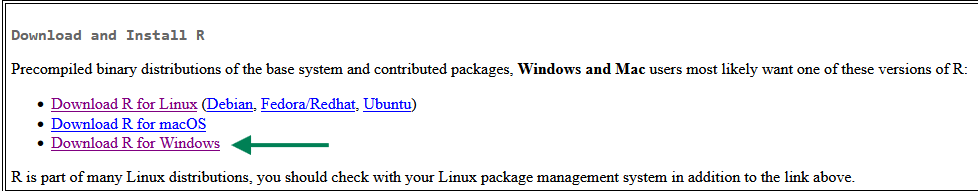
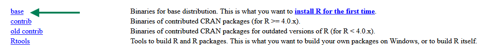
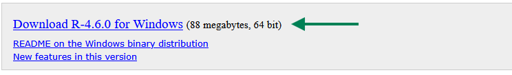
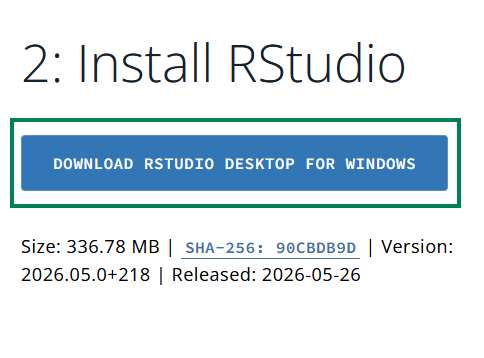
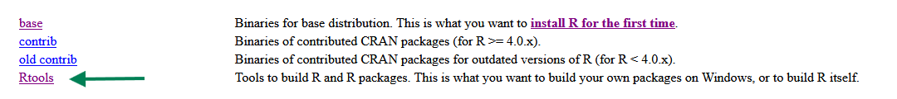
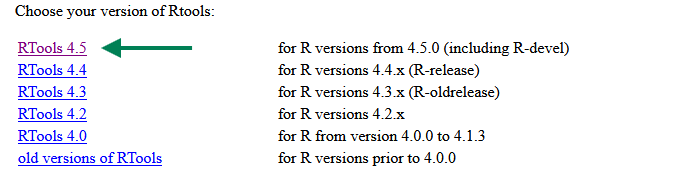
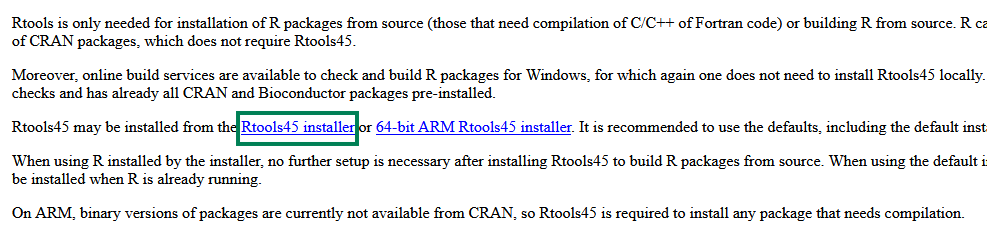
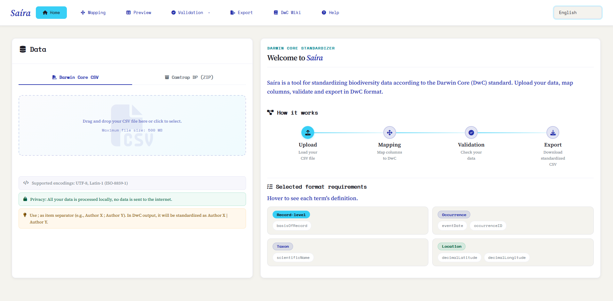

::: {.tut-standfirst}
Saíra is an R package that opens a visual interface in your browser. This page shows how to install it, start the application for the first time and what to expect from your first run.
:::

## Prerequisites

You need **R** installed (version 4.1 or higher), downloaded straight from [CRAN](https://cran.r-project.org/). [RStudio](https://posit.co/download/rstudio-desktop) is recommended but not required: any R console works. You do not need to know how to program. Once installed, all use happens through the graphical interface.

Because Saíra queries taxonomic databases and draws maps, a few supporting packages (spatial and spreadsheet-reading) are installed alongside it. On Linux these may require system libraries such as `GDAL`, `GEOS` and `PROJ`; on Windows and macOS they ship in the binaries.

## Installing R

Download R from the official **[CRAN](https://cran.r-project.org/)** site. The steps below are for Windows; on macOS choose "Download R for macOS" and follow the installer.

```{=html}
<figure class="shot">
  
  <figcaption><b>Figure 1.</b> On the CRAN page, choose <b>Download R for Windows</b> (or macOS, depending on your system).</figcaption>
</figure>
<figure class="shot">
  
  <figcaption><b>Figure 2.</b> Click <b>base</b> — that is the distribution you install the first time.</figcaption>
</figure>
<figure class="shot">
  
  <figcaption><b>Figure 3.</b> Download the installer (<b>Download R-4.x.x for Windows</b>) and run it with the default options.</figcaption>
</figure>
```

## Installing RStudio

**[RStudio Desktop](https://posit.co/download/rstudio-desktop)** is optional but makes the experience more comfortable. Download the version for your system and install it with the default options.

```{=html}
<figure class="shot">
  
  <figcaption><b>Figure 4.</b> On the Posit site, download <b>RStudio Desktop</b> and install it.</figcaption>
</figure>
```

## Windows: install Rtools

Because Saíra **is not on CRAN**, it is installed from source (next section). On **Windows**, compiling packages from source requires **Rtools**. Install the Rtools version that matches your R version before installing Saíra. (On macOS and Linux this step is usually not needed.)

```{=html}
<figure class="shot">
  
  <figcaption><b>Figure 5.</b> On the same R for Windows page, open <b>Rtools</b>.</figcaption>
</figure>
<figure class="shot">
  
  <figcaption><b>Figure 6.</b> Choose the version that matches your R (e.g. <b>RTools 4.5</b> for R 4.5 or higher).</figcaption>
</figure>
<figure class="shot">
  
  <figcaption><b>Figure 7.</b> Download the <b>Rtools installer</b> and run it with the default options.</figcaption>
</figure>
```

## Installing Saíra

Now that R (and, if you like, RStudio) are installed, let's install Saíra. Since it is not on CRAN yet, you install it straight from the GitHub repository with `pak`, which resolves all dependencies automatically. Open R (or RStudio) and run:

```r
install.packages("pak")
pak::pak("rogerio-onza/saira")
```

::: {.callout-tip}
## The first install takes a while
Saíra depends on several packages (Shiny, spreadsheet reading, taxonomic and geographic data). The first installation can take a few minutes while those dependencies are downloaded and compiled. Later installs are fast.
:::

## Opening the application

With the package installed, a single line opens the interface in your browser:

```r
library(saira)
saira::run_app()
```

The app opens in a new tab. From there, everything is done through menus, buttons and tables. To stop it, close the tab and interrupt the R session (`Esc` in the console or RStudio's stop button).

::: {.callout-warning}
## The window did not open?
On servers or environments without a default browser, `run_app()` prints a local address (something like `http://127.0.0.1:xxxx`). Copy that address and open it manually in your browser. To serve it to other computers on the network, run `saira::run_app(options = list(host = "0.0.0.0", port = 3838))`.
:::

```{=html}
<figure class="shot">
  
  <figcaption><b>Figure 8.</b> Saíra's welcome screen, with the language selector (PT-BR/EN) and the start of the import workflow.</figcaption>
</figure>
```

## Language

Saíra is bilingual. In the top corner of the interface you switch between **Portuguese (PT-BR)** and **English (EN-US)** at any time, handy for mixed teams or for publishing metadata in English. The switch is instant and does not interrupt work in progress.

## File size and performance

The app accepts uploads of up to **500 MB**, enough for datasets with hundreds of thousands of occurrences. Very large datasets make name validation and the map slower, because each name is looked up in the databases and each point is drawn. If you are just practicing the workflow, start with the sample spreadsheet.

## Updating

To update Saíra later, run the install command again (`pak::pak("rogerio-onza/saira")`). It pulls the latest version from the repository.

## Next steps

With the app open, go to **[Importing your data](02-upload.qmd)** and load your first spreadsheet.
