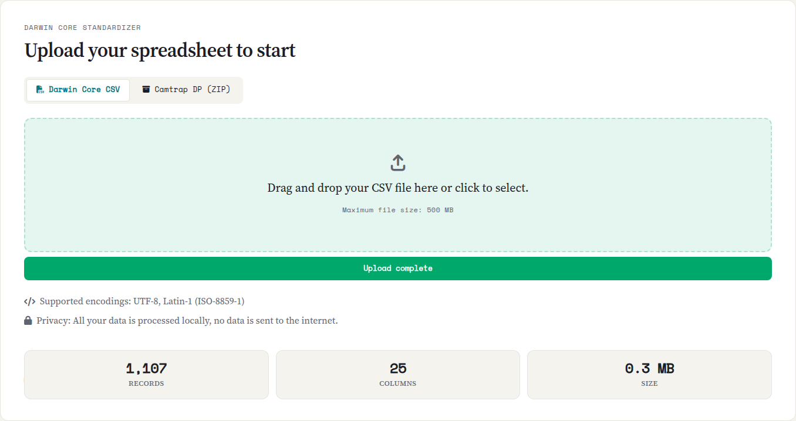

::: {.tut-standfirst}
The first step inside the application is loading your occurrence spreadsheet. Saíra accepts CSV (and the TSV/TXT variants) and camera-trap packages, and takes care of encoding and separator detection for you.
:::

## Supported formats

| Format | Extension | Notes |
|---|---|---|
| Delimited text | `.csv`, `.tsv`, `.txt` | Comma, semicolon or tab, detected automatically |
| Camera trap | `.zip` | Camtrap DP (with or without descriptor) and Wildlife Insights exports (see below) |

Each **row** should be one occurrence (a record of an organism in a place and time) and each **column** an attribute: catalog number, species, date, locality, collector, and so on.

## Loading the file

::: {.callout-tip}
## Download the sample spreadsheet
To practice this and the next steps, download [`ocorrencias-demo.csv`](../../assets/exemplo/ocorrencias-demo.csv), Saíra's demonstration dataset: 1,105 occurrences of Brazilian species across several biomes, deliberately imperfect. It has 24 columns to map, day, month and year in separate columns, catalogue numbers missing and repeated, coordinates swapped and out of range, records from neighbouring countries, threatened species for generalization and invasive alien species. Every tutorial step has something to resolve in it.
:::

In the **Upload** tab, drag the file onto the indicated area or click to select it.

```{=html}
<ol class="fix-steps">
  <li><strong>Select the file.</strong>
    <p>Drop the CSV or the camera-trap package onto the upload area (or click to choose).</p></li>
  <li><strong>Wait for the reading.</strong>
    <p>Saíra detects the encoding and separator automatically and shows a file summary: number of rows, number of columns and size.</p></li>
  <li><strong>Check the summary.</strong>
    <p>Verify that the row and column counts match what you expect.</p></li>
</ol>
```

```{=html}
<figure class="shot">
  
  <figcaption><b>Figure 1.</b> Upload area with the file summary (rows, columns and size) after loading.</figcaption>
</figure>
```

## Automatic encoding and separator detection

When it receives a CSV, Saíra tries to guess the **encoding** (UTF-8, Latin-1/ISO-8859-1, Windows-1252) and the column **separator**, and strips the byte-order mark (BOM) that some programs add at the start of the file. It is right almost every time; check in the summary that the column count makes sense, and review the content in the Mapping and Preview steps. Dates in various formats (`03/11/2024`, `2024-11-03`, `Nov 3 2024`) are recognized and standardized later, at export.

::: {.callout-tip}
## Accents showing up wrong?
That is almost always encoding. Brazilian spreadsheets are usually in **UTF-8** or **Latin-1 (ISO-8859-1)**. If, instead of `São Paulo`, you see `São Paulo` or `S?o Paulo`, it is the encoding. Saíra tries to detect it on its own; if it still comes out wrong, re-save the file as **UTF-8** before uploading (in Excel: *Save As → CSV UTF-8*).
:::

::: {.callout-warning}
## The whole spreadsheet opened in a single column?
That is the wrong separator. Brazilian files often use a **semicolon (`;`)** because the comma is already the decimal separator. Saíra detects the separator on its own; if the summary shows a single column, save the file with a consistent separator (`;` or `,`) or export it as **CSV UTF-8** and upload again.
:::

::: {.callout-important}
## Header on the first row
Saíra assumes the **first row** holds the column names. Remove title rows, logos or merged cells before exporting from Excel: they break the reading.
:::

## Camera-trap data

A regular occurrence spreadsheet you load directly (see [Supported formats](#supported-formats)). Camera-trap datasets are different: they arrive as **several separate files** (records, deployments, media) that have to be joined into a single table. That is why Saíra handles these `.zip` packages on their own, merging them automatically before mapping. It recognizes:

- **Camtrap DP** (Camera Trap Data Package): the standardized `.zip`, with the `datapackage.json` descriptor and the `deployments`, `observations` and (optional) `media` tables.
- **Loose Camtrap DP CSVs**: the same tables in a `.zip`, but **without the descriptor**: Saíra synthesizes one from the CSVs it finds.
- **Wildlife Insights**: the platform's export, where Saíra renames the columns to the Camtrap DP shape and derives the scientific name, the timestamp and the observation type.

In every case Saíra builds a consistent scientific name and organizes time and place, so the rest of the workflow (mapping, names, coordinates) works just like a regular spreadsheet.

::: {.callout-note}
## Incomplete camtrap package?
If the package descriptor is missing, Saíra tries to **synthesize** one from the CSVs it finds. Even so, check in the summary and the next steps that the species, date and coordinate columns came through before proceeding.
:::

With the data loaded and displayed correctly, move on to **[Mapping fields to Darwin Core](03-dwc-mapping.qmd)**.
