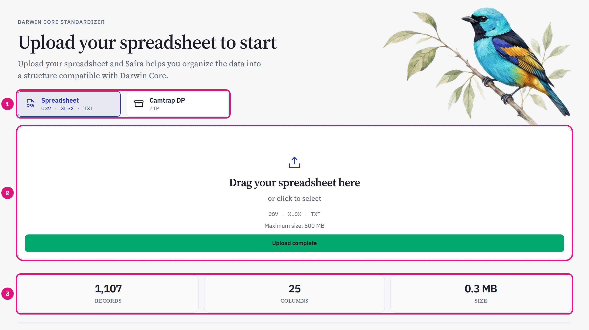

::: {.tut-standfirst}
Load the occurrence spreadsheet in the **Home** step.
:::

## Send the file

```{=html}
<figure class="shot"></figure>
```

::: {.marks}
1. Choose the format: **Spreadsheet** for CSV, XLSX or TXT, **Camtrap DP** for the camera-trap ZIP.
2. Drag the file to the upload area, or click it.
3. Check the summary: records, columns and size.
:::

| Format | Files |
|---|---|
| Spreadsheet | `.csv`, `.tsv`, `.txt`, `.xlsx` (first sheet only) |
| Camera trap | `.zip` Camtrap DP or Wildlife Insights export |

Each row is an occurrence. Each column is an attribute. The first row must have the column names.

::: {.callout-tip}
## Sample spreadsheet
[`ocorrencias-demo.csv`](../../assets/exemplo/ocorrencias-demo.csv) has 1,107 occurrences with deliberate errors: mixed dates, repeated catalog numbers, swapped coordinates, threatened and invasive species. The tutorials use this file.
:::

## If the file reads wrong

Saíra detects the encoding (UTF-8, Latin-1, Windows-1252) and the separator (comma, semicolon, tab). If the summary or the data look wrong:

| Symptom | Cause | Fix |
|---|---|---|
| `São Paulo` or `S?o Paulo` | Encoding | In Excel, save as **CSV UTF-8** and send it again. |
| Only one column in the summary | Mixed separators | Save with one separator only, `;` or `,`. |
| Strange column names | Rows above the header | Delete titles, logos and merged cells above the header. |

## Camera traps

In the **Camtrap DP** tab, Saíra accepts three kinds of `.zip`:

- **Camtrap DP** with the `datapackage.json` descriptor and the `deployments`, `observations` and, if present, `media` tables.
- The same tables **without the descriptor**. Saíra builds the descriptor from the CSVs.
- The **Wildlife Insights export**. Saíra renames the columns to the Camtrap DP format.

Saíra joins the tables into one spreadsheet, with scientific name, date and location. After that, the workflow is the same as for a spreadsheet.

Wildlife Insights data already comes with the sensitive species protected. See [generalization](06-generalization.qmd).

## Mapping guide

If you have the `<dataset>-mapping-guide.txt` from an earlier export, send the guide in the same area. Saíra imports the mapping. See [Reuse the mapping](03-dwc-mapping.qmd#reuse-the-mapping).
