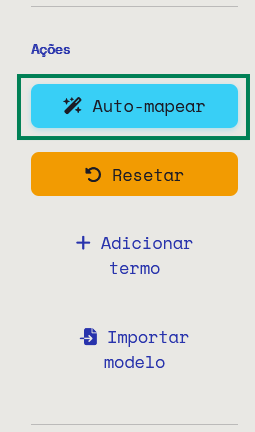
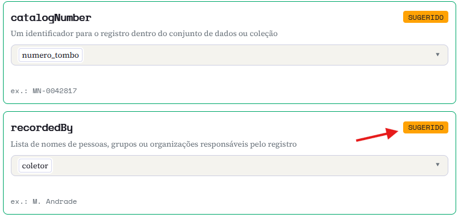
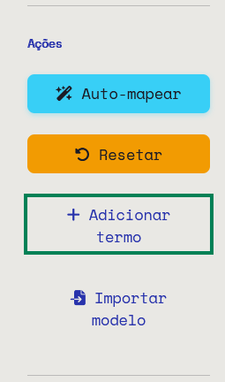
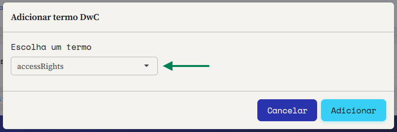
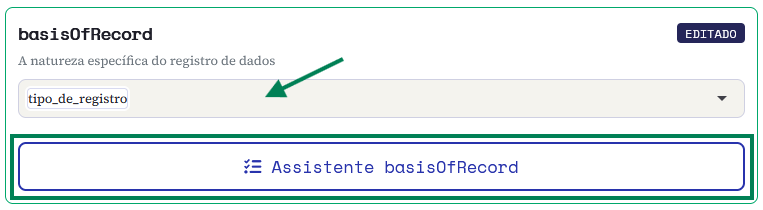
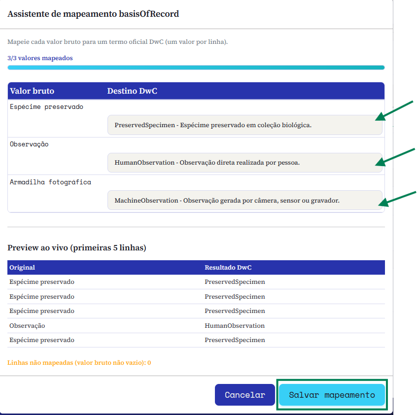

::: {.tut-standfirst}
How to match your spreadsheet columns to the terms of the Darwin Core standard using Saíra's visual mapper: the step that turns local data into interoperable records.
:::

## Overview

After importing your data (see [Importing your data](02-upload.qmd)), each column still carries the name you use day to day: <span class="term">numero_tombo</span>, <span class="term">especie</span>, <span class="term">data_coleta</span>. Mapping is the step where we tell Saíra which Darwin Core term matches each of those columns.

Saíra suggests matches automatically from each column's name and content. A good mapping is the foundation of everything that follows: validation, export and data quality all depend on it.

::: {.callout-note}
## The final decision is always yours
Saíra **suggests**, but you decide. Every suggestion can be confirmed, changed or discarded — nothing is applied without your review.
:::

## Auto-mapping

The **Auto-map** button, in the actions bar, sweeps every column at once and proposes a term for each one, assigning a **status** that signals how confident the suggestion is:

```{=html}
<figure class="shot">
  
  <figcaption><b>Figure 1.</b> The <b>Auto-map</b> button in the actions bar, next to Reset, Add term and Import template.</figcaption>
</figure>
```

- **AUTO**: high confidence (high score and compatible data type); already filled in.
- **SUGGESTED**: a likely match; confirm or adjust before moving on.
- **EDITED**: you adjusted it manually; your choice overrides the suggestions.

At the end, Saíra shows a summary (for example, "12 AUTO, 5 SUGGESTED"). Review the SUGGESTED ones carefully and confirm or correct each.

```{=html}
<ol class="steps">
  <li><strong>Run auto-mapping.</strong>
    <p>Click <span class="term">Auto-map</span>. High-confidence fields appear filled in and marked AUTO.</p></li>
  <li><strong>Review the suggested ones.</strong>
    <p>For each column marked SUGGESTED, confirm the term or change it in the selector.</p></li>
  <li><strong>Resolve unmapped fields.</strong>
    <p>Columns without a clear match are highlighted. Pick the matching Darwin Core term or <strong>leave the column unmapped</strong> — it is preserved on export (see below).</p></li>
  <li><strong>Set the basisOfRecord.</strong>
    <p>Use the assistant (see below) to map the record type from a column (e.g. <span class="term">tipo_de_registro</span>), pairing each value — Specimen, Observation, Camera trap — with its Darwin Core term.</p></li>
  <li><strong>Check the preview.</strong>
    <p>The bottom panel shows the first rows already with Darwin Core names, so you can validate before moving on.</p></li>
</ol>
```

```{=html}
<figure class="shot">
  
  <figcaption><b>Figure 2.</b> Mapping cards after Auto-map: <span class="term">numero_tombo</span> → <span class="term">catalogNumber</span> and <span class="term">coletor</span> → <span class="term">recordedBy</span>, both marked SUGGESTED for you to confirm.</figcaption>
</figure>
```

## Term catalog and search

The mapper works with a base set of the most-used Darwin Core terms, but the full catalog has about **218 terms** (`dwc:` and `dcterms:` properties). If the column you need is not in the list, use **Add term** to find and include any property in the standard, such as <span class="term">coordinateUncertaintyInMeters</span>, <span class="term">samplingProtocol</span> or <span class="term">organismQuantity</span>.

```{=html}
<figure class="shot">
  
  <figcaption><b>Figure 3.</b> The <b>Add term</b> button in the actions bar.</figcaption>
</figure>
<figure class="shot">
  
  <figcaption><b>Figure 4.</b> The <b>Add DwC term</b> dialog: pick the term in the selector and confirm to add it as a new card.</figcaption>
</figure>
```

### Example mapping

The table below shows a typical mapping for an ornithological collection:

```{=html}
<table class="maptable">
  <thead><tr><th>Spreadsheet column</th><th></th><th>Darwin Core term</th></tr></thead>
  <tbody>
    <tr><td>numero_tombo</td><td><span class="arrow">→</span></td><td>catalogNumber</td></tr>
    <tr><td>especie</td><td><span class="arrow">→</span></td><td>scientificName</td></tr>
    <tr><td>data_coleta</td><td><span class="arrow">→</span></td><td>eventDate</td></tr>
    <tr><td>coletor</td><td><span class="arrow">→</span></td><td>recordedBy</td></tr>
    <tr><td>latitude</td><td><span class="arrow">→</span></td><td>decimalLatitude</td></tr>
    <tr><td>longitude</td><td><span class="arrow">→</span></td><td>decimalLongitude</td></tr>
  </tbody>
</table>
```

## Templates

::: {.callout-tip}
## Save a template and reuse it
Save your mapping as a **template**. Collections often re-import spreadsheets with the same structure: reusing the template applies the whole mapping at once and saves hours on every new batch of records. On reapply, columns coming from the template show up with the matching status, and you only review what changed.
:::

## The basisOfRecord assistant

The term <span class="term">basisOfRecord</span> describes the nature of the record: preserved specimen, human observation, fossil material, machine record (camera trap), among others. Rather than a single value for the whole batch, Saíra includes an **assistant** that starts from a column of your spreadsheet (for example, <span class="term">tipo_de_registro</span>) and lets you pair **each distinct value** with its Darwin Core term, explaining each option in plain language — so you do not have to memorize the standard's controlled values.

```{=html}
<figure class="shot">
  
  <figcaption><b>Figure 5.</b> In the <span class="term">basisOfRecord</span> card, pick the source column (here, <span class="term">tipo_de_registro</span>) and open the <b>basisOfRecord assistant</b>.</figcaption>
</figure>
```

| Your value in the spreadsheet | Darwin Core term |
|---|---|
| Material cataloged in a collection | `PreservedSpecimen` |
| Field observation (no collection) | `HumanObservation` |
| Camera-trap photo | `MachineObservation` |
| Fossil material | `FossilSpecimen` |

```{=html}
<figure class="shot">
  
  <figcaption><b>Figure 6.</b> The assistant maps <b>each value</b> to a DwC term — Espécime preservado → PreservedSpecimen, Observação → HumanObservation, Armadilha fotográfica → MachineObservation — with a live preview before saving.</figcaption>
</figure>
```

## Unmapped columns

Not every column has to become a Darwin Core term — just leave it unmapped. At export, Saíra **appends to the right** the columns you did not use as a source for any term, preserving their original names and order, so no data is lost: you can edit them by hand later, already in the IPT.

::: {.callout-warning}
## Do not map two columns to the same term
If <span class="term">especie</span> and <span class="term">nome_cientifico</span> both point to <span class="term">scientificName</span>, Saíra flags the conflict and asks you to choose a single source before proceeding.
:::

```{=html}
<figure class="shot">
  <div class="frame"><span class="ph-label">screenshot · mapping screen</span></div>
  <figcaption><b>Figure 7.</b> Saíra's mapping panel, with automatic suggestions on the left and the Darwin Core preview on the right.</figcaption>
</figure>
```

## Next steps

With the fields mapped, your data is already in Darwin Core vocabulary, but it has not been verified yet. Go to **[Validating scientific names](04-name-validation.qmd)**.
