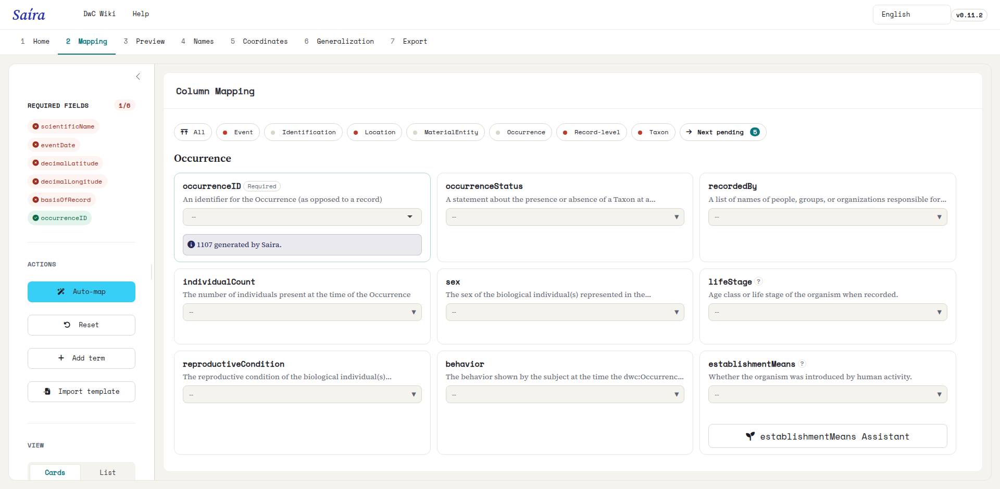
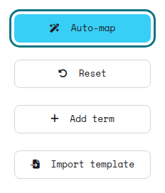
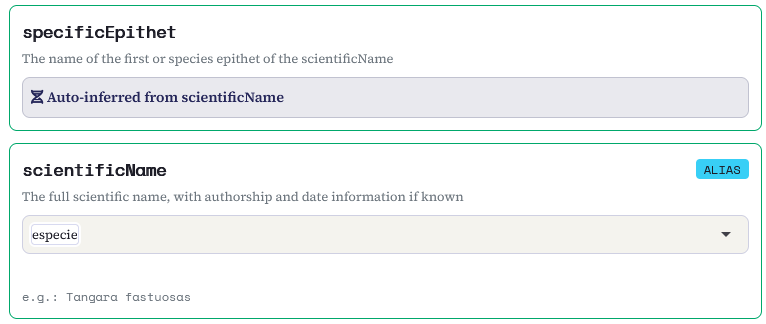
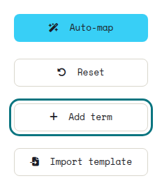
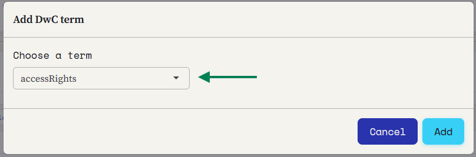
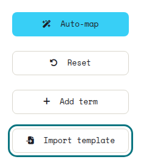
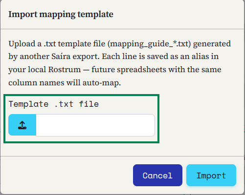
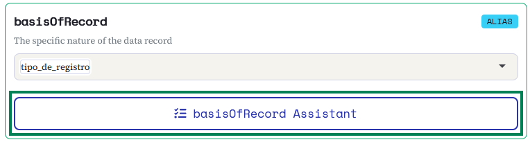
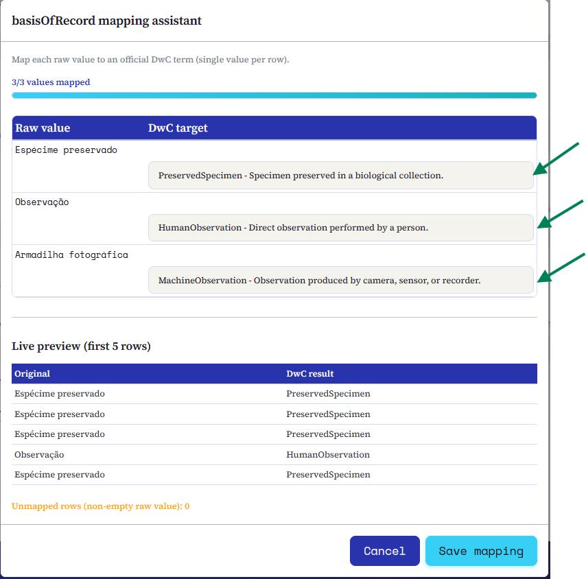
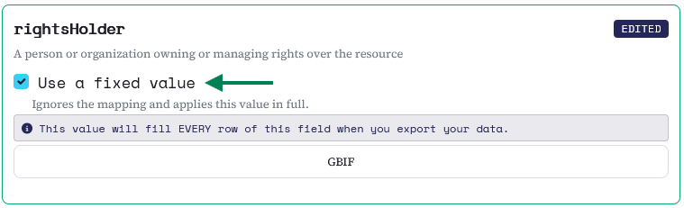

::: {.tut-standfirst}
How to match your spreadsheet columns to the terms of the Darwin Core standard using Saíra's visual mapper: the step that turns local data into interoperable records.
:::

## Overview

After importing your data (see [Importing your data](02-upload.qmd)), each column still carries the name you use day to day: <span class="term">numero_tombo</span>, <span class="term">especie</span>, <span class="term">data_coleta</span>. Mapping is the step where we tell Saíra which Darwin Core term matches each of those columns.

Saíra suggests matches automatically from each column's name and content. A good mapping is the foundation of everything that follows: validation, export and data quality all depend on it.

```{=html}
<figure class="shot">
  
  <figcaption><b>Figure 1.</b> The <b>Mapping</b> tab right after import, before any mapping: on the left, the required-fields panel and the actions bar (Auto-map, Reset, Add term, Import template); on the right, the Darwin Core term cards grouped by class (here, Occurrence).</figcaption>
</figure>
```

::: {.callout-note}
## The final decision is always yours
Saíra **suggests**, but you decide. Every suggestion can be confirmed, changed or discarded; nothing is applied without your review.
:::

## Auto-mapping

The **Auto-map** button, in the actions bar, sweeps every column at once and proposes a term for each one, assigning a **status** that signals how confident the suggestion is:

```{=html}
<figure class="shot">
  
  <figcaption><b>Figure 2.</b> The <b>Auto-map</b> button in the actions bar, next to Reset, Add term and Import template.</figcaption>
</figure>
```

Each card gets a **status badge**. You will see seven, depending on where the match came from:

```{=html}
<table class="maptable">
  <thead><tr><th>Badge</th><th>What it means</th></tr></thead>
  <tbody>
    <tr><td><span class="swatch" style="background:var(--success)"></span>AUTO</td><td>High confidence (high score and compatible data type). Already filled in.</td></tr>
    <tr><td><span class="swatch" style="background:var(--warning)"></span>SUGGESTED</td><td>A likely match. Confirm or adjust before moving on.</td></tr>
    <tr><td><span class="swatch" style="background:var(--coord-reference)"></span>AMBIGUOUS</td><td>Two or more terms with similar confidence. Saíra will not choose for you.</td></tr>
    <tr><td><span class="swatch" style="background:var(--info)"></span>EDITED</td><td>You adjusted it manually. Your choice overrides the suggestions.</td></tr>
    <tr><td><span class="swatch" style="background:var(--primary)"></span>ALIAS</td><td>Recognized by a saved alias from an earlier mapping.</td></tr>
    <tr><td><span class="swatch" style="background:var(--primary-dark)"></span>TEMPLATE</td><td>Came from an imported template.</td></tr>
    <tr><td><span class="swatch" style="background:var(--coord-missing)"></span>MANUAL</td><td>Set by you, or left unmapped, with no automatic suggestion.</td></tr>
  </tbody>
</table>
```

At the end, Saíra shows a summary (for example, "12 AUTO, 5 SUGGESTED"). Review the SUGGESTED ones carefully and confirm or correct each.

```{=html}
<ol class="fix-steps">
  <li><strong>Run auto-mapping.</strong>
    <p>Click <span class="term">Auto-map</span>. High-confidence fields appear filled in and marked AUTO.</p></li>
  <li><strong>Review the suggested ones.</strong>
    <p>For each column marked SUGGESTED, confirm the term or change it in the selector.</p></li>
  <li><strong>Resolve unmapped fields.</strong>
    <p>Columns without a clear match are highlighted. Pick the matching Darwin Core term or <strong>leave the column unmapped</strong>: it is preserved on export (see below).</p></li>
  <li><strong>Set the basisOfRecord.</strong>
    <p>Use the assistant (see below) to map the record type from a column (e.g. <span class="term">tipo_de_registro</span>), pairing each value (Specimen, Observation, Camera trap) with its Darwin Core term.</p></li>
  <li><strong>Check the preview.</strong>
    <p>The bottom panel shows the first rows already with Darwin Core names, so you can validate before moving on.</p></li>
</ol>
```

```{=html}
<figure class="shot">
  
  <figcaption><b>Figure 3.</b> Mapping cards after Auto-map: <span class="term">especie</span> → <span class="term">scientificName</span>, marked <b>ALIAS</b> (matched from a remembered mapping), while <span class="term">specificEpithet</span> is <b>auto-inferred from scientificName</b>.</figcaption>
</figure>
```

::: {.callout-warning}
## Do not map two columns to the same term
If <span class="term">especie</span> and <span class="term">nome_cientifico</span> both point to <span class="term">scientificName</span>, Saíra flags the conflict and asks you to choose a single source before proceeding.
:::

## Term catalog and search

The mapper works with a base set of the most-used Darwin Core terms, but the full catalog has about **218 terms** (`dwc:` and `dcterms:` properties). If the column you need is not in the list, use **Add term** to find and include any property in the standard, such as <span class="term">coordinateUncertaintyInMeters</span>, <span class="term">samplingProtocol</span> or <span class="term">organismQuantity</span>.

```{=html}
<figure class="shot">
  
  <figcaption><b>Figure 4.</b> The <b>Add term</b> button in the actions bar.</figcaption>
</figure>
<figure class="shot">
  
  <figcaption><b>Figure 5.</b> The <b>Add DwC term</b> dialog: pick the term in the selector and confirm to add it as a new card.</figcaption>
</figure>
```

### Example mapping

The table below shows a typical mapping for an ornithological collection:

```{=html}
<table class="maptable">
  <thead><tr><th>Spreadsheet column</th><th></th><th>Darwin Core term</th></tr></thead>
  <tbody>
    <tr><td>numero_tombo</td><td><span class="arrow">→</span></td><td>catalogNumber</td></tr>
    <tr><td>especie</td><td><span class="arrow">→</span></td><td>scientificName</td></tr>
    <tr><td>data_coleta</td><td><span class="arrow">→</span></td><td>eventDate</td></tr>
    <tr><td>coletor</td><td><span class="arrow">→</span></td><td>recordedBy</td></tr>
    <tr><td>latitude</td><td><span class="arrow">→</span></td><td>decimalLatitude</td></tr>
    <tr><td>longitude</td><td><span class="arrow">→</span></td><td>decimalLongitude</td></tr>
  </tbody>
</table>
```

## Templates

You don't need to save the mapping by hand. When you download the standardized spreadsheet (see [Preview and export](07-preview-export.qmd)), Saíra includes a **template** in the `.zip`: a text file (`<dataset>-mapping-guide.txt`) that records only the "your column → Darwin Core term" vocabulary, with no data. It is your mapping saved, ready to reuse later or hand to a colleague.

To reuse it, open the mapping for a new spreadsheet and click **Import template** in the actions bar. Each line of the template is saved as an alias in your local Rostrum, so columns with the same name are mapped automatically: you only review what changed.

```{=html}
<figure class="shot">
  
  <figcaption><b>Figure 6.</b> The <b>Import template</b> button, in the actions bar, brings back a template saved from an earlier export.</figcaption>
</figure>
<figure class="shot">
  
  <figcaption><b>Figure 7.</b> The <b>Import mapping template</b> dialog: pick the <code><dataset>-mapping-guide.txt</code> file that came in the <code>.zip</code> and confirm. Each line becomes an alias to auto-map future spreadsheets.</figcaption>
</figure>
```

::: {.callout-tip}
## Reuse it and save hours
Collections often re-import spreadsheets with the same structure. Reapplying the template applies the whole mapping at once and saves hours on every new batch of records.
:::

## The basisOfRecord assistant

The term <span class="term">basisOfRecord</span> describes the nature of the record: preserved specimen, human observation, fossil material, machine record (camera trap), among others. Rather than a single value for the whole batch, Saíra includes an **assistant** that starts from a column of your spreadsheet (for example, <span class="term">tipo_de_registro</span>) and lets you pair **each distinct value** with its Darwin Core term, explaining each option in plain language, so you do not have to memorize the standard's controlled values.

```{=html}
<figure class="shot">
  
  <figcaption><b>Figure 8.</b> In the <span class="term">basisOfRecord</span> card, pick the source column (here, <span class="term">tipo_de_registro</span>) and open the <b>basisOfRecord assistant</b>.</figcaption>
</figure>
```

```{=html}
<table class="maptable">
  <thead><tr><th>Your value in the spreadsheet</th><th></th><th>Darwin Core term</th></tr></thead>
  <tbody>
    <tr><td>Material cataloged in a collection</td><td><span class="arrow">→</span></td><td>PreservedSpecimen</td></tr>
    <tr><td>Field observation (no collection)</td><td><span class="arrow">→</span></td><td>HumanObservation</td></tr>
    <tr><td>Camera-trap photo</td><td><span class="arrow">→</span></td><td>MachineObservation</td></tr>
    <tr><td>Fossil material</td><td><span class="arrow">→</span></td><td>FossilSpecimen</td></tr>
  </tbody>
</table>
```

```{=html}
<figure class="shot">
  
  <figcaption><b>Figure 9.</b> The assistant maps <b>each value</b> to a DwC term (Espécime preservado → PreservedSpecimen, Observação → HumanObservation, Armadilha fotográfica → MachineObservation), with a live preview before saving.</figcaption>
</figure>
```

## Fixed values for the whole dataset

Some terms describe the **whole dataset**, not each record. Instead of repeating the value in every row of your spreadsheet, tick **Use a fixed value** on the term's card and type the value once: Saíra writes it to **every row** at export.

Seven terms accept a fixed value:

```{=html}
<p class="chip-row">
  <span class="term">rightsHolder</span>
  <span class="term">institutionCode</span>
  <span class="term">collectionCode</span>
  <span class="term">country</span>
  <span class="term">references</span>
  <span class="term">bibliographicCitation</span>
  <span class="term">geodeticDatum</span>
</p>
```

Mapping a column and using a fixed value are alternatives (an **OR** separates them): ticking the box hides the column selector, so the constant can never silently overwrite a column you had already mapped. The text field appears only after you tick the box, so nothing clutters the screen needlessly.

```{=html}
<figure class="shot">
  
  <figcaption><b>Figure 10.</b> On an eligible term's card, tick <b>Use a fixed value</b> and type the value once.</figcaption>
</figure>
<figure class="shot">
  
  <figcaption><b>Figure 11.</b> The warning strip makes clear the value fills <b>every row</b> of that field.</figcaption>
</figure>
```

::: {.callout-note}
## Terms not shown by default
<span class="term">references</span>, <span class="term">bibliographicCitation</span> and <span class="term">geodeticDatum</span> are not in the base set of cards. Add them with **Add term** (see above) and the fixed-value option appears on the card as soon as the term is added. <span class="term">countryCode</span> is filled automatically during coordinate validation, and <span class="term">basisOfRecord</span> has its own assistant, so those two do not use a fixed value.
:::

## Unmapped columns

Not every column has to become a Darwin Core term: just leave it unmapped. At export, Saíra **appends to the right** the columns you did not use as a source for any term, preserving their original names and order, so no data is lost: you can edit them by hand later, already in the IPT.

## Next steps

With the fields mapped, your data is already in Darwin Core vocabulary, but it has not been verified yet. Go to **[Validating scientific names](04-name-validation.qmd)**.
