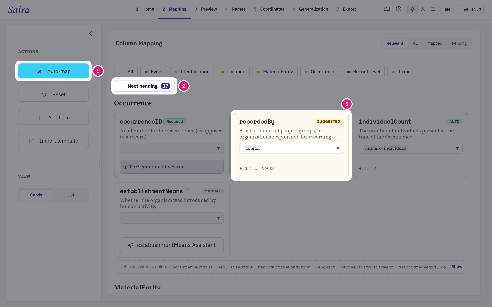
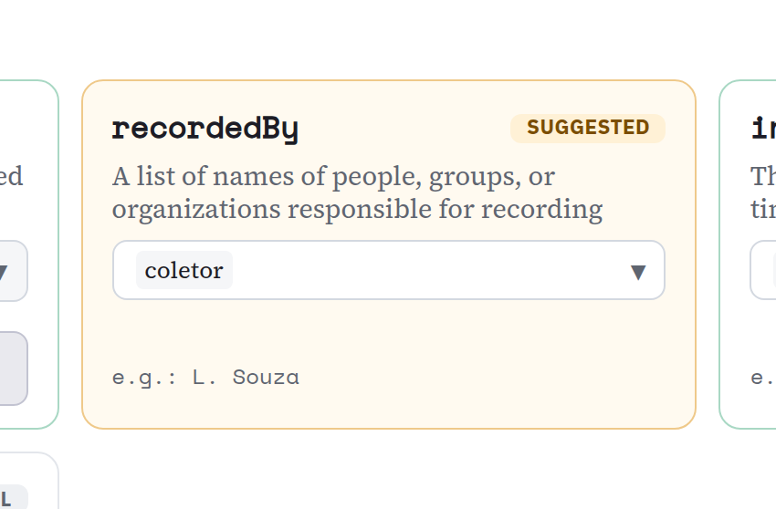
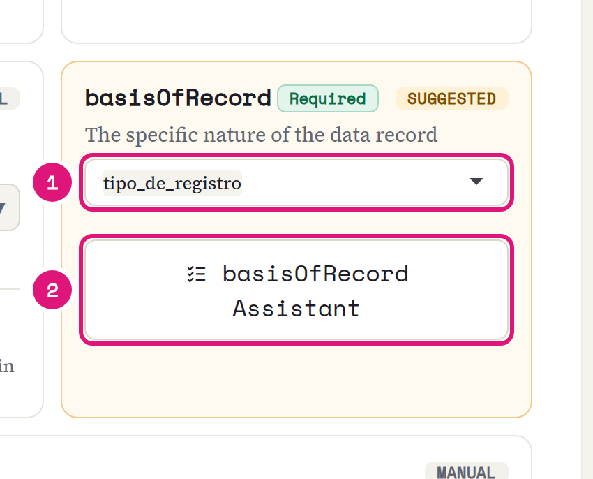
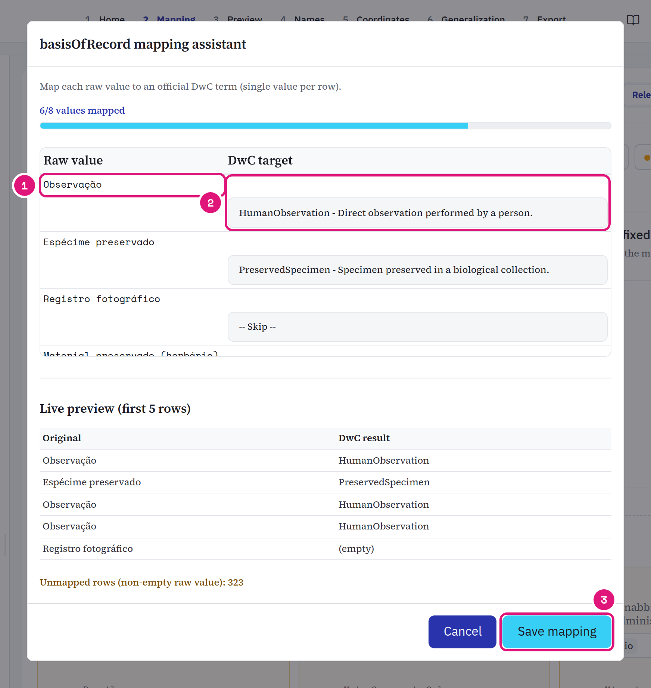
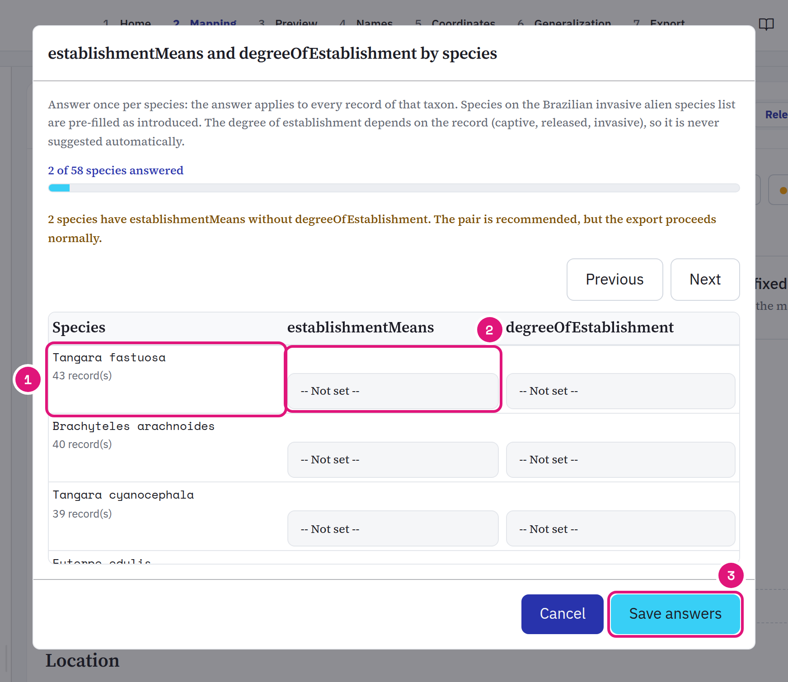
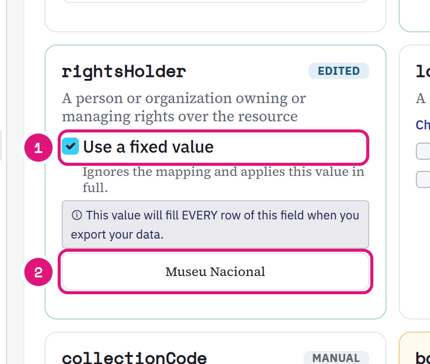
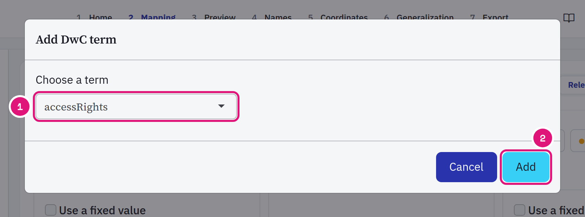
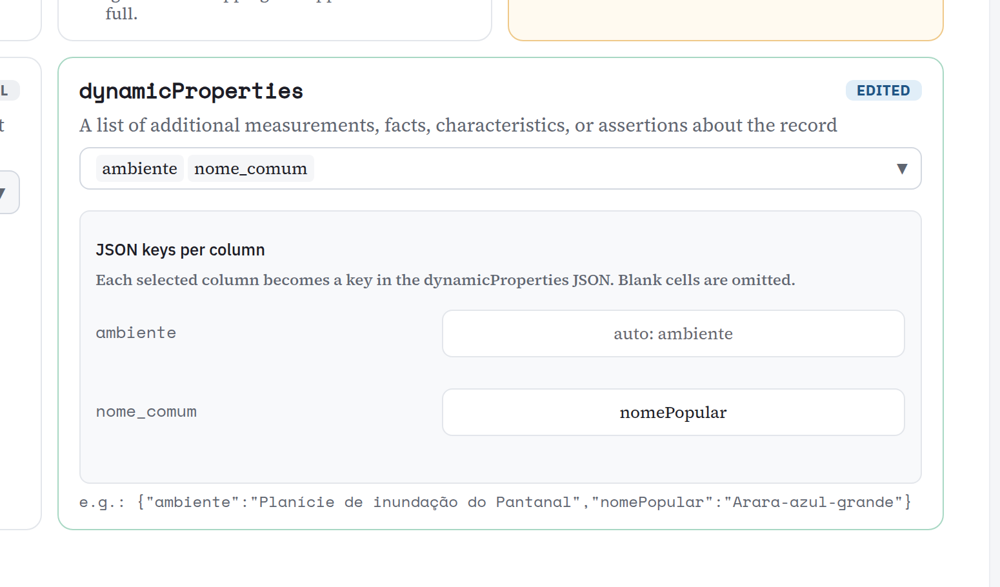
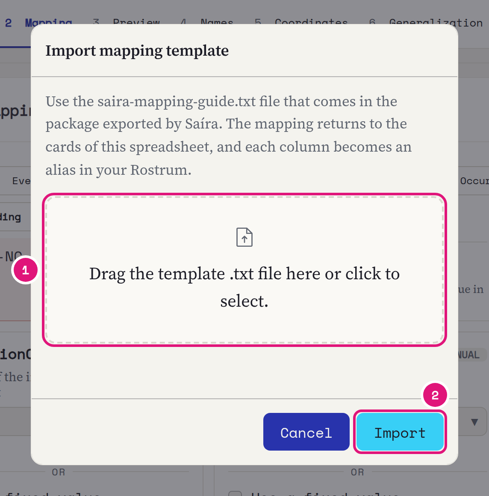

::: {.tut-standfirst}
Match each spreadsheet column to a Darwin Core term in the **Mapping** step.
:::

## Run Auto-map

```{=html}
<figure class="shot"></figure>
```

::: {.marks}
1. Click **Auto-map**. Saíra proposes a term for each column.
2. **Next pending** jumps to the next card that needs review. The number tells how many are left. In the class filters, a red dot is an empty required term, orange is review.
3. A yellow card is **SUGGESTED**: confirm or change it.
:::

## Review each card

```{=html}
<figure class="shot"></figure>
```

::: {.marks}
1. The badge tells where the term came from.
2. Wrong column? Change it in the selector.
3. `e.g.:` shows the first value read from the column.
:::

| Badge | Meaning |
|---|---|
| AUTO | High confidence. Already filled in. |
| SUGGESTED | Likely. Confirm it. |
| AMBIGUOUS | Two terms tie. You choose. |
| EDITED | You changed it. Your choice wins. |
| ALIAS | Came from an earlier mapping. |
| TEMPLATE | Came from an imported template. |
| MANUAL | No automatic suggestion. |

If the same column goes to more than one term, Saíra warns you. Check that this is intentional.

## Set basisOfRecord

```{=html}
<figure class="shot"></figure>
```

::: {.marks}
1. Choose the column with the record type, such as <span class="term">tipo_de_registro</span>.
2. Open the **basisOfRecord Assistant**.
:::

```{=html}
<figure class="shot"></figure>
```

::: {.marks}
1. Each distinct value of the column shows once.
2. Choose the Darwin Core term. The preview below shows the result.
3. **Save mapping**.
:::

## Answer establishmentMeans per species

Optional. The assistant is on the <span class="term">establishmentMeans</span> card and needs <span class="term">scientificName</span> mapped.

```{=html}
<figure class="shot"></figure>
```

::: {.marks}
1. One row per species, with the number of records the answer covers.
2. Choose <span class="term">establishmentMeans</span>. Next to it, the <span class="term">degreeOfEstablishment</span>.
3. **Save answers**.
:::

Invasive species already arrive as `introduced`. The degree is never suggested: only you know if the animal is captive or free. If a spreadsheet column also fills the term, the column wins.

## Use a fixed value for the dataset

```{=html}
<figure class="shot"></figure>
```

::: {.marks}
1. Check **Use a fixed value**.
2. Type the value once. It goes to all rows.
:::

These terms accept a fixed value: <span class="term">rightsHolder</span> <span class="term">institutionCode</span> <span class="term">collectionCode</span> <span class="term">country</span> <span class="term">references</span> <span class="term">bibliographicCitation</span> <span class="term">geodeticDatum</span>. The last three come in with **Add term**.

## Choose the license

The <span class="term">license</span> card is required. Choose CC0, CC-BY or CC-BY-NC, the three licenses GBIF accepts. Without a license, the export blocks.

## Add a term that is not shown

```{=html}
<figure class="shot"></figure>
```

::: {.marks}
1. Search for the term. The catalog has about 218.
2. **Add**. The term becomes a new card.
:::

## Put extra columns in dynamicProperties

```{=html}
<figure class="shot"></figure>
```

::: {.marks}
1. Choose the columns.
2. Rename the key, if you want.
3. Check the JSON of the first row.
:::

The conservation status goes into the same field, from [name validation](04-name-validation.qmd).

## Reuse the mapping

The exported `.zip` has the `<dataset>-mapping-guide.txt`. On the next spreadsheet, click **Import template**:

```{=html}
<figure class="shot"></figure>
```

::: {.marks}
1. Send the file.
2. **Import**. Columns with the same name map automatically.
:::

Columns that you do not map go at the end of the file, with the original name. GBIF ignores these columns.
