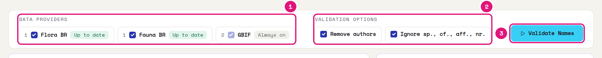
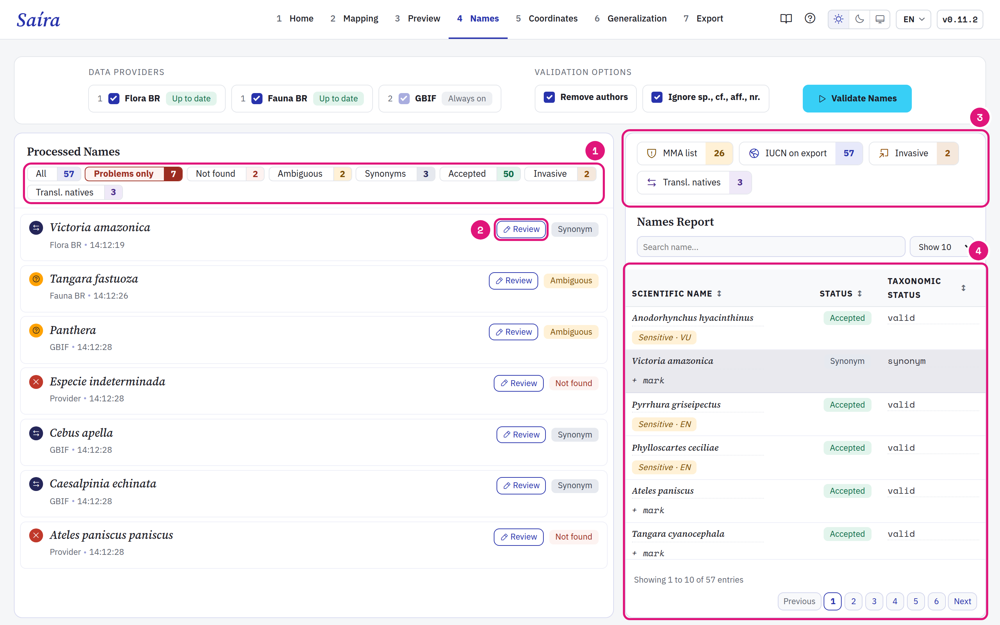
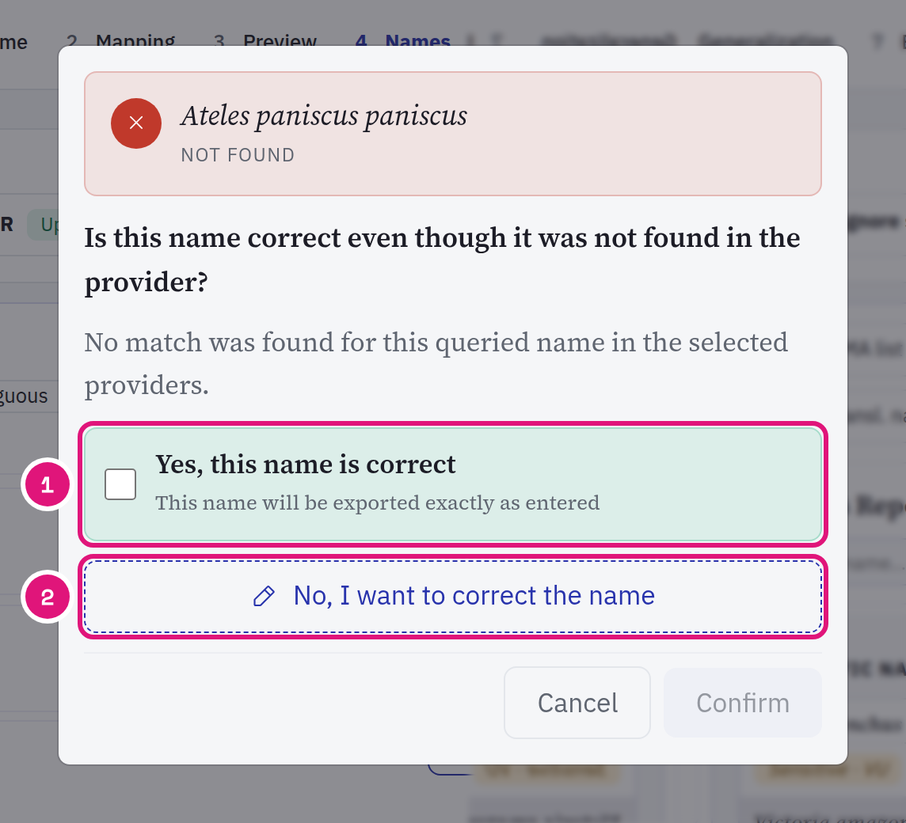
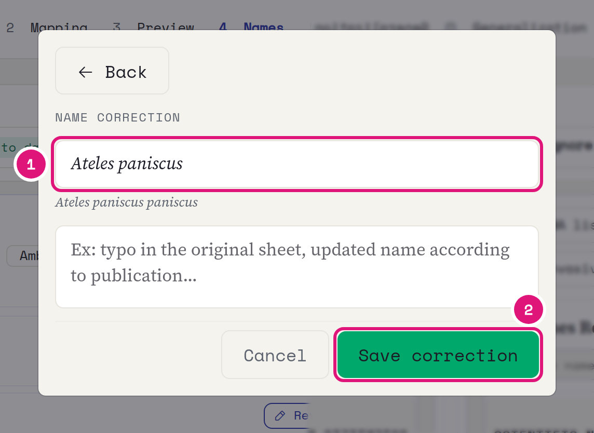
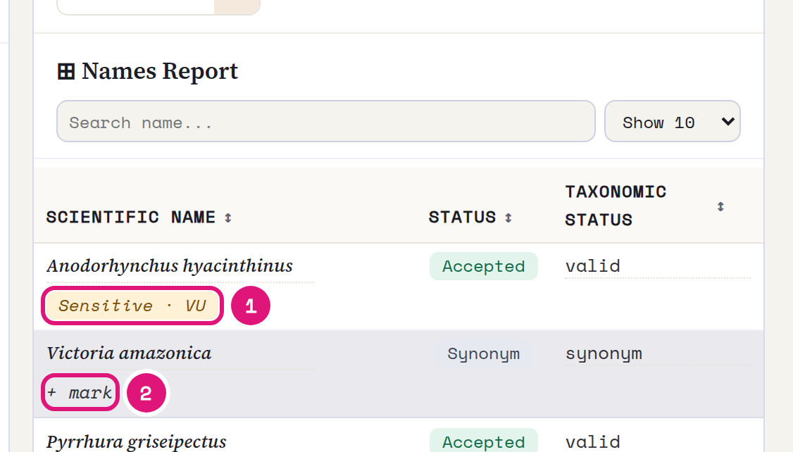
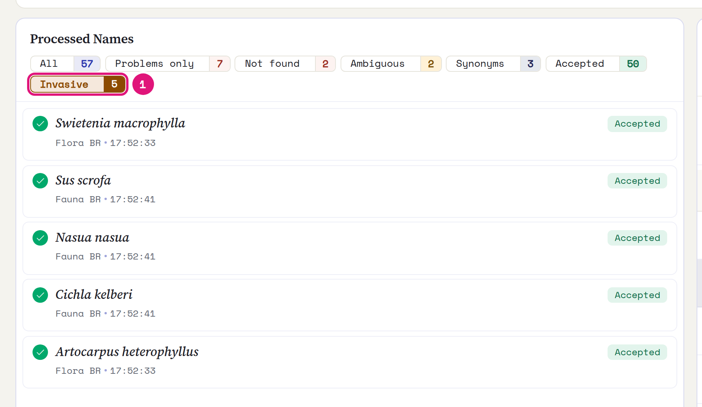

::: {.tut-standfirst}
Check each <span class="term">scientificName</span> against a taxonomic backbone in the **Names** step. The step also flags threatened and invasive species.
:::

## Run the validation

```{=html}
<figure class="shot"></figure>
```

::: {.marks}
1. Check **Flora BR** and **Fauna BR**. GBIF is always on.
2. Both options start on. They remove author and year (`Harpia harpyja (Daudin, 1800)`) and qualifiers (`sp.`, `cf.`, `aff.`, `nr.`) before the query.
3. Click **Validate Names**.
:::

The number on the provider is the query order. Saíra queries Flora BR and Fauna BR first, then GBIF. Each distinct name is queried once.

::: {.callout-note}
## Flora BR and Fauna BR stay on your computer
Saíra downloads both backbones on first use. After that, the validation works offline. If the provider shows **Update failed**, reinstall Saíra with `pak::pak("rogerio-onza/saira")`.
:::

## Read the result

```{=html}
<figure class="shot"></figure>
```

::: {.marks}
1. The filters group the names by status. **Problems only** shows what needs review.
2. **Review** opens the decision for that name.
3. How many species are on the MMA list, how many records get the IUCN status and how many species are invasive.
4. The report lists all names, with status and sensitivity mark.
:::

| Status | Meaning |
|---|---|
| Accepted | The name is the accepted name in the backbone. |
| Synonym | The backbone points to another accepted name. Also applies to spellings that the backbone marks as invalid. |
| Ambiguous | More than one strong candidate. You choose. |
| Not found | The name is in none of the backbones queried. |

Saíra does not fix spelling by itself. It only shows what the backbone returns.

## Review a name

```{=html}
<figure class="shot"></figure>
```

::: {.marks}
1. Is the name correct, such as a newly described taxon? Check the box and click **Confirm**. The name goes out as it is.
2. Is the name wrong? Click **No, I want to correct the name**.
:::

```{=html}
<figure class="shot"></figure>
```

::: {.marks}
1. Type the correct name. The reason is optional.
2. **Save correction**.
:::

The decision applies to all rows with the same name.

::: {.callout-warning}
## The taxonomic decision is yours
In groups with unstable taxonomy, check each case. The correction replaces the name in the export. To keep the original name, also map the same column to <span class="term">verbatimIdentification</span> in [mapping](03-dwc-mapping.qmd).
:::

## Check the threatened species

The Brazilian national list from MMA comes embedded in Saíra. Species on the list get the **Sensitive** mark with the category: VU, EN, CR or CR (PEX).

```{=html}
<figure class="shot"></figure>
```

::: {.marks}
1. Click the mark to remove the sensitivity. Without the mark, the coordinates of the species go out without generalization.
2. **+ mark** makes a species outside the list sensitive.
:::

The threat category does not change: it comes from the ordinances. This step only marks. The protection of the coordinates happens in [generalization](06-generalization.qmd).

::: {.callout-note}
## Where the list comes from
The embedded list comes from the official lists of the Brazilian Ministry of the Environment (MMA): **flora** from [**MMA Ordinance No. 148 of June 7, 2022**](https://www.in.gov.br/en/web/dou/-/portaria-mma-n-148-de-7-de-junho-de-2022-406272733); **terrestrial fauna** from [**MMA Ordinance No. 1,704 of June 16, 2026**](https://www.in.gov.br/en/web/dou/-/portaria-mma-n-1.704-de-16-de-junho-de-2026-712968917); and **aquatic fauna** (fish and invertebrates) from [**GM/MMA Ordinance No. 1,667 of April 27, 2026**](https://www.in.gov.br/web/dou/-/portaria-gm/mma-n-1.667-de-27-de-abril-de-2026-702075623).
:::

## Find the invasive species

```{=html}
<figure class="shot"></figure>
```

::: {.marks}
1. The **Invasive** filter shows the species on the invasive alien species list of the Hórus Institute (483 taxa).
:::

This filter uses the species list, not the validation status. Reviews do not change the count. In [mapping](03-dwc-mapping.qmd), these species arrive in the <span class="term">establishmentMeans</span> assistant as `introduced`.

The checked backbones set the conservation status written in the export: Flora BR and Fauna BR give the MMA category, GBIF gives the IUCN category. See [Preview and export](07-preview-export.qmd#conservation-status-in-dynamicproperties).
