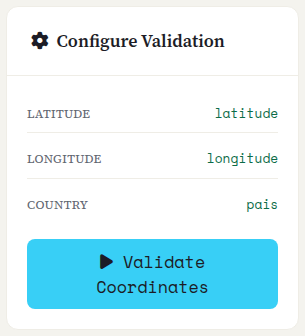
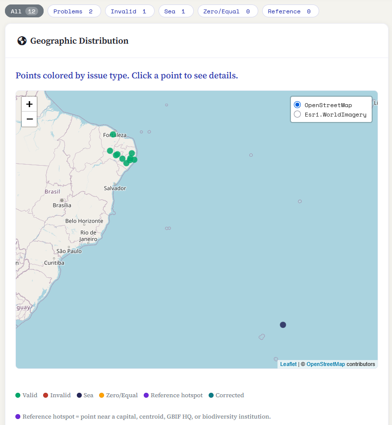
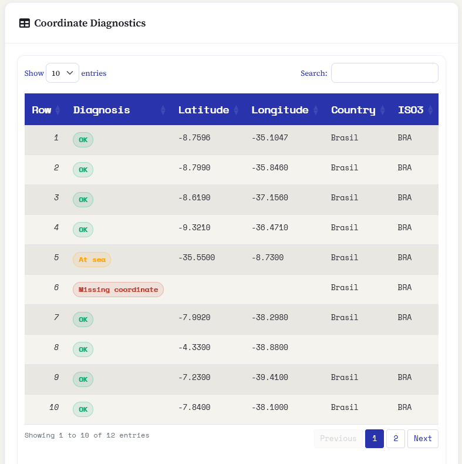
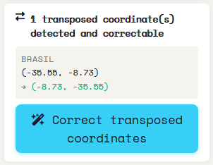
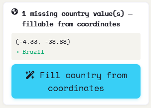
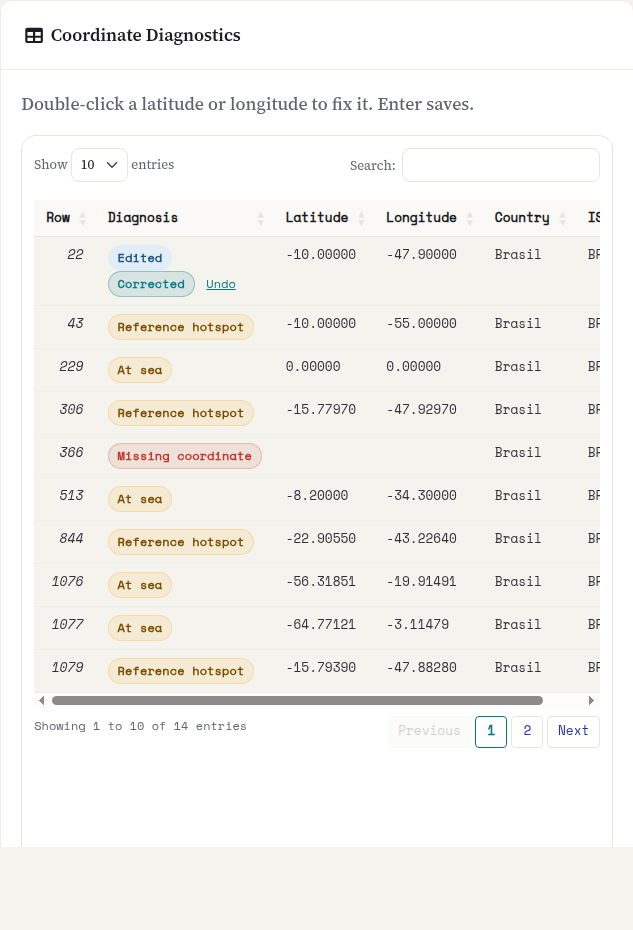

::: {.tut-standfirst}
Inverted, swapped or (0, 0) coordinates are among the most common errors in field spreadsheets. Saíra runs a deterministic diagnosis, shows every record on a map and in a table, and **proposes safe corrections**, applied only on export, never silently over your data.
:::

## Before validating: what must be mapped

Coordinate validation only runs once three Darwin Core terms are mapped (see **[Mapping](03-dwc-mapping.qmd)**):

- <span class="term">decimalLatitude</span>
- <span class="term">decimalLongitude</span>
- <span class="term">country</span>

The bar at the top of the screen shows the column associated with each term. While any is missing, the **Validate Coordinates** button stays disabled.

Validation always runs every test, including the detection of *reference hotspots* (suspicious points on capitals, country centroids, the GBIF HQ and biodiversity institutions).

Click **Validate Coordinates**. Validation is triggered by you, not on every change to the data.

```{=html}
<figure class="shot">
  
  <figcaption><b>Figure 1.</b> Top bar: status of the mapped columns (latitude, longitude, country) and the Validate Coordinates button.</figcaption>
</figure>
```

## What Saíra checks

From <span class="term">decimalLatitude</span>, <span class="term">decimalLongitude</span> and <span class="term">country</span>, each record gets **one diagnosis**, in the same color shown on the map and in the table badges:

```{=html}
<table class="maptable">
  <thead><tr><th>Diagnosis</th><th>What it means</th></tr></thead>
  <tbody>
    <tr><td><span class="swatch" style="background:var(--success)"></span>OK</td><td>Passed every test.</td></tr>
    <tr><td><span class="swatch" style="background:var(--coord-missing)"></span>Missing coordinate</td><td>Latitude or longitude empty or non-numeric.</td></tr>
    <tr><td><span class="swatch" style="background:var(--error)"></span>Out of bounds</td><td>Impossible values (latitude beyond ±90, longitude beyond ±180) or a zeroed coordinate.</td></tr>
    <tr><td><span class="swatch" style="background:var(--coord-swap)"></span>Possible swap</td><td>Latitude and longitude appear switched.</td></tr>
    <tr><td><span class="swatch" style="background:var(--info)"></span>At sea</td><td>The point falls in the water according to the coastline layer, when it should be on land.</td></tr>
    <tr><td><span class="swatch" style="background:var(--warning)"></span>Zero/Equal</td><td>Coordinate at (0, 0) or with identical latitude and longitude.</td></tr>
    <tr><td><span class="swatch" style="background:var(--coord-identical)"></span>All identical</td><td>Every valid record shares the same coordinate pair: a sign of a collective placeholder.</td></tr>
    <tr><td><span class="swatch" style="background:var(--coord-reference)"></span>Reference hotspot</td><td>Point near a capital, country centroid, GBIF HQ or biological institution (<b>Complete</b> profile only).</td></tr>
  </tbody>
</table>
```

The tests are deterministic (in the style of `CoordinateCleaner`) and use the Natural Earth country layer bundled with Saíra: they run without depending on external services.

## Reading the results

Once validation finishes, the results appear on the right.

**Filters.** Above the map, buttons filter the view by category: **All**, **Problems**, **Invalid**, **Sea**, **Zero/Equal** and **Reference**. Clicking one filters the map and the table at once.

**Map: Geographic Distribution.** Each record becomes a point, colored by situation. Click a point to see its row, diagnosis and coordinates; clusters outside the expected area stand out.

```{=html}
<table class="maptable">
  <thead><tr><th>Map color</th><th>Situation</th></tr></thead>
  <tbody>
    <tr><td><span class="swatch" style="background:var(--success)"></span>Green</td><td>Valid</td></tr>
    <tr><td><span class="swatch" style="background:var(--error)"></span>Red</td><td>Invalid</td></tr>
    <tr><td><span class="swatch" style="background:var(--info)"></span>Navy</td><td>Sea</td></tr>
    <tr><td><span class="swatch" style="background:var(--warning)"></span>Orange</td><td>Zero/Equal</td></tr>
    <tr><td><span class="swatch" style="background:var(--coord-reference)"></span>Violet</td><td>Reference hotspot</td></tr>
  </tbody>
</table>
```

```{=html}
<figure class="shot">
  
  <figcaption><b>Figure 2.</b> Geographic Distribution: points colored by situation, with the color legend below the map.</figcaption>
</figure>
```

::: {.callout-warning}
## The sea test is approximate
The sea test uses simplified coastline data. Points very close to the coast may be incorrectly flagged. **Verify visually on the map before discarding** a record marked *At sea*.
:::

**Table: Coordinate Diagnostics.** Below the map, a table lists each record with the columns **Row**, **Diagnosis** (colored badge), **Latitude**, **Longitude**, **Country** and **ISO3** (the resolved country code). It is searchable, paginated and follows the active filter.

```{=html}
<figure class="shot">
  
  <figcaption><b>Figure 3.</b> The filters and the Coordinate Diagnostics table (Row, Diagnosis, Latitude, Longitude, Country, ISO3).</figcaption>
</figure>
```

## Assisted corrections

Saíra **proposes the correction** for you to apply explicitly. The original coordinates are never silently overwritten, and accepted corrections are **applied on export**, not in the preview. When the export template has empty <span class="term">verbatimLatitude</span> and <span class="term">verbatimLongitude</span> columns, the original values are preserved there.

When candidates exist, panels appear on the left. Each shows the count and one example, and turns green with a ✓ once applied:

```{=html}
<ol class="fix-steps">
  <li><strong>Fix transpositions and swaps.</strong>
    <p>For points outside the informed country, Saíra tries lat/lon swaps and sign flips and accepts the first that lands inside the country (~22 km border margin). Button: <strong>Correct transposed coordinates</strong>.</p></li>
  <li><strong>Fill the country from the point.</strong>
    <p>When <span class="term">country</span> is blank and the coordinate is valid, Saíra derives the country the point falls in. Country values you already provided are never overwritten. Button: <strong>Fill country from coordinates</strong>.</p></li>
  <li><strong>Handle sea points with no country.</strong>
    <p>Blank country + sea point is a strong sign of a lat/lon swap. Saíra tries the swap and, when the corrected point lands unambiguously in a country, proposes the coordinate and the country together. Button: <strong>Swap lat/lon and fill country</strong>.</p></li>
</ol>
```

```{=html}
<figure class="shot">
  
  <figcaption><b>Figure 4.</b> Transposed-coordinate correction panel: count, example (old → new) and the Correct transposed coordinates button.</figcaption>
</figure>
```

```{=html}
<figure class="shot">
  
  <figcaption><b>Figure 5.</b> Country-fillable-from-coordinates panel (and the "sea + blank country → fixable by lat/lon swap" variant).</figcaption>
</figure>
```

## Fix a coordinate in the table

When no panel covers the error, fix the point in the **Coordinate Diagnostics** table itself, without going back to the spreadsheet:

```{=html}
<ol class="fix-steps">
  <li><strong>Double-click the latitude or the longitude.</strong>
    <p>The cell turns into a field. Type the value in decimal degrees, with a comma or a point (<code>-15,8</code> or <code>-15.8</code>). Enter saves.</p></li>
  <li><strong>Read the new diagnosis.</strong>
    <p>Saíra validates the point again, with the same tests. If it passes, the row reads <em>Edited</em> and <em>Corrected</em>. If it still fails (for example, it is still at sea), the row shows the new problem. The marker moves on the map.</p></li>
  <li><strong>Undo if you need to.</strong>
    <p>The row's <strong>Undo</strong> link brings the original coordinate back. The <strong>Edited</strong> filter shows only the rows you fixed.</p></li>
</ol>
```

```{=html}
<figure class="shot">
  
  <figcaption><b>Figure 6.</b> A row fixed in the table: <em>Edited</em> and <em>Corrected</em> badges, the Undo link and the new value.</figcaption>
</figure>
```

A manual fix follows the rules of the assisted ones: it goes into the export, and the original value goes to <span class="term">verbatimLatitude</span> and <span class="term">verbatimLongitude</span> when those columns are empty. Validating again does not erase manual fixes. A row without a unique <span class="term">occurrenceID</span> cannot be edited.

**Records with no coordinate** are marked *Missing coordinate*. Saíra does not invent a point from the locality text: those records are left to your judgement. Keep them ungeoreferenced as a conscious choice, or type both coordinates in the table.

::: {.callout-tip}
## Datum and precision
Record the <span class="term">geodeticDatum</span> (for example, <em>WGS84</em>) and, when known, the uncertainty in meters (<span class="term">coordinateUncertaintyInMeters</span>). Without these two fields, whoever reuses the record cannot tell whether the point is reliable to 10 m or to 10 km. Many analyses, such as distribution modeling, filter precisely on <span class="term">coordinateUncertaintyInMeters</span>.
:::

::: {.callout-warning}
## Coordinate signs in Brazil
Most of Brazil has **negative latitude and longitude**. Positive coordinates where the south/west hemisphere was expected are a strong sign of a sign error or a swap. The classic example: `-34.87, -8.04` (lat, lon) instead of `-8.04, -34.87` throws a point from Pernambuco into the middle of the Atlantic.
:::

Data mapped, names resolved and coordinates reviewed. If there are threatened species, the next step decides how to protect them: go to **[Generalizing sensitive species](06-generalization.qmd)**.
