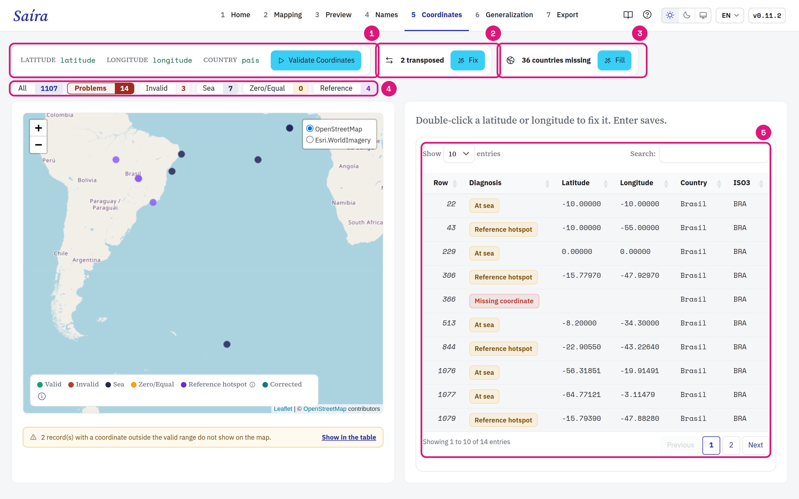
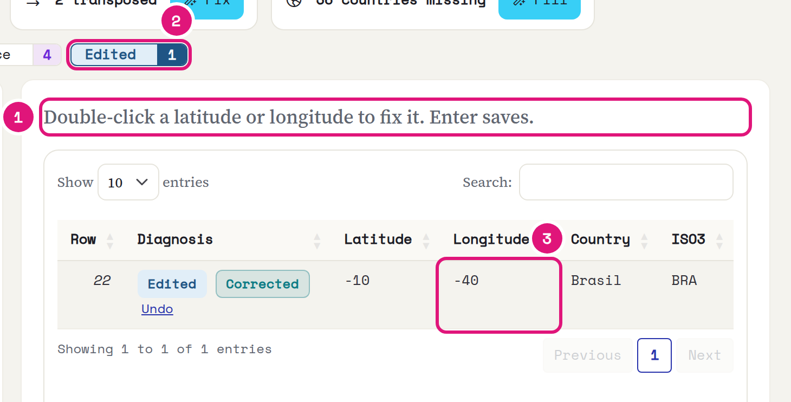

::: {.tut-standfirst}
Find coordinates that are swapped, at sea or outside the country in the **Coordinates** step. Saíra proposes fixes. You decide which ones to apply.
:::

## Run the validation

The validation needs <span class="term">decimalLatitude</span>, <span class="term">decimalLongitude</span> and <span class="term">country</span> mapped. If one is missing, the **Validate Coordinates** button stays disabled.

```{=html}
<figure class="shot"></figure>
```

::: {.marks}
1. The mapped columns and the **Validate Coordinates** button.
2. Transposed coordinates. **Fix** applies the swap.
3. Missing countries. **Fill** uses the country where the point falls.
4. The filters change the map and the table together.
5. The table lists each record with its diagnosis.
:::

| Diagnosis | Meaning |
|---|---|
| Missing coordinate | Latitude or longitude is empty or not a number. |
| Invalid | Latitude beyond ±90 or longitude beyond ±180. |
| Possible swap | Latitude and longitude look swapped. |
| At sea | The point falls in water. |
| Zero/Equal | Point at (0, 0) or latitude equal to longitude. |
| Reference hotspot | Point near a capital, a country centroid, the GBIF headquarters or a biological institution. |

The tests run offline, with the Natural Earth country layer embedded in Saíra.

::: {.callout-warning}
## The sea test is approximate
The coastline is simplified. A point very near the coast can show as **At sea**. Check it on the map before you discard the record.
:::

## Apply the proposed fixes

The panels show only when there are candidates:

| Panel | What Saíra does |
|---|---|
| **Fix** transposed | Tries swaps of latitude and longitude and of sign. Accepts the first that falls in the given country (~22 km margin). |
| **Fill** countries | Fills an empty <span class="term">country</span> with the country where the point falls. Does not replace a country already given. |
| **Swap** at sea without country | Swaps latitude and longitude and fills the country, if the new point falls in only one country. |

The fixes apply on export. The original data does not change. If <span class="term">verbatimLatitude</span> and <span class="term">verbatimLongitude</span> are empty, the original value goes to them.

## Fix a point in the table

```{=html}
<figure class="shot"></figure>
```

::: {.marks}
1. Double-click the latitude or the longitude. Type the value in decimal degrees, with a comma or a period. Enter saves.
2. The **Edited** filter shows only the rows you fixed.
3. The new value. Saíra validates the point again. **Undo** restores the original value.
:::

Validating again does not remove the manual fixes. A row without a unique <span class="term">occurrenceID</span> does not accept edits.

Saíra does not make a coordinate from the locality text. A record without coordinates stays as it is, unless you type both coordinates in the table.

::: {.callout-tip}
## Sign of coordinates in Brazil
Almost all of Brazil has negative latitude and longitude. `-34.87, -8.04` (lat, lon) instead of `-8.04, -34.87` puts a point from Pernambuco in the middle of the Atlantic.
:::

Also record the <span class="term">geodeticDatum</span> (for example, `WGS84`) and, if you know it, <span class="term">coordinateUncertaintyInMeters</span>. Many analyses filter records by this field.
