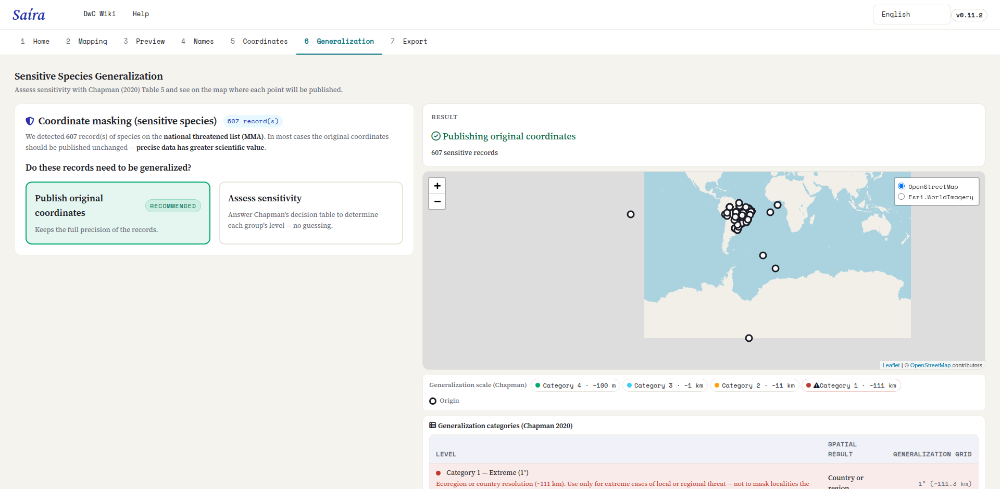
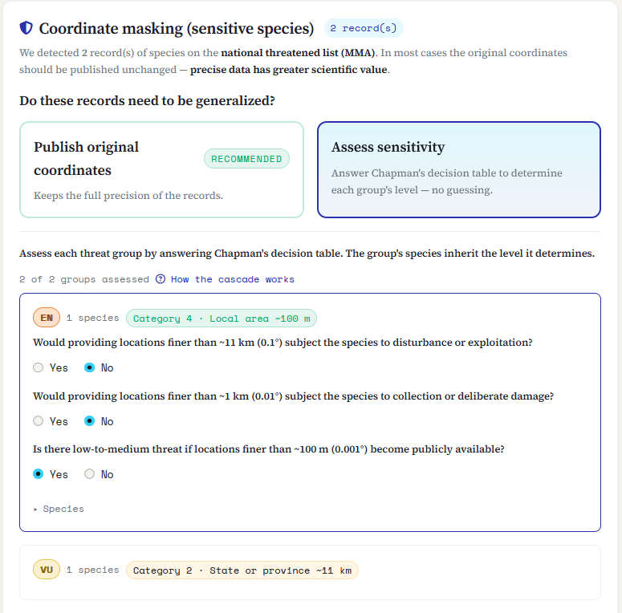
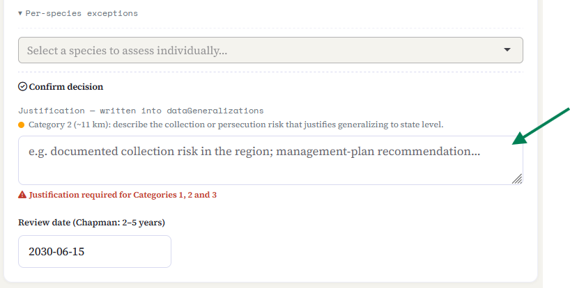
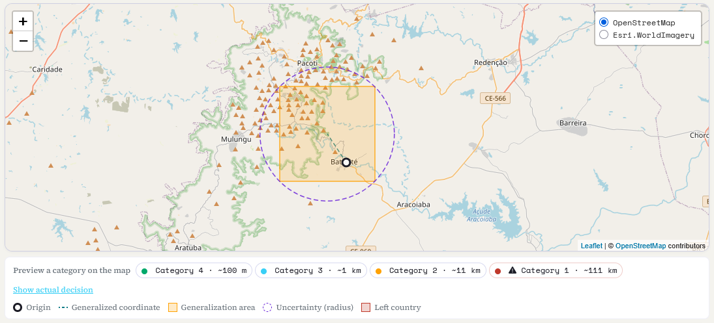

::: {.tut-standfirst}
Publishing the exact location of a threatened species can expose it to collection or persecution. In this step Saíra helps you decide, species by species, **whether** and **how much** to reduce coordinate precision before publishing, following the GBIF best practices described by Chapman (2020).
:::

## When this step appears

The **Generalization** tab only has work to do when [name validation](04-name-validation.qmd) flagged records of **threatened species** (the taxa on the national MMA list, plus any species you marked as sensitive by hand). Those are the records that arrive here for assessment.

If no sensitive taxon was detected, there is nothing to generalize: Saíra tells you so and you go straight to export, publishing the coordinates as they are.

```{=html}
<figure class="shot">
  
  <figcaption><b>Figure 1.</b> The Generalization tab lists the threatened-species records that came from name validation.</figcaption>
</figure>
```

::: {.callout-important}
## The default is to publish the original coordinate
Precise data has **greater scientific value**. Generalizing is the exception, not the rule: reduce precision only when there is a real risk of collection, persecution or exploitation. When in doubt, consult your country's conservation-authority guidelines. In Brazil, the recommendation is to follow the guidelines recommended by GBIF.
:::

## Two entry choices

For the set of sensitive records, Saíra offers two paths:

- **Publish original coordinates** *(recommended)*: keeps the full precision. The right choice in most cases.
- **Assess sensitivity**: opens [Chapman's (2020)](https://doi.org/10.15468/doc-5jp4-5g10) decision table to determine, with no guessing, the generalization level of each threat group.

Saíra also **detects automatically** coordinates that already arrived generalized (from an upstream source) and **does not generalize them again** — so the location is never degraded twice.

::: {.callout-important}
## DO NOT GENERALIZE WILDLIFE INSIGHTS DATA TWICE
**Wildlife Insights already obfuscates the coordinates of sensitive species** on export. If your dataset came from there and you flagged those species as sensitive, **choose "Publish original coordinates" and do NOT apply Saíra's generalization**. Generalizing again would degrade the location **TWICE**, losing precision needlessly with no added protection.
:::

## The decision table

When you choose **Assess sensitivity**, the species appear grouped by **MMA threat category** (CR, EN, VU…), plus a group for the species you flagged by hand. For each group you answer a short **cascade of questions**, from the most general to the most specific. The first "Yes" sets the level; the species in that group inherit the level it determines.

```{=html}
<ol class="fix-steps">
  <li><strong>Would providing locations finer than ~11 km (0.1°) subject the species to disturbance or exploitation?</strong>
    <p><b>Yes →</b> Category 2 (High, 0.1°). <b>No →</b> move on to the next question.</p></li>
  <li><strong>Would providing locations finer than ~1 km (0.01°) subject the species to collection or deliberate damage?</strong>
    <p><b>Yes →</b> Category 3 (Medium, 0.01°). <b>No →</b> move on to the next question.</p></li>
  <li><strong>Is there low-to-medium threat if locations finer than ~100 m (0.001°) become publicly available?</strong>
    <p><b>Yes →</b> Category 4 (Low, 0.001°). <b>No →</b> the group is treated as <b>not sensitive</b> and its coordinates are published unmasked.</p></li>
</ol>
```

```{=html}
<figure class="shot">
  
  <figcaption><b>Figure 2.</b> Chapman's decision cascade: each "No" reveals the next, finer question.</figcaption>
</figure>
```

::: {.callout-note}
## Unassessed species are published without generalization
Until a group is assessed, Saíra shows how many species are still pending and warns that they **will be published without generalization**. Assess every group before exporting so no sensitive species is left out by oversight.
:::

### The four levels

Each category maps to a generalization **grid**: the coordinate is shifted to the centre of a cell of that size. The larger the grid, the less precise (and less useful) the locality becomes.

```{=html}
<table class="maptable">
  <thead><tr><th>Level</th><th>Generalization grid</th><th>Spatial result</th></tr></thead>
  <tbody>
    <tr><td>Category 1 · Extreme</td><td>1° (~111 km)</td><td>Country or region</td></tr>
    <tr><td>Category 2 · High</td><td>0.1° (~11 km)</td><td>State or province</td></tr>
    <tr><td>Category 3 · Medium</td><td>0.01° (~1 km)</td><td>City or district</td></tr>
    <tr><td>Category 4 · Low</td><td>0.001° (~100 m)</td><td>Local area</td></tr>
  </tbody>
</table>
```

*Generalization levels, after [Chapman (2020)](https://doi.org/10.15468/doc-5jp4-5g10).*

::: {.callout-note}
## Generalization never increases precision
Generalizing only **reduces** precision, it never invents it. If a coordinate is already less precise than the category you picked, Saíra publishes it at the **data's real precision** — it never fakes 100 m — and still protects the record with <span class="term">informationWithheld</span>, <span class="term">dataGeneralizations</span> and the uncertainty radius. A banner on the tab counts how many records were published this way.
:::

## Per-species exceptions

The group decision is the starting point, not the final word. Under **Per-species exceptions** you can assess a single taxon (answering the same cascade) and override the level inherited from the group. Use this when one species in the group deserves different treatment from the rest.

**Category 1, Extreme (~111 km),** can only be assigned here, as an exception, through its own button. It is the only path to the extreme level, reserved for low-mobility or endemic species for which even general locality information is a risk.

::: {.callout-warning}
## Category 1 destroys almost all spatial value
At ~111 km the record loses almost all usefulness for spatial analysis and distribution modeling. **Do not use it** indiscriminately or without plausible justification.
:::

## Mandatory justification

Whenever a group or species lands on **Category 1, 2 or 3**, Saíra requires a written **justification** (Category 4 and publishing unmasked do not). The text is written into the Darwin Core field <span class="term">dataGeneralizations</span>, so that anyone reusing the data knows **why** the coordinate was generalized.

```{=html}
<figure class="shot">
  
  <figcaption><b>Figure 3.</b> The justification required for Categories 1–3 is written into the record's <span class="term">dataGeneralizations</span> field.</figcaption>
</figure>
```

## Map preview

On the right, the map shows the effect of each decision before you confirm it: the **original point**, the **generalized cell** where it will be published, the matching **uncertainty radius** (written into <span class="term">coordinateUncertaintyInMeters</span>) and the line joining the two. "What-if" buttons let you preview each category on the map without committing to it.

The colour warns about a common pitfall of generalization:

- **Orange**: the generalized cell stays inside the country of origin.
- **Red**: the generalized cell **crosses the border** and the point leaves its country of origin. In that case, **choose a less aggressive level** (a smaller grid), because a coordinate that changed country is worse than one that is merely imprecise.

```{=html}
<figure class="shot">
  
  <figcaption><b>Figure 4.</b> The preview map: original point, generalized cell and uncertainty radius, with the red alert when generalization crosses a border.</figcaption>
</figure>
```

::: {.callout-tip}
## Review date
Sensitivity changes over time: risk can rise or disappear. Chapman recommends **reviewing the decision every 2 to 5 years**. Saíra offers a review-date field to record when that reassessment should happen.
:::

## What ends up in the package

On generalized records, Saíra publishes the **cell coordinate** (not the original), fills <span class="term">coordinateUncertaintyInMeters</span>, <span class="term">dataGeneralizations</span> and <span class="term">informationWithheld</span>, and **blanks the fields that could reveal the exact locality** (verbatim coordinates and the like). The **original, precise coordinates** of those records do not go into the public `occurrence.txt`: they stay in a **separate file** inside the same `.zip` (`<dataset>-sensitive-coords.csv`), under your control, so you never lose the precise data.

With the decisions made, go to **[export](07-preview-export.qmd)**, where you review everything and generate the Darwin Core Archive.

## References

The rules in this step follow three GBIF best-practice documents:

- Chapman, A. D. (2020). *Current Best Practices for Generalizing Sensitive Species Occurrence Data.* Copenhagen: GBIF Secretariat. <https://doi.org/10.15468/doc-5jp4-5g10> (Table 5, decision cascade; Table 7, generalization grid).
- Chapman, A. D., & Wieczorek, J. R. (2020). *Georeferencing Best Practices.* Copenhagen: GBIF Secretariat. <https://doi.org/10.15468/doc-gg7h-s853> (sec. 2.3.4, point-radius uncertainty).
- Zermoglio, P. F., Chapman, A. D., Wieczorek, J. R., Luna, M. C., & Bloom, D. A. (2020). *Georeferencing Quick Reference Guide.* Copenhagen: GBIF Secretariat. <https://doi.org/10.35035/e09p-h128>

## Next steps

Sensitivity decisions made, it's time to wrap up the package: go to **[Preview and export](07-preview-export.qmd)**.
