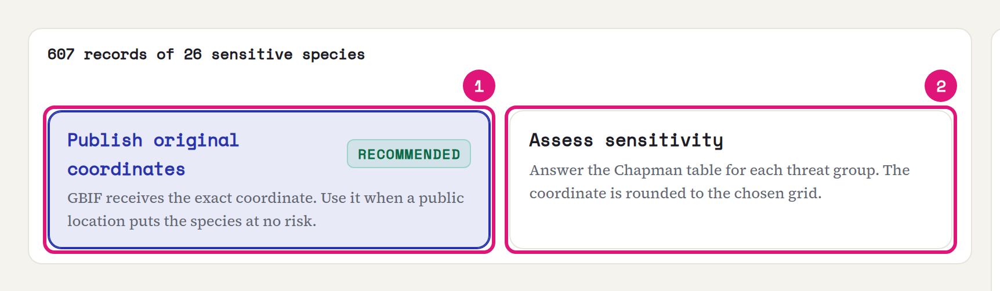
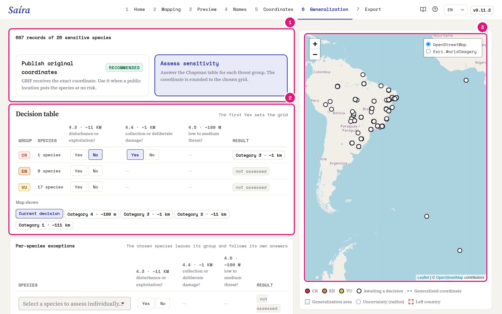
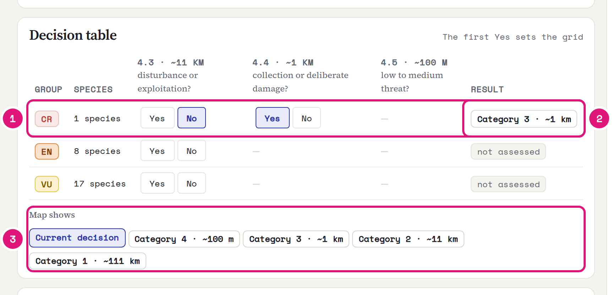
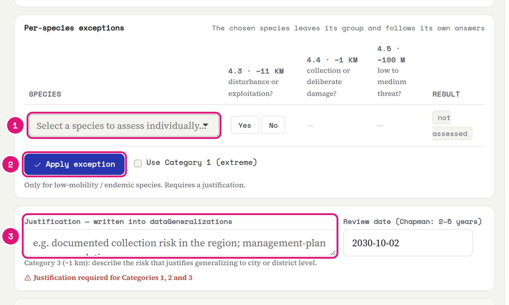

::: {.tut-standfirst}
Decide whether and how much to reduce the coordinate precision of threatened species in the **Generalization** step. The step follows the decision table of [Chapman (2020)](https://doi.org/10.15468/doc-5jp4-5g10).
:::

The step works with the species marked **Sensitive** in [name validation](04-name-validation.qmd). Without sensitive species, there is nothing to do here.

## Choose the path

```{=html}
<figure class="shot"></figure>
```

::: {.marks}
1. **Publish original coordinates** is the recommended default. Precise data has more scientific value.
2. **Assess sensitivity** opens the decision table. Choose this path only if there is a real risk of collection or persecution.
:::

Saíra does not generalize again a coordinate that already arrived generalized: <span class="term">coordinateUncertaintyInMeters</span> of 1 km or more, or <span class="term">dataGeneralizations</span> filled in.

::: {.callout-important}
## Wildlife Insights data is already protected
The Wildlife Insights export already hides the location of sensitive species. Choose **Publish original coordinates**. Generalizing again only removes precision.
:::

## Answer the decision table

```{=html}
<figure class="shot"></figure>
```

::: {.marks}
1. The **Assess sensitivity** mode.
2. The decision table, one row per threat category.
3. The map shows the result of each answer.
:::

```{=html}
<figure class="shot"></figure>
```

::: {.marks}
1. Answer the questions from left to right. Each **No** opens the next question. The first **Yes** sets the grid.
2. The result applies to all species in the group.
3. See on the map the effect of each category before you decide.
:::

| First Yes | Category | Grid | Spatial result |
|---|---|---|---|
| 4.3 · disturbance or exploitation | 2 | 0.1° (~11 km) | State or province |
| 4.4 · collection or deliberate harm | 3 | 0.01° (~1 km) | City or district |
| 4.5 · low to medium threat | 4 | 0.001° (~100 m) | Local area |
| None | Not sensitive | No grid | Original coordinate |

A group without an answer goes out without generalization. Generalization never increases precision: a coordinate less precise than the grid goes out at its real precision.

## Handle one species separately

```{=html}
<figure class="shot"></figure>
```

::: {.marks}
1. Choose the species and answer the same questions. The species leaves the group.
2. **Apply exception**.
3. Write the justification. It goes to <span class="term">dataGeneralizations</span>.
:::

The justification is required for Categories 1, 2 and 3. The review date suggests when to assess the decision again (Chapman recommends 2 to 5 years).

::: {.callout-warning}
## Category 1 (~111 km) only by exception
**Use Category 1 (extreme)** is the only way to reach this level. At ~111 km the record loses almost all its spatial value. Use it only for low-mobility or endemic species.
:::

## Check the map

The map shows the original point, the generalization area and the uncertainty radius. A point that **left the country** needs a smaller grid: a coordinate in the wrong country is worse than an imprecise coordinate.

## What goes into the package

In the generalized records, Saíra:

- publishes the coordinate of the cell, not the original;
- fills <span class="term">coordinateUncertaintyInMeters</span>, <span class="term">dataGeneralizations</span> and <span class="term">informationWithheld</span>;
- clears the fields that reveal the exact locality, such as the verbatim coordinates;
- keeps the original coordinates in `<dataset>-sensitive-coords.csv`, inside the `.zip`, outside `occurrence.txt`.

## References

- Chapman, A. D. (2020). *Current Best Practices for Generalizing Sensitive Species Occurrence Data.* Copenhagen: GBIF Secretariat. <https://doi.org/10.15468/doc-5jp4-5g10> (Table 5, decision cascade; Table 7, generalization grid).
- Chapman, A. D., & Wieczorek, J. R. (2020). *Georeferencing Best Practices.* Copenhagen: GBIF Secretariat. <https://doi.org/10.15468/doc-gg7h-s853> (sec. 2.3.4, uncertainty by the point-radius method).
- Zermoglio, P. F., Chapman, A. D., Wieczorek, J. R., Luna, M. C., & Bloom, D. A. (2020). *Georeferencing Quick Reference Guide.* Copenhagen: GBIF Secretariat. <https://doi.org/10.35035/e09p-h128>
