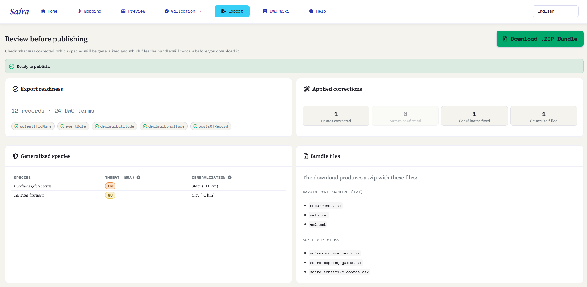
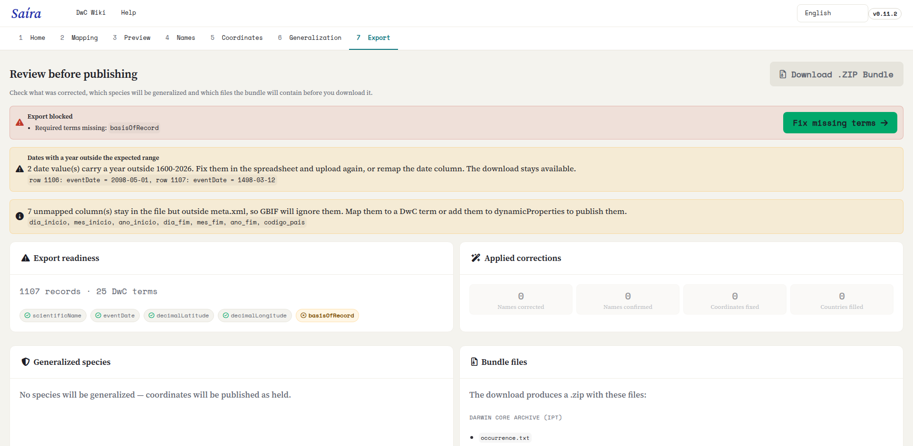

::: {.tut-standfirst}
Check the complete result, review what was corrected and which species will be generalized, and generate the Darwin Core Archive ready to publish on SiBBr and GBIF.
:::

## Preview

In the **Preview** tab, Saíra shows the final table already in Darwin Core vocabulary, with all corrections applied. This is the moment for one last overall check:

- columns carry the correct Darwin Core names;
- required fields are filled in;
- names and coordinates were validated in the previous steps.

```{=html}
<figure class="shot">
  <div class="frame"><span class="ph-label">screenshot · final preview</span></div>
  <figcaption><b>Figure 1.</b> Preview of the dataset in Darwin Core, with completeness indicators per field.</figcaption>
</figure>
```

## The Export tab: review before publishing

Before you download the package, the **Export** tab gathers in one place what was corrected, which species will be generalized and which files go into the `.zip`. Check each block before generating the Darwin Core Archive.

```{=html}
<figure class="shot">
  
  <figcaption><b>Figure 2.</b> The Export review hub, with readiness, applied corrections, generalized species and the bundle files.</figcaption>
</figure>
```

### Export readiness

At the top, an indicator says whether the dataset is **ready to publish** (green) or whether the **export is blocked** (red). When it blocks, Saíra lists what is missing (usually **required terms** left unfilled or **generalized species without the justification** required for Categories 1–3) and offers a shortcut to resolve the pending item.

```{=html}
<figure class="shot">
  
  <figcaption><b>Figure 3.</b> The blocked indicator: Saíra lists the missing required fields or pending justifications and offers direct shortcuts to resolve each one.</figcaption>
</figure>
```

::: {.callout-warning}
## No occurrenceID mapped
If you did not map an <span class="term">occurrenceID</span>, Saíra warns you: the IPT/GBIF then generate unstable identifiers on each publish. Export still works (Saíra generates a UUID), but the recommendation is to **map a stable occurrenceID** so each record keeps the same identifier over time.
:::

### Applied corrections

A summary shows everything the previous steps adjusted, so you can check at a glance before publishing:

- **Names corrected** and **names confirmed** in [name validation](04-name-validation.qmd);
- **Coordinates fixed** (transpositions, lat/lon swap, combined fill) and **countries filled** in [coordinate validation](05-coordinate-validation.qmd).

### Generalized species

If you generalized any taxon in the [generalization](06-generalization.qmd) step, a table lists each **species**, its **threat (MMA)** and the **generalization level** that will go into the package, at the same four levels described in [Generalizing sensitive species](06-generalization.qmd).

If nothing was generalized, Saíra records: *no species will be generalized; coordinates will be published as held*.

## What Saíra adjusts at export

When generating the package, Saíra automatically standardizes the dataset so it meets the repositories' expectations:

- **eventDate** converted to ISO format (`YYYY-MM-DD`).
- **Coordinates** with the decimal separator normalized (comma becomes dot).
- **occurrenceID** generated when missing, to guarantee a unique identifier per record.
- **Licenses** abbreviated to the canonical URL (for example, the matching Creative Commons URL).
- **Columns reordered** into the canonical Darwin Core sequence, with unmapped columns appended on the right, preserving their original names.

### Conservation status in `dynamicProperties`

For each assessed taxon, Saíra writes its conservation status into `dynamicProperties` as JSON keys, based on the databases you chose in [name validation](04-name-validation.qmd):

- a **Brazilian** database (Flora BR / Fauna BR) → `mmaThreatStatus` (category) and `mmaSource` (portaria);
- **GBIF** → `iucnRedListCategory` (global IUCN code, looked up live).

Both can appear together and they merge into whatever you mapped yourself:

```json
{"mmaThreatStatus":"CR","mmaSource":"Portaria 1.704/2026","iucnRedListCategory":"NT"}
```

The GBIF lookup is best-effort: with no internet or no assessment, the IUCN key is omitted and the export proceeds.

::: {.callout-warning}
## Not working with Brazilian species?
Only then select **GBIF only** in name validation: Saíra writes just `iucnRedListCategory` (global IUCN) and does not apply the MMA category, which covers Brazil's fauna and flora. If you do work with Brazilian species, keep the national database selected.
:::

## Bundle files

The download produces a `.zip` (`<dataset>-dwc-archive.zip`) with two sets of files.

The **Darwin Core Archive**, what you send to the repository:

```{=html}
<table class="maptable">
  <thead><tr><th>File</th><th>What it is</th></tr></thead>
  <tbody>
    <tr><td>occurrence.txt</td><td>The data: the core of the Darwin Core Archive.</td></tr>
    <tr><td>meta.xml</td><td>The descriptor that says what each column means.</td></tr>
    <tr><td>eml.xml</td><td>The dataset metadata (title, institution, license).</td></tr>
  </tbody>
</table>
```

And the **auxiliary files**, for your own control, kept out of the public package:

```{=html}
<table class="maptable">
  <thead><tr><th>File</th><th>What it is</th></tr></thead>
  <tbody>
    <tr><td>&lt;dataset&gt;-occurrences.xlsx</td><td>An Excel mirror, with every cell forced to text.</td></tr>
    <tr><td>&lt;dataset&gt;-mapping-guide.txt</td><td>The "your column → Darwin Core term" template, to reuse.</td></tr>
    <tr><td>&lt;dataset&gt;-sensitive-coords.csv</td><td>The real, precise coordinates of generalized records. Only present when there is generalization; you keep it, but do not publish it.</td></tr>
  </tbody>
</table>
```

## Generating the Darwin Core Archive

The metadata (`eml.xml`) is assembled **automatically**: Saíra uses a default title, computes the geographic bounding box and date range from your data, and applies the CC0 license by default, with nothing for you to fill in. Fine-tuning the metadata (institution, responsible parties, final license) happens later, in the IPT, at publication time.

```{=html}
<ol class="fix-steps">
  <li><strong>Generate the archive.</strong>
    <p>Saíra assembles the <span class="term">.zip</span> package with <span class="term">occurrence.txt</span>, <span class="term">meta.xml</span> and <span class="term">eml.xml</span>.</p></li>
  <li><strong>Download and publish.</strong>
    <p>Download the Darwin Core Archive and send it to your IPT (SiBBr/GBIF) for publication.</p></li>
</ol>
```

## Publishing on SiBBr and GBIF

With the `.zip` in hand, publication happens outside Saíra, usually via your institution's or SiBBr's **IPT** (Integrated Publishing Toolkit). The archive Saíra generates is already in the expected format: just upload it, check the mapping in the IPT and publish.

Back to the **[tutorials overview](index.qmd)** or to the **[home page](../index.qmd)**.
