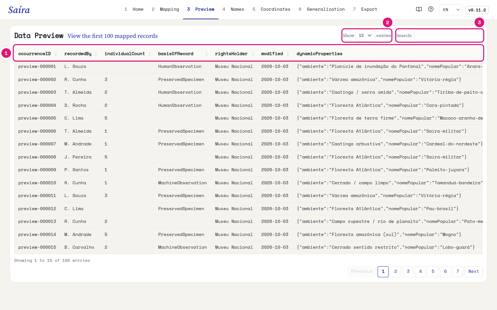
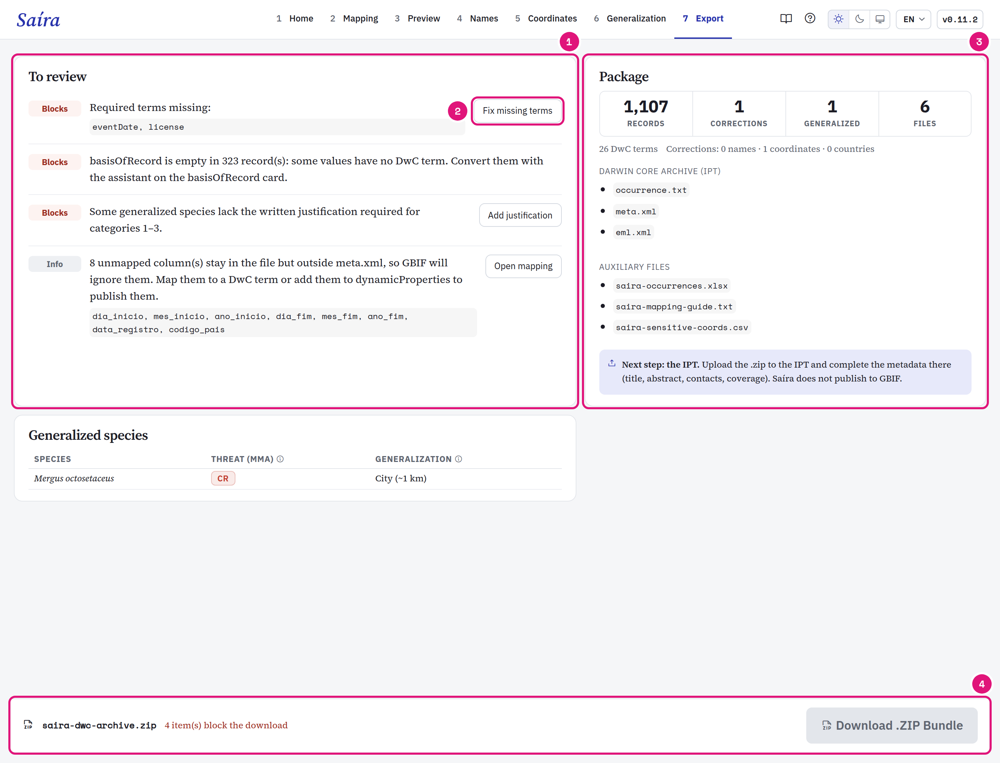

::: {.tut-standfirst}
Check the data in Darwin Core and download the Darwin Core Archive in the **Export** step.
:::

## Check the preview

```{=html}
<figure class="shot"></figure>
```

::: {.marks}
1. The columns already have the Darwin Core names.
2. Choose how many rows to see. The preview shows the first 100 records.
3. Search for a value in any column.
:::

## Resolve the pending items

```{=html}
<figure class="shot"></figure>
```

::: {.marks}
1. **Blocks** stops the download. **Info** only warns.
2. Each pending item has a button that goes to the step that resolves it.
3. The package: records, corrections, generalized species and files.
4. The download opens when no blocking item is left.
:::

| Pending item | Where to resolve |
|---|---|
| Required term missing, such as <span class="term">eventDate</span> or <span class="term">license</span> | [Mapping](03-dwc-mapping.qmd) |
| <span class="term">basisOfRecord</span> without a DwC term | [basisOfRecord Assistant](03-dwc-mapping.qmd#set-basisofrecord) |
| Generalization without justification | [Generalization](06-generalization.qmd#handle-one-species-separately) |
| Unmapped column (Info) | GBIF ignores the column. Map it to a term or include it in <span class="term">dynamicProperties</span>. |

::: {.callout-warning}
## Map the occurrenceID
Without <span class="term">occurrenceID</span>, Saíra makes an identifier from the content of the row. If you change the row, the identifier changes. Map the column with your identifiers. Saíra fills only the empty rows.
:::

## What Saíra adjusts

- **Dates** in ISO 8601: `YYYY-MM-DD`, `YYYY-MM` without a day, `YYYY-MM-DDThh:mm` with time. A year before 1600 or after the current year gives a warning, without blocking.
- **Coordinates** with a decimal point.
- **License** with the short name (`CC-BY`) in `occurrence.txt` and the URL in `eml.xml`.
- **Columns** in Darwin Core order. Unmapped columns go at the end, with the original name.

### Conservation status in `dynamicProperties`

Saíra writes the conservation status from the backbones of [name validation](04-name-validation.qmd):

- Flora BR or Fauna BR → `mmaThreatStatus` and `mmaSource`;
- GBIF → `iucnRedListCategory`, queried at export.

```json
{"mmaThreatStatus":"CR","mmaSource":"Portaria 1.704/2026","iucnRedListCategory":"NT"}
```

Without internet, the IUCN key is left out and the export continues. The MMA keys go only into records from Brazil, by <span class="term">country</span> or <span class="term">countryCode</span>. A record without a country has no MMA keys.

## Package files

The `.zip` (`<dataset>-dwc-archive.zip`) has the Darwin Core Archive and the auxiliary files.

| File | Use |
|---|---|
| `occurrence.txt` | The data. Goes to the IPT. |
| `meta.xml` | Gives the term of each column. Goes to the IPT. |
| `eml.xml` | Metadata: title, geographic extent, period and license. Goes to the IPT. |
| `<dataset>-occurrences.xlsx` | Excel copy, with all cells as text. |
| `<dataset>-mapping-guide.txt` | The mapping, to [reuse](03-dwc-mapping.qmd#reuse-the-mapping). |
| `<dataset>-sensitive-coords.csv` | Original coordinates of the generalized records. Keep it, do not publish it. |

## Publish through the IPT

Saíra does not publish to GBIF. Send the `.zip` to the IPT of your institution or of SiBBr. In the IPT, complete the metadata (abstract, contacts, coverage) and publish.
