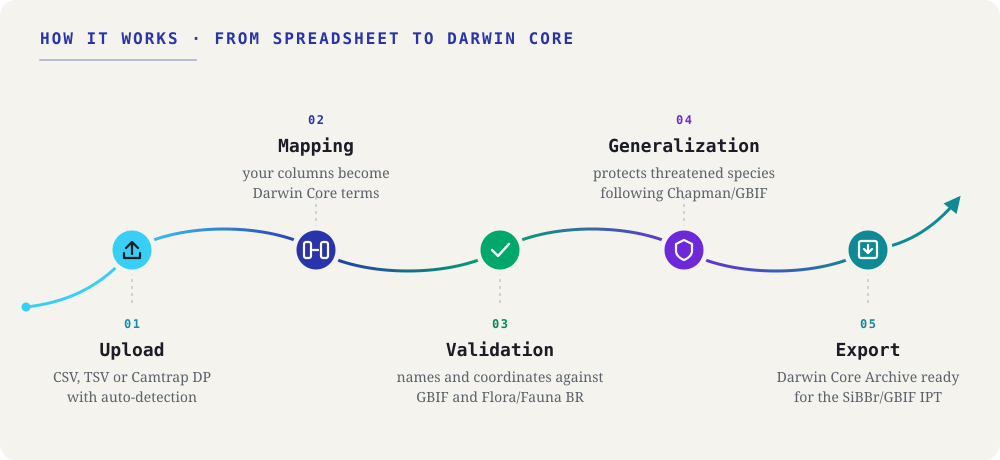

::: {.tut-standfirst}
Step-by-step guides to take your occurrence spreadsheet from the field notebook to a Darwin Core Archive, following the workflow of the application.
:::

```{=html}
<figure class="shot diagram-flow">
  
</figure>
```

The diagram shows the app's five working steps. The tutorials below are seven because installation comes before everything else and validation splits into names and coordinates. Move between them with the **sidebar** or the **previous / next** buttons at the bottom of each page; each step can also be read on its own.

## The workflow, from raw data to DwC-A

```{=html}
<div class="tut-grid">
  <a class="tut-card" href="01-installation.html">
    <div class="tut-card-top"><span class="tut-card-num">01</span><span class="tut-card-eyebrow">Step</span></div>
    <h3 class="tut-card-title">Installation and first steps</h3>
    <p class="tut-card-desc">Install Saíra from GitHub and open the app in your browser.</p>
    <span class="tut-card-arrow">→</span>
  </a>
  <a class="tut-card" href="02-upload.html">
    <div class="tut-card-top"><span class="tut-card-num">02</span><span class="tut-card-eyebrow">Step</span></div>
    <h3 class="tut-card-title">Importing your data</h3>
    <p class="tut-card-desc">Load CSV, TSV/TXT or a camera-trap package.</p>
    <span class="tut-card-arrow">→</span>
  </a>
  <a class="tut-card" href="03-dwc-mapping.html">
    <div class="tut-card-top"><span class="tut-card-num">03</span><span class="tut-card-eyebrow">Step</span></div>
    <h3 class="tut-card-title">Mapping fields to Darwin Core</h3>
    <p class="tut-card-desc">Match each column to a Darwin Core term, with automatic suggestions.</p>
    <span class="tut-card-arrow">→</span>
  </a>
  <a class="tut-card" href="04-name-validation.html">
    <div class="tut-card-top"><span class="tut-card-num">04</span><span class="tut-card-eyebrow">Step</span></div>
    <h3 class="tut-card-title">Validating scientific names</h3>
    <p class="tut-card-desc">Check nomenclature, resolve synonyms and see threatened taxa.</p>
    <span class="tut-card-arrow">→</span>
  </a>
  <a class="tut-card" href="05-coordinate-validation.html">
    <div class="tut-card-top"><span class="tut-card-num">05</span><span class="tut-card-eyebrow">Step</span></div>
    <h3 class="tut-card-title">Validating coordinates</h3>
    <p class="tut-card-desc">Find missing, swapped or transposed coordinates and review on the map.</p>
    <span class="tut-card-arrow">→</span>
  </a>
  <a class="tut-card" href="06-generalization.html">
    <div class="tut-card-top"><span class="tut-card-num">06</span><span class="tut-card-eyebrow">If needed</span></div>
    <h3 class="tut-card-title">Generalizing sensitive species</h3>
    <p class="tut-card-desc">Only when name validation flags threatened species: reduce coordinate precision (Chapman 2020).</p>
    <span class="tut-card-arrow">→</span>
  </a>
  <a class="tut-card" href="07-preview-export.html">
    <div class="tut-card-top"><span class="tut-card-num">07</span><span class="tut-card-eyebrow">Step</span></div>
    <h3 class="tut-card-title">Preview and export</h3>
    <p class="tut-card-desc">Review the result and the corrections and generate the Darwin Core Archive.</p>
    <span class="tut-card-arrow">→</span>
  </a>
</div>
```

::: {.callout-note}
## The workflow is flexible
You do not have to follow the steps in a rigid sequence: you can go back to any step (remap a field, reload the spreadsheet or revalidate) without losing the work already done.
:::

::: {.callout-tip}
## Practice with the sample file
Download [`ocorrencias-demo.csv`](../../assets/exemplo/ocorrencias-demo.csv) and follow the tutorials with it. What the spreadsheet carries as deliberate imperfections is described in [Importing your data](02-upload.qmd).
:::
