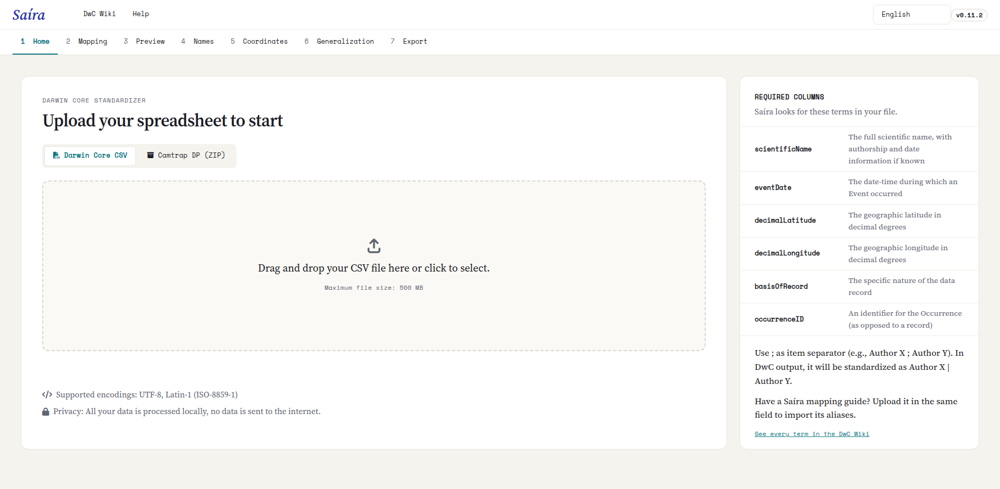

::: {.tut-standfirst}
Saíra es un paquete de R que abre una interfaz visual en el navegador. Esta página muestra cómo instalarlo, abrir la aplicación por primera vez y qué esperar del primer uso.
:::

## Requisitos previos

Necesita **R** instalado (versión 4.1 o posterior), descargado directamente de [CRAN](https://cran.r-project.org/). Se recomienda [RStudio](https://posit.co/download/rstudio-desktop), pero no es obligatorio: cualquier consola de R funciona. No necesita saber programar. Una vez instalado, todo el uso ocurre en la interfaz gráfica.

Como Saíra consulta bases taxonómicas y dibuja mapas, se instalan junto con él algunos paquetes de apoyo (espaciales y de lectura de hojas de cálculo). En Linux pueden requerir bibliotecas del sistema como `GDAL`, `GEOS` y `PROJ`. En Windows y macOS vienen incluidas en los binarios.

## Instalación de R

Descargue R del sitio oficial de **[CRAN](https://cran.r-project.org/)**. Los pasos de abajo son para Windows. En macOS, elija "Download R for macOS" y siga el instalador.

```{=html}
<figure class="shot">
  
  <figcaption><b>Figura 1.</b> En la página de CRAN, elija <b>Download R for Windows</b> (o macOS, según su sistema).</figcaption>
</figure>
<figure class="shot">
  
  <figcaption><b>Figura 2.</b> Haga clic en <b>base</b>: es la distribución que se instala la primera vez.</figcaption>
</figure>
<figure class="shot">
  
  <figcaption><b>Figura 3.</b> Descargue el instalador (<b>Download R-4.x.x for Windows</b>) y ejecútelo con las opciones predeterminadas.</figcaption>
</figure>
```

## Instalación de RStudio

**[RStudio Desktop](https://posit.co/download/rstudio-desktop)** es opcional, pero hace el uso más cómodo. Descargue la versión para su sistema e instálela con las opciones predeterminadas.

```{=html}
<figure class="shot">
  
  <figcaption><b>Figura 4.</b> En el sitio de Posit, descargue <b>RStudio Desktop</b> e instálelo.</figcaption>
</figure>
```

## Windows: instale Rtools

Como Saíra **no está en CRAN**, se instala desde el código fuente. En **Windows**, compilar paquetes desde el código fuente requiere **Rtools**. Instale la versión de Rtools que corresponde a su versión de R antes de instalar Saíra. (En macOS y Linux este paso normalmente no es necesario.)

```{=html}
<figure class="shot">
  
  <figcaption><b>Figura 5.</b> En la misma página R for Windows, abra <b>Rtools</b>.</figcaption>
</figure>
<figure class="shot">
  
  <figcaption><b>Figura 6.</b> Elija la versión que corresponde a su R (ej.: <b>RTools 4.5</b> para R 4.5 o posterior).</figcaption>
</figure>
<figure class="shot">
  
  <figcaption><b>Figura 7.</b> Descargue el <b>instalador de Rtools</b> y ejecútelo con las opciones predeterminadas.</figcaption>
</figure>
```

## Instalación de Saíra

Con R (y, si quiere, RStudio) instalado, instale Saíra. Como todavía no está en CRAN, se instala directamente desde el repositorio de GitHub con `pak`, que resuelve todas las dependencias de forma automática. Abra R (o RStudio) y ejecute:

```r
install.packages("pak")
pak::pak("rogerio-onza/saira")
```

::: {.callout-tip}
## La primera instalación tarda
Saíra depende de varios paquetes (Shiny, lectura de hojas de cálculo, datos taxonómicos y geográficos). La primera instalación puede tardar algunos minutos mientras se descargan y compilan esas dependencias. Las siguientes son rápidas.
:::

## Abrir la aplicación

Con el paquete instalado, una sola línea abre la interfaz en el navegador:

```r
library(saira)
saira::run_app()
```

La aplicación se abre en una pestaña nueva. A partir de ahí, todo se hace con menús, botones y tablas. Para detenerla, cierre la pestaña e interrumpa la sesión de R (`Esc` en la consola o el botón de detener de RStudio).

::: {.callout-warning}
## ¿La ventana no se abrió?
En servidores o entornos sin navegador predeterminado, `run_app()` muestra una dirección local (algo como `http://127.0.0.1:xxxx`). Copie esa dirección y ábrala manualmente en el navegador. Para servirla a otras computadoras de la red, ejecute `saira::run_app(options = list(host = "0.0.0.0", port = 3838))`.
:::

```{=html}
<figure class="shot">
  
  <figcaption><b>Figura 8.</b> Pantalla inicial de Saíra, con el selector de idioma, las etapas numeradas y el panel de carga.</figcaption>
</figure>
```

## Actualización

Saíra se instala desde GitHub, por eso **actualizar es reinstalar**: el mismo comando de instalación siempre descarga la versión más reciente.

1. Cierre la aplicación, si está abierta.
2. En la consola de R (o RStudio), ejecute de nuevo:

```r
pak::pak("rogerio-onza/saira")
```

`pak` descarga la versión más reciente y actualiza solo lo que cambió (las instalaciones siguientes son rápidas). Abra de nuevo la aplicación con `saira::run_app()`. Para ver qué versión está instalada, ejecute `packageVersion("saira")`.

## Idioma

Saíra es trilingüe. En la esquina superior de la interfaz puede cambiar entre **portugués (PT-BR)**, **inglés (EN-US)** y **español (ES)** en cualquier momento, útil para equipos mixtos o para publicar metadatos en inglés. El cambio es inmediato y no interrumpe el trabajo en curso.

## Tamaño de archivo y rendimiento

La aplicación acepta cargas de hasta **500 MB**, suficiente para conjuntos de datos con cientos de miles de ocurrencias. Los conjuntos muy grandes hacen más lentos la validación de nombres y el mapa, porque cada nombre se busca en las bases y cada punto se dibuja. Si solo quiere practicar el flujo, empiece con la hoja de cálculo de ejemplo.

Con la aplicación abierta, vaya a **[Carga de sus datos](02-carga.qmd)** y cargue su primera hoja de cálculo.
