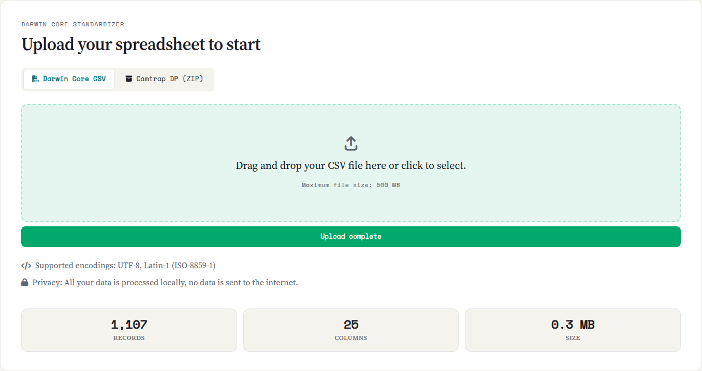

::: {.tut-standfirst}
El primer paso dentro de la aplicación es cargar su hoja de cálculo de ocurrencias. Saíra acepta CSV (y las variantes TSV/TXT) y paquetes de cámaras trampa, y detecta la codificación y el separador por usted.
:::

## Formatos aceptados

| Formato | Extensión | Observaciones |
|---|---|---|
| Texto delimitado | `.csv`, `.tsv`, `.txt` | Coma, punto y coma o tabulación, detectados automáticamente |
| Cámara trampa | `.zip` | Camtrap DP (con o sin descriptor) y exportaciones de Wildlife Insights (vea abajo) |

Cada **fila** debe ser una ocurrencia (el registro de un organismo en un lugar y un momento) y cada **columna** un atributo: número de catálogo, especie, fecha, localidad, colector, etc.

## Carga del archivo

::: {.callout-tip}
## Descargue la hoja de cálculo de ejemplo
Para practicar esta etapa y las siguientes, descargue [`ocorrencias-demo.csv`](../../assets/exemplo/ocorrencias-demo.csv), el conjunto de demostración de Saíra: 1.107 ocurrencias de especies brasileñas en varios biomas, imperfecto a propósito. Tiene 25 columnas para mapear, día, mes y año en columnas separadas, una columna de fecha que mezcla formatos (barras, horas, solo mes y año) y dos años imposibles, números de catálogo ausentes y repetidos, coordenadas invertidas y fuera de rango, registros de países vecinos, especies amenazadas para la generalización y especies exóticas invasoras. Cada etapa del tutorial tiene algo que resolver en ella.
:::

En la etapa **Inicio**, arrastre el archivo al área indicada o haga clic para seleccionarlo.

```{=html}
<ol class="fix-steps">
  <li><strong>Seleccione el archivo.</strong>
    <p>Suelte el CSV o el paquete de cámaras trampa en el área de carga (o haga clic para elegir).</p></li>
  <li><strong>Espere la lectura.</strong>
    <p>Saíra detecta la codificación y el separador automáticamente y muestra un resumen del archivo: número de filas, número de columnas y tamaño.</p></li>
  <li><strong>Revise el resumen.</strong>
    <p>Verifique que el número de filas y de columnas coincida con lo esperado.</p></li>
</ol>
```

```{=html}
<figure class="shot">
  
  <figcaption><b>Figura 1.</b> Área de carga con el resumen del archivo (filas, columnas y tamaño) después de la carga.</figcaption>
</figure>
```

## Detección automática de codificación y separador

Al recibir un CSV, Saíra intenta identificar la **codificación** (UTF-8, Latin-1/ISO-8859-1, Windows-1252) y el **separador** de columnas, y elimina la marca de orden de bytes (BOM) que algunos programas agregan al inicio del archivo. Acierta casi siempre. Verifique en el resumen que el número de columnas tenga sentido y revise el contenido en las etapas Mapeo y Vista previa. Las fechas en varios formatos (`03/11/2024`, `2024-11-03`, `Nov 3 2024`) se reconocen y se estandarizan después, al exportar.

::: {.callout-tip}
## ¿Los acentos aparecen mal?
Casi siempre es la codificación. Las hojas de cálculo suelen estar en **UTF-8** o **Latin-1 (ISO-8859-1)**. Si en lugar de `São Paulo` ve `São Paulo` o `S?o Paulo`, es la codificación. Saíra intenta detectarla sola. Si el resultado sigue mal, guarde de nuevo el archivo como **UTF-8** antes de cargarlo (en Excel: *Guardar como → CSV UTF-8*).
:::

::: {.callout-warning}
## ¿Toda la hoja de cálculo se abrió en una sola columna?
Es el separador equivocado. Los archivos en portugués y en español usan con frecuencia **punto y coma (`;`)** porque la coma ya es el separador decimal. Saíra detecta el separador solo. Si el resumen muestra una sola columna, guarde el archivo con un separador consistente (`;` o `,`) o expórtelo como **CSV UTF-8** y cárguelo de nuevo.
:::

::: {.callout-important}
## Encabezado en la primera fila
Saíra supone que la **primera fila** contiene los nombres de las columnas. Elimine filas de título, logotipos o celdas combinadas antes de exportar desde Excel: impiden la lectura.
:::

## Datos de cámaras trampa

Una hoja de cálculo de ocurrencias común se carga directamente (vea [Formatos aceptados](#formatos-aceptados)). Los conjuntos de cámaras trampa son diferentes: llegan en **varios archivos separados** (registros, instalaciones, medios) que se deben unir en una sola tabla. Por eso Saíra trata estos paquetes `.zip` por separado y los une automáticamente antes del mapeo. Reconoce:

- **Camtrap DP** (Camera Trap Data Package): el `.zip` estandarizado, con el descriptor `datapackage.json` y las tablas `deployments`, `observations` y (opcional) `media`.
- **CSV sueltos de Camtrap DP**: las mismas tablas en un `.zip`, pero **sin el descriptor**: Saíra sintetiza uno a partir de los CSV que encuentra.
- **Wildlife Insights**: la exportación de la plataforma, en la que Saíra cambia el nombre de las columnas al formato Camtrap DP y deriva el nombre científico, la fecha y hora y el tipo de observación.

En todos los casos, Saíra construye un nombre científico consistente y organiza tiempo y lugar, así el resto del flujo (mapeo, nombres, coordenadas) funciona igual que con una hoja de cálculo común.

::: {.callout-note}
## ¿Paquete camtrap incompleto?
Si falta el descriptor del paquete, Saíra intenta **sintetizar** uno a partir de los CSV que encuentra. Aun así, verifique en el resumen y en las etapas siguientes que las columnas de especie, fecha y coordenadas llegaron antes de continuar.
:::

Con los datos cargados y mostrados correctamente, pase a **[Mapeo de campos a Darwin Core](03-mapeo-dwc.qmd)**.
