::: {.tut-standfirst}
Cómo relacionar las columnas de su hoja de cálculo con los términos del estándar Darwin Core usando el mapeador visual de Saíra.
:::

## Visión general

Después de importar los datos (vea [Carga de sus datos](02-carga.qmd)), cada columna todavía tiene el nombre que usted usa en el día a día: <span class="term">numero_tombo</span>, <span class="term">especie</span>, <span class="term">data_coleta</span>. El mapeo le dice a Saíra qué término Darwin Core corresponde a cada una, a partir de sugerencias automáticas basadas en el nombre y el contenido de cada columna.

```{=html}
<figure class="shot">
  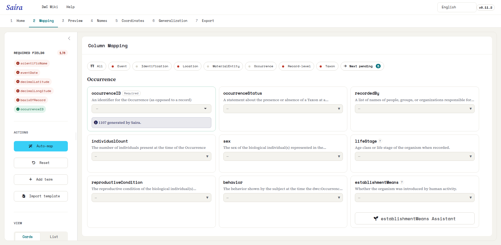
  <figcaption><b>Figura 1.</b> La pestaña <b>Mapeo</b> justo después de la importación, antes de cualquier mapeo: a la izquierda, el panel de campos obligatorios y la barra de acciones (Automapear, Reiniciar, Agregar término, Importar plantilla). A la derecha, las tarjetas de términos Darwin Core agrupadas por clase (aquí, Occurrence).</figcaption>
</figure>
```

::: {.callout-note}
## La decisión final siempre es suya
Saíra **sugiere**, pero usted decide. Cada sugerencia se puede confirmar, cambiar o descartar. Nada se aplica sin su revisión.
:::

## Mapeo automático

El botón **Automapear**, en la barra de acciones, recorre todas las columnas a la vez y propone un término para cada una, con un **estado** que indica la confianza de la sugerencia:

```{=html}
<figure class="shot">
  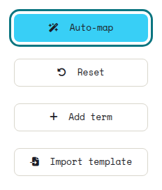
  <figcaption><b>Figura 2.</b> El botón <b>Automapear</b> en la barra de acciones, junto a Reiniciar, Agregar término e Importar plantilla.</figcaption>
</figure>
```

Cada tarjeta recibe una **etiqueta de estado**. Verá siete, según el origen de la correspondencia:

```{=html}
<table class="maptable">
  <thead><tr><th>Etiqueta</th><th>Qué significa</th></tr></thead>
  <tbody>
    <tr><td><span class="swatch" style="background:var(--success)"></span>AUTO</td><td>Alta confianza (puntuación alta y tipo de dato compatible). Ya viene completado.</td></tr>
    <tr><td><span class="swatch" style="background:var(--warning)"></span>SUGERIDO</td><td>Una correspondencia probable. Confirme o ajuste antes de continuar.</td></tr>
    <tr><td><span class="swatch" style="background:var(--coord-reference)"></span>AMBIGUO</td><td>Dos o más términos con confianza parecida. Saíra no elige por usted.</td></tr>
    <tr><td><span class="swatch" style="background:var(--info)"></span>EDITADO</td><td>Usted lo ajustó manualmente. Su elección prevalece sobre las sugerencias.</td></tr>
    <tr><td><span class="swatch" style="background:var(--primary)"></span>ALIAS</td><td>Reconocido por un alias guardado de un mapeo anterior.</td></tr>
    <tr><td><span class="swatch" style="background:var(--primary-dark)"></span>PLANTILLA</td><td>Vino de una plantilla importada.</td></tr>
    <tr><td><span class="swatch" style="background:var(--coord-missing)"></span>MANUAL</td><td>Definido por usted, o sin mapear, sin sugerencia automática.</td></tr>
  </tbody>
</table>
```

Al final, Saíra muestra un resumen (por ejemplo, "12 AUTO, 5 SUGERIDO"). Revise los SUGERIDO con atención y confirme o corrija cada uno.

```{=html}
<ol class="fix-steps">
  <li><strong>Ejecute el mapeo automático.</strong>
    <p>Haga clic en <span class="term">Automapear</span>. Los campos de alta confianza aparecen completados y marcados como AUTO.</p></li>
  <li><strong>Revise los sugeridos.</strong>
    <p>Para cada columna marcada como SUGERIDO, confirme el término o cámbielo en el selector.</p></li>
  <li><strong>Resuelva los campos sin mapear.</strong>
    <p>Las columnas sin correspondencia clara aparecen resaltadas. Elija el término Darwin Core correspondiente o <strong>deje la columna sin mapear</strong>: se conserva en la exportación (vea abajo).</p></li>
  <li><strong>Defina el basisOfRecord.</strong>
    <p>Use el asistente (vea abajo) para mapear el tipo de registro a partir de una columna (ej.: <span class="term">tipo_de_registro</span>), relacionando cada valor (Espécime, Observação, Armadilha fotográfica) con su término Darwin Core.</p></li>
  <li><strong>Revise la vista previa.</strong>
    <p>El panel inferior muestra las primeras filas ya con los nombres Darwin Core, para validar antes de continuar.</p></li>
</ol>
```

```{=html}
<figure class="shot">
  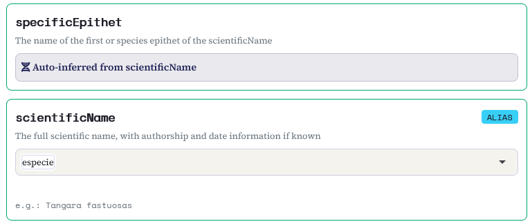
  <figcaption><b>Figura 3.</b> Tarjetas de mapeo después de Automapear: <span class="term">especie</span> → <span class="term">scientificName</span>, marcada como <b>ALIAS</b> (correspondencia de un mapeo recordado), mientras <span class="term">specificEpithet</span> se <b>infiere automáticamente de scientificName</b>.</figcaption>
</figure>
```

::: {.callout-warning}
## No mapee dos columnas al mismo término
Si <span class="term">especie</span> y <span class="term">nome_cientifico</span> apuntan las dos a <span class="term">scientificName</span>, Saíra señala el conflicto y le pide elegir una sola fuente antes de continuar.
:::

## Catálogo de términos y búsqueda

El mapeador trabaja con un conjunto base de los términos Darwin Core más usados, pero el catálogo completo tiene cerca de **218 términos** (propiedades `dwc:` y `dcterms:`). Si la columna que necesita no está en la lista, use **Agregar término** para buscar e incluir cualquier propiedad del estándar, como <span class="term">coordinateUncertaintyInMeters</span>, <span class="term">samplingProtocol</span> u <span class="term">organismQuantity</span>.

```{=html}
<figure class="shot">
  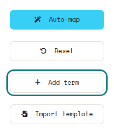
  <figcaption><b>Figura 4.</b> El botón <b>Agregar término</b> en la barra de acciones.</figcaption>
</figure>
<figure class="shot">
  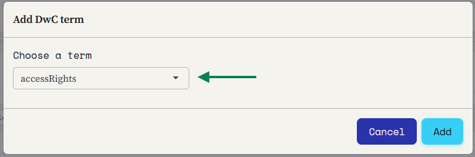
  <figcaption><b>Figura 5.</b> El diálogo <b>Agregar término DwC</b>: elija el término en el selector y confirme para agregarlo como una tarjeta nueva.</figcaption>
</figure>
```

### Ejemplo de mapeo

La tabla de abajo muestra un mapeo típico para una colección ornitológica:

```{=html}
<table class="maptable">
  <thead><tr><th>Columna de la hoja de cálculo</th><th></th><th>Término Darwin Core</th></tr></thead>
  <tbody>
    <tr><td>numero_tombo</td><td><span class="arrow">→</span></td><td>catalogNumber</td></tr>
    <tr><td>especie</td><td><span class="arrow">→</span></td><td>scientificName</td></tr>
    <tr><td>data_coleta</td><td><span class="arrow">→</span></td><td>eventDate</td></tr>
    <tr><td>coletor</td><td><span class="arrow">→</span></td><td>recordedBy</td></tr>
    <tr><td>latitude</td><td><span class="arrow">→</span></td><td>decimalLatitude</td></tr>
    <tr><td>longitude</td><td><span class="arrow">→</span></td><td>decimalLongitude</td></tr>
  </tbody>
</table>
```

## Plantillas

No necesita guardar el mapeo a mano. Al descargar la hoja de cálculo estandarizada (vea [Vista previa y exportación](07-vista-previa-exportacion.qmd)), Saíra incluye una **plantilla** en el `.zip` (`<dataset>-mapping-guide.txt`): solo el vocabulario "su columna → término Darwin Core", sin datos. Es su mapeo guardado, listo para reutilizar o para pasar a un colega.

Para reutilizarla, abra el mapeo de una hoja de cálculo nueva y haga clic en **Importar plantilla**. Cada línea se convierte en un alias en su Rostrum local, así las columnas con el mismo nombre se mapean automáticamente y usted solo revisa lo que cambió. Es útil para colecciones que importan de nuevo hojas de cálculo con la misma estructura.

```{=html}
<figure class="shot">
  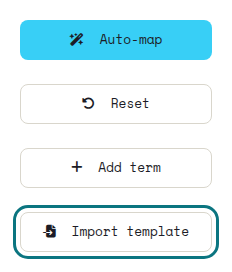
  <figcaption><b>Figura 6.</b> El botón <b>Importar plantilla</b>, en la barra de acciones, recupera una plantilla guardada de una exportación anterior.</figcaption>
</figure>
<figure class="shot">
  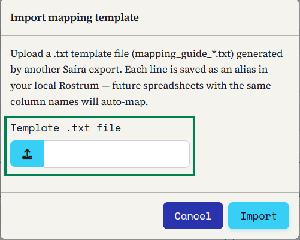
  <figcaption><b>Figura 7.</b> El diálogo <b>Importar plantilla de mapeo</b>: elija el archivo <code><dataset>-mapping-guide.txt</code> que vino en el <code>.zip</code> y confirme. Cada línea se convierte en un alias para mapear automáticamente las próximas hojas de cálculo.</figcaption>
</figure>
```

## El asistente basisOfRecord

El término <span class="term">basisOfRecord</span> describe la naturaleza del registro (espécimen preservado, observación humana, material fósil, registro de máquina…). En lugar de un solo valor para todo el lote, Saíra incluye un **asistente**: a partir de una columna de su hoja de cálculo (por ejemplo, <span class="term">tipo_de_registro</span>), usted relaciona **cada valor distinto** con su término Darwin Core, con una explicación en lenguaje simple de cada opción.

```{=html}
<figure class="shot">
  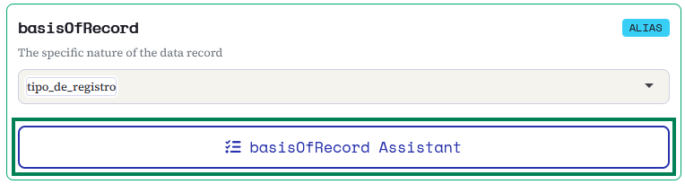
  <figcaption><b>Figura 8.</b> En la tarjeta <span class="term">basisOfRecord</span>, elija la columna de origen (aquí, <span class="term">tipo_de_registro</span>) y abra el <b>Asistente basisOfRecord</b>.</figcaption>
</figure>
```

```{=html}
<table class="maptable">
  <thead><tr><th>Su valor en la hoja de cálculo</th><th></th><th>Término Darwin Core</th></tr></thead>
  <tbody>
    <tr><td>Material catalogado en una colección</td><td><span class="arrow">→</span></td><td>PreservedSpecimen</td></tr>
    <tr><td>Observación de campo (sin colecta)</td><td><span class="arrow">→</span></td><td>HumanObservation</td></tr>
    <tr><td>Foto de cámara trampa</td><td><span class="arrow">→</span></td><td>MachineObservation</td></tr>
    <tr><td>Material fósil</td><td><span class="arrow">→</span></td><td>FossilSpecimen</td></tr>
  </tbody>
</table>
```

```{=html}
<figure class="shot">
  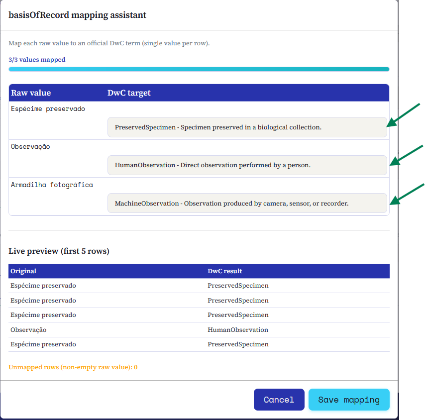
  <figcaption><b>Figura 9.</b> El asistente mapea <b>cada valor</b> a un término DwC (Espécime preservado → PreservedSpecimen, Observação → HumanObservation, Armadilha fotográfica → MachineObservation), con vista previa en vivo antes de guardar.</figcaption>
</figure>
```

## El asistente establishmentMeans y degreeOfEstablishment

<span class="term">establishmentMeans</span> dice **cómo llegó el taxón allí** (nativo, introducido, errante…) y <span class="term">degreeOfEstablishment</span>, **en qué situación está** (en cautiverio, cultivado, liberado, invasor…). Los dos son vocabularios controlados de TDWG, con 7 y 11 valores, y los dos describen la **especie**, no la fila.

Por eso el asistente pregunta **una vez por taxón**, no por valor de columna: lista las especies distintas de la columna mapeada a <span class="term">scientificName</span>, ordenadas por cuántos registros cubre cada una, y extiende su respuesta a todos los registros de esa especie.

```{=html}
<figure class="shot">
  
  <figcaption><b>Figura 10.</b> El botón está en la tarjeta <span class="term">establishmentMeans</span> y siempre aparece, incluso sin columna seleccionada: el asistente existe justamente para quien no tiene esa columna en la hoja de cálculo.</figcaption>
</figure>
```

::: {.callout-note}
## `scientificName` debe estar mapeado
El asistente trabaja con las especies de la columna mapeada a <span class="term">scientificName</span>. Sin ese mapeo, avisa y no se abre.
:::

Las especies de la lista de especies exóticas invasoras (la misma usada en la **[validación de nombres](04-validacion-nombres.qmd)**) llegan **completadas como `introduced`** y llevan una etiqueta dentro del asistente. El **grado nunca se sugiere**: según la definición de TDWG, es una propiedad del **registro**, no de la especie. Un <span class="term">Sus scrofa</span> en cautiverio y uno asilvestrado son la misma especie en grados diferentes, y solo usted sabe cuál es el caso de sus datos.

```{=html}
<table class="maptable">
  <thead><tr><th>Especie</th><th></th><th>establishmentMeans</th><th>degreeOfEstablishment</th></tr></thead>
  <tbody>
    <tr><td>Sus scrofa</td><td><span class="arrow">→</span></td><td>introduced</td><td>invasive</td></tr>
    <tr><td>Canis familiaris</td><td><span class="arrow">→</span></td><td>introduced</td><td>released</td></tr>
    <tr><td>Bos taurus</td><td><span class="arrow">→</span></td><td>introduced</td><td>captive</td></tr>
    <tr><td>Panthera onca</td><td><span class="arrow">→</span></td><td>native</td><td>native</td></tr>
  </tbody>
</table>
```

```{=html}
<figure class="shot">
  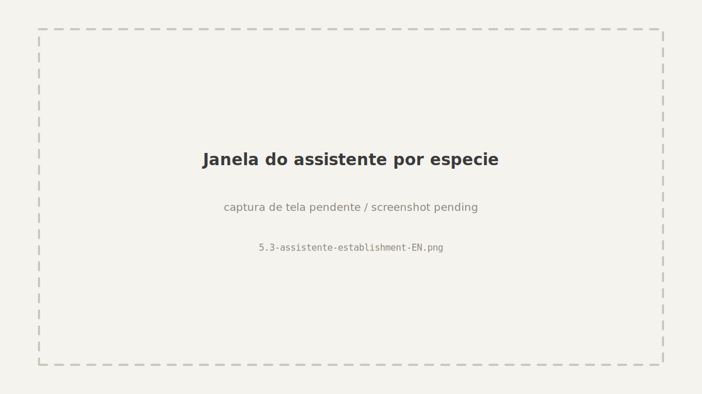
  <figcaption><b>Figura 11.</b> Una fila por especie, con el número de registros que cada respuesta cubre. Los dos selectores ofrecen el vocabulario controlado completo, con la definición de TDWG junto a cada valor.</figcaption>
</figure>
```

### Sus propios datos siempre prevalecen

Si **además** mapea una columna a cualquiera de los dos términos, los valores de la columna se mantienen y el asistente solo completa las filas que usted dejó vacías.

Una especie sin respuesta sale vacía, y un término sin ninguna respuesta no genera columna en la exportación. Saíra no inventa nada.

### La tarjeta muestra lo que hizo el asistente

```{=html}
<figure class="shot">
  
  <figcaption><b>Figura 12.</b> Después de guardar, la tarjeta cuenta como completada aunque no tenga columna seleccionada: borde verde, una etiqueta <span class="term">ASISTENTE</span> y una nota con cuántas especies se respondieron, con la línea de ejemplo que muestra el valor generado.</figcaption>
</figure>
```

El botón del asistente está **solo** en la tarjeta <span class="term">establishmentMeans</span>, porque una sola ventana completa los dos términos. La tarjeta <span class="term">degreeOfEstablishment</span> sigue existiendo con su propio selector de columna, que es como sus datos prevalecen allí, y con una nota que apunta a la tarjeta que tiene el asistente.

Un grado guardado sin medio se descarta: solo, no dice nada. En el caso contrario, un medio sin grado, Saíra **avisa pero nunca bloquea**, con un conteo en vivo mientras trabaja y un aviso al guardar. Darwin Core no exige <span class="term">degreeOfEstablishment</span>, y un taxón cuyo grado es realmente desconocido debe seguir siendo publicable.

::: {.callout-note}
## En la hoja exportada, los dos quedan junto al nombre
Los dos son términos de la clase **Occurrence**, que los pondría al principio del archivo, lejos de la especie que describen. La exportación los mueve al final del bloque **Taxon**, justo después de <span class="term">vernacularName</span>: abre el archivo, ve el nombre científico y, justo al lado, si esa especie es nativa o introducida. Solo cambia el orden de presentación: `meta.xml` sigue declarando las URI reales de los términos.
:::

## Valores fijos para todo el conjunto de datos

Algunos términos describen **todo el conjunto de datos**, no cada registro. En lugar de repetir el valor en cada fila de su hoja de cálculo, marque **Usar un valor fijo** en la tarjeta del término y escriba el valor una vez: Saíra lo escribe en **todas las filas** al exportar.

Siete términos aceptan valor fijo:

```{=html}
<p class="chip-row">
  <span class="term">rightsHolder</span>
  <span class="term">institutionCode</span>
  <span class="term">collectionCode</span>
  <span class="term">country</span>
  <span class="term">references</span>
  <span class="term">bibliographicCitation</span>
  <span class="term">geodeticDatum</span>
</p>
```

Mapear una columna y usar un valor fijo son alternativas (un **O** las separa): marcar la casilla oculta el selector de columna, así la constante nunca sobrescribe en silencio una columna que ya estaba mapeada. El campo de texto aparece solo después de marcar la casilla.

```{=html}
<figure class="shot">
  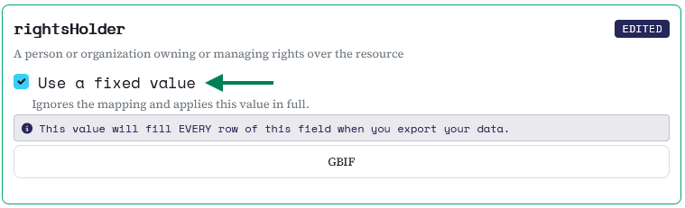
  <figcaption><b>Figura 13.</b> En la tarjeta de un término elegible, marque <b>Usar un valor fijo</b> y escriba el valor una vez. La franja de aviso deja claro que completa <b>todas las filas</b> de ese campo.</figcaption>
</figure>
```

::: {.callout-note}
## Términos que no aparecen de forma predeterminada
<span class="term">references</span>, <span class="term">bibliographicCitation</span> y <span class="term">geodeticDatum</span> no están en el conjunto base de tarjetas. Agréguelos con **Agregar término** (vea arriba) y la opción de valor fijo aparece en la tarjeta en cuanto se agrega el término. <span class="term">countryCode</span> se completa automáticamente en la validación de coordenadas, y <span class="term">basisOfRecord</span> tiene su propio asistente, por eso esos dos no usan valor fijo.
:::

## dynamicProperties: lo que los términos del estándar no cubren

No toda medida cabe en un término Darwin Core. Color del pelaje, sexo aparente, condición reproductiva, peso, un código interno del proyecto: Darwin Core reserva <span class="term">dynamicProperties</span> para esto, en un solo campo en formato JSON.

En la tarjeta <span class="term">dynamicProperties</span>, elija las columnas que quiere llevar y defina la **clave** de cada una. Saíra arma el objeto JSON con esas claves, una entrada por columna, y la tarjeta muestra **el resultado armado para la primera fila**, actualizado mientras edita las claves. Puede revisar el resultado allí mismo en lugar de descubrirlo al exportar.

```{=html}
<figure class="shot">
  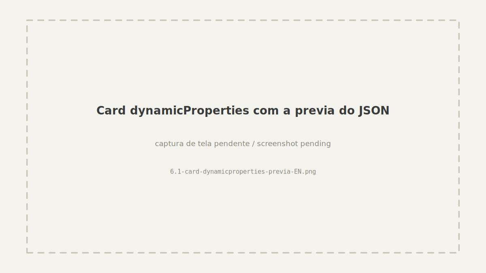
  <figcaption><b>Figura 14.</b> Con la columna <span class="term">Cor</span> mapeada, el editor deriva la clave <code>cor</code> y, debajo, muestra el JSON armado para la primera fila (<code>{"cor":"Melânico"}</code>), actualizado en cada edición de clave. La clave y el valor vienen de su hoja de cálculo, por eso quedan en el idioma de ella.</figcaption>
</figure>
```

::: {.callout-note}
## Una tarjeta siempre dice qué hizo con su columna
La línea de ejemplo bajo el selector (<code>ej.: Panthera onca</code>) muestra lo que Saíra leyó de la columna elegida. Cuando la columna está mapeada pero sus primeras filas están vacías, la tarjeta lo dice explícitamente en lugar de no mostrar nada, así **"mapeada y vacía"** nunca parece **"sin mapear"**. La celda exportada queda vacía, que es la convención de Darwin Core para información ausente.
:::

El estado de conservación (categorías del MMA y de la UICN) también se escribe en <span class="term">dynamicProperties</span>, pero por otro camino: viene de la **[validación de nombres](04-validacion-nombres.qmd)** y se agrega sin borrar las claves que usted definió aquí. Vea la **[exportación](07-vista-previa-exportacion.qmd)**.

## Columnas sin mapear

No toda columna tiene que convertirse en un término Darwin Core: basta con dejarla sin mapear. Al exportar, Saíra **agrega a la derecha** las columnas que usted no usó como fuente de ningún término, con sus nombres y su orden originales, así no se pierde ningún dato: puede editarlas a mano después, ya en el IPT.

Con los campos mapeados, sus datos ya están en el vocabulario Darwin Core, pero todavía no se verificaron. Vaya a **[Validación de nombres científicos](04-validacion-nombres.qmd)**.
