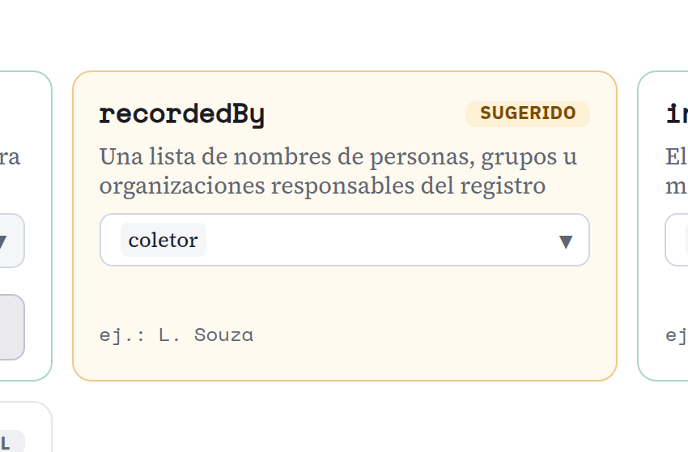
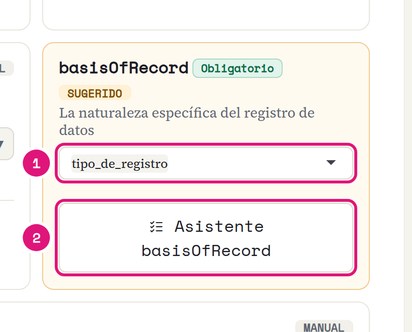
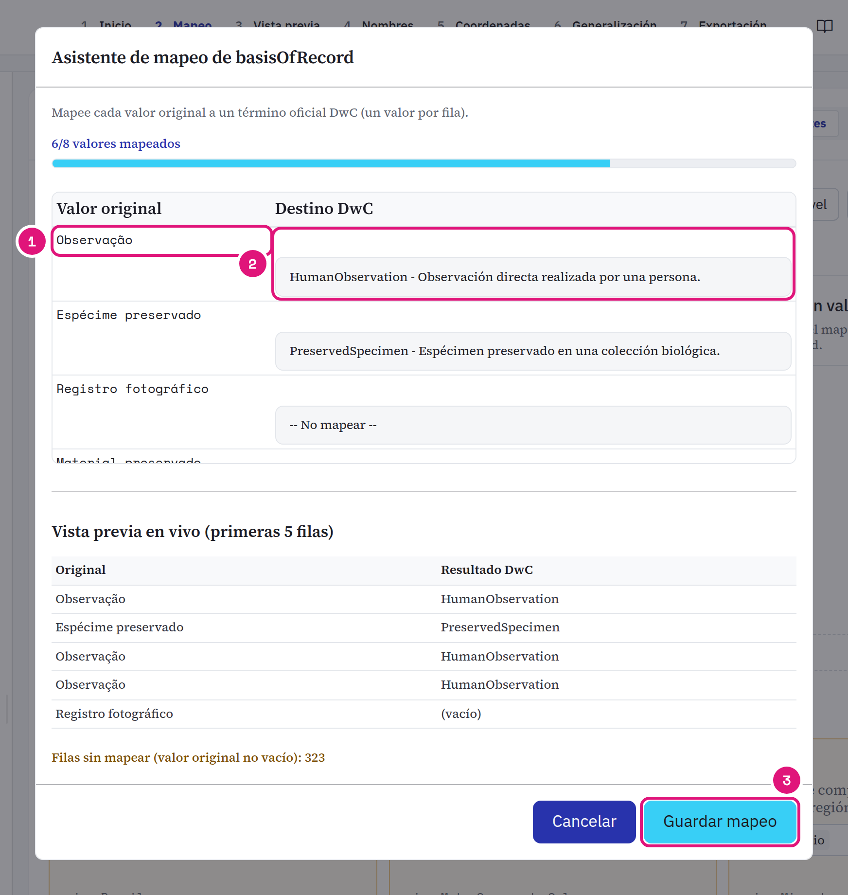
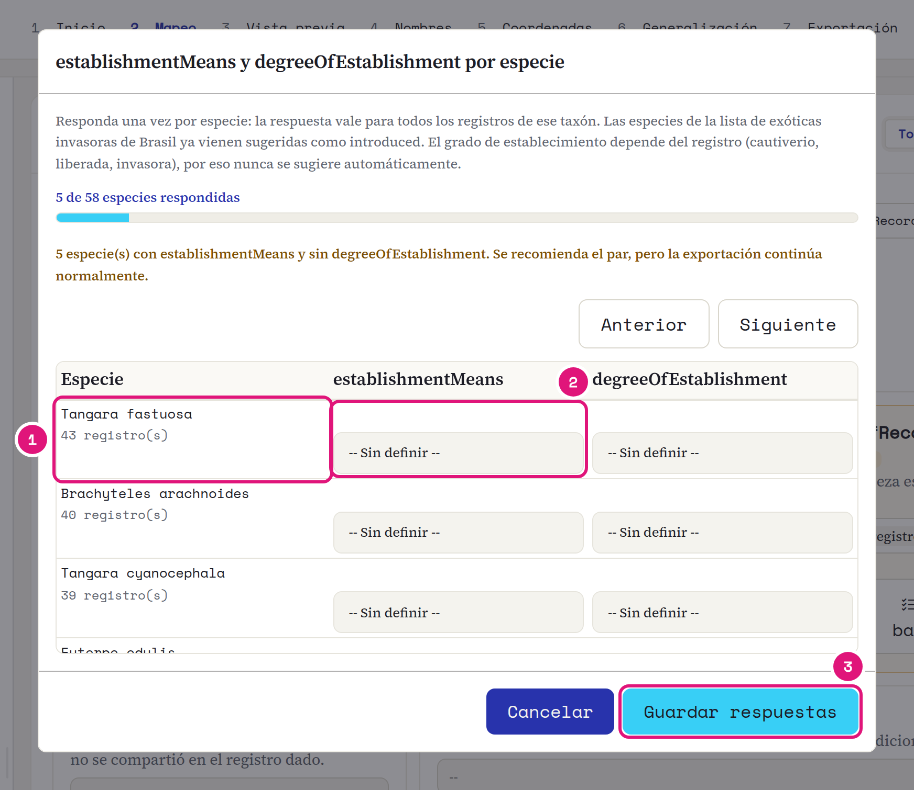
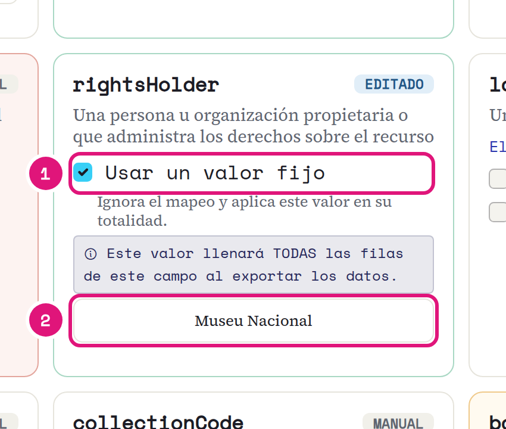
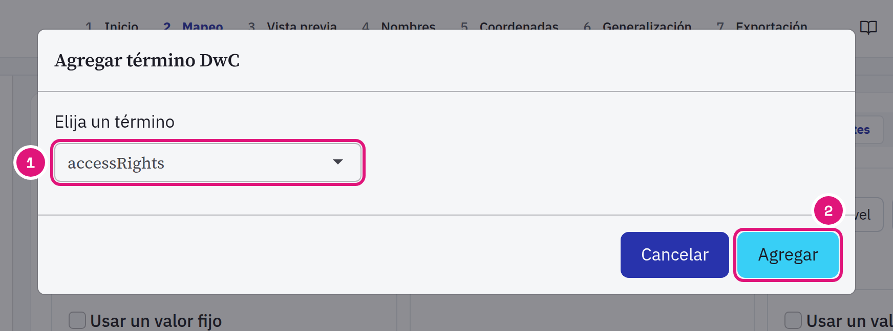
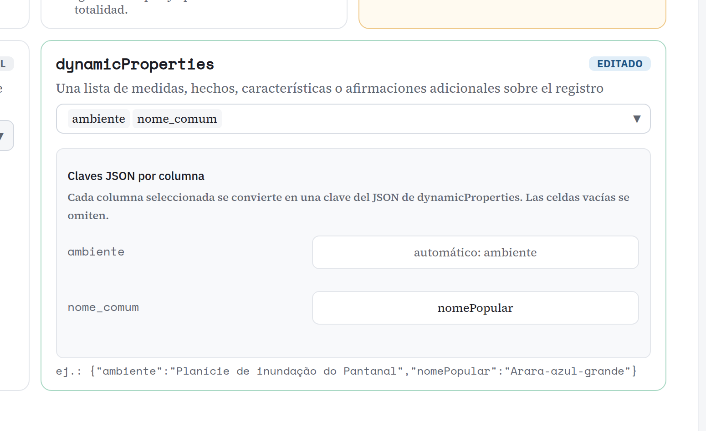
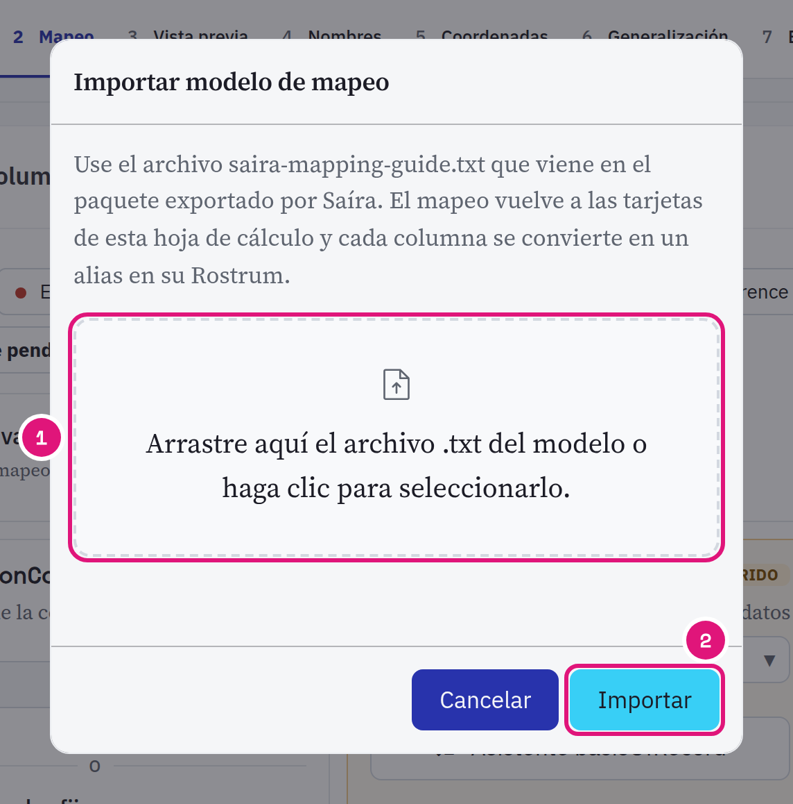

::: {.tut-standfirst}
Relacione cada columna de la hoja de cálculo con un término Darwin Core en la etapa **Mapeo**.
:::

## Ejecute Automapear

```{=html}
<figure class="shot"></figure>
```

::: {.marks}
1. Haga clic en **Automapear**. Saíra propone un término para cada columna.
2. **Siguiente pendiente** salta a la próxima tarjeta que pide revisión. El número indica cuántas faltan. En los filtros de clase, el punto rojo es un obligatorio vacío, el naranja es revisar.
3. La tarjeta amarilla es **SUGERIDO**: confírmela o cámbiela.
:::

## Revise cada tarjeta

```{=html}
<figure class="shot"></figure>
```

::: {.marks}
1. El sello indica de dónde vino el término.
2. ¿Columna equivocada? Cámbiela en el selector.
3. `ej.:` muestra el primer valor leído de la columna.
:::

| Sello | Significado |
|---|---|
| AUTO | Alta confianza. Ya viene completado. |
| SUGERIDO | Probable. Confírmelo. |
| AMBIGUO | Dos términos empatados. Usted elige. |
| EDITADO | Usted lo cambió. Su elección vale. |
| ALIAS | Vino de un mapeo anterior. |
| PLANTILLA | Vino de un modelo importado. |
| MANUAL | Sin sugerencia automática. |

Si la misma columna va a más de un término, Saíra le avisa. Verifique que sea intencional.

## Defina el basisOfRecord

```{=html}
<figure class="shot"></figure>
```

::: {.marks}
1. Elija la columna con el tipo de registro, como <span class="term">tipo_de_registro</span>.
2. Abra el **Asistente basisOfRecord**.
:::

```{=html}
<figure class="shot"></figure>
```

::: {.marks}
1. Cada valor distinto de la columna aparece una vez.
2. Elija el término Darwin Core. La vista previa de abajo muestra el resultado.
3. **Guardar mapeo**.
:::

## Responda establishmentMeans por especie

Opcional. El asistente está en la tarjeta <span class="term">establishmentMeans</span> y necesita <span class="term">scientificName</span> mapeado.

```{=html}
<figure class="shot"></figure>
```

::: {.marks}
1. Una fila por especie, con el número de registros que cubre la respuesta.
2. Elija <span class="term">establishmentMeans</span>. Al lado, el <span class="term">degreeOfEstablishment</span>.
3. **Guardar respuestas**.
:::

Las especies invasoras ya llegan como `introduced`. El grado nunca se sugiere: solo usted sabe si el animal está en cautiverio o libre. Si una columna de la hoja también completa el término, la columna gana.

## Use un valor fijo para el conjunto

```{=html}
<figure class="shot"></figure>
```

::: {.marks}
1. Marque **Usar un valor fijo**.
2. Escriba el valor una vez. Va a todas las filas.
:::

Aceptan valor fijo: <span class="term">rightsHolder</span> <span class="term">institutionCode</span> <span class="term">collectionCode</span> <span class="term">country</span> <span class="term">references</span> <span class="term">bibliographicCitation</span> <span class="term">geodeticDatum</span>. Los tres últimos entran con **Agregar término**.

## Elija la licencia

La tarjeta <span class="term">license</span> es obligatoria. Elija CC0, CC-BY o CC-BY-NC, las tres licencias que GBIF acepta. Sin licencia, la exportación se bloquea.

## Agregue un término que no aparece

```{=html}
<figure class="shot"></figure>
```

::: {.marks}
1. Busque el término. El catálogo tiene unos 218.
2. **Agregar**. El término se convierte en una tarjeta nueva.
:::

## Junte columnas extra en dynamicProperties

```{=html}
<figure class="shot"></figure>
```

::: {.marks}
1. Elija las columnas.
2. Renombre la clave, si quiere.
3. Revise el JSON de la primera fila.
:::

El estado de conservación entra en el mismo campo, a partir de la [validación de nombres](04-validacion-nombres.qmd).

## Reutilice el mapeo

El `.zip` exportado trae el `<dataset>-mapping-guide.txt`. En la próxima hoja de cálculo, haga clic en **Importar modelo**:

```{=html}
<figure class="shot"></figure>
```

::: {.marks}
1. Envíe el archivo.
2. **Importar**. Las columnas con el mismo nombre se mapean solas.
:::

Las columnas que usted no mapee salen al final del archivo, con el nombre original. GBIF ignora esas columnas.
