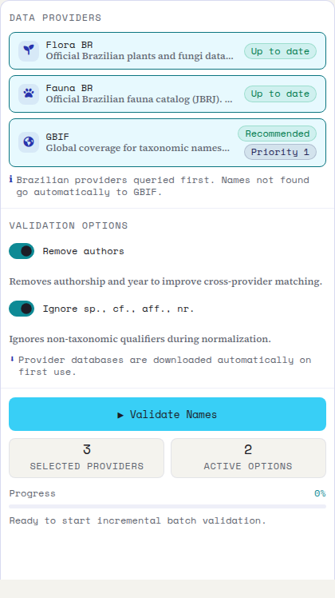
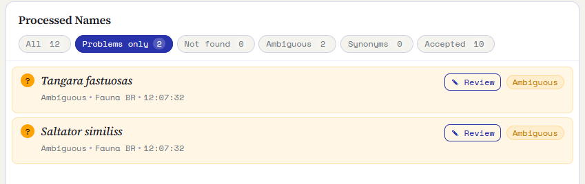
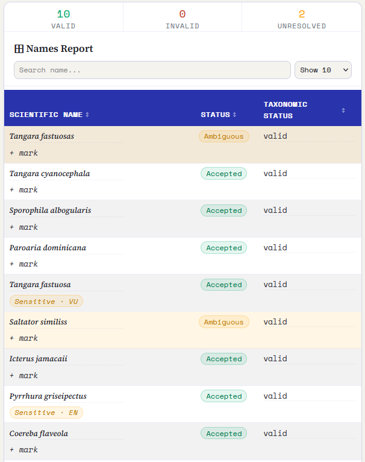
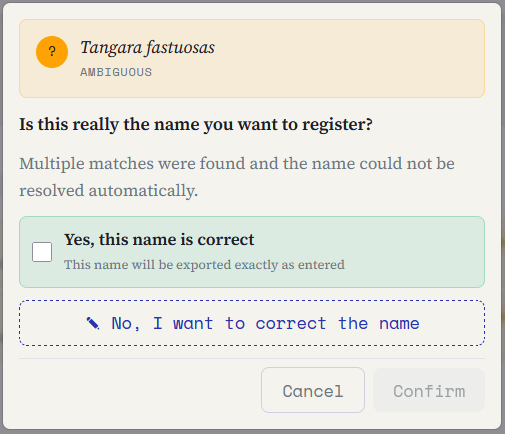
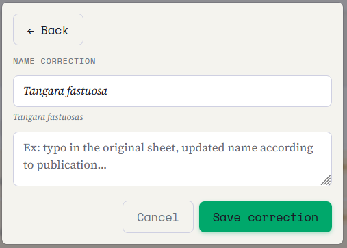
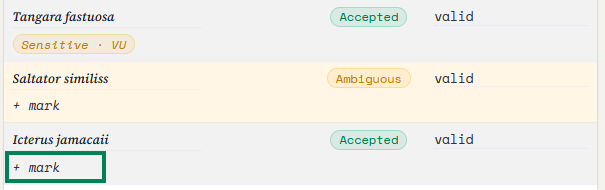
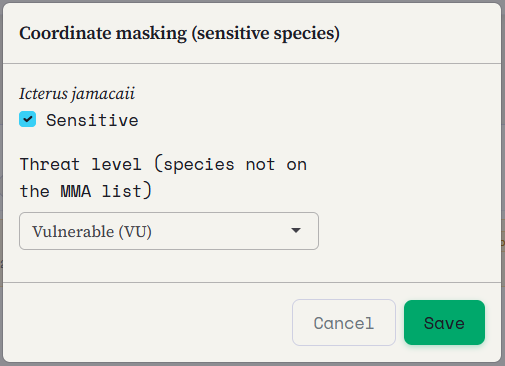
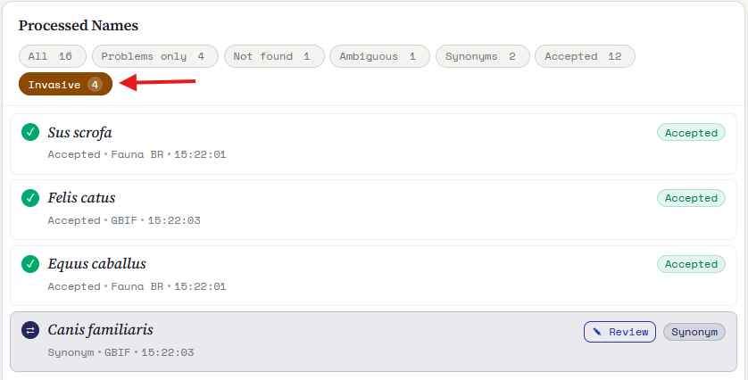
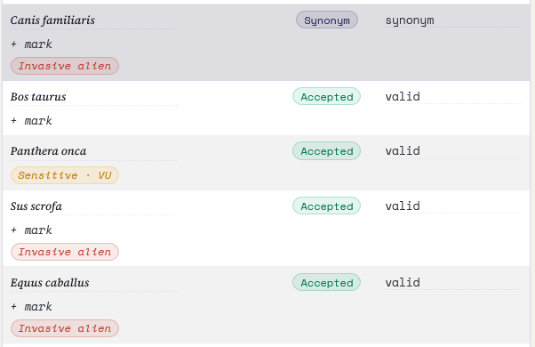

::: {.tut-standfirst}
Esta etapa verifica cada nombre científico en una base taxonómica de su elección, resuelve sinónimos y grafías divergentes, y señala las especies amenazadas de la lista nacional del MMA de Brasil.
:::

## Por qué validar los nombres

El mismo taxón puede aparecer escrito de muchas formas: con errores de tipeo, sinónimos antiguos, abreviaturas o sin el autor. Para que sus datos se combinen con otras colecciones, los nombres se deben **resolver** con una referencia taxonómica estable.

## Elección de la base de referencia

En la etapa **Nombres**, Saíra ofrece tres bases taxonómicas. Seleccione una o más, según su grupo:

```{=html}
<table class="maptable">
  <thead><tr><th>Base</th><th>Cobertura</th><th>Cuándo usar</th></tr></thead>
  <tbody>
    <tr><td>Flora do Brasil</td><td>Plantas, algas y hongos de Brasil</td><td>Colecciones botánicas y micológicas nacionales</td></tr>
    <tr><td>Fauna do Brasil</td><td>Animales de Brasil</td><td>Colecciones zoológicas nacionales</td></tr>
    <tr><td>GBIF (recomendada)</td><td>Base taxonómica global</td><td>Cualquier grupo, o cuando el taxón no es brasileño</td></tr>
  </tbody>
</table>
```

Si selecciona más de una base, Saíra las consulta en **cascada** (Flora do Brasil → Fauna do Brasil → GBIF) y usa como veredicto el primer proveedor que devuelve un resultado. Internamente, todas las consultas pasan por el paquete `taxadb`.

::: {.callout-note}
## Las bases brasileñas quedan en su computadora
Flora do Brasil y Fauna do Brasil se **descargan y guardan localmente** la primera vez que las usa. Después, la validación funciona incluso sin internet y es más rápida. Cada base aparece como una **tarjeta de proveedor** con su estado (no descargado, descargando, actualizado) y la versión local. Las bases que ya descargó quedan **preseleccionadas** cuando abre de nuevo la aplicación, así su elección se mantiene entre sesiones. GBIF se consulta según la necesidad.
:::

::: {.callout-warning}
## ¿Flora BR / Fauna BR no se descargan? Actualice Saíra
Los archivos que publican Flora e Funga do Brasil y el Catálogo Taxonômico da Fauna do Brasil cambian de vez en cuando, y Saíra acompaña esos formatos. Si una tarjeta queda en **"falló la actualización"** y nunca se pone verde, probablemente usa una versión anterior de la aplicación. **Reinstale Saíra con `pak`** para obtener la corrección más reciente. `pak` resuelve por usted las versiones correctas de los paquetes de las bases (Flora BR y Fauna BR):

```r
pak::pak("rogerio-onza/saira")
```

Después, abra de nuevo la aplicación con `saira::run_app()` e intente validar otra vez.
:::

## Antes de ejecutar: normalización

Debajo de las bases, dos opciones controlan cómo se prepara cada nombre antes de la consulta. Las dos vienen **activadas** de forma predeterminada:

- **Quitar autores**: elimina la autoría y el año para mejorar la correspondencia entre proveedores. Ej.: `Harpia harpyja (Daudin, 1800)` se convierte en `Harpia harpyja`.
- **Ignorar sp., cf., aff., nr.**: ignora los calificadores no taxonómicos durante la normalización.

```{=html}
<figure class="shot">
  
  <figcaption><b>Figura 1.</b> La columna de configuración: proveedores con el estado de cada base local, las opciones de normalización y el botón <span class="term">Validar nombres</span>.</figcaption>
</figure>
```

## Verificación de la nomenclatura

Al hacer clic en **Validar nombres**, Saíra compara cada <span class="term">scientificName</span> con la base elegida y asigna un **estado** a cada nombre:

- **Aceptado** — el nombre coincide con la referencia y ya es el nombre aceptado.
- **Sinónimo** — el nombre es válido, pero la base indica un nombre aceptado más actual (también es el estado de las grafías inválidas o mal aplicadas que devuelve la base).
- **Ambiguo** — más de un candidato fuerte. Usted decide cuál aplicar.
- **No encontrado** — no está en la base. Requiere revisión manual.

Saíra **no corrige la ortografía por su cuenta** ni adivina el nombre "más cercano": solo informa lo que devuelve la base taxonómica. Toda corrección viene de usted.

```{=html}
<ol class="fix-steps">
  <li><strong>Ejecute la verificación.</strong>
    <p>Saíra procesa la lista de nombres (cada nombre distinto se consulta una sola vez) y muestra un resumen por estado, con filtros para aislar los problemas.</p></li>
  <li><strong>Revise los problemas.</strong>
    <p>Para cada nombre señalado como sinónimo, ambiguo o no encontrado, abra la revisión manual y decida.</p></li>
  <li><strong>Trate los no encontrados.</strong>
    <p>Corrija la ortografía, confirme que es correcta (por ejemplo, un taxón descrito hace poco) o ajústela según la publicación de referencia.</p></li>
</ol>
```

```{=html}
<figure class="shot">
  
  <figcaption><b>Figura 2.</b> El panel <span class="term">Nombres procesados</span>: el resumen por situación, con filtros para aislar los problemas y un botón <span class="term">Revisar</span> en cada nombre pendiente.</figcaption>
</figure>
```

```{=html}
<figure class="shot">
  
  <figcaption><b>Figura 3.</b> El Informe de nombres: todos los taxones en una tabla, con el estado de cada uno y los conteos de válidos, inválidos y sin resolver arriba.</figcaption>
</figure>
```

## Corrección de nombres

La corrección es manual y ocurre en el **modal de revisión**. Haga clic en un nombre con problema y elija:

- **Sí, este nombre es correcto**: confirma el nombre como está. Se exporta exactamente así. Es útil para taxones descritos hace poco o nombres que faltan en la base.
- **No, quiero corregir el nombre**: abre el campo **Corrección del nombre** para escribir la grafía correcta, con un motivo opcional (ej.: error de tipeo en la hoja original, nombre actualizado según una publicación).

La decisión se **aplica de nuevo automáticamente** a todas las filas con el mismo nombre: como la validación agrupa los nombres idénticos, usted revisa cada uno una sola vez y la corrección vale para todo el conjunto de datos.

```{=html}
<figure class="shot">
  
  <figcaption><b>Figura 4.</b> El modal de revisión: confirme el nombre como está o elija corregirlo.</figcaption>
</figure>
```

```{=html}
<figure class="shot">
  
  <figcaption><b>Figura 5.</b> Modo de edición: escriba la grafía correcta y, si quiere, registre el motivo del cambio.</figcaption>
</figure>
```

::: {.callout-warning}
## La decisión taxonómica es suya
En grupos con taxonomía inestable, revise cada caso antes de aceptar. Reemplazar un nombre por su sinónimo aceptado significa reemplazar el nombre en el conjunto exportado: el nombre original se puede conservar en <span class="term">verbatimIdentification</span> u <span class="term">originalNameUsage</span> si mapeó esos campos.
:::

## Especies amenazadas (lista del MMA)

Después de resolver los nombres, Saíra compara cada taxón con la **lista nacional de especies amenazadas de extinción** de Brasil, que viene **incluida en la aplicación** (no hay nada que descargar). Los taxones de la lista reciben la marca **Sensible** en el informe, con la categoría de amenaza: **VU** (vulnerable), **EN** (en peligro), **CR** (en peligro crítico) y **CR (PEX)** (en peligro crítico, posiblemente extinta).

```{=html}
<figure class="shot">
  
  <figcaption><b>Figura 6.</b> En el informe, los taxones de la lista llevan la etiqueta <span class="term">Sensible</span> con la categoría. Los demás llevan la opción <span class="term">+ marcar</span>.</figcaption>
</figure>
```

### Ajuste de la sensibilidad

La lista del MMA es la referencia oficial y Saíra no la edita: las categorías de amenaza vienen de las ordenanzas federales y no cambian. Lo que usted ajusta es la **marca de sensibilidad** de cada taxón, según su experiencia y la realidad de su región de estudio:

- **Quitar la sensibilidad de un taxón**: si, en su contexto, ese registro no es sensible, desmárquelo. Saíra avisa que es una **decisión del custodio**: sin la marca, las coordenadas de ese taxón se publican sin generalización.
- **Marcar una especie que no está en la lista**: use **+ marcar** para señalar como sensible un taxón que la lista nacional no cubre, pero que usted sabe que es vulnerable en su zona.

El ajuste se hace en un pequeño diálogo de confirmación y se aplica al exportar.

```{=html}
<figure class="shot">
  
  <figcaption><b>Figura 7.</b> El diálogo de sensibilidad: marque o desmarque el taxón. Al desmarcar una especie de la lista del MMA, Saíra le recuerda que la decisión es suya y que las coordenadas se publicarán sin generalización.</figcaption>
</figure>
```

Aquí la etapa solo **señala** lo que es sensible. La protección real de las coordenadas (decidir si generalizar la ubicación y cuánto) ocurre en la etapa de **[generalización](06-generalizacion.qmd)**, según la tabla de decisión de Chapman (2020).

::: {.callout-note}
## De dónde viene la lista
La lista incluida viene de las listas oficiales del Ministerio del Medio Ambiente de Brasil: **flora** de la [**Portaria MMA nº 148, del 7 de junio de 2022**](https://www.in.gov.br/en/web/dou/-/portaria-mma-n-148-de-7-de-junho-de-2022-406272733); **fauna terrestre** de la [**Portaria MMA nº 1.704, del 16 de junio de 2026**](https://www.in.gov.br/en/web/dou/-/portaria-mma-n-1.704-de-16-de-junho-de-2026-712968917); y **fauna acuática** (peces e invertebrados) de la [**Portaria GM/MMA nº 1.667, del 27 de abril de 2026**](https://www.in.gov.br/web/dou/-/portaria-gm/mma-n-1.667-de-27-de-abril-de-2026-702075623).
:::

## Especies exóticas invasoras (Instituto Hórus)

Además de la lista de amenazadas, Saíra compara cada taxón con la **lista brasileña de especies exóticas invasoras** del **Instituto Hórus**, con 483 taxones de animales y plantas. También viene **incluida en la aplicación**: la verificación es local, sin conexión e inmediata.

La marca aparece en dos lugares. En **Nombres procesados**, la píldora de filtro <span class="term">Invasoras</span> se suma a las demás, con un conteo de taxones, y reduce la lista solo a esos, lo que ayuda cuando la lista es larga.

```{=html}
<figure class="shot">
  
  <figcaption><b>Figura 8.</b> La píldora <span class="term">Invasoras</span> en Nombres procesados, con su conteo de taxones. Al hacer clic, quedan solo las especies de la lista de Hórus.</figcaption>
</figure>
```

En el **Informe de nombres**, cada taxón de la lista lleva la etiqueta **Exótica invasora** bajo el nombre, y una línea sobre la tabla informa cuántos registros se ven afectados.

```{=html}
<figure class="shot">
  
  <figcaption><b>Figura 9.</b> La etiqueta <span class="term">Exótica invasora</span> en el informe. El mismo cuadro muestra que las dos listas son independientes: <span class="term">Panthera onca</span> es <span class="term">Sensible · VU</span> pero no invasora, y <span class="term">Bos taurus</span> no es ninguna de las dos.</figcaption>
</figure>
```

La comparación usa **exactamente la misma normalización de nombres** que el validador, así la autoría y los calificadores no la impiden: <span class="term">Felis catus (Linnaeus, 1758)</span> se reconoce.

::: {.callout-note}
## Invasora no es lo mismo que amenazada, y las píldoras también son diferentes
Las otras píldoras filtran por **estado de validación** (aceptado, sinónimo, no encontrado…), que cambia a medida que usted revisa los nombres. La píldora <span class="term">Invasoras</span> filtra por la **lista de especies**, por eso sus revisiones no la afectan. Un taxón puede estar en las dos condiciones o en ninguna: son listas independientes con propósitos opuestos.
:::

Estar en esta lista significa que el taxón es **exótico e invasor en Brasil**, que es justamente el dato de entrada para la sugerencia automática de <span class="term">establishmentMeans</span> en el **[mapeo](03-mapeo-dwc.qmd)**: esas especies llegan al asistente completadas como `introduced`. La lista a propósito **no dice nada** sobre <span class="term">degreeOfEstablishment</span>, que depende del registro: un animal en cautiverio y uno asilvestrado son la misma especie.

Si la lista falta o no se puede leer, la validación sigue funcionando y solo deja de señalar, con un aviso, en lugar de fallar.

## El estado de conservación va a la exportación

::: {.callout-important}
## Las bases que elige deciden el estado de conservación
Las bases que selecciona aquí deciden lo que Saíra escribe en `dynamicProperties` al exportar: una base **brasileña** (Flora BR / Fauna BR) aporta la categoría del **MMA**, **GBIF** la categoría global de la **UICN**. Una línea corta sobre el informe indica cuántos registros recibirán cada una. Las claves generadas y el comportamiento sin conexión se explican en **[Vista previa y exportación](07-vista-previa-exportacion.qmd)**.
:::

Con los nombres resueltos, pase al espacio: vaya a **[Validación de coordenadas](05-validacion-coordenadas.qmd)**.
