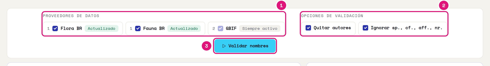
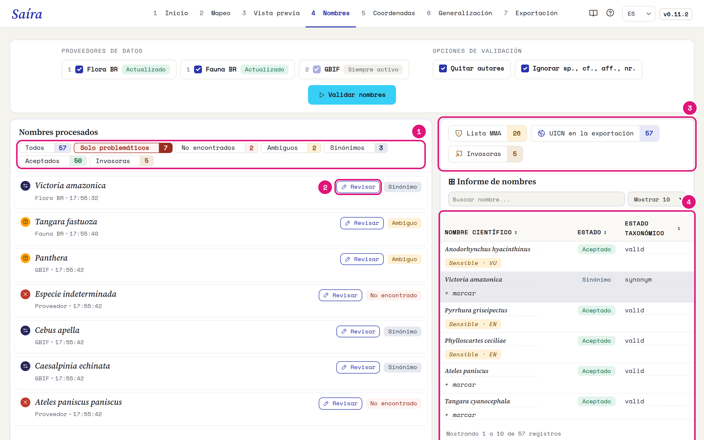
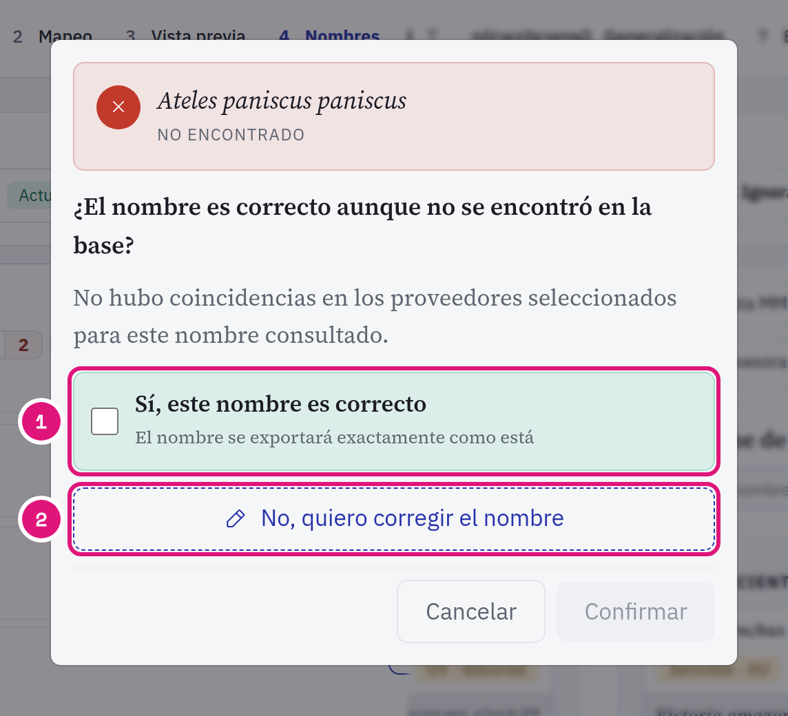
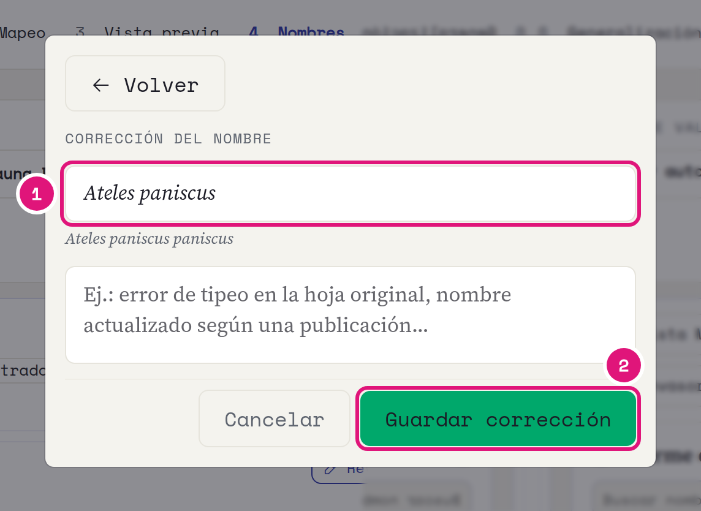
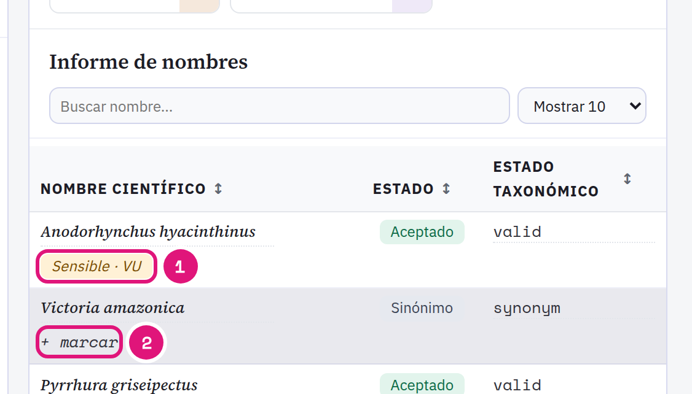
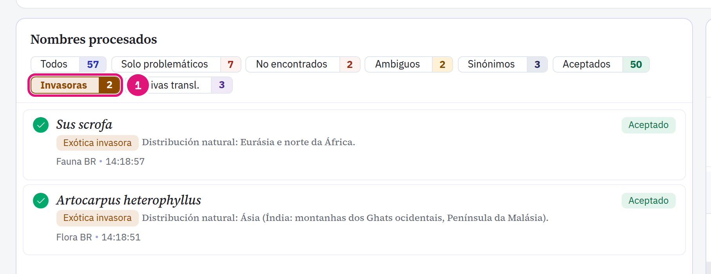

::: {.tut-standfirst}
Verifique cada <span class="term">scientificName</span> contra una base taxonómica en la etapa **Nombres**. La etapa también señala especies amenazadas e invasoras.
:::

## Ejecute la validación

```{=html}
<figure class="shot"></figure>
```

::: {.marks}
1. Marque **Flora BR** y **Fauna BR**. GBIF está siempre activo.
2. Las dos opciones vienen activadas. Quitan autor y año (`Harpia harpyja (Daudin, 1800)`) y calificadores (`sp.`, `cf.`, `aff.`, `nr.`) antes de la consulta.
3. Haga clic en **Validar nombres**.
:::

El número en el proveedor es el orden de la consulta. Saíra consulta Flora BR y Fauna BR primero, después GBIF. Cada nombre distinto se consulta una vez.

::: {.callout-note}
## Flora BR y Fauna BR quedan en su computadora
Saíra descarga las dos bases en el primer uso. Después la validación funciona sin internet. Si el proveedor muestra **Falló la actualización**, reinstale Saíra con `pak::pak("rogerio-onza/saira")`.
:::

## Lea el resultado

```{=html}
<figure class="shot"></figure>
```

::: {.marks}
1. Los filtros separan los nombres por estado. **Solo problemáticos** muestra lo que pide revisión.
2. **Revisar** abre la decisión para ese nombre.
3. Cuántas especies están en la Lista MMA, cuántos registros reciben el estado UICN y cuántas especies son invasoras.
4. El informe lista todos los nombres, con estado y marca de sensibilidad.
:::

| Estado | Significado |
|---|---|
| Aceptado | El nombre es el nombre aceptado en la base. |
| Sinónimo | La base apunta a otro nombre aceptado. También vale para grafías que la base marca como inválidas. |
| Ambiguo | Más de un candidato fuerte. Usted elige. |
| No encontrado | El nombre no está en ninguna base consultada. |

Saíra no corrige la grafía por sí solo. Solo muestra lo que la base devuelve.

## Revise un nombre

```{=html}
<figure class="shot"></figure>
```

::: {.marks}
1. ¿El nombre es correcto, como un taxón recién descrito? Márquelo y haga clic en **Confirmar**. El nombre sale tal como está.
2. ¿El nombre es incorrecto? Haga clic en **No, quiero corregir el nombre**.
:::

```{=html}
<figure class="shot"></figure>
```

::: {.marks}
1. Escriba el nombre correcto. El motivo es opcional.
2. **Guardar corrección**.
:::

La decisión vale para todas las filas con el mismo nombre.

::: {.callout-warning}
## La decisión taxonómica es suya
En grupos con taxonomía inestable, revise cada caso. La corrección sustituye el nombre en la exportación. Para guardar el nombre original, mapee la misma columna también en <span class="term">verbatimIdentification</span> en el [mapeo](03-mapeo-dwc.qmd).
:::

## Revise las especies amenazadas

La lista nacional del MMA de Brasil viene incorporada en Saíra. Las especies de la lista reciben la marca **Sensible** con la categoría: VU, EN, CR o CR (PEX).

```{=html}
<figure class="shot"></figure>
```

::: {.marks}
1. Haga clic en la marca para quitar la sensibilidad. Sin la marca, las coordenadas de la especie salen sin generalización.
2. **+ marcar** vuelve sensible una especie fuera de la lista.
:::

La categoría de amenaza no cambia: viene de las ordenanzas. La etapa solo marca. La protección de las coordenadas ocurre en la [generalización](06-generalizacion.qmd).

::: {.callout-note}
## De dónde viene la lista
La lista incorporada viene de las listas oficiales del Ministerio de Medio Ambiente de Brasil (MMA): la **flora** por la [**Portaria MMA nº 148, de 7 de junio de 2022**](https://www.in.gov.br/en/web/dou/-/portaria-mma-n-148-de-7-de-junho-de-2022-406272733); la **fauna terrestre** por la [**Portaria MMA nº 1.704, de 16 de junio de 2026**](https://www.in.gov.br/en/web/dou/-/portaria-mma-n-1.704-de-16-de-junho-de-2026-712968917); y la **fauna acuática** (peces e invertebrados) por la [**Portaria GM/MMA nº 1.667, de 27 de abril de 2026**](https://www.in.gov.br/web/dou/-/portaria-gm/mma-n-1.667-de-27-de-abril-de-2026-702075623).
:::

## Encuentre las especies invasoras

```{=html}
<figure class="shot"></figure>
```

::: {.marks}
1. El filtro **Invasoras** muestra las especies de la lista de exóticas invasoras del Instituto Hórus (483 taxones).
:::

Este filtro usa la lista de especies, no el estado de la validación. Las revisiones no cambian el conteo. En el [mapeo](03-mapeo-dwc.qmd), estas especies llegan al asistente de <span class="term">establishmentMeans</span> como `introduced`.

Las bases marcadas definen el estado de conservación grabado en la exportación: Flora BR y Fauna BR dan la categoría MMA, GBIF da la categoría UICN. Vea [Vista previa y exportación](07-vista-previa-exportacion.qmd#estado-de-conservación-en-dynamicproperties).
