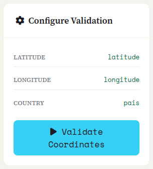
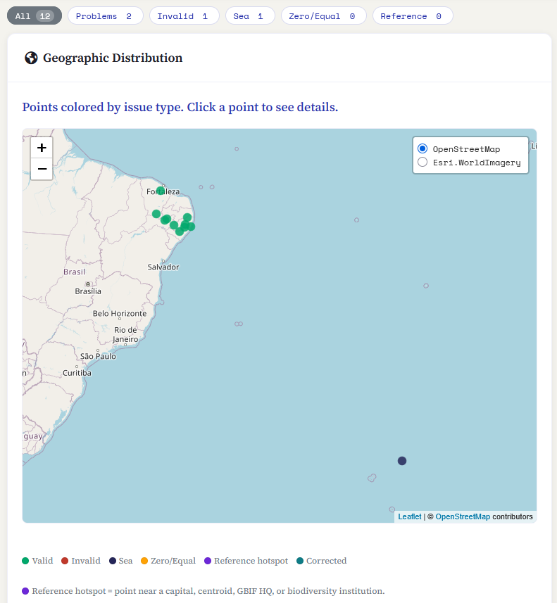
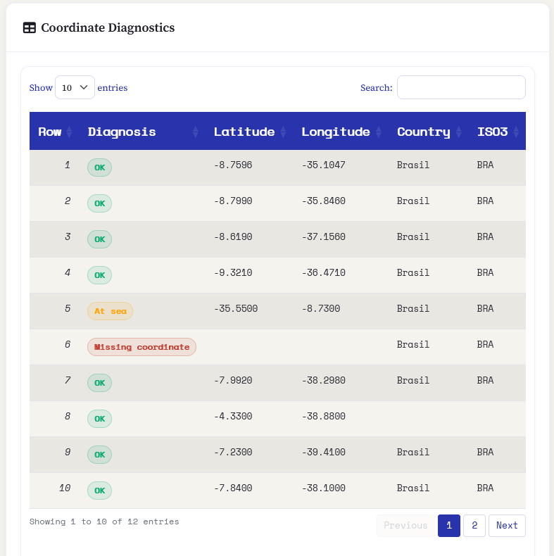
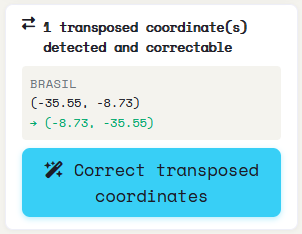
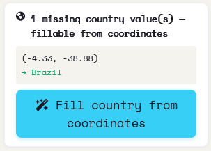
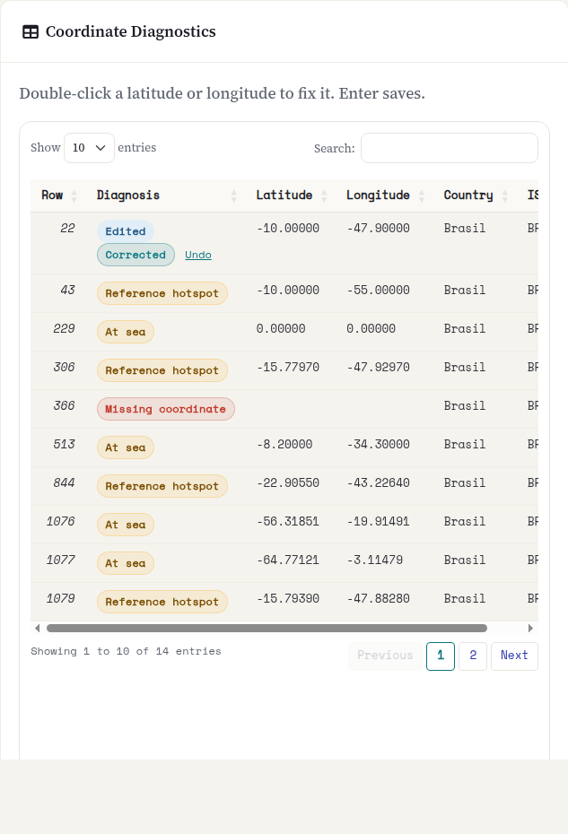

::: {.tut-standfirst}
Las coordenadas invertidas, cambiadas o en (0, 0) están entre los errores más comunes de las hojas de cálculo de campo. Saíra hace un diagnóstico determinista, muestra cada registro en un mapa y en una tabla, y **propone correcciones seguras**, aplicadas solo al exportar, nunca en silencio sobre sus datos.
:::

## Antes de validar: qué debe estar mapeado

La validación de coordenadas solo funciona cuando tres términos Darwin Core están mapeados (vea **[Mapeo](03-mapeo-dwc.qmd)**):

- <span class="term">decimalLatitude</span>
- <span class="term">decimalLongitude</span>
- <span class="term">country</span>

La barra en la parte superior de la pantalla muestra la columna asociada a cada término. Mientras falte alguno, el botón **Validar coordenadas** queda desactivado.

La validación siempre ejecuta todas las pruebas, incluida la detección de *referencias sensibles* (puntos sospechosos en capitales, centroides de países, la sede de GBIF e instituciones de biodiversidad).

Haga clic en **Validar coordenadas**. Usted inicia la validación. No ocurre en cada cambio de los datos.

```{=html}
<figure class="shot">
  
  <figcaption><b>Figura 1.</b> Barra superior: estado de las columnas mapeadas (latitud, longitud, país) y el botón Validar coordenadas.</figcaption>
</figure>
```

## Qué verifica Saíra

A partir de <span class="term">decimalLatitude</span>, <span class="term">decimalLongitude</span> y <span class="term">country</span>, cada registro recibe **un diagnóstico**, con el mismo color que aparece en el mapa y en las etiquetas de la tabla:

```{=html}
<table class="maptable">
  <thead><tr><th>Diagnóstico</th><th>Qué significa</th></tr></thead>
  <tbody>
    <tr><td><span class="swatch" style="background:var(--success)"></span>OK</td><td>Pasó todas las pruebas.</td></tr>
    <tr><td><span class="swatch" style="background:var(--coord-missing)"></span>Coordenada ausente</td><td>Latitud o longitud vacía o no numérica.</td></tr>
    <tr><td><span class="swatch" style="background:var(--error)"></span>Fuera de los límites</td><td>Valores imposibles (latitud más allá de ±90, longitud más allá de ±180) o coordenada en cero.</td></tr>
    <tr><td><span class="swatch" style="background:var(--coord-swap)"></span>Posible inversión</td><td>La latitud y la longitud parecen cambiadas.</td></tr>
    <tr><td><span class="swatch" style="background:var(--info)"></span>En mar abierto</td><td>El punto cae en el agua según la capa de línea de costa, cuando debería estar en tierra.</td></tr>
    <tr><td><span class="swatch" style="background:var(--warning)"></span>Cero/Iguales</td><td>Coordenada en (0, 0) o con latitud y longitud idénticas.</td></tr>
    <tr><td><span class="swatch" style="background:var(--coord-identical)"></span>Todas idénticas</td><td>Todos los registros válidos comparten el mismo par de coordenadas: señal de un valor de relleno colectivo.</td></tr>
    <tr><td><span class="swatch" style="background:var(--coord-reference)"></span>Referencia sensible</td><td>Punto cerca de una capital, centroide de país, sede de GBIF o institución biológica (solo en el perfil <b>Completo</b>).</td></tr>
  </tbody>
</table>
```

Las pruebas son deterministas (al estilo de `CoordinateCleaner`) y usan la capa de países de Natural Earth incluida en Saíra: funcionan sin depender de servicios externos.

## Lectura de los resultados

Cuando termina la validación, los resultados aparecen a la derecha.

**Filtros.** Sobre el mapa, unos botones filtran la vista por categoría: **Todos**, **Problemas**, **Inválida**, **Mar**, **Cero/Iguales** y **Referencia**. Al hacer clic en uno, se filtran el mapa y la tabla a la vez.

**Mapa: Distribución geográfica.** Cada registro se convierte en un punto, coloreado por situación. Haga clic en un punto para ver su fila, su diagnóstico y sus coordenadas. Los grupos fuera del área esperada se destacan.

```{=html}
<table class="maptable">
  <thead><tr><th>Color en el mapa</th><th>Situación</th></tr></thead>
  <tbody>
    <tr><td><span class="swatch" style="background:var(--success)"></span>Verde</td><td>Válida</td></tr>
    <tr><td><span class="swatch" style="background:var(--error)"></span>Rojo</td><td>Inválida</td></tr>
    <tr><td><span class="swatch" style="background:var(--info)"></span>Azul marino</td><td>Mar</td></tr>
    <tr><td><span class="swatch" style="background:var(--warning)"></span>Naranja</td><td>Cero/Iguales</td></tr>
    <tr><td><span class="swatch" style="background:var(--coord-reference)"></span>Violeta</td><td>Referencia sensible</td></tr>
  </tbody>
</table>
```

```{=html}
<figure class="shot">
  
  <figcaption><b>Figura 2.</b> Distribución geográfica: puntos coloreados por situación, con la leyenda de colores debajo del mapa.</figcaption>
</figure>
```

::: {.callout-warning}
## La prueba de mar es aproximada
La prueba de mar usa datos simplificados de la línea de costa. Los puntos muy cerca de la costa pueden quedar marcados por error. **Verifique visualmente en el mapa antes de descartar** un registro marcado como *En mar abierto*.
:::

**Tabla: Diagnóstico de coordenadas.** Debajo del mapa, una tabla lista cada registro con las columnas **Fila**, **Diagnóstico** (etiqueta de color), **Latitud**, **Longitud**, **País** e **ISO3** (el código de país resuelto). Se puede buscar en ella, tiene paginación y sigue el filtro activo.

```{=html}
<figure class="shot">
  
  <figcaption><b>Figura 3.</b> Los filtros y la tabla Diagnóstico de coordenadas (Fila, Diagnóstico, Latitud, Longitud, País, ISO3).</figcaption>
</figure>
```

## Correcciones asistidas

Saíra **propone la corrección** para que usted la aplique de forma explícita. Las coordenadas originales nunca se sobrescriben en silencio, y las correcciones aceptadas se **aplican al exportar**, no en la vista previa. Cuando la plantilla de exportación tiene las columnas <span class="term">verbatimLatitude</span> y <span class="term">verbatimLongitude</span> vacías, los valores originales se conservan allí.

Cuando hay candidatos, aparecen paneles a la izquierda. Cada uno muestra el conteo y un ejemplo, y se pone verde con un ✓ después de aplicado:

```{=html}
<ol class="fix-steps">
  <li><strong>Corrija transposiciones e inversiones.</strong>
    <p>Para los puntos fuera del país informado, Saíra prueba intercambios de lat/lon e inversiones de signo y acepta el primero que cae dentro del país (margen de ~22 km en la frontera). Botón: <strong>Corregir</strong>.</p></li>
  <li><strong>Complete el país a partir del punto.</strong>
    <p>Cuando <span class="term">country</span> está vacío y la coordenada es válida, Saíra deriva el país en el que cae el punto. Los países que usted ya informó nunca se sobrescriben. Botón: <strong>Completar</strong>.</p></li>
  <li><strong>Trate los puntos en el mar sin país.</strong>
    <p>País vacío + punto en el mar es una señal fuerte de intercambio de lat/lon. Saíra prueba el intercambio y, si el punto corregido cae sin ambigüedad en un país, propone la coordenada y el país juntos. Botón: <strong>Invertir</strong>.</p></li>
</ol>
```

```{=html}
<figure class="shot">
  
  <figcaption><b>Figura 4.</b> Panel de corrección de coordenadas transpuestas: conteo, ejemplo (anterior → nuevo) y el botón Corregir.</figcaption>
</figure>
```

```{=html}
<figure class="shot">
  
  <figcaption><b>Figura 5.</b> Panel de país que se puede completar a partir de las coordenadas (y la variante "mar + país vacío → se corrige con intercambio de lat/lon").</figcaption>
</figure>
```

## Corrija una coordenada en la tabla

Cuando ningún panel cubre el error, corrija el punto en la propia tabla **Diagnóstico de coordenadas**, sin volver a la hoja de cálculo:

```{=html}
<ol class="fix-steps">
  <li><strong>Haga doble clic en la latitud o la longitud.</strong>
    <p>La celda se convierte en un campo. Escriba el valor en grados decimales, con coma o punto (<code>-15,8</code> o <code>-15.8</code>). Enter guarda.</p></li>
  <li><strong>Lea el nuevo diagnóstico.</strong>
    <p>Saíra valida el punto de nuevo, con las mismas pruebas. Si pasa, la fila muestra <em>Editada</em> y <em>Corregida</em>. Si todavía falla (por ejemplo, sigue en el mar), la fila muestra el nuevo problema. El marcador se mueve en el mapa.</p></li>
  <li><strong>Deshaga si es necesario.</strong>
    <p>El enlace <strong>Deshacer</strong> de la fila recupera la coordenada original. El filtro <strong>Editadas</strong> muestra solo las filas que usted corrigió.</p></li>
</ol>
```

```{=html}
<figure class="shot">
  
  <figcaption><b>Figura 6.</b> Una fila corregida en la tabla: etiquetas <em>Editada</em> y <em>Corregida</em>, el enlace Deshacer y el nuevo valor.</figcaption>
</figure>
```

Una corrección manual sigue las reglas de las asistidas: va a la exportación, y el valor original va a <span class="term">verbatimLatitude</span> y <span class="term">verbatimLongitude</span> cuando esas columnas están vacías. Validar de nuevo no borra las correcciones manuales. Una fila sin un <span class="term">occurrenceID</span> único no se puede editar.

**Los registros sin coordenada** quedan marcados como *Coordenada ausente*. Saíra no inventa un punto a partir del texto de la localidad: esos registros quedan a su criterio. Déjelos sin georreferencia como una decisión consciente, o escriba las dos coordenadas en la tabla.

::: {.callout-tip}
## Datum y precisión
Registre el <span class="term">geodeticDatum</span> (por ejemplo, <em>WGS84</em>) y, si la conoce, la incertidumbre en metros (<span class="term">coordinateUncertaintyInMeters</span>). Sin estos dos campos, quien reutiliza el registro no sabe si el punto es confiable a 10 m o a 10 km. Muchos análisis, como el modelado de distribución, filtran justamente por <span class="term">coordinateUncertaintyInMeters</span>.
:::

::: {.callout-warning}
## Signos de las coordenadas en Brasil
Casi todo Brasil tiene **latitud y longitud negativas**. Las coordenadas positivas donde se esperaba el hemisferio sur/oeste son una señal fuerte de error de signo o de intercambio. El ejemplo clásico: `-34.87, -8.04` (lat, lon) en lugar de `-8.04, -34.87` lleva un punto de Pernambuco a la mitad del Atlántico.
:::

Datos mapeados, nombres resueltos y coordenadas revisadas. Si hay especies amenazadas, la etapa siguiente decide cómo protegerlas: vaya a **[Generalización de especies sensibles](06-generalizacion.qmd)**.
