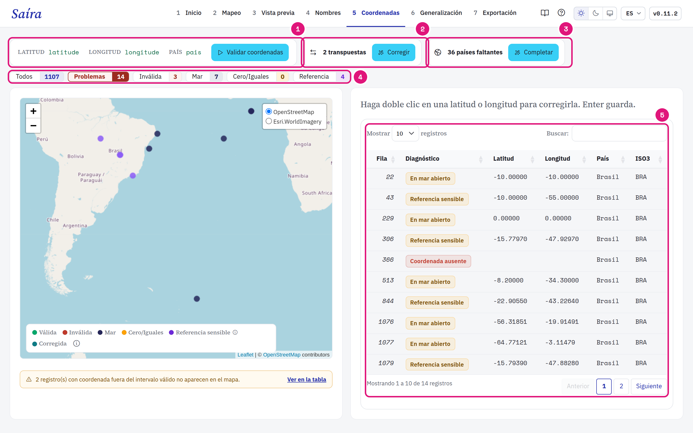
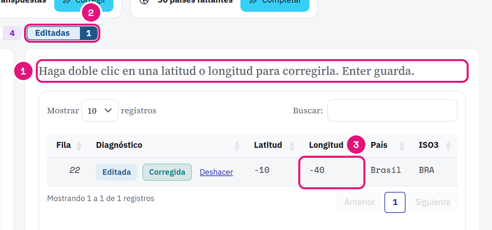

::: {.tut-standfirst}
Encuentre coordenadas invertidas, en el mar o fuera del país en la etapa **Coordenadas**. Saíra propone correcciones. Usted decide cuáles aplicar.
:::

## Ejecute la validación

La validación necesita <span class="term">decimalLatitude</span>, <span class="term">decimalLongitude</span> y <span class="term">country</span> mapeados. Sin uno de ellos, el botón **Validar coordenadas** queda desactivado.

```{=html}
<figure class="shot"></figure>
```

::: {.marks}
1. Las columnas mapeadas y el botón **Validar coordenadas**.
2. Coordenadas transpuestas. **Corregir** aplica el intercambio.
3. Países faltantes. **Completar** usa el país donde cae el punto.
4. Los filtros cambian el mapa y la tabla juntos.
5. La tabla lista cada registro con su diagnóstico.
:::

| Diagnóstico | Significado |
|---|---|
| Coordenada ausente | Latitud o longitud vacía o no numérica. |
| Inválida | Latitud más allá de ±90 o longitud más allá de ±180. |
| Posible inversión | La latitud y la longitud parecen intercambiadas. |
| En mar abierto | El punto cae en el agua. |
| Cero/Iguales | Punto en (0, 0) o latitud igual a la longitud. |
| Referencia sensible | Punto cerca de una capital, del centroide de un país, de la sede de GBIF o de una institución biológica. |

Las pruebas funcionan sin internet, con la capa de países de Natural Earth incorporada en Saíra.

::: {.callout-warning}
## La prueba de mar es aproximada
La costa está simplificada. Un punto muy cerca de la costa puede aparecer como **En mar abierto**. Revíselo en el mapa antes de descartar el registro.
:::

## Aplique las correcciones propuestas

Los paneles aparecen solo cuando hay candidatos:

| Panel | Qué hace Saíra |
|---|---|
| **Corregir** transpuestas | Prueba intercambios de latitud y longitud y de signo. Acepta el primero que cae en el país informado (margen de ~22 km). |
| **Completar** países | Completa un <span class="term">country</span> vacío con el país donde cae el punto. No cambia un país ya informado. |
| **Invertir** en el mar sin país | Intercambia latitud y longitud y completa el país, si el punto nuevo cae en un solo país. |

Las correcciones valen en la exportación. El dato original no cambia. Si <span class="term">verbatimLatitude</span> y <span class="term">verbatimLongitude</span> están vacíos, el valor original va a ellos.

## Corrija un punto en la tabla

```{=html}
<figure class="shot"></figure>
```

::: {.marks}
1. Haga doble clic en la latitud o en la longitud. Escriba el valor en grados decimales, con coma o punto. Enter guarda.
2. El filtro **Editadas** muestra solo las filas que usted corrigió.
3. El valor nuevo. Saíra valida el punto de nuevo. **Deshacer** devuelve el valor original.
:::

Validar de nuevo no borra las correcciones manuales. Una fila sin <span class="term">occurrenceID</span> único no acepta edición.

Saíra no crea coordenadas a partir del texto de la localidad. Un registro sin coordenadas queda como está, a menos que usted escriba las dos coordenadas en la tabla.

::: {.callout-tip}
## Signo de las coordenadas en Brasil
Casi todo Brasil tiene latitud y longitud negativas. `-34.87, -8.04` (lat, lon) en lugar de `-8.04, -34.87` pone un punto de Pernambuco en medio del Atlántico.
:::

Registre también el <span class="term">geodeticDatum</span> (por ejemplo, `WGS84`) y, si lo sabe, <span class="term">coordinateUncertaintyInMeters</span>. Muchos análisis filtran los registros por ese campo.
