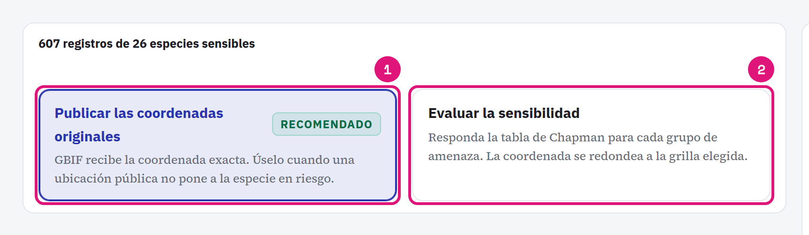
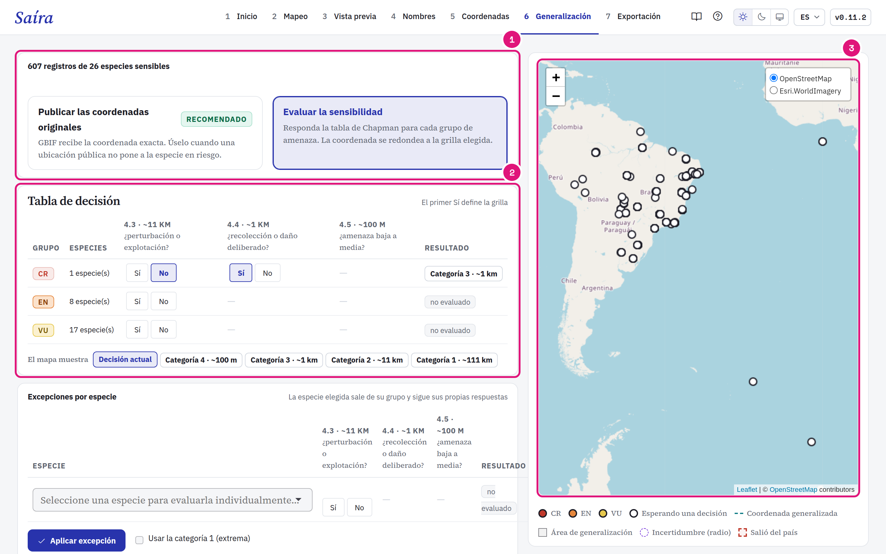
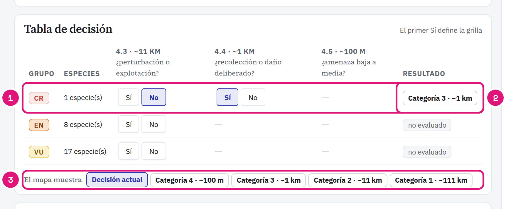
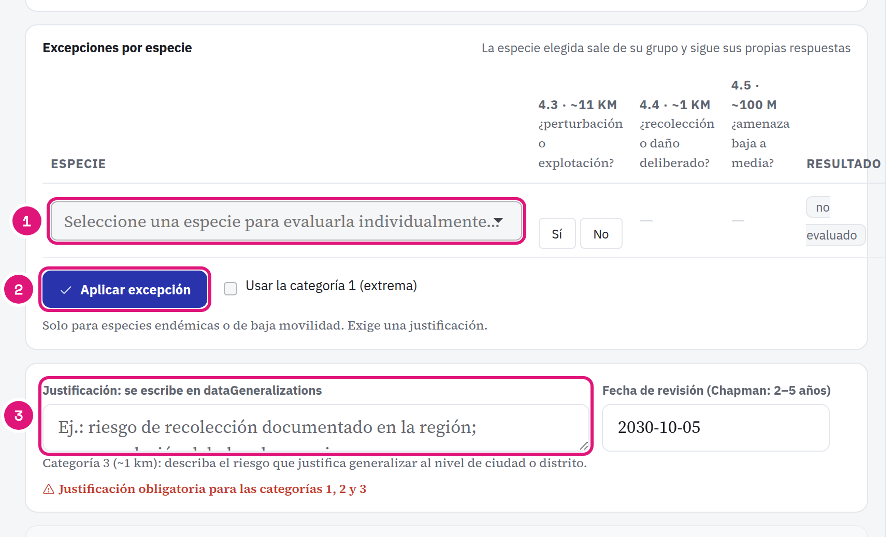

::: {.tut-standfirst}
Decida si reducir la precisión de las coordenadas de especies amenazadas, y cuánto, en la etapa **Generalización**. La etapa sigue la tabla de decisión de [Chapman (2020)](https://doi.org/10.15468/doc-5jp4-5g10).
:::

La etapa trabaja con las especies marcadas como **Sensible** en la [validación de nombres](04-validacion-nombres.qmd). Sin especies sensibles, no hay nada que hacer aquí.

## Elija el camino

```{=html}
<figure class="shot"></figure>
```

::: {.marks}
1. **Publicar las coordenadas originales** es el valor recomendado. Un dato preciso tiene más valor científico.
2. **Evaluar la sensibilidad** abre la tabla de decisión. Elija este camino solo si hay un riesgo real de recolecta o persecución.
:::

Saíra no generaliza de nuevo una coordenada que ya llegó generalizada: <span class="term">coordinateUncertaintyInMeters</span> de 1 km o más, o <span class="term">dataGeneralizations</span> completado.

::: {.callout-important}
## Los datos de Wildlife Insights ya vienen protegidos
La exportación de Wildlife Insights ya oculta la ubicación de las especies sensibles. Elija **Publicar las coordenadas originales**. Generalizar de nuevo solo quita precisión.
:::

## Responda la tabla de decisión

```{=html}
<figure class="shot"></figure>
```

::: {.marks}
1. El modo **Evaluar la sensibilidad**.
2. La tabla de decisión, una fila por categoría de amenaza.
3. El mapa muestra el resultado de cada respuesta.
:::

```{=html}
<figure class="shot"></figure>
```

::: {.marks}
1. Responda las preguntas de izquierda a derecha. Cada **No** abre la pregunta siguiente. El primer **Sí** define la cuadrícula.
2. El resultado vale para todas las especies del grupo.
3. Vea en el mapa el efecto de cada categoría antes de decidir.
:::

| Primer Sí | Categoría | Cuadrícula | Resultado espacial |
|---|---|---|---|
| 4.3 · perturbación o explotación | 2 | 0,1° (~11 km) | Estado o provincia |
| 4.4 · recolecta o daño deliberado | 3 | 0,01° (~1 km) | Ciudad o distrito |
| 4.5 · amenaza baja a media | 4 | 0,001° (~100 m) | Área local |
| Ninguno | No sensible | Sin cuadrícula | Coordenada original |

Un grupo sin respuesta sale sin generalización. La generalización nunca aumenta la precisión: una coordenada menos precisa que la cuadrícula sale con su precisión real.

## Trate una especie aparte

```{=html}
<figure class="shot"></figure>
```

::: {.marks}
1. Elija la especie y responda las mismas preguntas. La especie sale del grupo.
2. **Aplicar excepción**.
3. Escriba la justificación. Va a <span class="term">dataGeneralizations</span>.
:::

La justificación es obligatoria para las Categorías 1, 2 y 3. La fecha de revisión sugiere cuándo evaluar de nuevo la decisión (Chapman recomienda de 2 a 5 años).

::: {.callout-warning}
## Categoría 1 (~111 km) solo por excepción
**Usar la categoría 1 (extrema)** es la única forma de llegar a ese nivel. A ~111 km el registro pierde casi todo su valor espacial. Úsela solo para especies de baja movilidad o endémicas.
:::

## Revise el mapa

El mapa muestra el punto original, el área de generalización y el radio de incertidumbre. Un punto que **salió del país** pide una cuadrícula menor: una coordenada en el país equivocado es peor que una coordenada imprecisa.

## Qué sale en el paquete

En los registros generalizados, Saíra:

- publica la coordenada de la celda, no la original;
- completa <span class="term">coordinateUncertaintyInMeters</span>, <span class="term">dataGeneralizations</span> e <span class="term">informationWithheld</span>;
- borra los campos que revelan la localidad exacta, como las coordenadas verbatim;
- guarda las coordenadas originales en `<dataset>-sensitive-coords.csv`, dentro del `.zip`, fuera del `occurrence.txt`.

## Referencias

- Chapman, A. D. (2020). *Current Best Practices for Generalizing Sensitive Species Occurrence Data.* Copenhagen: GBIF Secretariat. <https://doi.org/10.15468/doc-5jp4-5g10> (Tabla 5, cascada de decisión; Tabla 7, cuadrícula de generalización).
- Chapman, A. D., & Wieczorek, J. R. (2020). *Georeferencing Best Practices.* Copenhagen: GBIF Secretariat. <https://doi.org/10.15468/doc-gg7h-s853> (secc. 2.3.4, incertidumbre por el método punto-radio).
- Zermoglio, P. F., Chapman, A. D., Wieczorek, J. R., Luna, M. C., & Bloom, D. A. (2020). *Georeferencing Quick Reference Guide.* Copenhagen: GBIF Secretariat. <https://doi.org/10.35035/e09p-h128>
