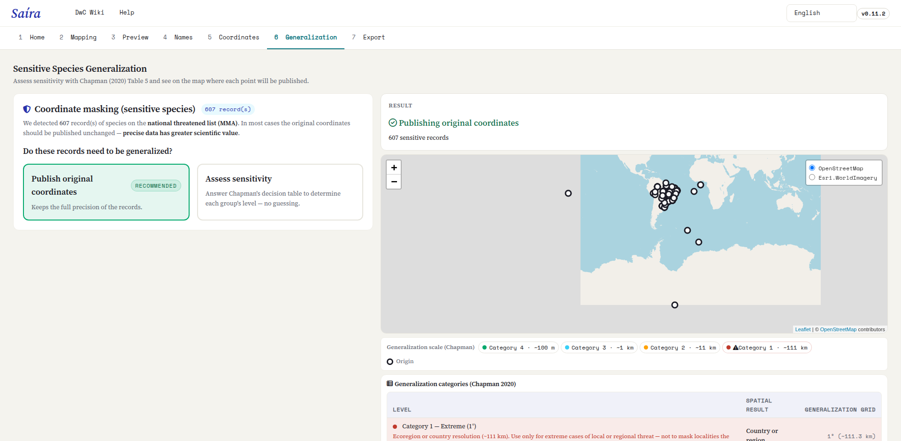
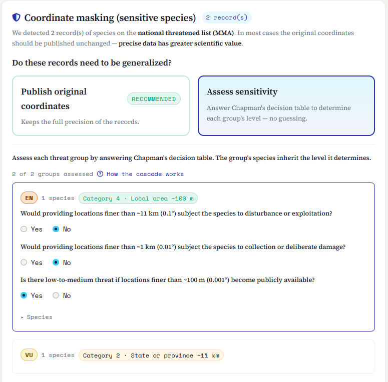
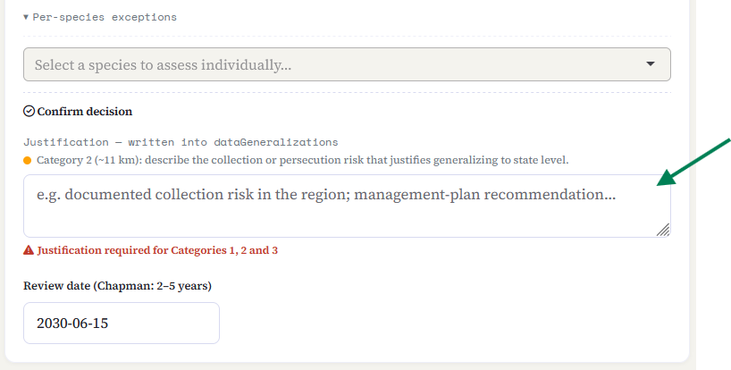
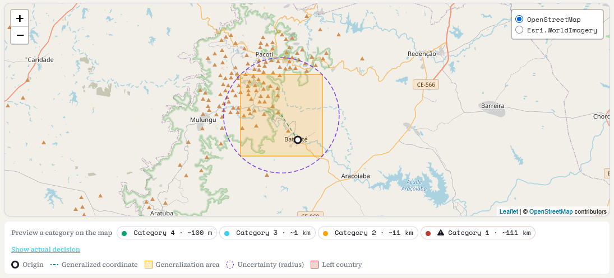

::: {.tut-standfirst}
Publicar la ubicación exacta de una especie amenazada puede exponerla a la recolección o a la persecución. En esta etapa, Saíra le ayuda a decidir, especie por especie, **si** reducir la precisión de las coordenadas antes de publicar y **cuánto**, según las buenas prácticas de GBIF descritas por Chapman (2020).
:::

## Cuándo aparece esta etapa

La pestaña **Generalización** solo tiene trabajo cuando la [validación de nombres](04-validacion-nombres.qmd) señaló registros de **especies amenazadas** (los taxones de la lista nacional del MMA, más las especies que usted marcó como sensibles a mano). Esos son los registros que llegan aquí para evaluación.

Si no se detectó ningún taxón sensible, no hay nada que generalizar: Saíra se lo indica y usted pasa directamente a la exportación, con las coordenadas publicadas como están.

```{=html}
<figure class="shot">
  
  <figcaption><b>Figura 1.</b> La pestaña Generalización lista los registros de especies amenazadas que vinieron de la validación de nombres.</figcaption>
</figure>
```

::: {.callout-important}
## Lo predeterminado es publicar la coordenada original
Los datos precisos tienen **mayor valor científico**. Generalizar es la excepción, no la regla: reduzca la precisión solo cuando hay un riesgo real de recolección, persecución o explotación. Si tiene dudas, consulte las directrices de la autoridad de conservación de su país. En Brasil, siga las de GBIF.
:::

## Dos opciones de entrada

Para el conjunto de registros sensibles, Saíra ofrece dos caminos:

- **Publicar las coordenadas originales** *(recomendado)*: mantiene la precisión completa.
- **Evaluar la sensibilidad**: abre la tabla de decisión de [Chapman (2020)](https://doi.org/10.15468/doc-5jp4-5g10) para determinar, sin adivinar, el nivel de generalización de cada grupo de amenaza.

Saíra también **detecta automáticamente** las coordenadas que ya llegaron generalizadas y **no las generaliza de nuevo**, siempre que la fuente tenga la señal: <span class="term">coordinateUncertaintyInMeters</span> de 1 km o más, o un <span class="term">dataGeneralizations</span> completado. Sin ninguna de las dos, la detección no tiene cómo saberlo, y la decisión pasa a ser suya.

::: {.callout-important}
## NO GENERALICE DOS VECES LOS DATOS DE WILDLIFE INSIGHTS
**Wildlife Insights ya oculta las coordenadas de las especies sensibles** al exportar. Si su conjunto de datos vino de allí y usted marcó esas especies como sensibles, **elija "Publicar las coordenadas originales" y NO aplique la generalización de Saíra**. Generalizar de nuevo degradaría la ubicación **DOS VECES** y perdería precisión sin necesidad y sin protección adicional.
:::

## La tabla de decisión

Al elegir **Evaluar la sensibilidad**, las especies aparecen agrupadas por **categoría de amenaza del MMA** (CR, EN, VU…), más un grupo para las especies que usted marcó a mano. Para cada grupo, responde una breve **cascada de preguntas**, de la más general a la más específica. El primer "Sí" define el nivel. Las especies de ese grupo heredan el nivel que determina.

```{=html}
<ol class="fix-steps">
  <li><strong>¿Informar ubicaciones más finas que ~11 km (0,1°) expondría la especie a perturbación o explotación?</strong>
    <p><b>Sí →</b> Categoría 2 (Alta, 0,1°). <b>No →</b> pase a la pregunta siguiente.</p></li>
  <li><strong>¿Informar ubicaciones más finas que ~1 km (0,01°) expondría la especie a recolección o daño deliberado?</strong>
    <p><b>Sí →</b> Categoría 3 (Media, 0,01°). <b>No →</b> pase a la pregunta siguiente.</p></li>
  <li><strong>¿Hay una amenaza baja o media si las ubicaciones más finas que ~100 m (0,001°) se hacen públicas?</strong>
    <p><b>Sí →</b> Categoría 4 (Baja, 0,001°). <b>No →</b> el grupo se trata como <b>no sensible</b> y sus coordenadas se publican sin enmascaramiento.</p></li>
</ol>
```

```{=html}
<figure class="shot">
  
  <figcaption><b>Figura 2.</b> La cascada de decisión de Chapman: cada "No" muestra la pregunta siguiente, más fina.</figcaption>
</figure>
```

::: {.callout-note}
## Las especies no evaluadas se publican sin generalización
Mientras un grupo no se evalúa, Saíra muestra cuántas especies siguen pendientes y avisa que **se publicarán sin generalización**. Evalúe todos los grupos antes de exportar para que ninguna especie sensible quede fuera por descuido.
:::

### Los cuatro niveles

Cada categoría corresponde a una **grilla** de generalización: la coordenada se mueve al centro de una celda de ese tamaño. Cuanto más grande es la grilla, menos precisa (y menos útil) queda la localidad.

```{=html}
<table class="maptable">
  <thead><tr><th>Nivel</th><th>Grilla de generalización</th><th>Resultado espacial</th></tr></thead>
  <tbody>
    <tr><td>Categoría 1 · Extrema</td><td>1° (~111 km)</td><td>País o región</td></tr>
    <tr><td>Categoría 2 · Alta</td><td>0,1° (~11 km)</td><td>Estado o provincia</td></tr>
    <tr><td>Categoría 3 · Media</td><td>0,01° (~1 km)</td><td>Ciudad o distrito</td></tr>
    <tr><td>Categoría 4 · Baja</td><td>0,001° (~100 m)</td><td>Área local</td></tr>
  </tbody>
</table>
```

*Niveles de generalización, según [Chapman (2020)](https://doi.org/10.15468/doc-5jp4-5g10).*

::: {.callout-note}
## La generalización nunca aumenta la precisión
Generalizar solo **reduce** la precisión, nunca la inventa. Si una coordenada ya es menos precisa que la categoría elegida, Saíra la publica con la **precisión real del dato**, sin simular 100 m, y aun así protege el registro con <span class="term">informationWithheld</span>, <span class="term">dataGeneralizations</span> y el radio de incertidumbre. Un aviso en la pestaña cuenta cuántos registros se publicaron así.
:::

## Excepciones por especie

La decisión del grupo es el punto de partida, no la palabra final. En **Excepciones por especie** puede evaluar un solo taxón (con la misma cascada) y sustituir el nivel heredado del grupo. Úselo cuando una especie del grupo merece un tratamiento diferente del resto.

**La categoría 1, Extrema (~111 km),** solo se puede asignar aquí, como excepción, con su propio botón. Es el único camino al nivel extremo, reservado para especies endémicas o de baja movilidad para las que incluso la información general de localidad es un riesgo.

::: {.callout-warning}
## La categoría 1 destruye casi todo el valor espacial
A ~111 km, el registro pierde casi toda su utilidad para el análisis espacial y el modelado de distribución. **No la use** de forma indiscriminada o sin una justificación plausible.
:::

## Justificación obligatoria

Siempre que un grupo o una especie queda en la **categoría 1, 2 o 3**, Saíra exige una **justificación** escrita (la categoría 4 y la publicación sin enmascaramiento no la exigen). El texto se escribe en el campo Darwin Core <span class="term">dataGeneralizations</span>, para que quien reutilice los datos sepa **por qué** se generalizó la coordenada.

```{=html}
<figure class="shot">
  
  <figcaption><b>Figura 3.</b> La justificación obligatoria para las categorías 1 a 3 se escribe en el campo <span class="term">dataGeneralizations</span> del registro.</figcaption>
</figure>
```

## Vista previa en el mapa

A la derecha, el mapa muestra el efecto de cada decisión antes de confirmarla: el **punto original**, la **celda generalizada** donde se publicará, el **radio de incertidumbre** correspondiente (que se escribe en <span class="term">coordinateUncertaintyInMeters</span>) y la línea que une los dos. Unos botones de simulación permiten ver cada categoría en el mapa sin aplicarla.

El color avisa de un problema común de la generalización:

- **Naranja**: la celda generalizada queda dentro del país de origen.
- **Rojo**: la celda generalizada **cruza la frontera** y el punto sale de su país de origen. En ese caso, **elija un nivel menos agresivo** (una grilla más pequeña), porque una coordenada que cambió de país es peor que una solo imprecisa.

```{=html}
<figure class="shot">
  
  <figcaption><b>Figura 4.</b> El mapa de vista previa: punto original, celda generalizada y radio de incertidumbre, con la alerta roja cuando la generalización cruza una frontera.</figcaption>
</figure>
```

::: {.callout-tip}
## Fecha de revisión
La sensibilidad cambia con el tiempo: el riesgo puede aumentar o desaparecer. Chapman recomienda **revisar la decisión cada 2 a 5 años**. Saíra ofrece un campo de fecha de revisión para registrar cuándo debe ocurrir esa nueva evaluación.
:::

## Qué va al paquete

En los registros generalizados, Saíra publica la **coordenada de la celda** (no la original), completa <span class="term">coordinateUncertaintyInMeters</span>, <span class="term">dataGeneralizations</span> e <span class="term">informationWithheld</span>, y **vacía los campos que podrían revelar la localidad exacta** (coordenadas verbatim y similares). Las **coordenadas originales y precisas** de esos registros no van al `occurrence.txt` público: quedan en un **archivo separado** dentro del mismo `.zip` (`<dataset>-sensitive-coords.csv`), bajo su control, así nunca pierde el dato preciso.

Con las decisiones tomadas, vaya a la **[exportación](07-vista-previa-exportacion.qmd)**, donde revisa todo y genera el Darwin Core Archive.

## Referencias

Las reglas de esta etapa siguen tres documentos de buenas prácticas de GBIF:

- Chapman, A. D. (2020). *Current Best Practices for Generalizing Sensitive Species Occurrence Data.* Copenhagen: GBIF Secretariat. <https://doi.org/10.15468/doc-5jp4-5g10> (tabla 5, cascada de decisión; tabla 7, grilla de generalización).
- Chapman, A. D., & Wieczorek, J. R. (2020). *Georeferencing Best Practices.* Copenhagen: GBIF Secretariat. <https://doi.org/10.15468/doc-gg7h-s853> (sec. 2.3.4, incertidumbre punto-radio).
- Zermoglio, P. F., Chapman, A. D., Wieczorek, J. R., Luna, M. C., & Bloom, D. A. (2020). *Georeferencing Quick Reference Guide.* Copenhagen: GBIF Secretariat. <https://doi.org/10.35035/e09p-h128>
