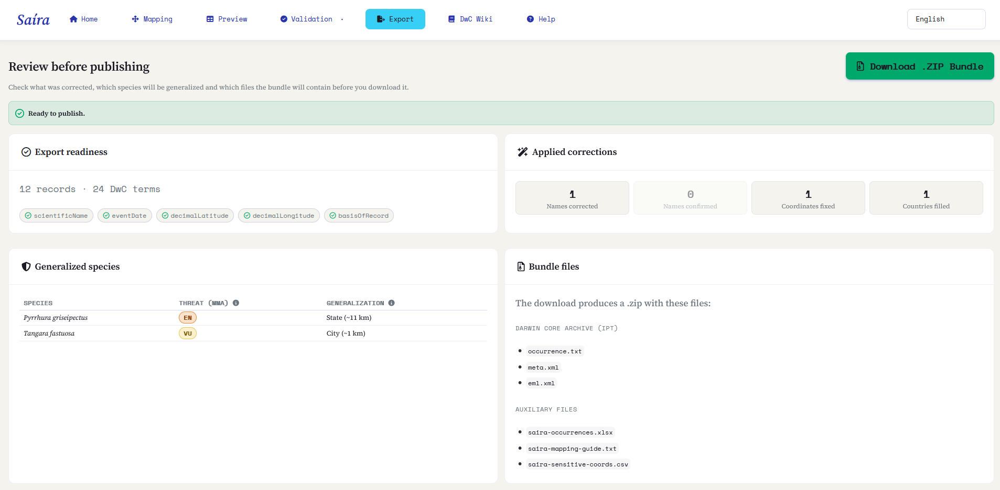
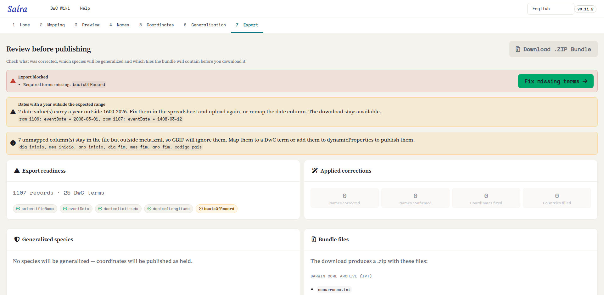

::: {.tut-standfirst}
Revise el resultado completo, lo que se corrigió y qué especies se generalizarán, y genere el Darwin Core Archive listo para publicar en SiBBr y GBIF.
:::

## Vista previa

En la pestaña **Vista previa**, Saíra muestra la tabla final ya en el vocabulario Darwin Core, con todas las correcciones aplicadas. Es el momento de una última revisión general:

- las columnas tienen los nombres Darwin Core correctos;
- los campos obligatorios están completados;
- los nombres y las coordenadas se validaron en las etapas anteriores.

```{=html}
<figure class="shot">
  <div class="frame"><span class="ph-label">captura · vista previa final</span></div>
  <figcaption><b>Figura 1.</b> Vista previa del conjunto de datos en Darwin Core, con indicadores de completitud por campo.</figcaption>
</figure>
```

## La pestaña Exportación: revise antes de publicar

Antes de descargar el paquete, la pestaña **Exportación** reúne en un solo lugar lo que se corrigió, qué especies se generalizarán y qué archivos van en el `.zip`. Revise cada bloque antes de generar el Darwin Core Archive.

```{=html}
<figure class="shot">
  
  <figcaption><b>Figura 2.</b> El centro de revisión de la exportación, con la preparación, las correcciones aplicadas, las especies generalizadas y los archivos del paquete.</figcaption>
</figure>
```

### Preparación para exportar

Arriba, un indicador dice si el conjunto de datos está **listo para publicar** (verde) o si la **exportación está bloqueada** (rojo). Cuando se bloquea, Saíra lista lo que falta (normalmente **términos obligatorios** sin completar o **especies generalizadas sin la justificación** que exigen las categorías 1 a 3) y ofrece un atajo para resolver el pendiente.

```{=html}
<figure class="shot">
  
  <figcaption><b>Figura 3.</b> El indicador de bloqueo: Saíra lista los campos obligatorios que faltan o las justificaciones pendientes y ofrece atajos directos para resolver cada uno.</figcaption>
</figure>
```

::: {.callout-warning}
## Sin occurrenceID mapeado
Si no mapeó un <span class="term">occurrenceID</span>, Saíra le avisa: el IPT/GBIF generan entonces identificadores inestables en cada publicación. La exportación funciona igual, y los identificadores que genera Saíra se derivan del contenido de la fila, así cargar de nuevo la misma hoja de cálculo los reproduce. Aun así, se recomienda **mapear la columna que ya tiene sus identificadores**: Saíra mantiene los que usted tiene y completa solo las filas vacías.
:::

### Correcciones aplicadas

Un resumen muestra todo lo que ajustaron las etapas anteriores, para revisarlo de un vistazo antes de publicar:

- **Nombres corregidos** y **nombres confirmados** en la [validación de nombres](04-validacion-nombres.qmd);
- **Coordenadas corregidas** (transposiciones, intercambio de lat/lon, completado combinado) y **países completados** en la [validación de coordenadas](05-validacion-coordenadas.qmd).

### Especies generalizadas

Si generalizó algún taxón en la etapa de [generalización](06-generalizacion.qmd), una tabla lista cada **especie**, su **amenaza (MMA)** y el **nivel de generalización** que irá al paquete, en los mismos cuatro niveles descritos en [Generalización de especies sensibles](06-generalizacion.qmd).

Si no se generalizó nada, Saíra lo registra: *ninguna especie se generalizará; las coordenadas se publicarán como están*.

## Qué ajusta Saíra al exportar

Al generar el paquete, Saíra estandariza automáticamente el conjunto de datos para que cumpla con lo que esperan los repositorios:

- **Fechas** convertidas al formato ISO (`AAAA-MM-DD`), sin importar el separador que usó la hoja de cálculo. Una fecha sin día sale como `AAAA-MM`, y una fecha con hora como `AAAA-MM-DDThh:mm`. Si el año está fuera del intervalo entre 1600 y el año actual, Saíra avisa e indica las filas: el error es de tipeo y solo usted sabe cuál debería ser la fecha. El aviso no bloquea la exportación.
- **Coordenadas** con el separador decimal normalizado (la coma se convierte en punto).
- **occurrenceID** derivado del contenido de la fila cuando falta, para garantizar un identificador único y estable por registro.
- **Licencias** abreviadas a la URL canónica (por ejemplo, la URL de Creative Commons correspondiente).
- **Columnas reordenadas** en la secuencia canónica de Darwin Core, con las columnas sin mapear agregadas a la derecha, con sus nombres originales.

### Estado de conservación en `dynamicProperties`

Para cada taxón evaluado, Saíra escribe su estado de conservación en `dynamicProperties` como claves JSON, según las bases que usted eligió en la [validación de nombres](04-validacion-nombres.qmd):

- una base **brasileña** (Flora BR / Fauna BR) → `mmaThreatStatus` (categoría) y `mmaSource` (ordenanza);
- **GBIF** → `iucnRedListCategory` (código global de la UICN, consultado en vivo).

Las dos pueden aparecer juntas y se combinan con lo que usted mismo mapeó:

```json
{"mmaThreatStatus":"CR","mmaSource":"Portaria 1.704/2026","iucnRedListCategory":"NT"}
```

La consulta a GBIF es de mejor esfuerzo: sin internet o sin evaluación, la clave de la UICN se omite y la exportación continúa.

::: {.callout-warning}
## El estado del MMA es nacional
La categoría del MMA viene de la lista roja de Brasil, por eso Saíra la escribe solo en los registros cuyo `country` (o `countryCode`) corresponde a Brasil. En un conjunto de datos de varios países, la misma especie recibe las claves del MMA en la fila brasileña y no en la extranjera. Un registro sin país también queda sin las claves: mapee `country`, o use el completado a partir de las coordenadas en la [validación de coordenadas](05-validacion-coordenadas.qmd). `iucnRedListCategory` es global y no depende de esto.
:::

## Archivos del paquete

La descarga genera un `.zip` (`<dataset>-dwc-archive.zip`) con dos conjuntos de archivos.

El **Darwin Core Archive**, lo que usted envía al repositorio:

```{=html}
<table class="maptable">
  <thead><tr><th>Archivo</th><th>Qué es</th></tr></thead>
  <tbody>
    <tr><td>occurrence.txt</td><td>Los datos: el núcleo del Darwin Core Archive.</td></tr>
    <tr><td>meta.xml</td><td>El descriptor que indica qué significa cada columna.</td></tr>
    <tr><td>eml.xml</td><td>Los metadatos del conjunto (título, institución, licencia).</td></tr>
  </tbody>
</table>
```

Y los **archivos auxiliares**, para su propio control, fuera del paquete público:

```{=html}
<table class="maptable">
  <thead><tr><th>Archivo</th><th>Qué es</th></tr></thead>
  <tbody>
    <tr><td>&lt;dataset&gt;-occurrences.xlsx</td><td>Una copia en Excel, con todas las celdas forzadas a texto.</td></tr>
    <tr><td>&lt;dataset&gt;-mapping-guide.txt</td><td>La plantilla "su columna → término Darwin Core", para reutilizar.</td></tr>
    <tr><td>&lt;dataset&gt;-sensitive-coords.csv</td><td>Las coordenadas reales y precisas de los registros generalizados. Solo existe cuando hay generalización. Usted lo guarda, pero no lo publica.</td></tr>
  </tbody>
</table>
```

## Generación del Darwin Core Archive

Los metadatos (`eml.xml`) se arman **automáticamente**: Saíra usa un título predeterminado, calcula el recuadro geográfico y el intervalo de fechas a partir de sus datos, y aplica la licencia CC0 de forma predeterminada, sin nada que usted deba completar. El ajuste fino de los metadatos (institución, responsables, licencia final) ocurre después, en el IPT, al publicar.

```{=html}
<ol class="fix-steps">
  <li><strong>Genere el archivo.</strong>
    <p>Saíra arma el paquete <span class="term">.zip</span> con <span class="term">occurrence.txt</span>, <span class="term">meta.xml</span> y <span class="term">eml.xml</span>.</p></li>
  <li><strong>Descargue y publique.</strong>
    <p>Descargue el Darwin Core Archive y envíelo a su IPT (SiBBr/GBIF) para publicarlo.</p></li>
</ol>
```

## Publicación en SiBBr y GBIF

Con el `.zip` en mano, la publicación ocurre fuera de Saíra, normalmente con el **IPT** (Integrated Publishing Toolkit) de su institución o de SiBBr. El archivo que genera Saíra ya está en el formato esperado: basta con cargarlo, revisar el mapeo en el IPT y publicar.

Vuelva a la **[visión general de los tutoriales](index.qmd)** o a la **[página de inicio](../index.qmd)**.
