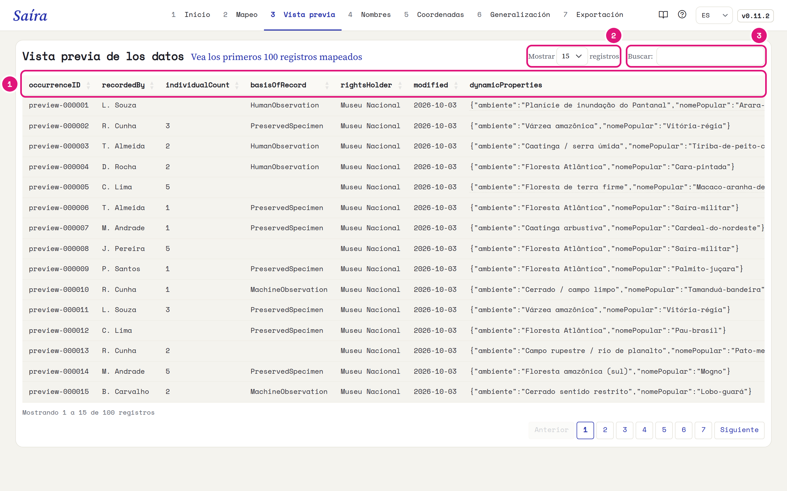
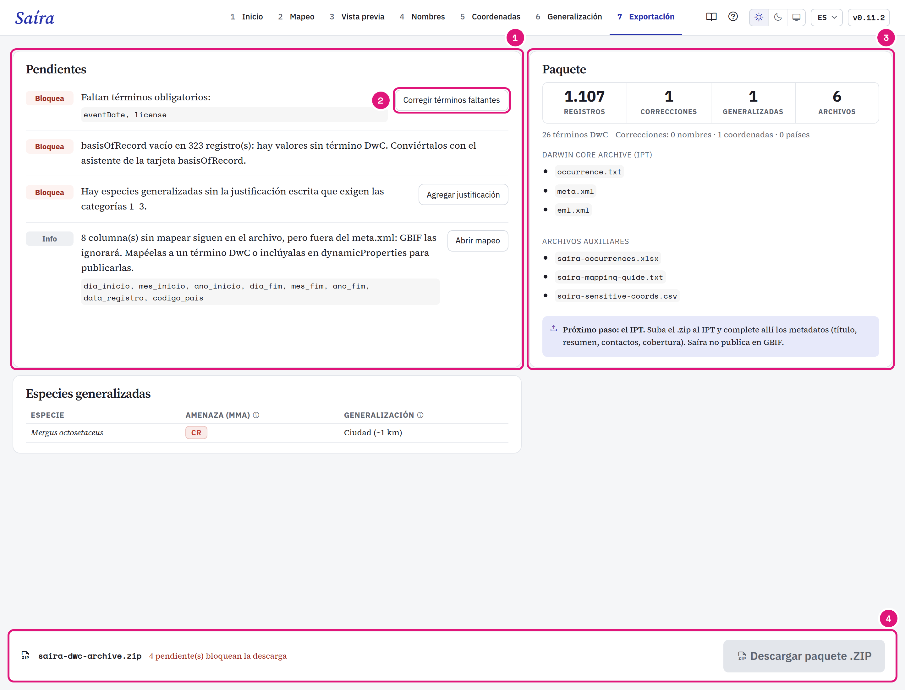

::: {.tut-standfirst}
Revise los datos en Darwin Core y descargue el Darwin Core Archive en la etapa **Exportación**.
:::

## Revise la vista previa

```{=html}
<figure class="shot"></figure>
```

::: {.marks}
1. Las columnas ya tienen los nombres Darwin Core.
2. Elija cuántas filas ver. La vista previa muestra los primeros 100 registros.
3. Busque un valor en cualquier columna.
:::

## Resuelva los pendientes

```{=html}
<figure class="shot"></figure>
```

::: {.marks}
1. **Bloquea** impide la descarga. **Info** solo avisa.
2. Cada pendiente tiene un botón que lleva a la etapa que lo resuelve.
3. El paquete: registros, correcciones, especies generalizadas y archivos.
4. La descarga se libera cuando no queda ningún pendiente que bloquea.
:::

| Pendiente | Dónde resolverlo |
|---|---|
| Término obligatorio faltante, como <span class="term">eventDate</span> o <span class="term">license</span> | [Mapeo](03-mapeo-dwc.qmd) |
| <span class="term">basisOfRecord</span> sin término DwC | [Asistente basisOfRecord](03-mapeo-dwc.qmd#defina-el-basisofrecord) |
| Generalización sin justificación | [Generalización](06-generalizacion.qmd#trate-una-especie-aparte) |
| Columna sin mapear (Info) | GBIF ignora la columna. Mapéela a un término o inclúyala en <span class="term">dynamicProperties</span>. |

::: {.callout-warning}
## Mapee el occurrenceID
Sin <span class="term">occurrenceID</span>, Saíra crea un identificador a partir del contenido de la fila. Si usted cambia la fila, el identificador cambia. Mapee la columna con sus identificadores. Saíra solo completa las filas vacías.
:::

## Qué ajusta Saíra

- **Fechas** en ISO 8601: `AAAA-MM-DD`, `AAAA-MM` sin día, `AAAA-MM-DDThh:mm` con hora. Un año antes de 1600 o después del año actual genera un aviso, sin bloquear.
- **Coordenadas** con punto decimal.
- **Licencia** con el nombre corto (`CC-BY`) en el `occurrence.txt` y la URL en el `eml.xml`.
- **Columnas** en el orden de Darwin Core. Las columnas sin mapear quedan al final, con el nombre original.

### Estado de conservación en `dynamicProperties`

Saíra graba el estado de conservación según las bases de la [validación de nombres](04-validacion-nombres.qmd):

- Flora BR o Fauna BR → `mmaThreatStatus` y `mmaSource`;
- GBIF → `iucnRedListCategory`, consultado en la exportación.

```json
{"mmaThreatStatus":"CR","mmaSource":"Portaria 1.704/2026","iucnRedListCategory":"NT"}
```

Sin internet, la clave UICN queda fuera y la exportación continúa. Las claves MMA entran solo en registros de Brasil, por <span class="term">country</span> o <span class="term">countryCode</span>. Un registro sin país queda sin las claves MMA.

## Archivos del paquete

El `.zip` (`<dataset>-dwc-archive.zip`) tiene el Darwin Core Archive y los archivos auxiliares.

| Archivo | Uso |
|---|---|
| `occurrence.txt` | Los datos. Va al IPT. |
| `meta.xml` | Indica el término de cada columna. Va al IPT. |
| `eml.xml` | Metadatos: título, extensión geográfica, período y licencia. Va al IPT. |
| `<dataset>-occurrences.xlsx` | Copia en Excel, con todas las celdas como texto. |
| `<dataset>-mapping-guide.txt` | El mapeo, para [reutilizar](03-mapeo-dwc.qmd#reutilice-el-mapeo). |
| `<dataset>-sensitive-coords.csv` | Coordenadas originales de los registros generalizados. Guárdelo, no lo publique. |

## Publique por el IPT

Saíra no publica en GBIF. Envíe el `.zip` al IPT de su institución o del SiBBr. En el IPT, complete los metadatos (resumen, contactos, cobertura) y publique.
