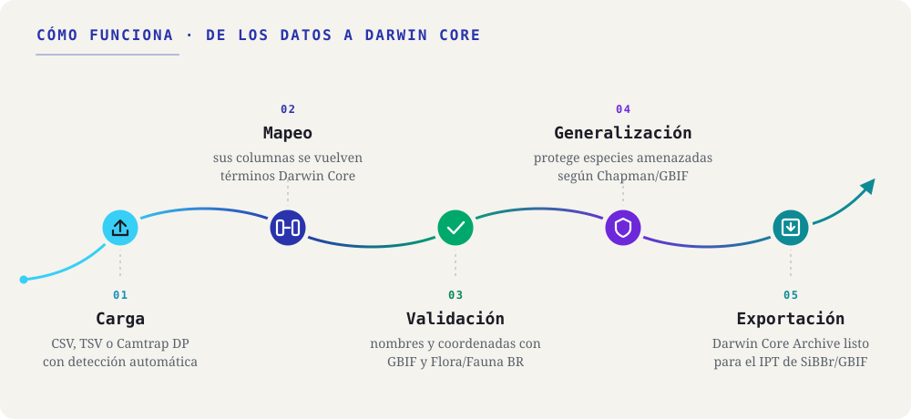

::: {.tut-standfirst}
Guías paso a paso para llevar su hoja de cálculo de ocurrencias de la libreta de campo a un Darwin Core Archive, siguiendo el flujo de la aplicación.
:::

```{=html}
<figure class="shot diagram-flow">
  
</figure>
```

El diagrama muestra las cinco etapas de trabajo de la aplicación. Los tutoriales de abajo son siete porque la instalación viene antes de todo y la validación se divide en nombres y coordenadas. Muévase entre ellos con la **barra lateral** o con los botones **anterior / siguiente** al final de cada página. Cada etapa también se puede leer por separado.

## El flujo, del dato bruto al DwC-A

```{=html}
<div class="tut-grid">
  <a class="tut-card" href="01-instalacion.html">
    <div class="tut-card-top"><span class="tut-card-num">01</span><span class="tut-card-eyebrow">Etapa</span></div>
    <h3 class="tut-card-title">Instalación y primeros pasos</h3>
    <p class="tut-card-desc">Instale Saíra desde GitHub y abra la aplicación en el navegador.</p>
    <span class="tut-card-arrow">→</span>
  </a>
  <a class="tut-card" href="02-carga.html">
    <div class="tut-card-top"><span class="tut-card-num">02</span><span class="tut-card-eyebrow">Etapa</span></div>
    <h3 class="tut-card-title">Carga de sus datos</h3>
    <p class="tut-card-desc">Cargue CSV, TSV/TXT o un paquete de cámaras trampa.</p>
    <span class="tut-card-arrow">→</span>
  </a>
  <a class="tut-card" href="03-mapeo-dwc.html">
    <div class="tut-card-top"><span class="tut-card-num">03</span><span class="tut-card-eyebrow">Etapa</span></div>
    <h3 class="tut-card-title">Mapeo de campos a Darwin Core</h3>
    <p class="tut-card-desc">Relacione cada columna con un término Darwin Core, con sugerencias automáticas.</p>
    <span class="tut-card-arrow">→</span>
  </a>
  <a class="tut-card" href="04-validacion-nombres.html">
    <div class="tut-card-top"><span class="tut-card-num">04</span><span class="tut-card-eyebrow">Etapa</span></div>
    <h3 class="tut-card-title">Validación de nombres científicos</h3>
    <p class="tut-card-desc">Verifique la nomenclatura, resuelva sinónimos y vea los taxones amenazados.</p>
    <span class="tut-card-arrow">→</span>
  </a>
  <a class="tut-card" href="05-validacion-coordenadas.html">
    <div class="tut-card-top"><span class="tut-card-num">05</span><span class="tut-card-eyebrow">Etapa</span></div>
    <h3 class="tut-card-title">Validación de coordenadas</h3>
    <p class="tut-card-desc">Encuentre coordenadas ausentes, invertidas o transpuestas y revíselas en el mapa.</p>
    <span class="tut-card-arrow">→</span>
  </a>
  <a class="tut-card" href="06-generalizacion.html">
    <div class="tut-card-top"><span class="tut-card-num">06</span><span class="tut-card-eyebrow">Si aplica</span></div>
    <h3 class="tut-card-title">Generalización de especies sensibles</h3>
    <p class="tut-card-desc">Solo cuando la validación de nombres señala especies amenazadas: reduzca la precisión de las coordenadas (Chapman 2020).</p>
    <span class="tut-card-arrow">→</span>
  </a>
  <a class="tut-card" href="07-vista-previa-exportacion.html">
    <div class="tut-card-top"><span class="tut-card-num">07</span><span class="tut-card-eyebrow">Etapa</span></div>
    <h3 class="tut-card-title">Vista previa y exportación</h3>
    <p class="tut-card-desc">Revise el resultado y las correcciones y genere el Darwin Core Archive.</p>
    <span class="tut-card-arrow">→</span>
  </a>
</div>
```

::: {.callout-note}
## El flujo es flexible
No necesita seguir las etapas en una secuencia rígida: puede volver a cualquier etapa (mapear de nuevo un campo, cargar de nuevo la hoja de cálculo o validar de nuevo) sin perder el trabajo ya hecho.
:::

::: {.callout-tip}
## Practique con el archivo de ejemplo
Descargue [`ocorrencias-demo.csv`](../../assets/exemplo/ocorrencias-demo.csv) y siga los tutoriales con él. Las imperfecciones deliberadas de la hoja de cálculo se describen en [Carga de sus datos](02-carga.qmd).
:::
