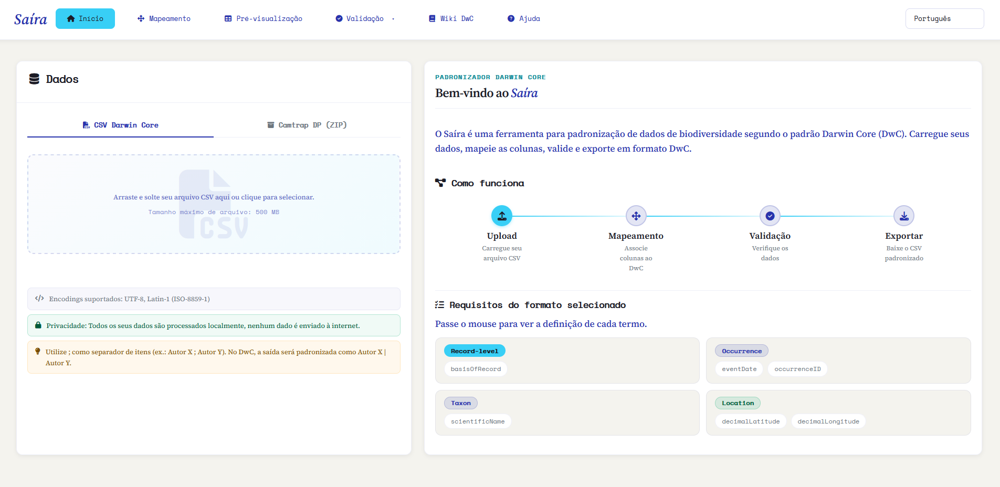

::: {.tut-standfirst}
O Saíra é um pacote R que abre uma interface visual no seu navegador. Esta página mostra como instalá-lo, iniciar o aplicativo pela primeira vez e o que esperar do primeiro uso.
:::

## Pré-requisitos

Você precisa do **R** instalado (versão 4.1 ou superior), baixado direto do [CRAN](https://cran.r-project.org/). O [RStudio](https://posit.co/download/rstudio-desktop) é recomendado, mas não é obrigatório: qualquer console R serve. Não é necessário saber programar. Depois de instalado, todo o uso acontece pela interface gráfica.

Como o Saíra consulta bases taxonômicas e desenha mapas, alguns pacotes de apoio (espaciais e de leitura de planilhas) são instalados junto. Em Linux, esses pacotes podem exigir bibliotecas de sistema como `GDAL`, `GEOS` e `PROJ`; em Windows e macOS elas vêm nos binários.

## Instalando o R

Baixe o R no site oficial do **[CRAN](https://cran.r-project.org/)**. Os passos abaixo são para Windows; no macOS escolha "Download R for macOS" e siga o instalador.

```{=html}
<figure class="shot">
  
  <figcaption><b>Figura 1.</b> Na página do CRAN, escolha <b>Download R for Windows</b> (ou macOS, conforme seu sistema).</figcaption>
</figure>
<figure class="shot">
  
  <figcaption><b>Figura 2.</b> Clique em <b>base</b> — é a distribuição que se instala da primeira vez.</figcaption>
</figure>
<figure class="shot">
  
  <figcaption><b>Figura 3.</b> Baixe o instalador (<b>Download R-4.x.x for Windows</b>) e execute com as opções padrão.</figcaption>
</figure>
```

## Instalando o RStudio

O **[RStudio Desktop](https://posit.co/download/rstudio-desktop)** é opcional, mas deixa o uso mais confortável. Baixe a versão para o seu sistema e instale com as opções padrão.

```{=html}
<figure class="shot">
  
  <figcaption><b>Figura 4.</b> No site da Posit, baixe o <b>RStudio Desktop</b> e instale.</figcaption>
</figure>
```

## Windows: instale o Rtools

Como o Saíra **não está no CRAN**, ele é instalado a partir do código-fonte (próxima seção). No **Windows**, compilar pacotes a partir do código exige o **Rtools**. Instale a versão de Rtools que corresponde à sua versão do R antes de instalar o Saíra. (No macOS e no Linux esse passo normalmente não é necessário.)

```{=html}
<figure class="shot">
  
  <figcaption><b>Figura 5.</b> Na mesma página do R para Windows, abra <b>Rtools</b>.</figcaption>
</figure>
<figure class="shot">
  
  <figcaption><b>Figura 6.</b> Escolha a versão compatível com o seu R (ex.: <b>RTools 4.5</b> para R 4.5 ou superior).</figcaption>
</figure>
<figure class="shot">
  
  <figcaption><b>Figura 7.</b> Baixe o <b>instalador do Rtools</b> e execute com as opções padrão.</figcaption>
</figure>
```

## Instalando o Saíra

Agora que o R (e, se quiser, o RStudio) já estão instalados, vamos instalar o Saíra. Como ele ainda não está no CRAN, a instalação é feita direto do repositório no GitHub com o `pak`, que resolve todas as dependências automaticamente. Abra o R (ou o RStudio) e rode:

```r
install.packages("pak")
pak::pak("rogerio-onza/saira")
```

::: {.callout-tip}
## Primeira instalação demora um pouco
O Saíra depende de vários pacotes (Shiny, leitura de planilhas, bases taxonômicas e geográficas). A primeira instalação pode levar alguns minutos enquanto essas dependências são baixadas e compiladas. As instalações seguintes são rápidas.
:::

## Abrindo o aplicativo

Com o pacote instalado, uma única linha abre a interface no navegador:

```r
library(saira)
saira::run_app()
```

O app abre em uma nova aba. A partir daí, tudo é feito por menus, botões e tabelas. Para encerrar, feche a aba e interrompa a sessão R (`Esc` no console ou o botão de parada do RStudio).

::: {.callout-warning}
## A janela não abriu?
Em servidores ou ambientes sem navegador padrão, o `run_app()` imprime um endereço local (algo como `http://127.0.0.1:xxxx`). Copie esse endereço e abra manualmente no navegador. Para servir a outros computadores da rede, rode `saira::run_app(options = list(host = "0.0.0.0", port = 3838))`.
:::

```{=html}
<figure class="shot">
  
  <figcaption><b>Figura 8.</b> Tela de boas-vindas do Saíra, com o seletor de idioma (PT-BR/EN) e o início do fluxo de importação.</figcaption>
</figure>
```

## Idioma

O Saíra é bilíngue. No canto superior da interface você alterna entre **Português (PT-BR)** e **Inglês (EN-US)** a qualquer momento, útil para equipes mistas ou para publicar metadados em inglês. A troca é imediata e não interrompe o trabalho em andamento.

## Tamanho de arquivo e desempenho

O app aceita uploads de até **500 MB**, suficiente para conjuntos com centenas de milhares de ocorrências. Conjuntos muito grandes deixam a validação de nomes e o mapa mais lentos, porque cada nome é consultado nas bases e cada ponto é desenhado. Se for só treinar o fluxo, comece com a planilha de exemplo.

## Atualizando

Para atualizar o Saíra mais tarde, rode novamente o comando de instalação (`pak::pak("rogerio-onza/saira")`). Ele baixa a versão mais recente do repositório.

## Próximos passos

Com o app aberto, siga para **[Importando seus dados](02-upload.qmd)** e carregue sua primeira planilha.
