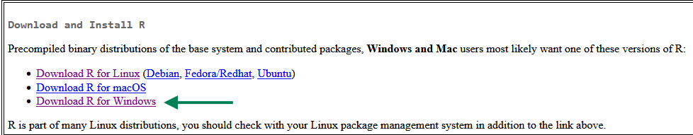
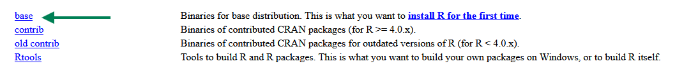
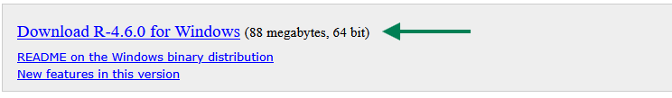
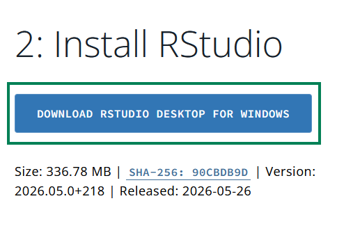
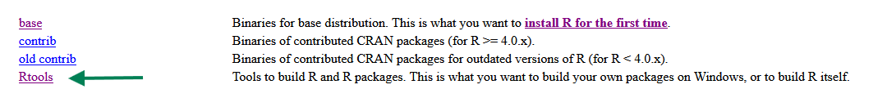
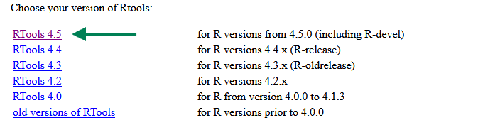
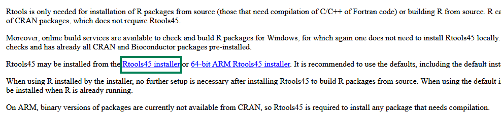

::: {.tut-standfirst}
Instale o R, o Saíra e abra o app no navegador. Você não precisa saber programar.
:::

## Instale o R

Precisa do R 4.1 ou superior. Baixe no **[CRAN](https://cran.r-project.org/)**. Os passos abaixo são para Windows. No macOS, escolha **Download R for macOS**.

```{=html}
<figure class="shot"></figure>
<figure class="shot"></figure>
<figure class="shot"></figure>
```

1. Clique em **Download R for Windows**.
2. Clique em **base**.
3. Baixe o instalador e execute com as opções padrão.

## Instale o RStudio (opcional)

O **[RStudio Desktop](https://posit.co/download/rstudio-desktop)** deixa o uso mais confortável. Qualquer console R também serve.

```{=html}
<figure class="shot"></figure>
```

## Windows: instale o Rtools

O Saíra não está no CRAN. No Windows, a instalação a partir do GitHub precisa do **Rtools** da mesma versão do R. No macOS e no Linux, pule este passo.

```{=html}
<figure class="shot"></figure>
<figure class="shot"></figure>
<figure class="shot"></figure>
```

1. Na página do R para Windows, abra **Rtools**.
2. Escolha a versão do seu R, por exemplo **RTools 4.5** para R 4.5.
3. Baixe o instalador e execute com as opções padrão.

No Linux, os pacotes espaciais precisam das bibliotecas de sistema `GDAL`, `GEOS` e `PROJ`.

## Instale o Saíra

No R ou no RStudio, rode:

```r
install.packages("pak")
pak::pak("rogerio-onza/saira")
```

A primeira instalação baixa e compila as dependências. Ela pode levar alguns minutos.

## Abra o app

```r
saira::run_app()
```

O app abre numa aba do navegador. Para encerrar, feche a aba e pare a sessão R (`Esc` no console ou o botão de parada do RStudio).

::: {.callout-warning}
## A aba não abriu?
O `run_app()` mostra um endereço como `http://127.0.0.1:xxxx`. Abra esse endereço no navegador. Para servir a outros computadores da rede, rode `saira::run_app(options = list(host = "0.0.0.0", port = 3838))`.
:::

O seletor no canto superior troca o idioma entre PT, EN e ES a qualquer momento, sem perder o trabalho. O app aceita arquivos de até 500 MB.

## Atualize

Feche o app e rode de novo:

```r
pak::pak("rogerio-onza/saira")
```

Para ver a versão instalada, rode `packageVersion("saira")`.
