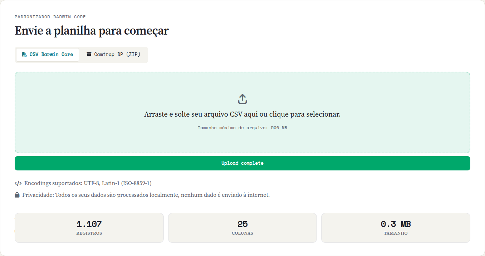

::: {.tut-standfirst}
O primeiro passo dentro do aplicativo é carregar sua planilha de ocorrências. O Saíra aceita CSV (e as variantes TSV/TXT) e pacotes de armadilha fotográfica, e cuida da detecção de codificação e separador para você.
:::

## Formatos aceitos

| Formato | Extensão | Observações |
|---|---|---|
| Texto separado | `.csv`, `.tsv`, `.txt` | Vírgula, ponto-e-vírgula ou tabulação, detectados automaticamente |
| Armadilha fotográfica | `.zip` | Camtrap DP (com ou sem descritor) e exportações do Wildlife Insights (ver abaixo) |

Cada **linha** deve ser uma ocorrência (um registro de um organismo em um lugar e momento) e cada **coluna**, um atributo: número de tombo, espécie, data, localidade, coletor, e assim por diante.

## Carregando o arquivo

::: {.callout-tip}
## Baixe a planilha de exemplo
Para praticar esta e as próximas etapas, baixe [`ocorrencias-exemplo.csv`](../assets/exemplo/ocorrencias-exemplo.csv), um conjunto de exemplo propositalmente imperfeito (várias colunas para mapear, uma coordenada invertida e um país em branco para corrigir na validação).
:::

Na aba **Upload**, arraste o arquivo para a área indicada ou clique para selecioná-lo.

```{=html}
<ol class="fix-steps">
  <li><strong>Selecione o arquivo.</strong>
    <p>Solte o CSV ou o pacote de armadilha fotográfica na área de upload (ou clique para escolher).</p></li>
  <li><strong>Aguarde a leitura.</strong>
    <p>O Saíra detecta a codificação e o separador automaticamente e exibe um resumo do arquivo: número de linhas, número de colunas e tamanho.</p></li>
  <li><strong>Confira o resumo.</strong>
    <p>Verifique se a contagem de linhas e colunas bate com o esperado. O conteúdo célula a célula você confere nas etapas de Mapeamento e na aba Pré-visualização.</p></li>
</ol>
```

```{=html}
<figure class="shot">
  
  <figcaption><b>Figura 1.</b> Área de upload com o resumo do arquivo (linhas, colunas e tamanho) após o carregamento.</figcaption>
</figure>
```

## Detecção automática de codificação e separador

Ao receber um CSV, o Saíra tenta adivinhar a **codificação** (UTF-8, Latin-1/ISO-8859-1, Windows-1252) e o **separador** de colunas, e remove a marca de ordem de bytes (BOM) que alguns programas adicionam no começo do arquivo. Quase sempre acerta; confira no resumo se a contagem de colunas faz sentido e veja o conteúdo nas etapas de Mapeamento e Pré-visualização. Datas em formatos variados (`03/11/2024`, `2024-11-03`, `Nov 3 2024`) são reconhecidas e padronizadas depois, na exportação.

::: {.callout-tip}
## Acentos aparecendo errados?
Isso quase sempre é codificação. Planilhas brasileiras costumam estar em **UTF-8** ou **Latin-1 (ISO-8859-1)**. Se, em vez de `São Paulo`, aparece `São Paulo` ou `S?o Paulo`, é a codificação. O Saíra tenta detectar sozinho; se ainda sair errado, re-salve o arquivo como **UTF-8** antes de subir (no Excel: *Salvar como → CSV UTF-8*).
:::

::: {.callout-warning}
## A planilha abriu tudo numa coluna só?
É o separador errado. Arquivos brasileiros costumam usar **ponto-e-vírgula (`;`)** porque a vírgula já é o separador decimal. O Saíra detecta o separador sozinho; se o resumo mostrar só uma coluna, salve o arquivo com um separador consistente (`;` ou `,`) ou exporte como **CSV UTF-8** e suba de novo.
:::

::: {.callout-important}
## Cabeçalho na primeira linha
O Saíra assume que a **primeira linha** contém os nomes das colunas. Remova linhas de título, logotipos ou células mescladas antes de exportar do Excel: elas atrapalham a leitura.
:::

## Dados de armadilha fotográfica

Se seus dados vêm de armadilhas fotográficas (camera trap), o Saíra reconhece três formatos e os converte em uma tabela de ocorrências antes do mapeamento:

- **Camtrap DP** (Camera Trap Data Package): o pacote `.zip` padronizado, com o descritor `datapackage.json` e as tabelas `deployments`, `observations` e (opcionalmente) `media`.
- **CSVs de Camtrap DP soltos**: o mesmo conjunto de tabelas (`deployments.csv` + `observations.csv`, com `media.csv` opcional) num `.zip`, mas **sem o descritor**: o Saíra sintetiza um `datapackage.json` a partir dos CSVs encontrados.
- **Wildlife Insights**: a exportação da plataforma (`deployments.csv` + `projects.csv` + imagens), em que o Saíra renomeia as colunas para o formato Camtrap DP e deriva o nome científico (a partir de classe, ordem, família, gênero e espécie), a data/hora do registro e o tipo de observação.

Em ambos os casos o Saíra monta um nome científico consistente e organiza os campos de tempo e local, para que o restante do fluxo (mapeamento, nomes, coordenadas) funcione igual ao de uma planilha comum.

::: {.callout-note}
## Pacote camtrap incompleto?
Se faltar o descritor do pacote, o Saíra tenta **sintetizar** um a partir dos CSVs encontrados. Ainda assim, confira no resumo e nas próximas etapas se as colunas de espécie, data e coordenada vieram preenchidas antes de prosseguir.
:::

## Próximos passos

Com os dados carregados e exibidos corretamente, avance para **[Mapeando campos para Darwin Core](03-mapeamento-dwc.qmd)**.
