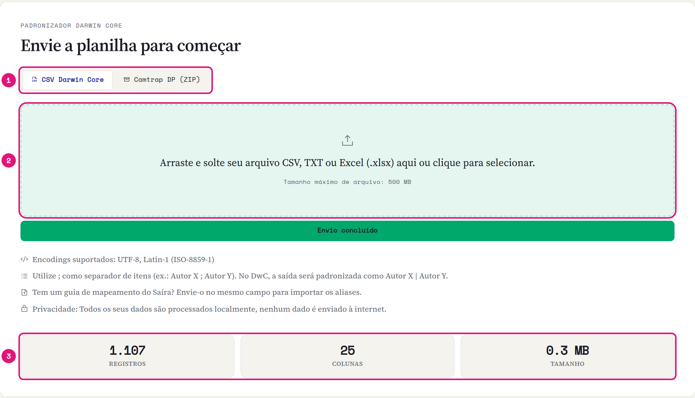

::: {.tut-standfirst}
Carregue a planilha de ocorrências na etapa **Início**.
:::

## Envie o arquivo

```{=html}
<figure class="shot"></figure>
```

::: {.marks}
1. Escolha o formato: **Planilha** para CSV, XLSX ou TXT, **Camtrap DP** para o ZIP de armadilha fotográfica.
2. Arraste o arquivo para a área de envio, ou clique nela.
3. Confira o resumo: registros, colunas e tamanho.
:::

| Formato | Arquivos |
|---|---|
| Planilha | `.csv`, `.tsv`, `.txt`, `.xlsx` (só a primeira aba) |
| Armadilha fotográfica | `.zip` Camtrap DP ou exportação do Wildlife Insights |

Cada linha é uma ocorrência. Cada coluna é um atributo. A primeira linha precisa ter os nomes das colunas.

::: {.callout-tip}
## Planilha de exemplo
[`ocorrencias-demo.csv`](../assets/exemplo/ocorrencias-demo.csv) tem 1.107 ocorrências com erros de propósito: datas misturadas, tombos repetidos, coordenadas trocadas, espécies ameaçadas e invasoras. Os tutoriais usam esse arquivo.
:::

## Se a leitura sair errada

O Saíra detecta a codificação (UTF-8, Latin-1, Windows-1252) e o separador (vírgula, ponto e vírgula, tabulação). Se o resumo ou os dados parecerem errados:

| Sintoma | Causa | Solução |
|---|---|---|
| `São Paulo` ou `S?o Paulo` | Codificação | No Excel, salve como **CSV UTF-8** e envie de novo. |
| Uma coluna só no resumo | Separador misturado | Salve com um separador só, `;` ou `,`. |
| Nomes de coluna estranhos | Linhas acima do cabeçalho | Apague títulos, logos e células mescladas acima do cabeçalho. |

## Armadilha fotográfica

Na aba **Camtrap DP**, o Saíra aceita três tipos de `.zip`:

- **Camtrap DP** com o descritor `datapackage.json` e as tabelas `deployments`, `observations` e, se houver, `media`.
- As mesmas tabelas **sem o descritor**. O Saíra cria o descritor a partir dos CSVs.
- A **exportação do Wildlife Insights**. O Saíra renomeia as colunas para o formato Camtrap DP.

O Saíra junta as tabelas numa planilha só, com nome científico, data e local. Depois o fluxo é igual ao de uma planilha.

Dados do Wildlife Insights já vêm com as espécies sensíveis protegidas. Veja a [generalização](06-generalizacao.qmd).

## Guia de mapeamento

Se você já tem o `<dataset>-mapping-guide.txt` de uma exportação anterior, envie o guia na mesma área. O Saíra importa o mapeamento. Veja [Reaproveite o mapeamento](03-mapeamento-dwc.qmd#reaproveite-o-mapeamento).
