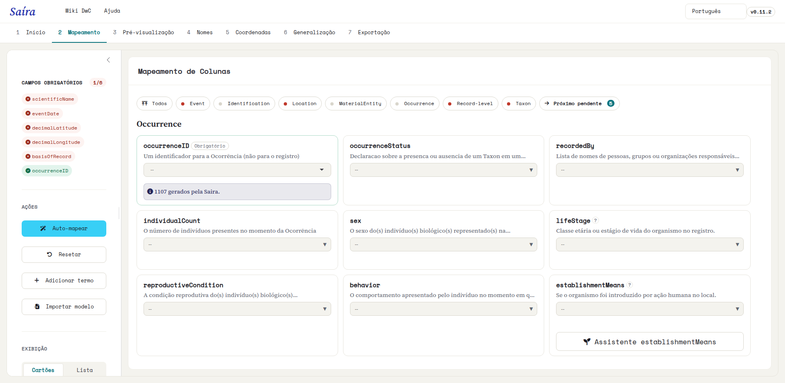
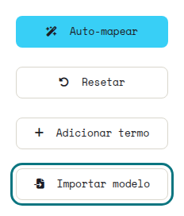
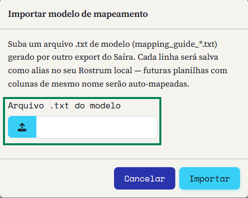
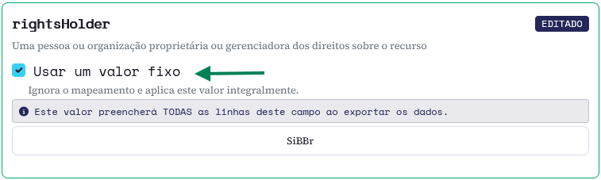

::: {.tut-standfirst}
Como associar as colunas da sua planilha aos termos do padrão Darwin Core usando o mapeador visual do Saíra: a etapa que transforma dados locais em registros interoperáveis.
:::

## Visão geral

Depois de importar seus dados (ver [Importando seus dados](02-upload.qmd)), cada coluna ainda carrega o nome que você usa no dia a dia: <span class="term">numero_tombo</span>, <span class="term">especie</span>, <span class="term">data_coleta</span>. O mapeamento é o passo em que dizemos ao Saíra qual termo Darwin Core corresponde a cada uma dessas colunas.

O Saíra sugere correspondências automaticamente a partir do nome e do conteúdo de cada coluna. Um bom mapeamento é a base de tudo o que vem depois: validação, exportação e qualidade dos dados dependem dele.

```{=html}
<figure class="shot">
  
  <figcaption><b>Figura 1.</b> A aba de <b>Mapeamento</b> logo após a importação, antes de qualquer mapeamento: à esquerda, o painel de campos obrigatórios e a barra de ações (Auto-mapear, Resetar, Adicionar termo, Importar modelo); à direita, os cards dos termos Darwin Core agrupados por classe (aqui, Occurrence).</figcaption>
</figure>
```

::: {.callout-note}
## A decisão final é sempre sua
O Saíra **sugere**, mas quem decide é você. Toda sugestão pode ser confirmada, trocada ou descartada; nada é aplicado sem a sua revisão.
:::

## Auto-mapeamento

O botão **Auto-mapear**, na barra de ações, percorre todas as colunas de uma vez e propõe um termo para cada uma, atribuindo um **status** que indica a confiança da sugestão:

```{=html}
<figure class="shot">
  
  <figcaption><b>Figura 2.</b> O botão <b>Auto-mapear</b> na barra de ações, ao lado de Resetar, Adicionar termo e Importar modelo.</figcaption>
</figure>
```

Cada card recebe um **selo de status**. Você verá sete, conforme a origem da correspondência:

```{=html}
<table class="maptable">
  <thead><tr><th>Selo</th><th>O que significa</th></tr></thead>
  <tbody>
    <tr><td><span class="swatch" style="background:var(--success)"></span>AUTO</td><td>Alta confiança (score alto e tipo de dado compatível). Já vem preenchido.</td></tr>
    <tr><td><span class="swatch" style="background:var(--warning)"></span>SUGERIDO</td><td>Correspondência provável. Confirme ou ajuste antes de seguir.</td></tr>
    <tr><td><span class="swatch" style="background:var(--coord-reference)"></span>AMBÍGUO</td><td>Dois ou mais termos com confiança parecida. O Saíra não escolhe sozinho.</td></tr>
    <tr><td><span class="swatch" style="background:var(--info)"></span>EDITADO</td><td>Você ajustou manualmente. Sua escolha prevalece sobre as sugestões.</td></tr>
    <tr><td><span class="swatch" style="background:var(--primary)"></span>ALIAS</td><td>Reconhecido por um alias salvo de um mapeamento anterior.</td></tr>
    <tr><td><span class="swatch" style="background:var(--primary-dark)"></span>TEMPLATE</td><td>Veio de um modelo (template) importado.</td></tr>
    <tr><td><span class="swatch" style="background:var(--coord-missing)"></span>MANUAL</td><td>Definido por você, ou deixado sem mapear, sem sugestão automática.</td></tr>
  </tbody>
</table>
```

Ao fim, o Saíra mostra um resumo (por exemplo, "12 AUTO, 5 SUGERIDO"). Revise os SUGERIDO com atenção e confirme ou corrija cada um.

```{=html}
<ol class="fix-steps">
  <li><strong>Rode o auto-mapeamento.</strong>
    <p>Clique em <span class="term">Auto-mapear</span>. Campos com alta confiança aparecem preenchidos e marcados como AUTO.</p></li>
  <li><strong>Revise os sugeridos.</strong>
    <p>Para cada coluna marcada como SUGERIDO, confirme o termo ou troque-o no seletor.</p></li>
  <li><strong>Resolva os campos não mapeados.</strong>
    <p>Colunas sem correspondência clara ficam destacadas. Escolha o termo Darwin Core correspondente ou <strong>deixe a coluna sem mapear</strong>: ela é preservada na exportação (ver abaixo).</p></li>
  <li><strong>Defina o basisOfRecord.</strong>
    <p>Use o assistente (ver abaixo) para mapear o tipo de registro a partir de uma coluna (ex.: <span class="term">tipo_de_registro</span>), associando cada valor (Espécime, Observação, Armadilha) ao termo Darwin Core.</p></li>
  <li><strong>Confira a pré-visualização.</strong>
    <p>O painel inferior mostra as primeiras linhas já com os nomes Darwin Core, para você validar antes de seguir.</p></li>
</ol>
```

```{=html}
<figure class="shot">
  
  <figcaption><b>Figura 3.</b> Cards de mapeamento após o Auto-mapear: <span class="term">numero_tombo</span> → <span class="term">catalogNumber</span> e <span class="term">coletor</span> → <span class="term">recordedBy</span>, ambos marcados como SUGERIDO para você confirmar.</figcaption>
</figure>
```

::: {.callout-warning}
## Não mapeie duas colunas para o mesmo termo
Se <span class="term">especie</span> e <span class="term">nome_cientifico</span> apontarem ambas para <span class="term">scientificName</span>, o Saíra sinaliza o conflito e pede que você escolha uma fonte única antes de prosseguir.
:::

## Catálogo de termos e busca

O mapeador trabalha com um conjunto-base dos termos Darwin Core mais usados, mas o catálogo completo tem cerca de **218 termos** (propriedades `dwc:` e `dcterms:`). Se a coluna que você precisa não estiver na lista, use **Adicionar termo** para encontrar e incluir qualquer propriedade do padrão, como <span class="term">coordinateUncertaintyInMeters</span>, <span class="term">samplingProtocol</span> ou <span class="term">organismQuantity</span>.

```{=html}
<figure class="shot">
  
  <figcaption><b>Figura 4.</b> O botão <b>Adicionar termo</b> na barra de ações.</figcaption>
</figure>
<figure class="shot">
  
  <figcaption><b>Figura 5.</b> A janela <b>Adicionar termo DwC</b>: escolha o termo no seletor e confirme para incluí-lo como um novo card.</figcaption>
</figure>
```

### Exemplo de correspondência

A tabela abaixo mostra um mapeamento típico de uma coleção ornitológica:

```{=html}
<table class="maptable">
  <thead><tr><th>Coluna na planilha</th><th></th><th>Termo Darwin Core</th></tr></thead>
  <tbody>
    <tr><td>numero_tombo</td><td><span class="arrow">→</span></td><td>catalogNumber</td></tr>
    <tr><td>especie</td><td><span class="arrow">→</span></td><td>scientificName</td></tr>
    <tr><td>data_coleta</td><td><span class="arrow">→</span></td><td>eventDate</td></tr>
    <tr><td>coletor</td><td><span class="arrow">→</span></td><td>recordedBy</td></tr>
    <tr><td>latitude</td><td><span class="arrow">→</span></td><td>decimalLatitude</td></tr>
    <tr><td>longitude</td><td><span class="arrow">→</span></td><td>decimalLongitude</td></tr>
  </tbody>
</table>
```

## Modelos (templates)

Você não precisa salvar o mapeamento à mão. Quando você baixa a planilha padronizada (ver [Pré-visualização e exportação](07-preview-exportacao.qmd)), o Saíra inclui no `.zip` um **modelo**: um arquivo de texto (`<dataset>-mapping-guide.txt`) que registra apenas o vocabulário "sua coluna → termo Darwin Core", sem nenhum dado. É o seu mapeamento guardado, pronto para reusar mais tarde ou repassar a outra pessoa da equipe.

Para reaproveitar, abra o mapeamento de uma nova planilha e clique em **Importar modelo** na barra de ações. Cada linha do modelo é salva como alias no seu Rostrum local, então colunas com o mesmo nome são mapeadas automaticamente: você só revisa o que mudou.

```{=html}
<figure class="shot">
  
  <figcaption><b>Figura 6.</b> O botão <b>Importar modelo</b>, na barra de ações, traz de volta um modelo salvo em uma exportação anterior.</figcaption>
</figure>
<figure class="shot">
  
  <figcaption><b>Figura 7.</b> A janela <b>Importar modelo de mapeamento</b>: selecione o arquivo <code><dataset>-mapping-guide.txt</code> que veio no <code>.zip</code> e confirme. Cada linha vira um alias para auto-mapear planilhas futuras.</figcaption>
</figure>
```

::: {.callout-tip}
## Reaplique o mapeamento de uma vez
Coleções costumam reimportar planilhas com a mesma estrutura. Importar o modelo reaplica todo o vocabulário coluna → termo de uma vez e salva cada par como alias, então só as colunas novas ou renomeadas pedem revisão.
:::

## O assistente de basisOfRecord

O termo <span class="term">basisOfRecord</span> descreve a natureza do registro: espécime preservado, observação humana, material fóssil, registro de máquina (armadilha fotográfica), entre outros. Em vez de um valor único para o lote, o Saíra traz um **assistente** que parte de uma coluna da sua planilha (por exemplo, <span class="term">tipo_de_registro</span>) e deixa você associar **cada valor distinto** ao termo Darwin Core correspondente, explicando cada opção em linguagem simples, para você não precisar decorar os valores controlados do padrão.

```{=html}
<figure class="shot">
  
  <figcaption><b>Figura 8.</b> No card <span class="term">basisOfRecord</span>, escolha a coluna-fonte (aqui, <span class="term">tipo_de_registro</span>) e abra o <b>Assistente basisOfRecord</b>.</figcaption>
</figure>
```

```{=html}
<table class="maptable">
  <thead><tr><th>Seu valor na planilha</th><th></th><th>Termo Darwin Core</th></tr></thead>
  <tbody>
    <tr><td>Material tombado em coleção</td><td><span class="arrow">→</span></td><td>PreservedSpecimen</td></tr>
    <tr><td>Observação em campo (sem coleta)</td><td><span class="arrow">→</span></td><td>HumanObservation</td></tr>
    <tr><td>Foto de armadilha fotográfica</td><td><span class="arrow">→</span></td><td>MachineObservation</td></tr>
    <tr><td>Material fóssil</td><td><span class="arrow">→</span></td><td>FossilSpecimen</td></tr>
  </tbody>
</table>
```

```{=html}
<figure class="shot">
  
  <figcaption><b>Figura 9.</b> O assistente mapeia <b>cada valor</b> para um termo DwC (Espécime preservado → PreservedSpecimen, Observação → HumanObservation, Armadilha fotográfica → MachineObservation), com prévia ao vivo antes de salvar.</figcaption>
</figure>
```

## Valores fixos para todo o conjunto

Alguns termos descrevem o **conjunto inteiro**, não cada registro. Em vez de repetir o valor em todas as linhas da planilha, marque **Usar um valor fixo** no card do termo e digite o valor uma vez: o Saíra o aplica a **todas as linhas** na exportação.

Sete termos aceitam valor fixo:

```{=html}
<p class="chip-row">
  <span class="term">rightsHolder</span>
  <span class="term">institutionCode</span>
  <span class="term">collectionCode</span>
  <span class="term">country</span>
  <span class="term">references</span>
  <span class="term">bibliographicCitation</span>
  <span class="term">geodeticDatum</span>
</p>
```

Mapear uma coluna e usar um valor fixo são alternativas (um **OU** separa as duas): ao marcar a opção, o seletor de coluna some, então o valor fixo nunca sobrescreve em silêncio uma coluna já mapeada. O campo de texto só aparece depois que você marca a opção, sem poluir a tela à toa.

```{=html}
<figure class="shot">
  
  <figcaption><b>Figura 10.</b> No card de um termo elegível, marque <b>Usar um valor fixo</b> e digite o valor uma vez.</figcaption>
</figure>
<figure class="shot">
  
  <figcaption><b>Figura 11.</b> A faixa de aviso deixa claro que o valor preenche <b>todas as linhas</b> daquele campo.</figcaption>
</figure>
```

::: {.callout-note}
## Termos que não aparecem por padrão
<span class="term">references</span>, <span class="term">bibliographicCitation</span> e <span class="term">geodeticDatum</span> não vêm no conjunto-base de cards. Inclua-os com **Adicionar termo** (ver acima) e a opção de valor fixo aparece no card assim que o termo é adicionado. Já <span class="term">countryCode</span> é preenchido automaticamente na validação de coordenadas, e <span class="term">basisOfRecord</span> tem o próprio assistente, então esses dois não usam valor fixo.
:::

## Colunas não mapeadas

Nem toda coluna precisa virar um termo Darwin Core: basta deixá-la sem mapear. Na exportação, o Saíra **anexa à direita** as colunas que você não usou como fonte de nenhum termo, preservando o nome e a ordem originais, para que nenhum dado se perca: você pode editá-las à mão depois, já no IPT.

## Próximos passos

Com os campos mapeados, seus dados já estão em vocabulário Darwin Core, mas ainda não foram verificados. Siga para **[Validando nomes científicos](04-validacao-nomes.qmd)**.
