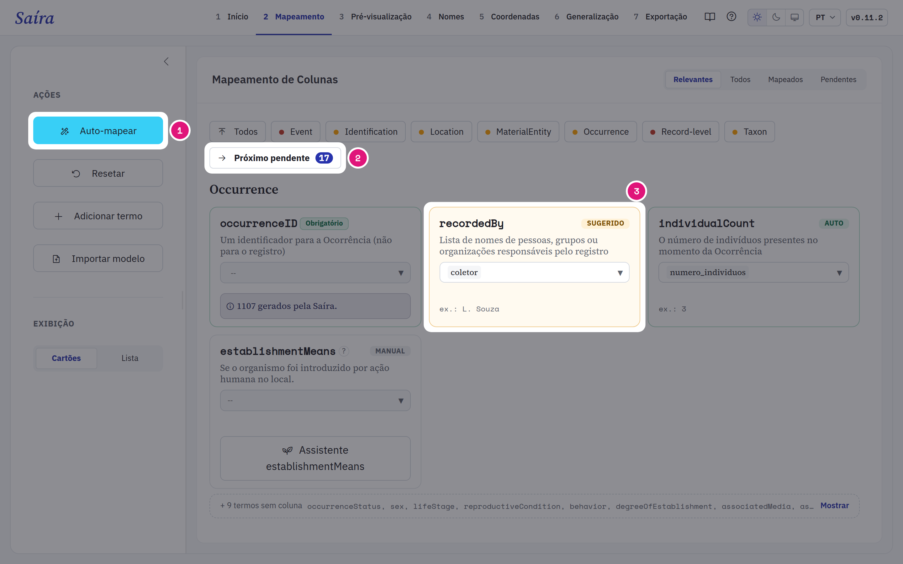
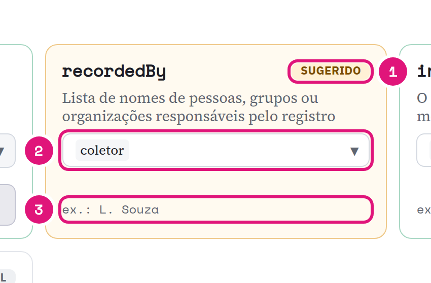
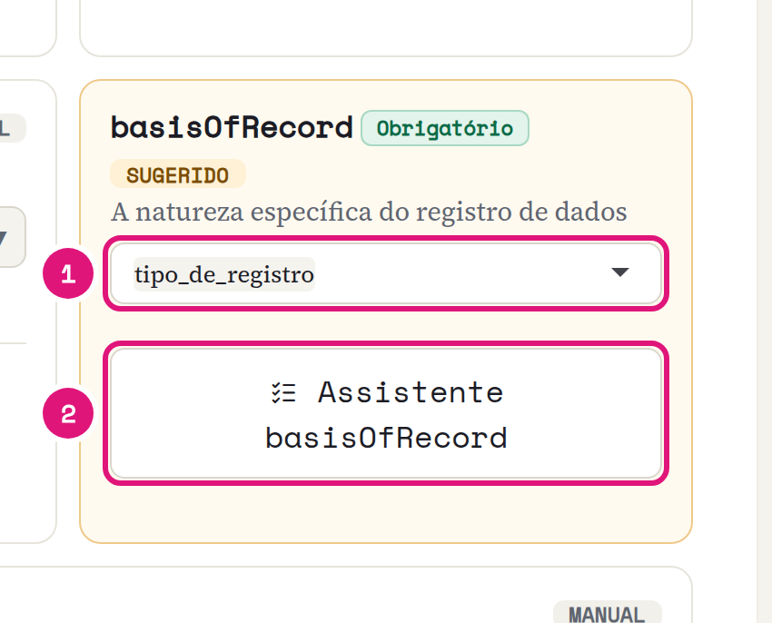
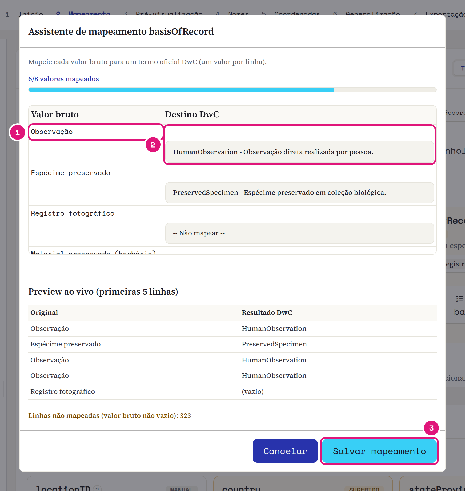
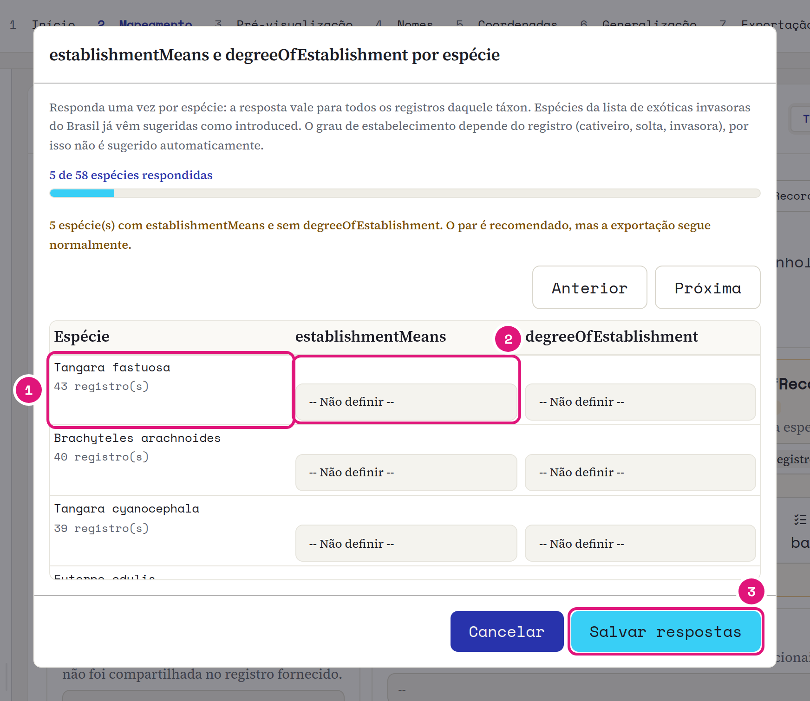
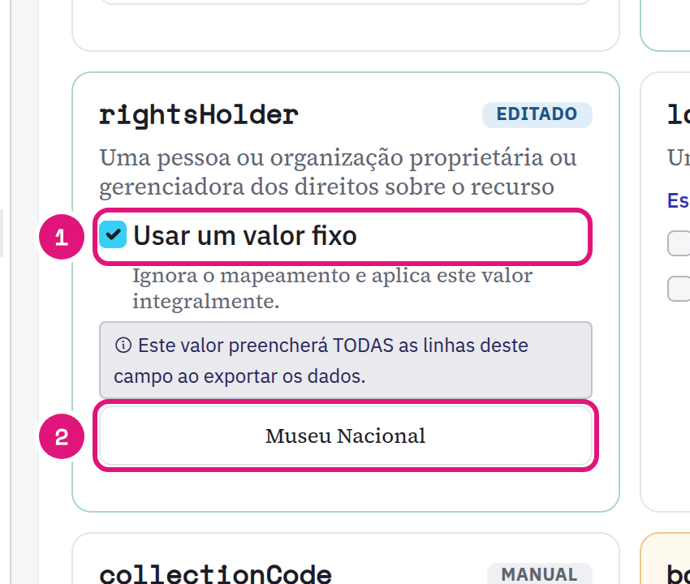
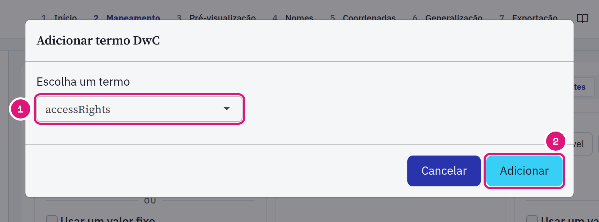
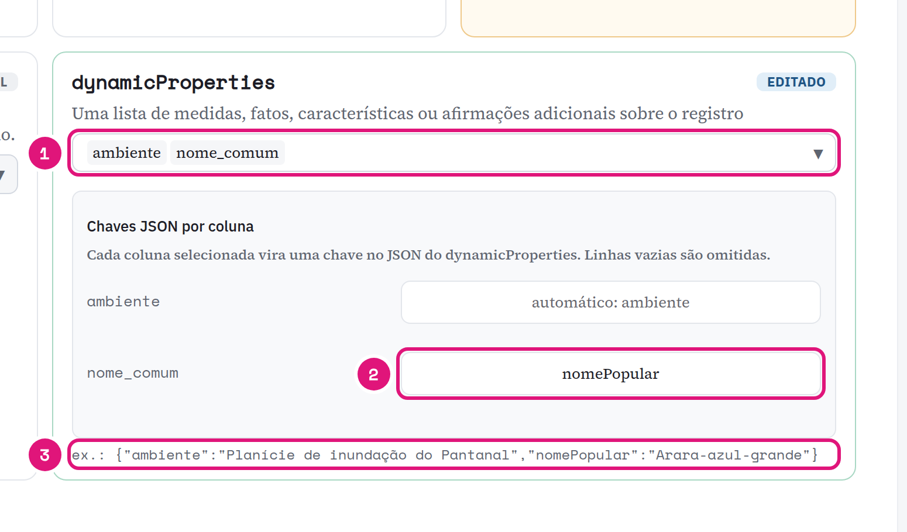
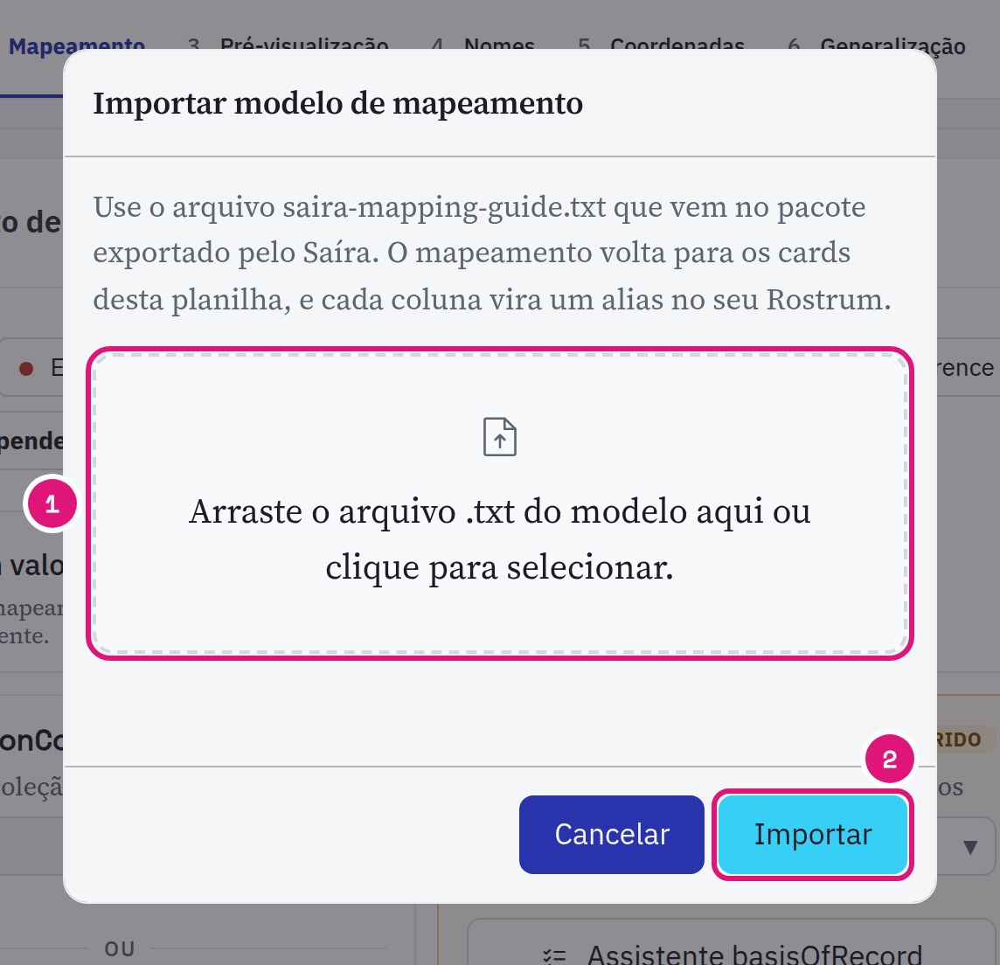

::: {.tut-standfirst}
Associe cada coluna da planilha a um termo Darwin Core na etapa **Mapeamento**.
:::

## Rode o Auto-mapear

```{=html}
<figure class="shot"></figure>
```

::: {.marks}
1. Clique em **Auto-mapear**. O Saíra propõe um termo para cada coluna.
2. **Próximo pendente** pula para o próximo card que pede revisão. O número diz quantos faltam. Nos filtros de classe, ponto vermelho é obrigatório vazio, laranja é revisar.
3. Card amarelo é **SUGERIDO**: confirme ou troque.
:::

## Revise cada card

```{=html}
<figure class="shot"></figure>
```

::: {.marks}
1. O selo diz de onde veio o termo.
2. Coluna errada? Troque no seletor.
3. `ex.:` mostra o primeiro valor lido da coluna.
:::

| Selo | Significado |
|---|---|
| AUTO | Alta confiança. Já vem preenchido. |
| SUGERIDO | Provável. Confirme. |
| AMBÍGUO | Dois termos empatados. Você escolhe. |
| EDITADO | Você mudou. Sua escolha vale. |
| ALIAS | Veio de um mapeamento anterior. |
| TEMPLATE | Veio de um modelo importado. |
| MANUAL | Sem sugestão automática. |

Se a mesma coluna vai para mais de um termo, o Saíra avisa. Confira se é intencional.

## Defina o basisOfRecord

```{=html}
<figure class="shot"></figure>
```

::: {.marks}
1. Escolha a coluna com o tipo de registro, como <span class="term">tipo_de_registro</span>.
2. Abra o **Assistente basisOfRecord**.
:::

```{=html}
<figure class="shot"></figure>
```

::: {.marks}
1. Cada valor diferente da coluna aparece uma vez.
2. Escolha o termo Darwin Core. A prévia embaixo mostra o resultado.
3. **Salvar mapeamento**.
:::

## Responda establishmentMeans por espécie

Opcional. O assistente fica no card <span class="term">establishmentMeans</span> e precisa de <span class="term">scientificName</span> mapeado.

```{=html}
<figure class="shot"></figure>
```

::: {.marks}
1. Uma linha por espécie, com o número de registros que a resposta cobre.
2. Escolha <span class="term">establishmentMeans</span>. Ao lado, o <span class="term">degreeOfEstablishment</span>.
3. **Salvar respostas**.
:::

Espécies invasoras já chegam como `introduced`. O grau nunca é sugerido: só você sabe se o animal está em cativeiro ou solto. Se uma coluna da planilha também preenche o termo, a coluna vence.

## Use um valor fixo para o conjunto

```{=html}
<figure class="shot"></figure>
```

::: {.marks}
1. Marque **Usar um valor fixo**.
2. Digite o valor uma vez. Ele vai para todas as linhas.
:::

Aceitam valor fixo: <span class="term">rightsHolder</span> <span class="term">institutionCode</span> <span class="term">collectionCode</span> <span class="term">country</span> <span class="term">references</span> <span class="term">bibliographicCitation</span> <span class="term">geodeticDatum</span>. Os três últimos entram com **Adicionar termo**.

## Escolha a licença

O card <span class="term">license</span> é obrigatório. Escolha CC0, CC-BY ou CC-BY-NC, as três licenças que o GBIF aceita. Sem licença, a exportação bloqueia.

## Adicione um termo que não aparece

```{=html}
<figure class="shot"></figure>
```

::: {.marks}
1. Busque o termo. O catálogo tem cerca de 218.
2. **Adicionar**. O termo vira um card novo.
:::

## Junte colunas extras em dynamicProperties

```{=html}
<figure class="shot"></figure>
```

::: {.marks}
1. Escolha as colunas.
2. Renomeie a chave, se quiser.
3. Confira o JSON da primeira linha.
:::

O status de conservação entra no mesmo campo, a partir da [validação de nomes](04-validacao-nomes.qmd).

## Reaproveite o mapeamento

O `.zip` exportado traz o `<dataset>-mapping-guide.txt`. Na próxima planilha, clique em **Importar modelo**:

```{=html}
<figure class="shot"></figure>
```

::: {.marks}
1. Envie o arquivo.
2. **Importar**. Colunas com o mesmo nome são mapeadas sozinhas.
:::

Colunas que você não mapear saem no fim do arquivo, com o nome original. O GBIF ignora essas colunas.
