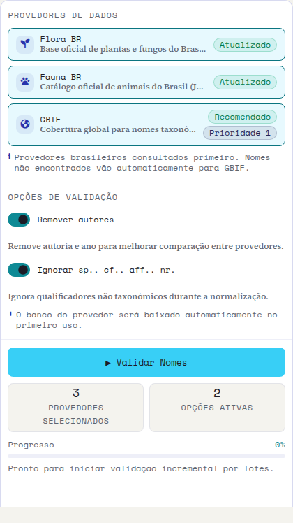
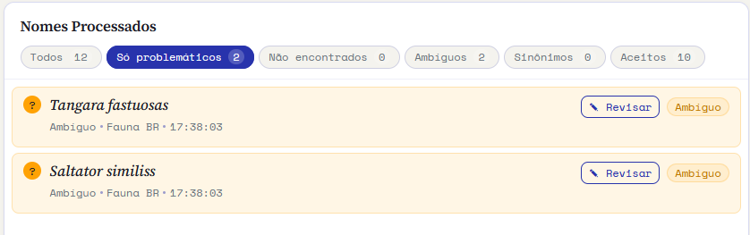
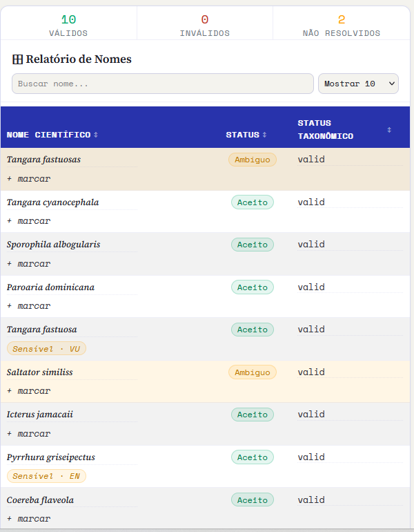
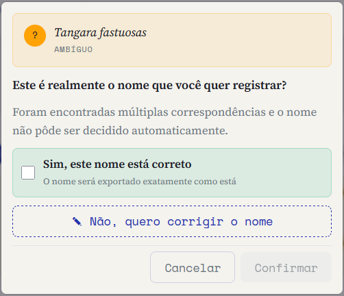
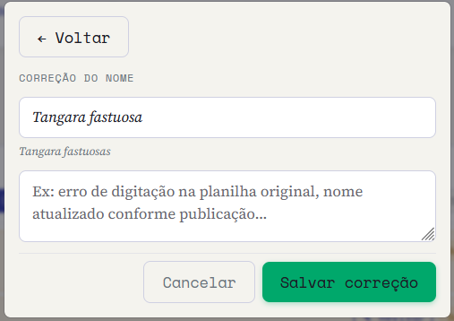
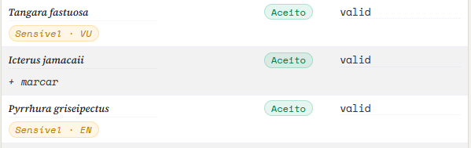
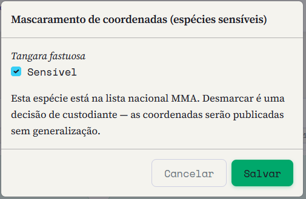
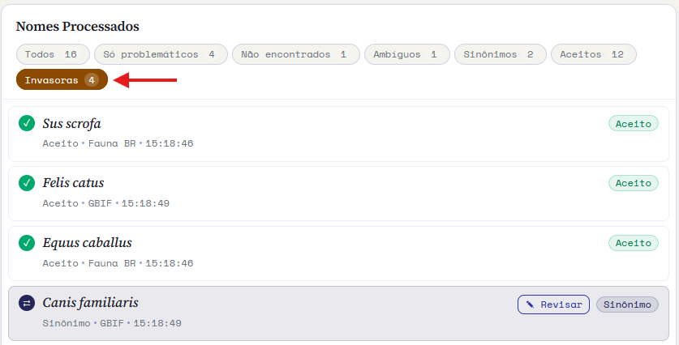
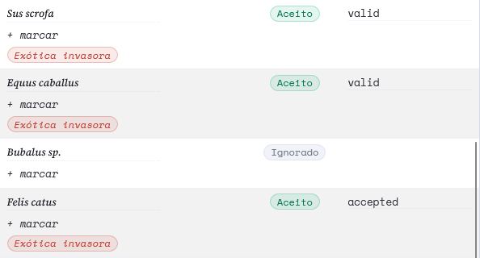

::: {.tut-standfirst}
Esta etapa confere cada nome científico contra uma base taxonômica à sua escolha, resolve sinônimos e grafias divergentes, e sinaliza as espécies ameaçadas da lista nacional do MMA.
:::

## Por que validar nomes

Um mesmo táxon pode aparecer escrito de muitas formas: com erros de digitação, sinônimos antigos, abreviações ou sem o autor. Para que seus dados se combinem com os de outras coleções, os nomes precisam ser **resolvidos** contra uma referência taxonômica estável.

## Escolhendo a base de referência

Na aba **Validação de nomes**, o Saíra oferece três bases taxonômicas. Marque uma ou mais, a mais adequada ao seu grupo:

```{=html}
<table class="maptable">
  <thead><tr><th>Base</th><th>Cobertura</th><th>Quando usar</th></tr></thead>
  <tbody>
    <tr><td>Flora do Brasil</td><td>Plantas, algas e fungos do Brasil</td><td>Coleções botânicas e micológicas nacionais</td></tr>
    <tr><td>Fauna do Brasil</td><td>Animais do Brasil</td><td>Coleções zoológicas nacionais</td></tr>
    <tr><td>GBIF (recomendada)</td><td>Backbone taxonômico global</td><td>Qualquer grupo, ou quando o táxon não é brasileiro</td></tr>
  </tbody>
</table>
```

Quando você marca mais de uma base, o Saíra consulta em **cascata** (Flora do Brasil → Fauna do Brasil → GBIF) e usa como veredito o primeiro provedor que retornar um resultado. Por baixo, todas as consultas passam pelo pacote `taxadb`.

::: {.callout-note}
## Bases brasileiras ficam no seu computador
Flora do Brasil e Fauna do Brasil são **baixadas e armazenadas localmente** na primeira vez que você as usa. Depois disso, a validação roda mesmo sem internet e fica mais rápida. Cada base aparece como um **cartão de provedor** com o seu status (não baixada, baixando, atualizada) e a versão local; as bases que você já baixou ficam **pré-selecionadas** ao reabrir o app, para que sua escolha persista entre sessões. O GBIF é consultado conforme a necessidade.
:::

::: {.callout-warning}
## Flora BR / Fauna BR não baixam? Atualize o Saíra
Os arquivos publicados pela Flora e Funga do Brasil e pelo Catálogo Taxonômico da Fauna do Brasil mudam de tempos em tempos, e o Saíra acompanha esses formatos. Se o cartão travar com **"falha na atualização"** e nunca ficar verde, é sinal de que você está numa versão antiga do app. **Reinstale o Saíra com `pak`** para pegar a correção mais recente. O `pak` resolve sozinho as versões certas dos pacotes das bases (Flora BR e Fauna BR):

```r
pak::pak("rogerio-onza/saira")
```

Depois reabra o app com `saira::run_app()` e tente a validação de novo.
:::

## Antes de rodar: normalização

Abaixo das bases, duas opções controlam como cada nome é preparado antes da consulta. As duas vêm **ligadas** por padrão:

- **Remover autores**: descarta autoria e ano para melhorar a comparação entre provedores. Ex.: `Harpia harpyja (Daudin, 1800)` vira `Harpia harpyja`.
- **Ignorar sp., cf., aff., nr.**: ignora qualificadores não taxonômicos durante a normalização.

```{=html}
<figure class="shot">
  
  <figcaption><b>Figura 1.</b> Coluna de configuração: os provedores com o status de cada base local, as opções de normalização e o botão <span class="term">Validar Nomes</span>.</figcaption>
</figure>
```

## Conferindo a nomenclatura

Ao clicar em **Validar Nomes**, o Saíra compara cada <span class="term">scientificName</span> com a base escolhida e atribui um **status** a cada nome:

- **Aceito** — o nome bate com a referência e já é o nome aceito.
- **Sinônimo** — o nome é válido, mas a base aponta um nome aceito mais atual (também é o status para grafias inválidas ou inaplicadas que a base devolve).
- **Ambíguo** — mais de um candidato forte; você decide qual aplicar.
- **Não encontrado** — não está na base; exige revisão manual.

O Saíra **não corrige grafia por conta própria** nem adivinha o nome "mais parecido": ele só reporta o que a base taxonômica devolve. Qualquer correção parte de você.

```{=html}
<ol class="fix-steps">
  <li><strong>Rode a verificação.</strong>
    <p>O Saíra processa a lista de nomes (cada nome distinto é consultado uma vez) e mostra um resumo por status, com filtros para isolar os problemas.</p></li>
  <li><strong>Revise os problemas.</strong>
    <p>Para cada nome marcado como sinônimo, ambíguo ou não encontrado, abra a revisão manual e decida.</p></li>
  <li><strong>Trate os não encontrados.</strong>
    <p>Corrija a grafia, confirme que está certo (por exemplo, um táxon recém-descrito) ou ajuste conforme a publicação de referência.</p></li>
</ol>
```

```{=html}
<figure class="shot">
  
  <figcaption><b>Figura 2.</b> Painel <span class="term">Nomes Processados</span>: o resumo por situação, com filtros para isolar os problemas e o botão <span class="term">Revisar</span> em cada nome pendente.</figcaption>
</figure>
```

```{=html}
<figure class="shot">
  
  <figcaption><b>Figura 3.</b> Relatório de Nomes: todos os táxons em tabela, com o status de cada um e a contagem de válidos, inválidos e não resolvidos no topo.</figcaption>
</figure>
```

## Corrigindo nomes

A correção é manual e acontece no **modal de revisão**. Clique em um nome problemático e escolha:

- **Sim, este nome está correto**: confirma o nome como está; ele será exportado exatamente assim. Útil para táxons recém-descritos ou ausentes da base.
- **Não, quero corrigir o nome**: abre o campo **Correção do nome** para você digitar a grafia certa, com um motivo opcional (ex.: erro de digitação na planilha original, nome atualizado conforme publicação).

A decisão é **reaplicada automaticamente** a todas as linhas com aquele mesmo nome: como a validação agrupa nomes idênticos, você revisa cada um uma única vez e a correção vale para o conjunto inteiro.

```{=html}
<figure class="shot">
  
  <figcaption><b>Figura 4.</b> Modal de revisão: confirme o nome como está ou escolha corrigi-lo.</figcaption>
</figure>
```

```{=html}
<figure class="shot">
  
  <figcaption><b>Figura 5.</b> Modo de correção: digite a grafia certa e, se quiser, registre o motivo da mudança.</figcaption>
</figure>
```

::: {.callout-warning}
## A decisão taxonômica é sua
Em grupos com taxonomia instável, confira cada caso antes de aceitar. Trocar um nome por seu sinônimo aceito significa substituir o nome no conjunto exportado: o nome original pode ser preservado em <span class="term">verbatimIdentification</span> ou <span class="term">originalNameUsage</span> se você mapeou esses campos.
:::

## Espécies ameaçadas (Lista MMA)

Depois de resolver os nomes, o Saíra compara cada táxon com a **lista nacional de espécies ameaçadas de extinção**, que vem **embutida no app** (não é preciso baixar nada). Os táxons presentes na lista recebem uma sinalização **Sensível** no relatório, com a categoria de ameaça: **VU** (vulnerável), **EN** (em perigo), **CR** (criticamente em perigo) e **CR (PEX)** (criticamente em perigo, possivelmente extinta).

```{=html}
<figure class="shot">
  
  <figcaption><b>Figura 6.</b> No relatório, táxons da lista trazem a etiqueta <span class="term">Sensível</span> com a categoria; os demais trazem a opção <span class="term">+ marcar</span>.</figcaption>
</figure>
```

### Ajustando a sensibilidade

A lista do MMA é a referência oficial e o Saíra não a edita: as categorias de ameaça vêm das portarias e não mudam. O que você ajusta é a **marcação de sensibilidade** de cada táxon, conforme sua experiência e a realidade da sua região de trabalho:

- **Desmarcar a sensibilidade de um táxon**: se, no seu contexto, aquele registro não for sensível, desmarque-o. O Saíra avisa que essa é uma **decisão de custódia**: sem a marca, as coordenadas daquele táxon serão publicadas sem generalização.
- **Marcar uma espécie fora da lista**: use **+ marcar** para sinalizar como sensível um táxon que a lista nacional não cobre, mas que você sabe ser vulnerável na sua área.

O ajuste é feito num pequeno diálogo de confirmação e vale para a exportação.

```{=html}
<figure class="shot">
  
  <figcaption><b>Figura 7.</b> Diálogo de sensibilidade: marque ou desmarque o táxon. Ao desmarcar uma espécie da lista do MMA, o Saíra lembra que a decisão é sua e que as coordenadas sairão sem generalização.</figcaption>
</figure>
```

Aqui a etapa apenas **sinaliza** o que é sensível. A proteção efetiva das coordenadas (decidir se e quanto generalizar a localização) acontece na etapa de **[generalização](06-generalizacao.qmd)**, seguindo a tabela de decisão de Chapman (2020).

::: {.callout-note}
## De onde vem a lista
A lista embutida vem das listas oficiais do Ministério do Meio Ambiente: a **flora** pela [**Portaria MMA nº 148, de 7 de junho de 2022**](https://www.in.gov.br/en/web/dou/-/portaria-mma-n-148-de-7-de-junho-de-2022-406272733); a **fauna terrestre** pela [**Portaria MMA nº 1.704, de 16 de junho de 2026**](https://www.in.gov.br/en/web/dou/-/portaria-mma-n-1.704-de-16-de-junho-de-2026-712968917); e a **fauna aquática** (peixes e invertebrados) pela [**Portaria GM/MMA nº 1.667, de 27 de abril de 2026**](https://www.in.gov.br/web/dou/-/portaria-gm/mma-n-1.667-de-27-de-abril-de-2026-702075623).
:::

## Espécies exóticas invasoras (Instituto Hórus)

Além da lista de ameaçadas, o Saíra compara cada táxon com a **lista brasileira de espécies exóticas invasoras** do **Instituto Hórus**, com 483 táxons entre animais e plantas. Ela também vem **embutida no app**: a verificação é local, offline e instantânea.

A sinalização aparece em dois lugares. Nos **Nomes Processados**, a pílula de filtro <span class="term">Invasoras</span> se junta às demais, com a contagem de táxons, e isola só esses, o que ajuda quando a lista é longa.

```{=html}
<figure class="shot">
  
  <figcaption><b>Figura 8.</b> A pílula <span class="term">Invasoras</span> nos Nomes Processados, com a contagem de táxons. Ao clicar, a lista mostra só as espécies da lista do Hórus.</figcaption>
</figure>
```

No **Relatório de Nomes**, cada táxon da lista traz a etiqueta **Exótica invasora** abaixo do nome, e uma linha acima da tabela informa quantos registros estão nessa condição.

```{=html}
<figure class="shot">
  
  <figcaption><b>Figura 9.</b> A etiqueta <span class="term">Exótica invasora</span> no relatório. <span class="term">Bubalus sp.</span> aparece sem ela: não está na lista, e o Saíra não deduz a partir do gênero.</figcaption>
</figure>
```

O casamento usa **exatamente a mesma normalização de nomes** da validação, então autoria e qualificadores não atrapalham: <span class="term">Felis catus (Linnaeus, 1758)</span> é reconhecido.

::: {.callout-note}
## Invasora é diferente de ameaçada, e as duas pílulas são diferentes
As outras pílulas filtram por **situação da validação** (aceito, sinônimo, não encontrado…), que muda conforme você revisa os nomes. A pílula <span class="term">Invasoras</span> filtra pela **lista de espécies**, então ela não é afetada pelas suas revisões. Um táxon pode estar nas duas condições ou em nenhuma: são listas independentes, com finalidades opostas.
:::

Estar nessa lista significa que o táxon é **exótico e invasor no Brasil**, o que é exatamente o insumo da sugestão automática de <span class="term">establishmentMeans</span> no **[mapeamento](03-mapeamento-dwc.qmd)**: essas espécies chegam ao assistente já pré-preenchidas como `introduced`. A lista deliberadamente **não** diz nada sobre <span class="term">degreeOfEstablishment</span>, que depende do registro: um animal em cativeiro e um assilvestrado são a mesma espécie.

Se a lista estiver ausente ou ilegível, a validação continua funcionando normalmente e apenas deixa de sinalizar, com um aviso, em vez de quebrar.

## O status de conservação vai para a exportação

::: {.callout-important}
## A escolha das bases define o status de conservação
As bases marcadas aqui decidem o que o Saíra grava em `dynamicProperties` na exportação: uma base **brasileira** (Flora BR / Fauna BR) contribui com a categoria **MMA**, o **GBIF** com a categoria **IUCN** global. Uma linha curta acima do relatório informa quantos registros receberão cada uma. As chaves geradas e o comportamento sem internet estão em **[Pré-visualização e exportação](07-preview-exportacao.qmd)**.
:::

Com os nomes resolvidos, vamos ao espaço: siga para **[Validando coordenadas](05-validacao-coordenadas.qmd)**.
