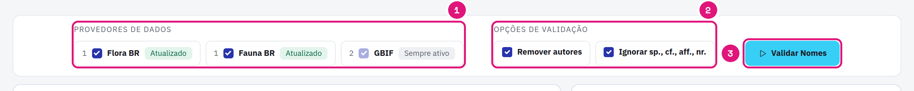
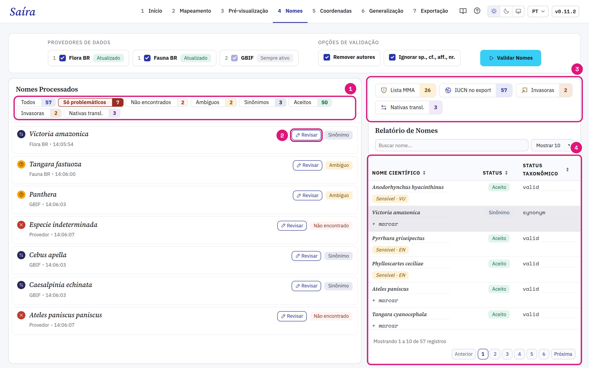
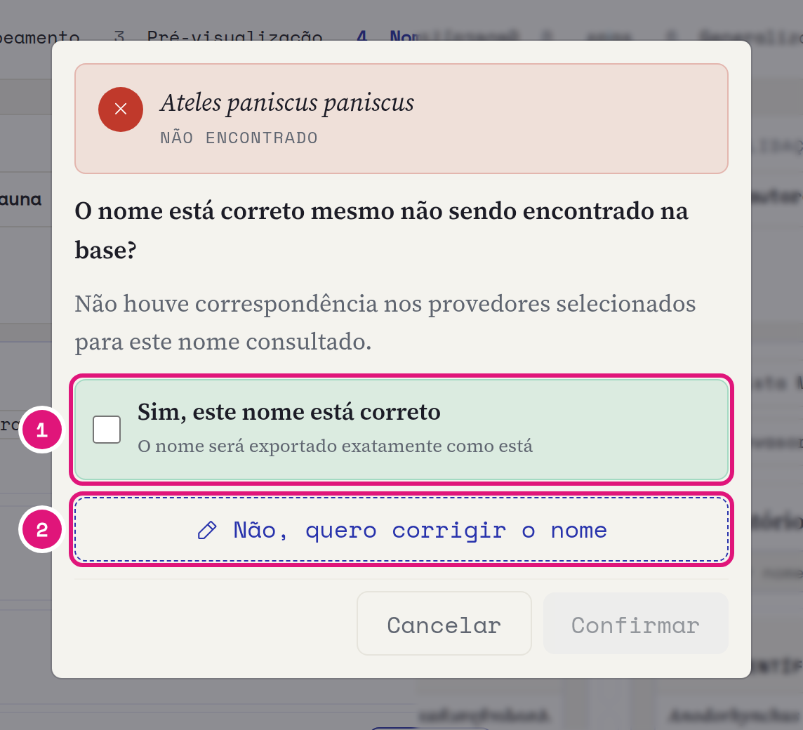
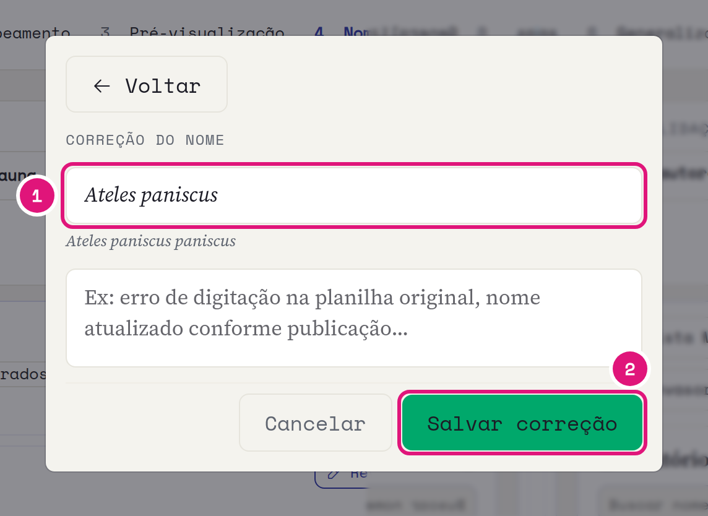
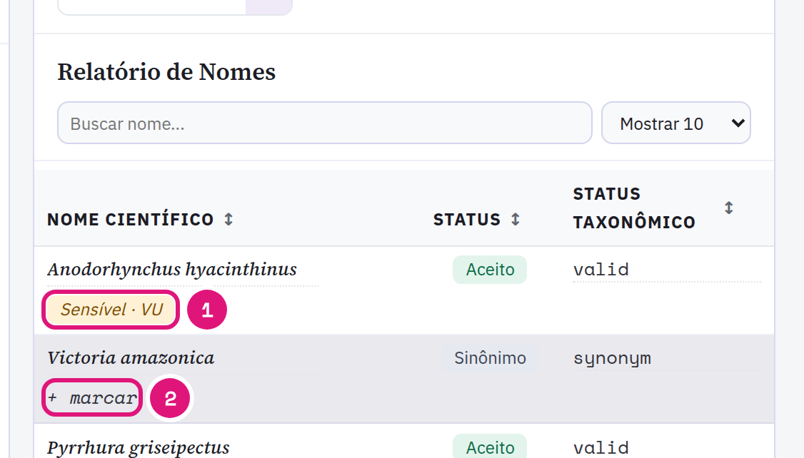
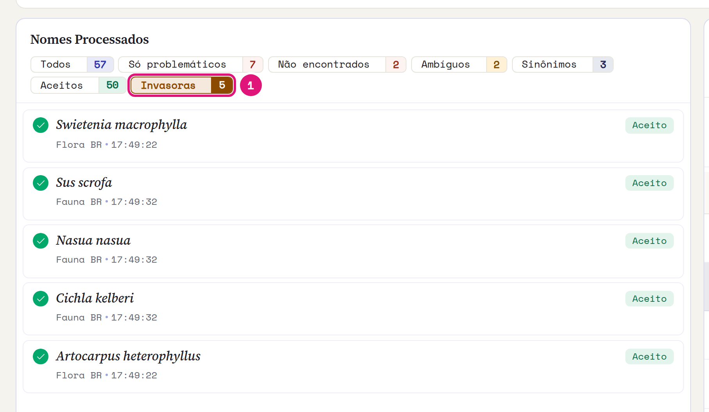

::: {.tut-standfirst}
Confira cada <span class="term">scientificName</span> contra uma base taxonômica na etapa **Nomes**. A etapa também sinaliza espécies ameaçadas e invasoras.
:::

## Rode a validação

```{=html}
<figure class="shot"></figure>
```

::: {.marks}
1. Marque **Flora BR** e **Fauna BR**. O GBIF está sempre ativo.
2. As duas opções vêm ligadas. Elas tiram autor e ano (`Harpia harpyja (Daudin, 1800)`) e qualificadores (`sp.`, `cf.`, `aff.`, `nr.`) antes da consulta.
3. Clique em **Validar Nomes**.
:::

O número no provedor é a ordem da consulta. O Saíra consulta Flora BR e Fauna BR primeiro, depois o GBIF. Cada nome distinto é consultado uma vez.

::: {.callout-note}
## Flora BR e Fauna BR ficam no seu computador
O Saíra baixa as duas bases no primeiro uso. Depois a validação funciona sem internet. Se o provedor mostra **falha na atualização**, reinstale o Saíra com `pak::pak("rogerio-onza/saira")`.
:::

## Leia o resultado

```{=html}
<figure class="shot"></figure>
```

::: {.marks}
1. Os filtros separam os nomes por situação. **Só problemáticos** mostra o que pede revisão.
2. **Revisar** abre a decisão para aquele nome.
3. Quantas espécies estão na Lista MMA, quantos registros recebem o status IUCN e quantas espécies são invasoras.
4. O relatório lista todos os nomes, com status e marcação de sensibilidade.
:::

| Situação | Significado |
|---|---|
| Aceito | O nome é o nome aceito na base. |
| Sinônimo | A base aponta outro nome aceito. Também vale para grafias que a base marca como inválidas. |
| Ambíguo | Mais de um candidato forte. Você escolhe. |
| Não encontrado | O nome não está em nenhuma base consultada. |

O Saíra não corrige grafia sozinho. Ele só mostra o que a base devolve.

## Revise um nome

```{=html}
<figure class="shot"></figure>
```

::: {.marks}
1. O nome está certo, como um táxon recém-descrito? Marque e clique em **Confirmar**. O nome sai como está.
2. O nome está errado? Clique em **Não, quero corrigir o nome**.
:::

```{=html}
<figure class="shot"></figure>
```

::: {.marks}
1. Digite o nome correto. O motivo é opcional.
2. **Salvar correção**.
:::

A decisão vale para todas as linhas com o mesmo nome.

::: {.callout-warning}
## A decisão taxonômica é sua
Em grupos com taxonomia instável, confira cada caso. A correção substitui o nome na exportação. Para guardar o nome original, mapeie a mesma coluna também em <span class="term">verbatimIdentification</span> no [mapeamento](03-mapeamento-dwc.qmd).
:::

## Confira as espécies ameaçadas

A lista nacional do MMA vem embutida no Saíra. Espécies da lista recebem a marca **Sensível** com a categoria: VU, EN, CR ou CR (PEX).

```{=html}
<figure class="shot"></figure>
```

::: {.marks}
1. Clique na marca para tirar a sensibilidade. Sem a marca, as coordenadas da espécie saem sem generalização.
2. **+ marcar** torna sensível uma espécie fora da lista.
:::

A categoria de ameaça não muda: ela vem das portarias. A etapa só marca. A proteção das coordenadas acontece na [generalização](06-generalizacao.qmd).

::: {.callout-note}
## De onde vem a lista
A lista embutida vem das listas oficiais do Ministério do Meio Ambiente: a **flora** pela [**Portaria MMA nº 148, de 7 de junho de 2022**](https://www.in.gov.br/en/web/dou/-/portaria-mma-n-148-de-7-de-junho-de-2022-406272733); a **fauna terrestre** pela [**Portaria MMA nº 1.704, de 16 de junho de 2026**](https://www.in.gov.br/en/web/dou/-/portaria-mma-n-1.704-de-16-de-junho-de-2026-712968917); e a **fauna aquática** (peixes e invertebrados) pela [**Portaria GM/MMA nº 1.667, de 27 de abril de 2026**](https://www.in.gov.br/web/dou/-/portaria-gm/mma-n-1.667-de-27-de-abril-de-2026-702075623).
:::

## Encontre as espécies invasoras

```{=html}
<figure class="shot"></figure>
```

::: {.marks}
1. O filtro **Invasoras** mostra as espécies da lista de exóticas invasoras do Instituto Hórus (483 táxons).
:::

Esse filtro usa a lista de espécies, não a situação da validação. As revisões não mudam a contagem. No [mapeamento](03-mapeamento-dwc.qmd), essas espécies chegam ao assistente de <span class="term">establishmentMeans</span> como `introduced`.

As bases marcadas definem o status de conservação gravado na exportação: Flora BR e Fauna BR dão a categoria MMA, o GBIF dá a categoria IUCN. Veja [Pré-visualização e exportação](07-preview-exportacao.qmd#status-de-conservação-no-dynamicproperties).
