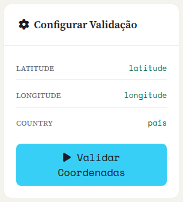
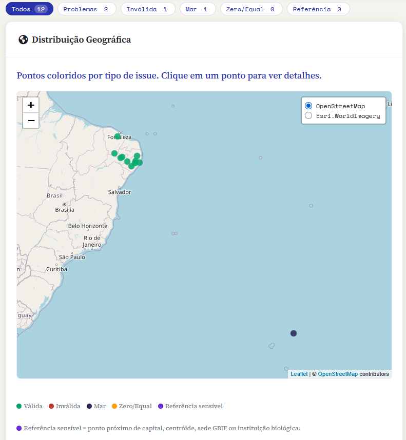
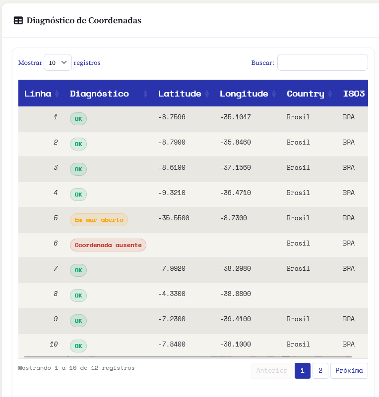
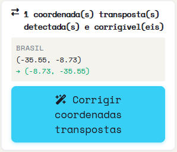
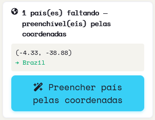

::: {.tut-standfirst}
Coordenadas erradas são uma das maiores fontes de erro em dados de biodiversidade. O Saíra roda um diagnóstico determinístico, mostra cada registro no mapa e numa tabela, e **propõe correções seguras** — aplicadas só na exportação, nunca por cima dos seus dados.
:::

## Antes de validar: o que precisa estar mapeado

A validação de coordenadas só roda quando três termos do Darwin Core estão mapeados (veja **[Mapeamento](03-mapeamento-dwc.qmd)**):

- <span class="term">decimalLatitude</span>
- <span class="term">decimalLongitude</span>
- <span class="term">country</span>

O painel da esquerda mostra a coluna associada a cada termo. Enquanto algum faltar, o botão **Validar Coordenadas** fica desabilitado.

Antes de rodar, escolha o **Perfil**:

- **Completo** — roda todos os testes, incluindo a detecção de *referências sensíveis* (pontos suspeitos sobre capitais, centróides de país, sede do GBIF e instituições de biodiversidade).
- **Rápido** — pula os testes de referência; útil para uma primeira passada em bases grandes.

Clique em **Validar Coordenadas**. A validação é disparada por você, não a cada mudança nos dados.

```{=html}
<figure class="shot">
  
  <figcaption><b>Figura 1.</b> Painel da esquerda: status das colunas mapeadas (latitude, longitude, country), o seletor de Perfil (Completo / Rápido) e o botão Validar Coordenadas.</figcaption>
</figure>
```

## O que o Saíra verifica

A partir de <span class="term">decimalLatitude</span>, <span class="term">decimalLongitude</span> e <span class="term">country</span>, cada registro recebe **um diagnóstico**, com a mesma cor que aparece no mapa e nos badges da tabela:

```{=html}
<table class="maptable">
  <thead><tr><th>Diagnóstico</th><th>O que significa</th></tr></thead>
  <tbody>
    <tr><td><span class="swatch" style="background:var(--success)"></span>OK</td><td>Passou em todos os testes.</td></tr>
    <tr><td><span class="swatch" style="background:var(--coord-missing)"></span>Coordenada ausente</td><td>Latitude ou longitude vazia ou não numérica.</td></tr>
    <tr><td><span class="swatch" style="background:var(--error)"></span>Fora dos limites</td><td>Valores impossíveis (latitude além de ±90, longitude além de ±180) ou coordenada zerada.</td></tr>
    <tr><td><span class="swatch" style="background:var(--coord-swap)"></span>Possível inversão</td><td>Latitude e longitude aparentam estar trocadas.</td></tr>
    <tr><td><span class="swatch" style="background:var(--info)"></span>Em mar aberto</td><td>O ponto cai na água segundo a camada de costa, quando deveria estar em terra.</td></tr>
    <tr><td><span class="swatch" style="background:var(--warning)"></span>Zero/Equal</td><td>Coordenada em (0, 0) ou com latitude e longitude idênticas.</td></tr>
    <tr><td><span class="swatch" style="background:var(--coord-identical)"></span>Todas idênticas</td><td>Todos os registros válidos compartilham o mesmo par de coordenadas — sinal de um valor padrão coletivo.</td></tr>
    <tr><td><span class="swatch" style="background:var(--coord-reference)"></span>Referência sensível</td><td>Ponto próximo de capital, centróide de país, sede do GBIF ou instituição biológica (só no perfil <b>Completo</b>).</td></tr>
  </tbody>
</table>
```

Os testes são determinísticos (no estilo do `CoordinateCleaner`) e usam a camada de países do Natural Earth embutida no Saíra — rodam sem depender de serviços externos.

## Lendo os resultados

Concluída a validação, os resultados aparecem à direita.

**Filtros.** Acima do mapa, botões filtram a visão por categoria — **Todos**, **Problemas**, **Inválida**, **Mar**, **Zero/Equal** e **Referência**. Clicar em um filtra o mapa e a tabela ao mesmo tempo.

**Mapa — Distribuição Geográfica.** Cada registro vira um ponto, colorido pela situação. Clique em um ponto para ver linha, diagnóstico e coordenadas; concentrações fora da área esperada saltam aos olhos.

```{=html}
<table class="maptable">
  <thead><tr><th>Cor no mapa</th><th>Situação</th></tr></thead>
  <tbody>
    <tr><td><span class="swatch" style="background:var(--success)"></span>Verde</td><td>Válida</td></tr>
    <tr><td><span class="swatch" style="background:var(--error)"></span>Vermelho</td><td>Inválida</td></tr>
    <tr><td><span class="swatch" style="background:var(--info)"></span>Azul-marinho</td><td>Mar</td></tr>
    <tr><td><span class="swatch" style="background:var(--warning)"></span>Laranja</td><td>Zero/Equal</td></tr>
    <tr><td><span class="swatch" style="background:var(--coord-reference)"></span>Violeta</td><td>Referência sensível</td></tr>
  </tbody>
</table>
```

```{=html}
<figure class="shot">
  
  <figcaption><b>Figura 2.</b> Distribuição Geográfica: pontos coloridos por situação, com a legenda de cores abaixo do mapa.</figcaption>
</figure>
```

::: {.callout-warning}
## O teste de mar é aproximado
O teste de mar usa dados de costa simplificados. Pontos muito próximos da costa podem ser flagados incorretamente. **Verifique visualmente no mapa antes de descartar** um registro marcado como *Em mar aberto*.
:::

**Tabela — Diagnóstico de Coordenadas.** Abaixo do mapa, uma tabela lista cada registro com as colunas **Linha**, **Diagnóstico** (badge colorido), **Latitude**, **Longitude**, **Country** e **ISO3** (o código de país resolvido). É pesquisável, paginada e acompanha o filtro ativo.

```{=html}
<figure class="shot">
  
  <figcaption><b>Figura 3.</b> Os filtros e a tabela Diagnóstico de Coordenadas (Linha, Diagnóstico, Latitude, Longitude, Country, ISO3).</figcaption>
</figure>
```

## Correções assistidas

O Saíra não só aponta o erro: ele **propõe a correção** para você aplicar explicitamente. As coordenadas originais nunca são sobrescritas em silêncio, e as correções aceitas são **aplicadas na exportação**, não no preview. Quando o modelo de exportação tem as colunas <span class="term">verbatimLatitude</span> e <span class="term">verbatimLongitude</span> vazias, os valores originais são preservados ali.

Havendo candidatos, painéis aparecem à esquerda. Cada um mostra a contagem e um exemplo, e fica verde com um ✓ depois de aplicado:

```{=html}
<ol class="fix-steps">
  <li><strong>Corrija transposições e inversões.</strong>
    <p>Para pontos fora do país informado, o Saíra testa trocas de lat/lon e inversões de sinal e aceita a primeira que cai dentro do país (margem de ~22 km). Botão: <strong>Corrigir coordenadas transpostas</strong>.</p></li>
  <li><strong>Preencha o país pelo ponto.</strong>
    <p>Com <span class="term">country</span> em branco e coordenada válida, o Saíra deriva o país em que o ponto cai. Países já informados nunca são substituídos. Botão: <strong>Preencher país pelas coordenadas</strong>.</p></li>
  <li><strong>Trate pontos no mar sem país.</strong>
    <p>País vazio + ponto no mar é forte indício de troca lat/lon. O Saíra testa a troca e, se o ponto corrigido cai sem ambiguidade em um país, propõe coordenada e país juntos. Botão: <strong>Trocar lat/lon e preencher país</strong>.</p></li>
</ol>
```

```{=html}
<figure class="shot">
  
  <figcaption><b>Figura 4.</b> Painel de correção de coordenadas transpostas: contagem, exemplo (antiga → nova) e o botão Corrigir coordenadas transpostas.</figcaption>
</figure>
```

```{=html}
<figure class="shot">
  
  <figcaption><b>Figura 5.</b> Painel de país preenchível pelas coordenadas (e a variante "mar + país vazio → corrigível por troca lat/lon").</figcaption>
</figure>
```

**Registros sem coordenada** ficam marcados como *Coordenada ausente*. O Saíra não inventa um ponto a partir do texto da localidade — esses registros ficam a seu critério: mantenha-os sem georreferenciamento de forma consciente, ou preencha as coordenadas antes do upload.

::: {.callout-tip}
## Datum e precisão
Registre o <span class="term">geodeticDatum</span> (por exemplo, <em>WGS84</em>) e, quando souber, a incerteza em metros (<span class="term">coordinateUncertaintyInMeters</span>). Isso aumenta muito o valor científico do dado e ajuda quem for reutilizá-lo a julgar a precisão.
:::

::: {.callout-warning}
## Sinal das coordenadas no Brasil
A maior parte do Brasil tem **latitude e longitude negativas**. Coordenadas positivas onde se esperava o hemisfério sul/oeste são um forte indício de erro de sinal ou de inversão. O exemplo clássico: `-34.87, -8.04` (lat, lon) em vez de `-8.04, -34.87` joga um ponto de Pernambuco para o meio do Atlântico.
:::

## Próximos passos

Dados mapeados, nomes resolvidos e coordenadas revisadas. Se houver espécies ameaçadas, o próximo passo decide como protegê-las: siga para **[Generalizando espécies sensíveis](06-generalizacao.qmd)**.
