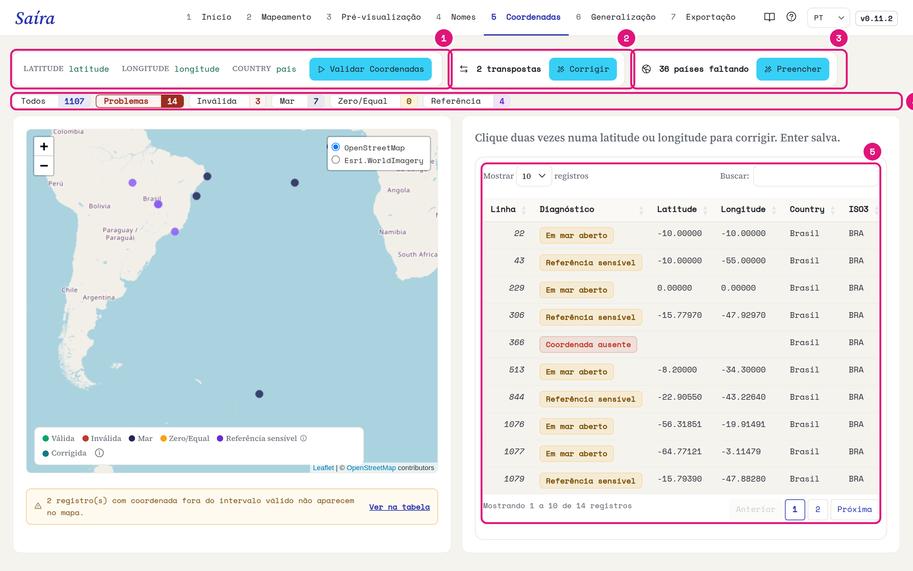
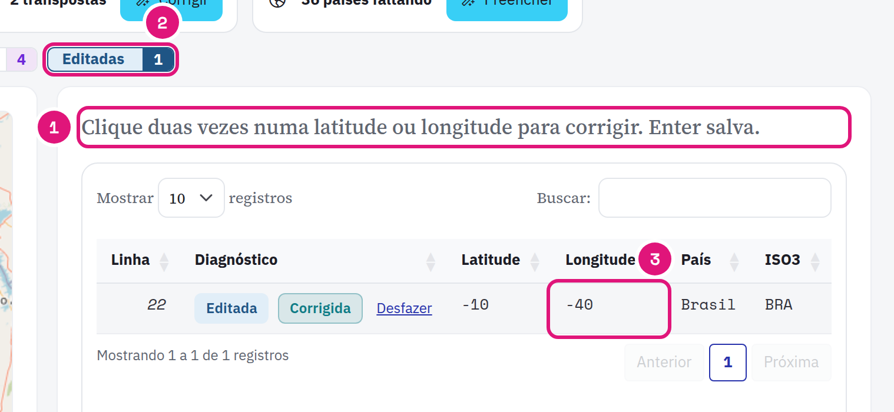

::: {.tut-standfirst}
Encontre coordenadas trocadas, no mar ou fora do país na etapa **Coordenadas**. O Saíra propõe correções. Você decide quais aplicar.
:::

## Rode a validação

A validação precisa de <span class="term">decimalLatitude</span>, <span class="term">decimalLongitude</span> e <span class="term">country</span> mapeados. Sem um deles, o botão **Validar Coordenadas** fica desativado.

```{=html}
<figure class="shot"></figure>
```

::: {.marks}
1. As colunas mapeadas e o botão **Validar Coordenadas**.
2. Coordenadas transpostas. **Corrigir** aplica a troca.
3. Países faltando. **Preencher** usa o país em que o ponto cai.
4. Os filtros mudam o mapa e a tabela juntos.
5. A tabela lista cada registro com o diagnóstico.
:::

| Diagnóstico | Significado |
|---|---|
| Coordenada ausente | Latitude ou longitude vazia ou não numérica. |
| Inválida | Latitude além de ±90 ou longitude além de ±180. |
| Possível inversão | Latitude e longitude parecem trocadas. |
| Em mar aberto | O ponto cai na água. |
| Zero/Equal | Ponto em (0, 0) ou latitude igual à longitude. |
| Referência sensível | Ponto perto de capital, centróide de país, sede do GBIF ou instituição biológica. |

Os testes rodam sem internet, com a camada de países do Natural Earth embutida no Saíra.

::: {.callout-warning}
## O teste de mar é aproximado
A costa é simplificada. Um ponto muito perto da costa pode aparecer como **Em mar aberto**. Confira no mapa antes de descartar o registro.
:::

## Aplique as correções propostas

Os painéis aparecem só quando há candidatos:

| Painel | O que o Saíra faz |
|---|---|
| **Corrigir** transpostas | Testa trocas de latitude e longitude e de sinal. Aceita a primeira que cai no país informado (margem de ~22 km). |
| **Preencher** países | Preenche <span class="term">country</span> vazio com o país em que o ponto cai. Não troca um país já informado. |
| **Trocar** no mar sem país | Troca latitude e longitude e preenche o país, se o ponto novo cai num só país. |

As correções valem na exportação. O dado original não muda. Se <span class="term">verbatimLatitude</span> e <span class="term">verbatimLongitude</span> estão vazios, o valor original vai para eles.

## Corrija um ponto na tabela

```{=html}
<figure class="shot"></figure>
```

::: {.marks}
1. Clique duas vezes na latitude ou na longitude. Digite o valor em graus decimais, com vírgula ou ponto. Enter salva.
2. O filtro **Editadas** mostra só as linhas que você corrigiu.
3. O valor novo. O Saíra valida o ponto de novo. **Desfazer** devolve o valor original.
:::

Validar de novo não apaga as correções manuais. Uma linha sem <span class="term">occurrenceID</span> único não aceita edição.

O Saíra não cria coordenada a partir do texto da localidade. Um registro sem coordenada fica como está, a não ser que você digite as duas coordenadas na tabela.

::: {.callout-tip}
## Sinal das coordenadas no Brasil
Quase todo o Brasil tem latitude e longitude negativas. `-34.87, -8.04` (lat, lon) em vez de `-8.04, -34.87` põe um ponto de Pernambuco no meio do Atlântico.
:::

Registre também o <span class="term">geodeticDatum</span> (por exemplo, `WGS84`) e, se souber, <span class="term">coordinateUncertaintyInMeters</span>. Muitas análises filtram registros por esse campo.
