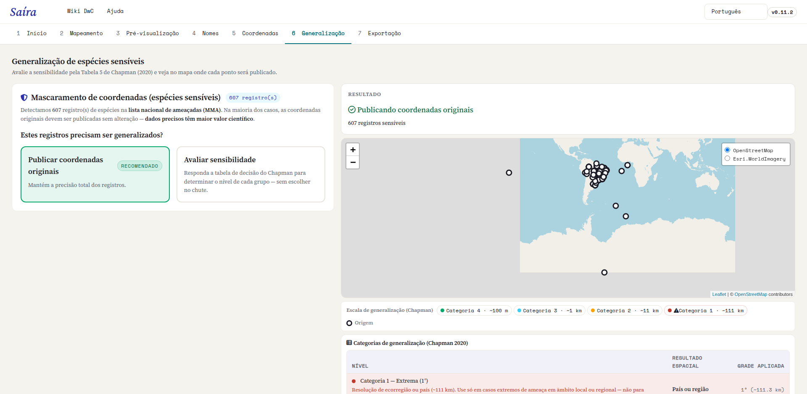
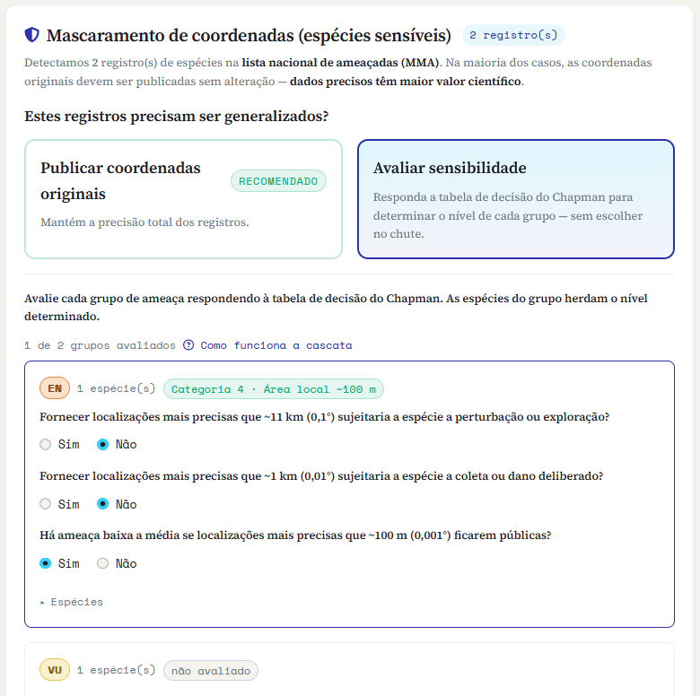
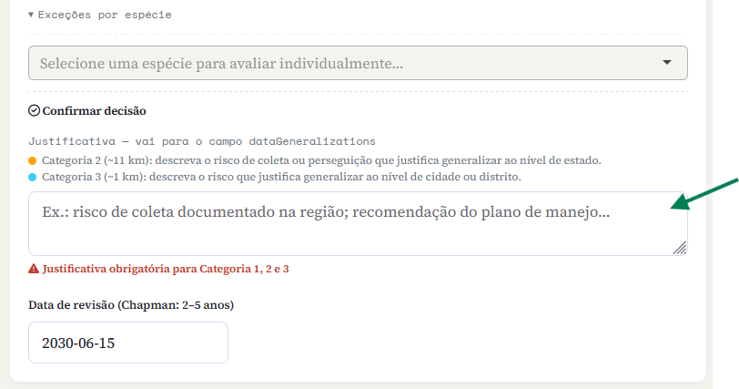
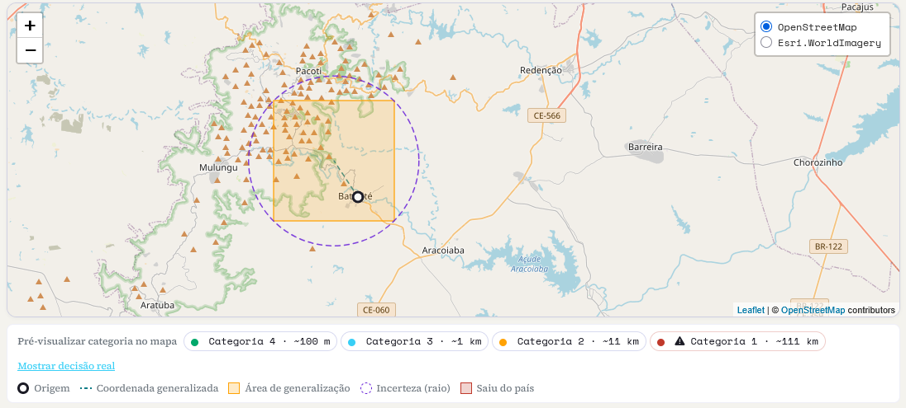

::: {.tut-standfirst}
Publicar a localização exata de uma espécie ameaçada pode expô-la a coleta ou perseguição. Nesta etapa o Saíra ajuda você a decidir, espécie por espécie, **se** e **quanto** reduzir a precisão das coordenadas antes de publicar, seguindo as boas práticas do GBIF descritas por Chapman (2020).
:::

## Quando esta etapa aparece

A aba **Generalização** só tem trabalho a fazer quando a [validação de nomes](04-validacao-nomes.qmd) sinalizou registros de **espécies ameaçadas** (os táxons da lista nacional do MMA, mais qualquer espécie que você tenha marcado manualmente como sensível). São esses registros que chegam aqui para avaliação.

Se nenhum táxon sensível foi detectado, não há nada a generalizar: o Saíra avisa e você segue direto para a exportação, publicando as coordenadas como estão.

```{=html}
<figure class="shot">
  
  <figcaption><b>Figura 1.</b> A aba Generalização lista os registros de espécies ameaçadas que vieram da validação de nomes.</figcaption>
</figure>
```

::: {.callout-important}
## O padrão é publicar a coordenada original
Dados precisos têm **maior valor científico**. Generalizar é a exceção, não a regra: reduza a precisão apenas quando houver risco real de coleta, perseguição ou exploração. Na dúvida, consulte as diretrizes das autoridades de conservação do seu país. No Brasil, siga as do GBIF.
:::

## Duas escolhas de entrada

Para o conjunto de registros sensíveis, o Saíra oferece dois caminhos:

- **Publicar coordenadas originais** *(recomendado)*: mantém a precisão total.
- **Avaliar sensibilidade**: abre a tabela de decisão de [Chapman (2020)](https://doi.org/10.15468/doc-5jp4-5g10) para determinar, sem chute, o nível de generalização de cada grupo de ameaça.

O Saíra também **identifica automaticamente** coordenadas que já chegaram generalizadas e **não as generaliza de novo**, desde que a origem traga o sinal: <span class="term">coordinateUncertaintyInMeters</span> de 1 km ou mais, ou <span class="term">dataGeneralizations</span> preenchido. Sem um desses dois a detecção não tem como saber, e a decisão passa a ser sua.

::: {.callout-important}
## NÃO GENERALIZE DADOS DO WILDLIFE INSIGHTS DUAS VEZES
O **Wildlife Insights já ofusca as coordenadas de espécies sensíveis** na própria exportação. Se o seu conjunto veio de lá e você marcou essas espécies como sensíveis, **escolha "Publicar coordenadas originais" e NÃO aplique a generalização do Saíra**. Generalizar de novo degradaria a localização **DUAS VEZES**, perdendo precisão sem necessidade e sem ganho de proteção.
:::

## A tabela de decisão

Ao escolher **Avaliar sensibilidade**, as espécies aparecem agrupadas por **categoria de ameaça do MMA** (CR, EN, VU…), além de um grupo para as espécies que você marcou manualmente. Para cada grupo, você responde uma pequena **cascata de perguntas**, da mais geral para a mais específica. A primeira resposta "Sim" define o nível; as espécies daquele grupo herdam o nível determinado.

```{=html}
<ol class="fix-steps">
  <li><strong>Fornecer localizações mais precisas que ~11 km (0,1°) sujeitaria a espécie a perturbação ou exploração?</strong>
    <p><b>Sim →</b> Categoria 2 (Alta, 0,1°). <b>Não →</b> avance para a próxima pergunta.</p></li>
  <li><strong>Fornecer localizações mais precisas que ~1 km (0,01°) sujeitaria a espécie a coleta ou dano deliberado?</strong>
    <p><b>Sim →</b> Categoria 3 (Média, 0,01°). <b>Não →</b> avance para a próxima pergunta.</p></li>
  <li><strong>Há ameaça baixa a média se localizações mais precisas que ~100 m (0,001°) ficarem públicas?</strong>
    <p><b>Sim →</b> Categoria 4 (Baixa, 0,001°). <b>Não →</b> o grupo é considerado <b>não sensível</b> e suas coordenadas são publicadas sem mascaramento.</p></li>
</ol>
```

```{=html}
<figure class="shot">
  
  <figcaption><b>Figura 2.</b> A cascata de decisão de Chapman: cada "Não" revela a pergunta seguinte, mais precisa.</figcaption>
</figure>
```

::: {.callout-note}
## Espécies não avaliadas saem sem generalização
Enquanto um grupo não for avaliado, o Saíra mostra quantas espécies ainda faltam e avisa que elas **serão publicadas sem generalização**. Avalie todos os grupos antes de exportar para não deixar nenhuma espécie sensível de fora por esquecimento.
:::

### Os quatro níveis

Cada categoria corresponde a uma **grade** de generalização: a coordenada é deslocada para o centro da célula daquele tamanho. Quanto maior a grade, menos precisa (e menos útil) fica a localidade.

```{=html}
<table class="maptable">
  <thead><tr><th>Nível</th><th>Grade aplicada</th><th>Resultado espacial</th></tr></thead>
  <tbody>
    <tr><td>Categoria 1 · Extrema</td><td>1° (~111 km)</td><td>País ou região</td></tr>
    <tr><td>Categoria 2 · Alta</td><td>0,1° (~11 km)</td><td>Estado ou província</td></tr>
    <tr><td>Categoria 3 · Média</td><td>0,01° (~1 km)</td><td>Cidade ou distrito</td></tr>
    <tr><td>Categoria 4 · Baixa</td><td>0,001° (~100 m)</td><td>Área local</td></tr>
  </tbody>
</table>
```

*Níveis de generalização, conforme [Chapman (2020)](https://doi.org/10.15468/doc-5jp4-5g10).*

::: {.callout-note}
## A generalização nunca aumenta a precisão
Generalizar só **reduz** a precisão, nunca a inventa. Se a coordenada já for menos precisa que a categoria escolhida, o Saíra publica na **precisão real do dado**, sem fingir 100 m, e ainda protege o registro com <span class="term">informationWithheld</span>, <span class="term">dataGeneralizations</span> e o raio de incerteza. Um aviso na aba conta quantos registros saíram assim.
:::

## Exceções por espécie

A decisão do grupo é o ponto de partida, não a palavra final. Em **Exceções por espécie** você pode avaliar um táxon individualmente (respondendo a mesma cascata) e sobrescrever o nível herdado do grupo. Use isso quando uma espécie do grupo merece tratamento diferente do restante.

A **Categoria 1, Extrema (~111 km),** só pode ser atribuída aqui, por exceção, com um botão próprio. É o único caminho para o nível extremo, reservado a espécies de baixa mobilidade ou endêmicas em que mesmo a localidade geral já representa risco.

::: {.callout-warning}
## A Categoria 1 destrói quase todo o valor espacial
A ~111 km o registro perde quase toda a utilidade para análise espacial e modelagem de distribuição. **Não a use** de forma indiscriminada nem sem justificativa plausível.
:::

## Justificativa obrigatória

Sempre que um grupo ou espécie ficar nas **Categorias 1, 2 ou 3**, o Saíra exige uma **justificativa** por escrito (a Categoria 4 e a publicação sem mascaramento dispensam). O texto é gravado no campo Darwin Core <span class="term">dataGeneralizations</span>, para que quem reutilizar o dado saiba **por que** a coordenada foi generalizada.

```{=html}
<figure class="shot">
  
  <figcaption><b>Figura 3.</b> A justificativa exigida para as Categorias 1–3 vai para o campo <span class="term">dataGeneralizations</span> do registro.</figcaption>
</figure>
```

## Pré-visualização no mapa

À direita, o mapa mostra o efeito de cada decisão antes de você confirmar: o **ponto original**, a **célula generalizada** onde ele será publicado, o **raio de incerteza** correspondente (gravado em <span class="term">coordinateUncertaintyInMeters</span>) e a linha que liga os dois. Botões de "e se?" deixam você prever cada categoria no mapa sem se comprometer com ela.

A cor avisa sobre um risco comum da generalização:

- **Laranja**: a célula generalizada continua dentro do país de origem.
- **Vermelho**: a célula **cruza a fronteira** e o ponto sai do país de origem. Nesse caso, **escolha um nível menos agressivo** (uma grade menor), porque uma coordenada que mudou de país é pior que uma coordenada apenas imprecisa.

```{=html}
<figure class="shot">
  
  <figcaption><b>Figura 4.</b> O mapa de pré-visualização: ponto original, célula generalizada e raio de incerteza, com o alerta em vermelho quando a generalização cruza a fronteira.</figcaption>
</figure>
```

::: {.callout-tip}
## Data de revisão
Sensibilidade muda com o tempo: o risco pode aumentar ou desaparecer. Chapman recomenda **rever a decisão a cada 2 a 5 anos**. O Saíra oferece um campo de data de revisão para registrar quando essa reavaliação deve acontecer.
:::

## O que sai no pacote

Nos registros generalizados, o Saíra publica a **coordenada da célula** (não a original), preenche <span class="term">coordinateUncertaintyInMeters</span>, <span class="term">dataGeneralizations</span> e <span class="term">informationWithheld</span> e **apaga os campos que poderiam revelar a localidade exata** (coordenadas verbatim e similares). As **coordenadas originais e precisas** desses registros não vão para o `occurrence.txt` público: ficam num **arquivo à parte** dentro do próprio `.zip` (`<dataset>-sensitive-coords.csv`), sob seu controle, para que você não perca o dado preciso.

Com as decisões tomadas, siga para a **[exportação](07-preview-exportacao.qmd)**, onde você revisa tudo e gera o Darwin Core Archive.

## Referências

As regras desta etapa seguem três documentos de boas práticas do GBIF:

- Chapman, A. D. (2020). *Current Best Practices for Generalizing Sensitive Species Occurrence Data.* Copenhagen: GBIF Secretariat. <https://doi.org/10.15468/doc-5jp4-5g10> (Tabela 5, cascata de decisão; Tabela 7, grade de generalização).
- Chapman, A. D., & Wieczorek, J. R. (2020). *Georeferencing Best Practices.* Copenhagen: GBIF Secretariat. <https://doi.org/10.15468/doc-gg7h-s853> (seç. 2.3.4, incerteza pelo método ponto-raio).
- Zermoglio, P. F., Chapman, A. D., Wieczorek, J. R., Luna, M. C., & Bloom, D. A. (2020). *Georeferencing Quick Reference Guide.* Copenhagen: GBIF Secretariat. <https://doi.org/10.35035/e09p-h128>
