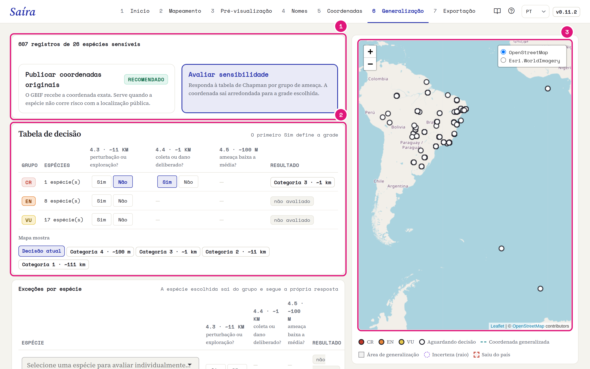
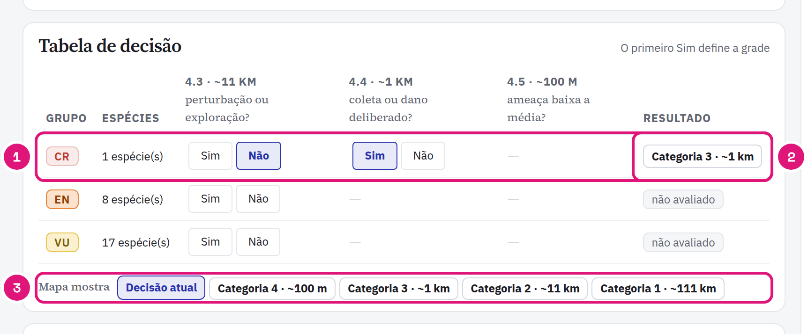
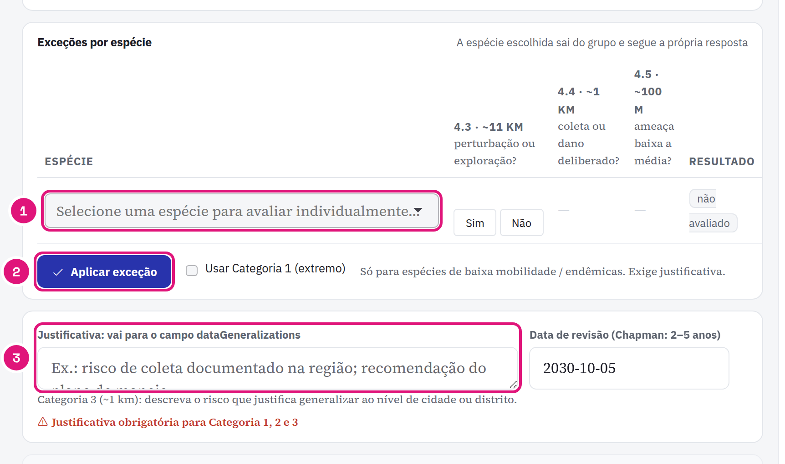

::: {.tut-standfirst}
Decida se e quanto reduzir a precisão das coordenadas de espécies ameaçadas na etapa **Generalização**. A etapa segue a tabela de decisão de [Chapman (2020)](https://doi.org/10.15468/doc-5jp4-5g10).
:::

A etapa trabalha com as espécies marcadas como **Sensível** na [validação de nomes](04-validacao-nomes.qmd). Sem espécie sensível, não há nada a fazer aqui.

## Escolha o caminho

```{=html}
<figure class="shot"></figure>
```

::: {.marks}
1. **Publicar coordenadas originais** é o padrão recomendado. Dado preciso tem mais valor científico.
2. **Avaliar sensibilidade** abre a tabela de decisão. Escolha este caminho só se há risco real de coleta ou perseguição.
:::

O Saíra não generaliza de novo uma coordenada que já chegou generalizada: <span class="term">coordinateUncertaintyInMeters</span> de 1 km ou mais, ou <span class="term">dataGeneralizations</span> preenchido.

::: {.callout-important}
## Dados do Wildlife Insights já vêm protegidos
A exportação do Wildlife Insights já esconde a localização das espécies sensíveis. Escolha **Publicar coordenadas originais**. Generalizar de novo só tira precisão.
:::

## Responda a tabela de decisão

```{=html}
<figure class="shot"></figure>
```

::: {.marks}
1. O modo **Avaliar sensibilidade**.
2. A tabela de decisão, uma linha por categoria de ameaça.
3. O mapa mostra o resultado de cada resposta.
:::

```{=html}
<figure class="shot"></figure>
```

::: {.marks}
1. Responda as perguntas da esquerda para a direita. Cada **Não** abre a próxima pergunta. O primeiro **Sim** define a grade.
2. O resultado vale para todas as espécies do grupo.
3. Veja no mapa o efeito de cada categoria antes de decidir.
:::

| Primeiro Sim | Categoria | Grade | Resultado espacial |
|---|---|---|---|
| 4.3 · perturbação ou exploração | 2 | 0,1° (~11 km) | Estado ou província |
| 4.4 · coleta ou dano deliberado | 3 | 0,01° (~1 km) | Cidade ou distrito |
| 4.5 · ameaça baixa a média | 4 | 0,001° (~100 m) | Área local |
| Nenhum | Não sensível | Sem grade | Coordenada original |

Grupo sem resposta sai sem generalização. A generalização nunca aumenta a precisão: uma coordenada menos precisa que a grade sai na precisão real.

## Trate uma espécie à parte

```{=html}
<figure class="shot"></figure>
```

::: {.marks}
1. Escolha a espécie e responda as mesmas perguntas. A espécie sai do grupo.
2. **Aplicar exceção**.
3. Escreva a justificativa. Ela vai para <span class="term">dataGeneralizations</span>.
:::

A justificativa é obrigatória para as Categorias 1, 2 e 3. A data de revisão sugere quando reavaliar a decisão (Chapman recomenda 2 a 5 anos).

::: {.callout-warning}
## Categoria 1 (~111 km) só por exceção
**Usar Categoria 1 (extremo)** é a única forma de chegar a esse nível. A ~111 km o registro perde quase todo o valor espacial. Use só para espécies de baixa mobilidade ou endêmicas.
:::

## Confira o mapa

O mapa mostra o ponto original, a área de generalização e o raio de incerteza. Um ponto que **saiu do país** pede uma grade menor: coordenada no país errado é pior que coordenada imprecisa.

## O que sai no pacote

Nos registros generalizados, o Saíra:

- publica a coordenada da célula, não a original;
- preenche <span class="term">coordinateUncertaintyInMeters</span>, <span class="term">dataGeneralizations</span> e <span class="term">informationWithheld</span>;
- apaga os campos que revelam a localidade exata, como as coordenadas verbatim;
- guarda as coordenadas originais em `<dataset>-sensitive-coords.csv`, dentro do `.zip`, fora do `occurrence.txt`.

## Referências

- Chapman, A. D. (2020). *Current Best Practices for Generalizing Sensitive Species Occurrence Data.* Copenhagen: GBIF Secretariat. <https://doi.org/10.15468/doc-5jp4-5g10> (Tabela 5, cascata de decisão; Tabela 7, grade de generalização).
- Chapman, A. D., & Wieczorek, J. R. (2020). *Georeferencing Best Practices.* Copenhagen: GBIF Secretariat. <https://doi.org/10.15468/doc-gg7h-s853> (seç. 2.3.4, incerteza pelo método ponto-raio).
- Zermoglio, P. F., Chapman, A. D., Wieczorek, J. R., Luna, M. C., & Bloom, D. A. (2020). *Georeferencing Quick Reference Guide.* Copenhagen: GBIF Secretariat. <https://doi.org/10.35035/e09p-h128>
