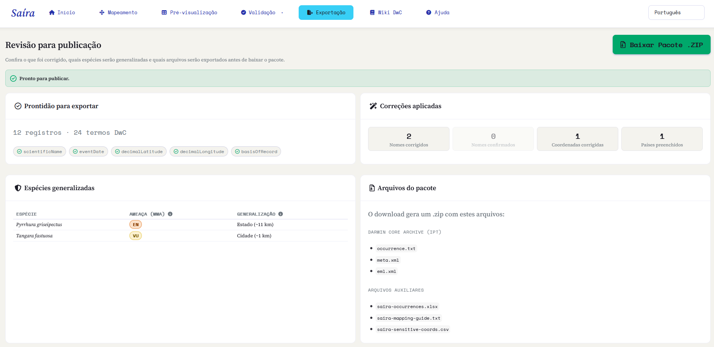
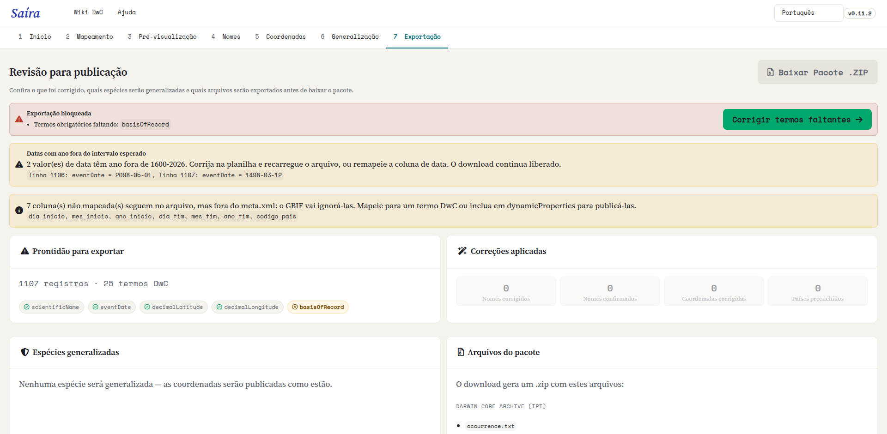

::: {.tut-standfirst}
Confira o resultado completo, revise o que foi corrigido e quais espécies serão generalizadas, e gere o Darwin Core Archive pronto para publicar no SiBBr e no GBIF.
:::

## Pré-visualização

Na aba **Pré-visualização**, o Saíra mostra a tabela final já em vocabulário Darwin Core, com todas as correções aplicadas. É o momento de uma última conferência geral:

- as colunas estão com os nomes Darwin Core corretos;
- campos obrigatórios estão preenchidos;
- nomes e coordenadas foram validados nas etapas anteriores.

```{=html}
<figure class="shot">
  <div class="frame"><span class="ph-label">screenshot · pré-visualização final</span></div>
  <figcaption><b>Figura 1.</b> Pré-visualização do conjunto em Darwin Core, com indicadores de completude por campo.</figcaption>
</figure>
```

## A aba Exportação: revisão antes de publicar

Antes de baixar o pacote, a aba **Exportação** reúne num só lugar o que foi corrigido, quais espécies serão generalizadas e quais arquivos vão no `.zip`. Confira cada bloco antes de gerar o Darwin Core Archive.

```{=html}
<figure class="shot">
  
  <figcaption><b>Figura 2.</b> O hub de revisão da Exportação, com a prontidão, as correções aplicadas, as espécies generalizadas e os arquivos do pacote.</figcaption>
</figure>
```

### Prontidão para exportar

No topo, um indicador diz se o conjunto está **pronto para publicar** (verde) ou se a **exportação está bloqueada** (vermelho). Quando bloqueia, o Saíra lista o que falta (em geral, **termos obrigatórios** não preenchidos ou **espécies generalizadas sem a justificativa** exigida para as Categorias 1–3) e oferece um atalho para resolver a pendência.

```{=html}
<figure class="shot">
  
  <figcaption><b>Figura 3.</b> Indicador de bloqueio: o Saíra lista os campos obrigatórios faltantes ou as justificativas pendentes e oferece atalhos diretos para cada pendência.</figcaption>
</figure>
```

::: {.callout-warning}
## Sem occurrenceID mapeado
Se você não mapeou um <span class="term">occurrenceID</span>, o Saíra avisa: o IPT/GBIF passa a gerar identificadores instáveis a cada publicação. A exportação ainda funciona, e os identificadores que o Saíra gera derivam do conteúdo da linha, então re-enviar a mesma planilha reproduz os mesmos valores. Mesmo assim, o recomendado é **mapear a coluna que já carrega seus identificadores**: o Saíra preserva os que existem e só preenche as linhas em branco.
:::

### Correções aplicadas

Um resumo mostra tudo o que as etapas anteriores ajustaram, para você conferir de relance antes de publicar:

- **Nomes corrigidos** e **nomes confirmados** na [validação de nomes](04-validacao-nomes.qmd);
- **Coordenadas corrigidas** (transposições, troca lat/lon, preenchimento conjunto) e **países preenchidos** na [validação de coordenadas](05-validacao-coordenadas.qmd).

### Espécies generalizadas

Se você generalizou algum táxon na etapa de [generalização](06-generalizacao.qmd), uma tabela lista cada **espécie**, sua **ameaça (MMA)** e o **nível de generalização** que sairá no pacote, nos mesmos quatro níveis descritos em [Generalizando espécies sensíveis](06-generalizacao.qmd).

Se nada foi generalizado, o Saíra registra: *nenhuma espécie será generalizada; as coordenadas serão publicadas como estão*.

## O que o Saíra ajusta na exportação

Ao gerar o pacote, o Saíra padroniza automaticamente o conjunto para que ele atenda às expectativas dos repositórios:

- **eventDate** convertido para o formato ISO (`AAAA-MM-DD`).
- **Coordenadas** com o separador decimal normalizado (vírgula vira ponto).
- **occurrenceID** derivado do conteúdo da linha quando ausente, para garantir um identificador único e estável por registro.
- **Licenças** abreviadas para a URL canônica (por exemplo, a URL da Creative Commons correspondente).
- **Colunas reordenadas** na sequência canônica do Darwin Core, com as colunas não mapeadas anexadas à direita, preservando seus nomes originais.

### Status de conservação no `dynamicProperties`

Para cada táxon avaliado, o Saíra grava o status de conservação em `dynamicProperties` como chaves JSON, conforme as bases escolhidas na [validação de nomes](04-validacao-nomes.qmd):

- base **brasileira** (Flora BR / Fauna BR) → `mmaThreatStatus` (categoria) e `mmaSource` (portaria);
- **GBIF** → `iucnRedListCategory` (código IUCN global, consultado ao vivo).

As duas podem aparecer juntas e se somam ao que você mesmo mapeou:

```json
{"mmaThreatStatus":"CR","mmaSource":"Portaria 1.704/2026","iucnRedListCategory":"NT"}
```

A consulta ao GBIF é best-effort: sem internet ou sem avaliação, a chave IUCN é omitida e a exportação segue.

::: {.callout-warning}
## O status MMA é nacional
A categoria MMA vem da lista vermelha do Brasil, então o Saíra só a grava nos registros cujo `country` (ou `countryCode`) resolve para o Brasil. Num conjunto com registros de vários países, a mesma espécie recebe as chaves MMA na linha brasileira e não recebe na estrangeira. Registro sem país informado também fica sem as chaves: mapeie `country`, ou use o preenchimento a partir das coordenadas na [validação de coordenadas](05-validacao-coordenadas.qmd). O `iucnRedListCategory` é global e não depende disso.
:::

## Arquivos do pacote

O download gera um `.zip` (`<dataset>-dwc-archive.zip`) com dois conjuntos de arquivos.

O **Darwin Core Archive**, que você envia ao repositório:

```{=html}
<table class="maptable">
  <thead><tr><th>Arquivo</th><th>O que é</th></tr></thead>
  <tbody>
    <tr><td>occurrence.txt</td><td>Os dados: o núcleo do Darwin Core Archive.</td></tr>
    <tr><td>meta.xml</td><td>O descritor que diz o que cada coluna significa.</td></tr>
    <tr><td>eml.xml</td><td>Os metadados do conjunto (título, instituição, licença).</td></tr>
  </tbody>
</table>
```

E os **arquivos auxiliares**, para o seu controle, fora do pacote público:

```{=html}
<table class="maptable">
  <thead><tr><th>Arquivo</th><th>O que é</th></tr></thead>
  <tbody>
    <tr><td>&lt;dataset&gt;-occurrences.xlsx</td><td>Espelho em Excel, com todas as células forçadas a texto.</td></tr>
    <tr><td>&lt;dataset&gt;-mapping-guide.txt</td><td>O modelo "sua coluna → termo Darwin Core", para reaproveitar.</td></tr>
    <tr><td>&lt;dataset&gt;-sensitive-coords.csv</td><td>Coordenadas reais e precisas dos registros generalizados. Só aparece quando há generalização; você guarda, mas não publica.</td></tr>
  </tbody>
</table>
```

## Gerando o Darwin Core Archive

Os metadados (`eml.xml`) são montados **automaticamente**: o Saíra usa um título padrão, calcula a extensão geográfica e o intervalo de datas a partir dos seus dados e aplica a licença CC0 por padrão, sem você precisar preencher nada. O ajuste fino dos metadados (instituição, responsáveis, licença definitiva) é feito depois, no IPT, na hora de publicar.

```{=html}
<ol class="fix-steps">
  <li><strong>Gere o arquivo.</strong>
    <p>O Saíra monta o pacote <span class="term">.zip</span> com <span class="term">occurrence.txt</span>, <span class="term">meta.xml</span> e <span class="term">eml.xml</span>.</p></li>
  <li><strong>Baixe e publique.</strong>
    <p>Faça o download do Darwin Core Archive e envie-o ao seu IPT (SiBBr/GBIF) para publicação.</p></li>
</ol>
```

## Publicando no SiBBr e no GBIF

Com o `.zip` em mãos, a publicação acontece fora do Saíra, normalmente via **IPT** (Integrated Publishing Toolkit) da sua instituição ou do SiBBr. O arquivo gerado pelo Saíra já está no formato esperado: basta carregá-lo, conferir o mapeamento no IPT e publicar.

Voltar à **[visão geral dos tutoriais](index.qmd)** ou ao **[início](../index.qmd)**.
