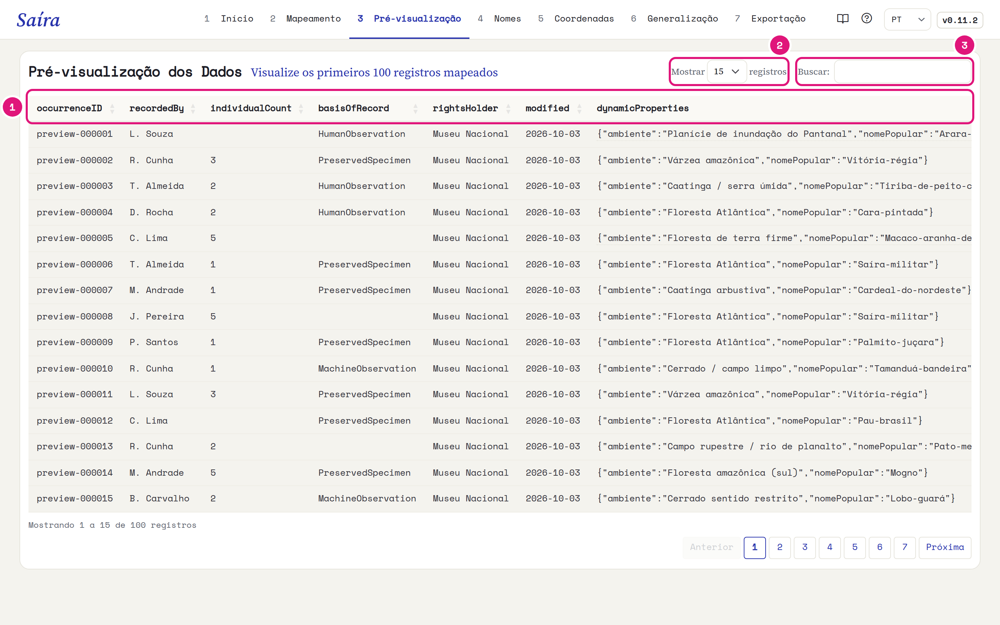
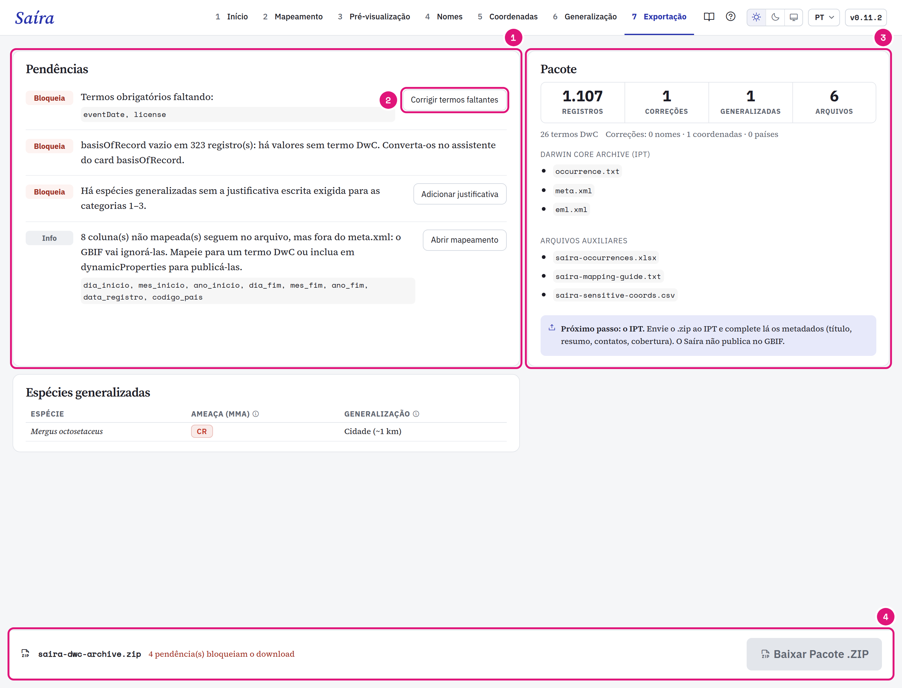

::: {.tut-standfirst}
Confira os dados em Darwin Core e baixe o Darwin Core Archive na etapa **Exportação**.
:::

## Confira a pré-visualização

```{=html}
<figure class="shot"></figure>
```

::: {.marks}
1. As colunas já têm os nomes Darwin Core.
2. Escolha quantas linhas ver. A pré-visualização mostra os primeiros 100 registros.
3. Busque um valor em qualquer coluna.
:::

## Resolva as pendências

```{=html}
<figure class="shot"></figure>
```

::: {.marks}
1. **Bloqueia** impede o download. **Info** só avisa.
2. Cada pendência tem um botão que leva à etapa que resolve.
3. O pacote: registros, correções, espécies generalizadas e arquivos.
4. O download libera quando não há mais pendência que bloqueia.
:::

| Pendência | Onde resolver |
|---|---|
| Termo obrigatório faltando, como <span class="term">eventDate</span> ou <span class="term">license</span> | [Mapeamento](03-mapeamento-dwc.qmd) |
| <span class="term">basisOfRecord</span> sem termo DwC | [Assistente basisOfRecord](03-mapeamento-dwc.qmd#defina-o-basisofrecord) |
| Generalização sem justificativa | [Generalização](06-generalizacao.qmd#trate-uma-espécie-à-parte) |
| Coluna não mapeada (Info) | O GBIF ignora a coluna. Mapeie para um termo ou inclua em <span class="term">dynamicProperties</span>. |

::: {.callout-warning}
## Mapeie o occurrenceID
Sem <span class="term">occurrenceID</span>, o Saíra cria um identificador a partir do conteúdo da linha. Se você mudar a linha, o identificador muda. Mapeie a coluna com os seus identificadores. O Saíra só preenche as linhas vazias.
:::

## O que o Saíra ajusta

- **Datas** em ISO 8601: `AAAA-MM-DD`, `AAAA-MM` sem dia, `AAAA-MM-DDThh:mm` com hora. Um ano antes de 1600 ou depois do ano atual gera aviso, sem bloquear.
- **Coordenadas** com ponto decimal.
- **Licença** com o nome curto (`CC-BY`) no `occurrence.txt` e a URL no `eml.xml`.
- **Colunas** na ordem do Darwin Core. As colunas não mapeadas ficam no fim, com o nome original.

### Status de conservação no `dynamicProperties`

O Saíra grava o status de conservação conforme as bases da [validação de nomes](04-validacao-nomes.qmd):

- Flora BR ou Fauna BR → `mmaThreatStatus` e `mmaSource`;
- GBIF → `iucnRedListCategory`, consultado na exportação.

```json
{"mmaThreatStatus":"CR","mmaSource":"Portaria 1.704/2026","iucnRedListCategory":"NT"}
```

Sem internet, a chave IUCN fica de fora e a exportação continua. As chaves MMA entram só em registros do Brasil, pelo <span class="term">country</span> ou <span class="term">countryCode</span>. Registro sem país fica sem as chaves MMA.

## Arquivos do pacote

O `.zip` (`<dataset>-dwc-archive.zip`) tem o Darwin Core Archive e os arquivos auxiliares.

| Arquivo | Uso |
|---|---|
| `occurrence.txt` | Os dados. Vai para o IPT. |
| `meta.xml` | Diz o termo de cada coluna. Vai para o IPT. |
| `eml.xml` | Metadados: título, extensão geográfica, período e licença. Vai para o IPT. |
| `<dataset>-occurrences.xlsx` | Cópia em Excel, com todas as células como texto. |
| `<dataset>-mapping-guide.txt` | O mapeamento, para [reaproveitar](03-mapeamento-dwc.qmd#reaproveite-o-mapeamento). |
| `<dataset>-sensitive-coords.csv` | Coordenadas originais dos registros generalizados. Guarde, não publique. |

## Publique pelo IPT

O Saíra não publica no GBIF. Envie o `.zip` ao IPT da sua instituição ou do SiBBr. No IPT, complete os metadados (resumo, contatos, cobertura) e publique.
