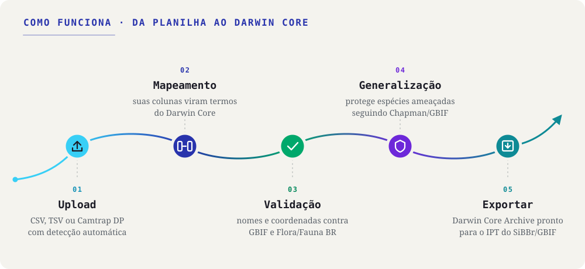

::: {.tut-standfirst}
Guias passo a passo para levar sua planilha de ocorrências do caderno de campo ao Darwin Core Archive, seguindo o fluxo do aplicativo.
:::

```{=html}
<figure class="shot diagram-flow">
  
</figure>
```

O diagrama mostra as cinco etapas de trabalho do app. Os tutoriais abaixo são sete porque a instalação vem antes de tudo e a validação se divide em nomes e coordenadas. Navegue pela **barra lateral** ou pelos botões **anterior / próximo** no rodapé; cada etapa também pode ser lida de forma independente.

## O fluxo, do dado bruto ao DwC-A

```{=html}
<div class="tut-grid">
  <a class="tut-card" href="01-instalacao.html">
    <div class="tut-card-top"><span class="tut-card-num">01</span><span class="tut-card-eyebrow">Etapa</span></div>
    <h3 class="tut-card-title">Instalação e primeiros passos</h3>
    <p class="tut-card-desc">Instale o Saíra a partir do GitHub e abra o app no navegador.</p>
    <span class="tut-card-arrow">→</span>
  </a>
  <a class="tut-card" href="02-upload.html">
    <div class="tut-card-top"><span class="tut-card-num">02</span><span class="tut-card-eyebrow">Etapa</span></div>
    <h3 class="tut-card-title">Importando seus dados</h3>
    <p class="tut-card-desc">Carregue CSV, TSV/TXT ou um pacote de armadilha fotográfica.</p>
    <span class="tut-card-arrow">→</span>
  </a>
  <a class="tut-card" href="03-mapeamento-dwc.html">
    <div class="tut-card-top"><span class="tut-card-num">03</span><span class="tut-card-eyebrow">Etapa</span></div>
    <h3 class="tut-card-title">Mapeando campos para Darwin Core</h3>
    <p class="tut-card-desc">Associe cada coluna a um termo Darwin Core, com sugestões automáticas.</p>
    <span class="tut-card-arrow">→</span>
  </a>
  <a class="tut-card" href="04-validacao-nomes.html">
    <div class="tut-card-top"><span class="tut-card-num">04</span><span class="tut-card-eyebrow">Etapa</span></div>
    <h3 class="tut-card-title">Validando nomes científicos</h3>
    <p class="tut-card-desc">Confira a nomenclatura, resolva sinônimos e veja os táxons ameaçados.</p>
    <span class="tut-card-arrow">→</span>
  </a>
  <a class="tut-card" href="05-validacao-coordenadas.html">
    <div class="tut-card-top"><span class="tut-card-num">05</span><span class="tut-card-eyebrow">Etapa</span></div>
    <h3 class="tut-card-title">Validando coordenadas</h3>
    <p class="tut-card-desc">Encontre coordenadas ausentes, invertidas ou transpostas e revise no mapa.</p>
    <span class="tut-card-arrow">→</span>
  </a>
  <a class="tut-card" href="06-generalizacao.html">
    <div class="tut-card-top"><span class="tut-card-num">06</span><span class="tut-card-eyebrow">Se houver</span></div>
    <h3 class="tut-card-title">Generalizando espécies sensíveis</h3>
    <p class="tut-card-desc">Só quando a validação de nomes sinaliza espécies ameaçadas: reduza a precisão das coordenadas (Chapman 2020).</p>
    <span class="tut-card-arrow">→</span>
  </a>
  <a class="tut-card" href="07-preview-exportacao.html">
    <div class="tut-card-top"><span class="tut-card-num">07</span><span class="tut-card-eyebrow">Etapa</span></div>
    <h3 class="tut-card-title">Pré-visualização e exportação</h3>
    <p class="tut-card-desc">Revise o resultado e as correções e gere o Darwin Core Archive.</p>
    <span class="tut-card-arrow">→</span>
  </a>
</div>
```

::: {.callout-note}
## O fluxo é flexível
Você não precisa seguir as etapas em sequência rígida: dá para voltar a qualquer passo (remapear um campo, recarregar a planilha ou revalidar) sem perder o trabalho já feito.
:::

::: {.callout-tip}
## Pratique com o arquivo de exemplo
Baixe [`ocorrencias-demo.csv`](../assets/exemplo/ocorrencias-demo.csv) e siga os tutoriais com ele. O que a planilha traz de propositalmente imperfeito está descrito em [Importando seus dados](02-upload.qmd).
:::
